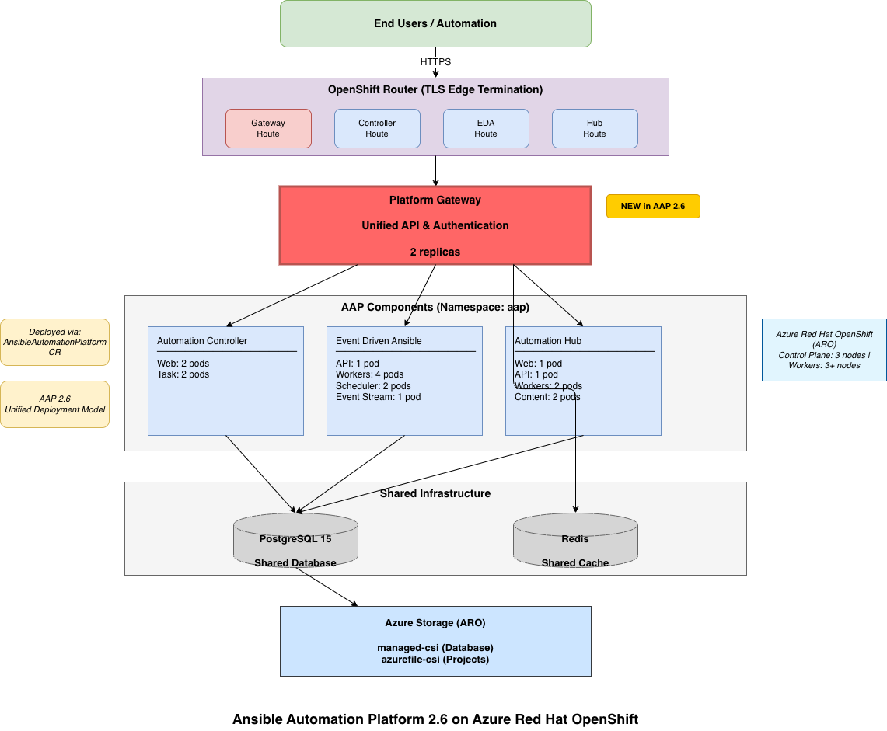
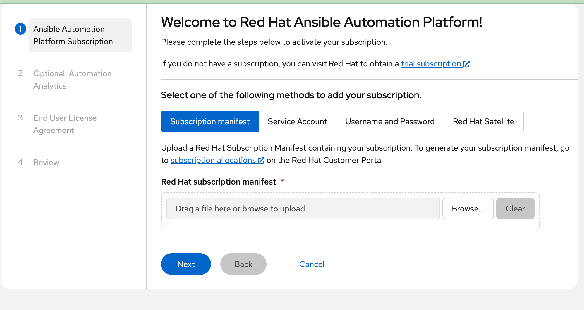
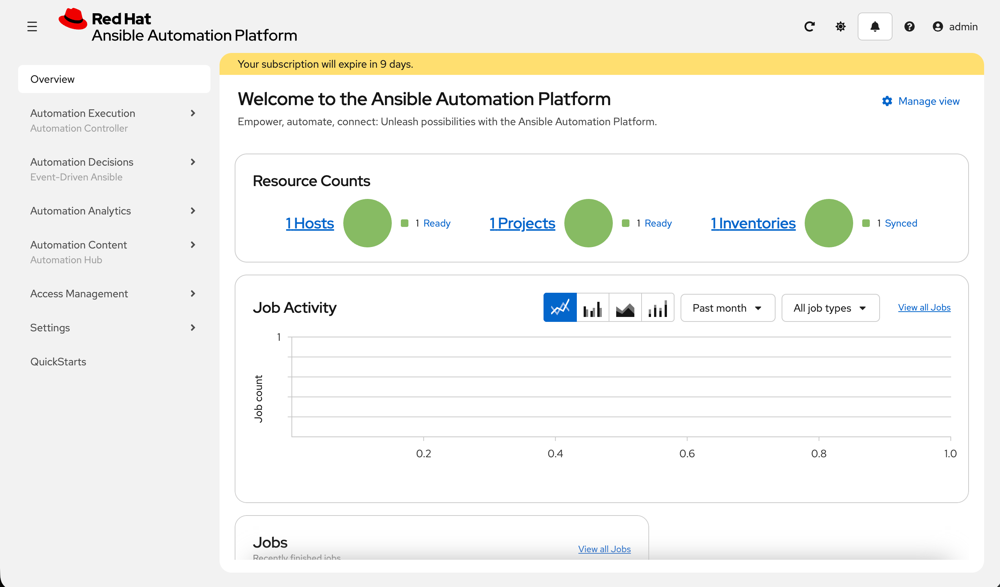

[Ansible Automation Platform (AAP)](https://www.ansible.com/products/automation-platform) is a popular platform for centralizing 
and managing an organization's automation content using Ansible as the engine for writing automation code.  Prior to 
deployment, organizations are faced with the decision "where do I want to host this thing?".  In today's landscape, there 
are several options between traditional Virtual Machines, running it on OpenShift, or even running it as a 
managed offering.  This walkthrough covers a scenario when a customer wants to run AAP on top of a managed 
OpenShift offering like Azure Red Hat OpenShift (ARO).

> **NOTE:** there are several design decisions that go into the deployment of AAP.  This is a simple walkthrough to 
> get you going and does not cover all possible decisions.


## Prerequisites

* [Azure CLI](https://docs.microsoft.com/en-us/cli/azure/install-azure-cli?view=azure-cli-latest)
* [An Azure Red Hat OpenShift (ARO) cluster](/experts/quickstart-aro) version 4.20 or later
* Red Hat OpenShift pull secret from [console.redhat.com](https://console.redhat.com/openshift/install/azure/aro-provisioned)


## High-Level Architecture

Below represents a high-level architecture.  It is intended to show a simplified architecture with *most* components
deployed.  Please note that components can easily be spread across multiple availability zones to achieve high 
availability requirements, which is not represented in the overly simplified diagram below:



## Prepare your Environment

This step simply sets up your environment with variables to be used during installation:

```bash
export AZR_RESOURCE_GROUP='aro-cluster-rg'
export AZR_CLUSTER='aro-cluster'
export AAP_ADMIN_USERNAME='admin'
export AAP_ADMIN_PASSWORD='MySecureP@$$w0rd' # notsecret
export AAP_ADMIN_EMAIL='myemail@mydomain.com'
export AAP_APPS_DOMAIN="$(az aro show -n $AZR_CLUSTER -g $AZR_RESOURCE_GROUP | jq -r '.clusterProfile.domain')"
```


## Create the Prerequisite Projects and Secrets

AAP 2.6 uses a unified deployment model where all components are managed through a single `AnsibleAutomationPlatform` resource. All components will be deployed in the `aap` namespace.

1. Create the project for AAP:

    ```bash
    oc new-project aap
    ```

1. Create the admin password secret that will be used to authenticate with all AAP components:

    ```bash
    oc -n aap create secret generic aap-admin-password --from-literal=password="$AAP_ADMIN_PASSWORD"
    ```


## Install the AAP Operator

This section covers the installation of the AAP operator. The AAP operator is responsible for all deployment 
and management actions for all AAP components including the Platform Gateway, Automation Controller, EDA, and Automation Hub.

1. Install the AAP Operator:

    ```bash
    cat <<EOF | oc apply -f -
    apiVersion: operators.coreos.com/v1
    kind: OperatorGroup
    metadata:
      name: aap
      namespace: aap
    spec:
      upgradeStrategy: Default
    ---
    apiVersion: operators.coreos.com/v1alpha1
    kind: Subscription
    metadata:
      labels:
        operators.coreos.com/ansible-automation-platform-operator.aap: ""
      name: ansible-automation-platform-operator
      namespace: aap
    spec:
      channel: stable-2.6-cluster-scoped
      installPlanApproval: Automatic
      name: ansible-automation-platform-operator
      source: redhat-operators
      sourceNamespace: openshift-marketplace
    EOF
    ```

    > **NOTE:** The `startingCSV` field has been removed to allow the operator to automatically select the latest AAP 2.6 version.

1. Verify the operator installation:

    ```bash
    # Check the ClusterServiceVersion status
    oc get csv -n aap
    
    # Wait for the operator to reach Succeeded phase
    oc wait --for=jsonpath='{.status.phase}'=Succeeded csv -l operators.coreos.com/ansible-automation-platform-operator.aap -n aap --timeout=300s
    ```

    You should see output similar to:

    ```
    NAME                               DISPLAY                           VERSION   REPLACES   PHASE
    aap-operator.v2.6.0-0.1774648973   Ansible Automation Platform       2.6.0                Succeeded
    ```


## Deploy Ansible Automation Platform

AAP 2.6 introduces a unified deployment model using the `AnsibleAutomationPlatform` custom resource. This single resource deploys and manages all AAP components including:

- **Platform Gateway** - Unified API and authentication gateway
- **Automation Controller** - Job execution and orchestration
- **Event Driven Ansible (EDA)** - Event-driven automation
- **Automation Hub** - Private automation content repository

1. Deploy the unified AAP platform:

    > **NOTE:** You can adjust resource requirements and replicas based on your deployment size. 
    > See `oc explain ansibleautomationplatform.spec` for full configuration options.

    ```bash
    # Get the full apps domain including region (e.g., apps.xyz.region.aroapp.io)
    export APPS_DOMAIN="$(oc get ingresses.config.openshift.io cluster -o jsonpath='{.spec.domain}')"
    
    cat <<EOF | oc apply -f -
    apiVersion: aap.ansible.com/v1alpha1
    kind: AnsibleAutomationPlatform
    metadata:
      name: aap
      namespace: aap
    spec:
      admin_password_secret: aap-admin-password
      hostname: aap.$APPS_DOMAIN
      route_host: aap.$APPS_DOMAIN
      route_tls_termination_mechanism: Edge
      ingress_type: Route
      
      # Platform Gateway (API Gateway)
      api:
        replicas: 2
      
      # Automation Controller
      controller:
        replicas: 2
        admin_email: $AAP_ADMIN_EMAIL
        admin_user: $AAP_ADMIN_USERNAME
        postgres_storage_class: managed-csi
        projects_persistence: true
        projects_storage_access_mode: ReadWriteMany
        projects_storage_class: azurefile-csi
        projects_storage_size: 8Gi
        task_replicas: 2
        web_replicas: 2
      
      # Event Driven Ansible
      eda:
        replicas: 2
      
      # Automation Hub
      hub:
        file_storage_storage_class: azurefile-csi
    EOF
    ```

1. Monitor the deployment progress. The operator will create all AAP components:

    ```bash
    # Watch the AAP platform status
    oc get ansibleautomationplatform aap -n aap -w
    ```
    
    expected output:
    
    ```
    oc get ansibleautomationplatform aap -n aap -w

    NAME   AGE
    aap    7s
    aap    10s
    ```
    
    Check all pods in the aap namespace
    
    ```bash
    oc get pods -n aap
    ```

    expected output:
    ```
    NAME                                                              READY   STATUS     RESTARTS   AGE
    aap-eda-activation-worker-b9d649c5d-l9xvv                         0/1     Init:0/1   0          18s
    aap-eda-activation-worker-b9d649c5d-v4crs                         0/1     Init:0/1   0          18s
    aap-eda-api-655fddb565-xwrv6                                      0/3     Init:0/2   0          23s
    aap-eda-default-worker-5cbd44dbfb-2gkgs                           0/1     Init:0/1   0          20s
    aap-eda-default-worker-5cbd44dbfb-xz74s                           0/1     Init:0/1   0          20s
    aap-eda-event-stream-577f6697f8-szjzd                             0/2     Init:0/1   0          9s
    aap-eda-scheduler-57d694b8cf-jxxdd                                0/1     Init:0/1   0          16s
    aap-eda-scheduler-57d694b8cf-xj9p8                                0/1     Init:0/1   0          16s
    aap-gateway-7f7889b8b9-m548n                                      2/2     Running    0          4m52s
    aap-gateway-7f7889b8b9-r5c9d                                      2/2     Running    0          4m52s
    aap-gateway-operator-controller-manager-6d67956c65-4qg42          2/2     Running    0          9m53s
    aap-postgres-15-0                                                 1/1     Running    0          6m15s
    aap-redis-0                                                       1/1     Running    0          6m45s
    ansible-lightspeed-operator-controller-manager-5c88768749-zlwdp   2/2     Running    0          9m52s
    automation-controller-operator-controller-manager-779cff78drdc6   2/2     Running    0          9m53s
    automation-hub-operator-controller-manager-5c4ff8cd8-26db7        2/2     Running    0          9m52s
    eda-server-operator-controller-manager-57dbc986f7-lw48n           2/2     Running    0          9m53s
    resource-operator-controller-manager-666884b955-lhftn             2/2     Running    0          9m52s
    ```

    The deployment typically takes 15-20 minutes. You should see pods for:
    - Platform Gateway (2 pods)
    - Automation Controller (web, task, postgres pods)
    - EDA (api, workers, scheduler pods)
    - Automation Hub (web, api, worker, content pods)
    - Shared PostgreSQL 15 database
    - Redis cache

1. Verify all components are running:

    ```bash
    # Check individual component custom resources created by the operator
    oc get automationcontroller,eda,automationhub -n aap
    
    # Check routes for each component
    oc get routes -n aap
    ```

    Expected output:

    ```
    NAME                                                           AGE
    automationcontroller.automationcontroller.ansible.com/aap-controller   10m

    NAME                              AGE
    eda.eda.ansible.com/aap-eda   10m

    NAME                                                  AGE
    automationhub.automationhub.ansible.com/aap-hub   10m
    ```

## Access the AAP Components

Once the deployment is complete, you can access each AAP component through its dedicated route.

1. First, retrieve the actual route URLs:

    ```bash
    # Get all AAP routes
    oc get routes -n aap
    
    # Or get specific URLs
    echo "Platform Gateway:       https://$(oc get route aap -n aap -o jsonpath='{.spec.host}')"
    echo "Automation Controller:  https://$(oc get route aap-controller -n aap -o jsonpath='{.spec.host}')"
    echo "EDA Controller:         https://$(oc get route aap-eda -n aap -o jsonpath='{.spec.host}')"
    echo "Automation Hub:         https://$(oc get route aap-hub -n aap -o jsonpath='{.spec.host}')"
    ```

> **NOTE:** all the routes will redirect to the Platform Gateway which has a unified view for all Ansible components.

1. **Platform Gateway** (Unified API Gateway):

    The Platform Gateway provides a unified API endpoint and authentication for all AAP components. The URL will be in the format:

    ```
    https://aap.apps.<cluster-domain>.<region>.aroapp.io
    ```

    Access the Platform Gateway at the URL shown by the route command. Login with `$AAP_ADMIN_USERNAME` and `$AAP_ADMIN_PASSWORD`. You will need to provide an AAP subscription via your Red Hat credentials and accept the EULA on first login.

    When you first login, you will se this.  Enter your Red Hat Ansible subscription manifest which you can retrieve from https://console.redhat.com/subscriptions/manifests
    
    

   After entering your subscription and agree to the terms and conditions, you will see the Ansible Platform Gateway.

   

## Migration from AAP 2.4 to 2.6

If you have an existing AAP 2.4 deployment and are upgrading to AAP 2.6, be aware of the following important changes:

### Key Changes in AAP 2.6

1. **Unified Deployment Model**: AAP 2.6 uses a single `AnsibleAutomationPlatform` custom resource instead of separate component CRs. The operator automatically creates individual component resources.

2. **Platform Gateway**: AAP 2.6 introduces a Platform Gateway that provides unified API access and authentication across all components. This is integrated into the unified deployment model.

3. **Operator Channel**: The operator channel has changed from `stable-2.4-cluster-scoped` to `stable-2.6-cluster-scoped`.

4. **Namespace Consolidation**: AAP 2.6 can deploy all components in a single namespace (`aap`) for simplified management, though separate namespaces are still supported.

### Migration Steps

For users upgrading from AAP 2.4:

1. **Backup Your Configuration**: Before upgrading, export critical configurations:
   - Automation Controller: job templates, inventories, credentials, projects
   - Automation Hub: content collections and configurations
   - EDA: rulebook activations and decision environments

2. **Update the Operator Subscription**:

    ```bash
    oc patch subscription ansible-automation-platform-operator -n aap \
      --type='merge' \
      -p '{"spec":{"channel":"stable-2.6-cluster-scoped"}}'
    ```

3. **Migration Considerations**:

   - **Database Compatibility**: PostgreSQL databases are generally compatible, but database migrations will run automatically
   - **Authentication Changes**: Platform Gateway centralizes authentication - existing authentication configurations may need adjustment
   - **API Changes**: Review API version changes if you have external integrations

4. **Verify the Upgrade**:

    ```bash
    # Check operator version
    oc get csv -n aap
    
    # Verify all components
    oc get ansibleautomationplatform,automationcontroller,eda,automationhub -n aap
    
    # Check pod status
    oc get pods -n aap
    ```

### Important Notes

- The upgrade process typically takes 15-30 minutes
- Existing automation jobs will be interrupted during the upgrade
- Plan the upgrade during a maintenance window
- Test thoroughly in a non-production environment first
- Review the [AAP 2.6 Release Notes](https://access.redhat.com/documentation/en-us/red_hat_ansible_automation_platform/2.6) for complete details

### Rollback

If you need to roll back to AAP 2.4:

1. Change the operator channel back to `stable-2.4-cluster-scoped`
2. Restore from backups if necessary
3. Note that rolling back may result in data loss for configurations created in AAP 2.6