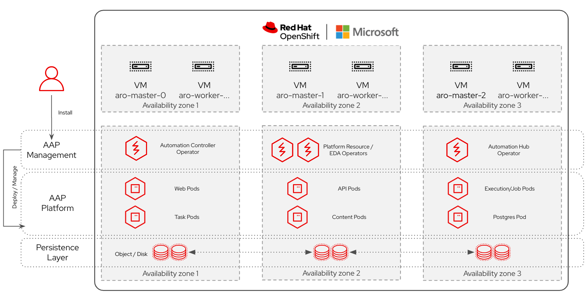
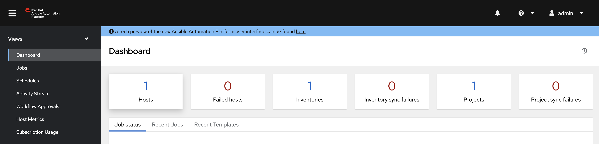

[Ansible Automation Platform (AAP)](https://www.ansible.com/products/automation-platform) is a popular platform for centralizing 
and managing an organization's automation content using Ansible as the engine for writing automation code.  Prior to 
deployment, organizations are faced with the decision "where do I want to host this thing?".  In today's landscape, there 
are several options between traditional Virtual Machines, running it on OpenShift, or even running it as a 
managed offering.  This walkthrough covers a scenario when a customer wants to run AAP on top of a managed 
OpenShift offering like Azure Red Hat OpenShift (ARO).

> **NOTE:** there are several design decisions that go into the deployment of AAP.  This is a simple walkthrough to 
> get you going and does not cover all possible decisions.


## Prerequisites

* [Azure CLI](https://docs.microsoft.com/en-us/cli/azure/install-azure-cli?view=azure-cli-latest)
* [An Azure Red Hat OpenShift (ARO) cluster](/quickstart-aro)


## High-Level Architecture

Below represents a high-level architecture.  It is intended to show a simplified architecture with *most* components
deployed.  Please note that components can easily be spread across multiple availability zones to achieve high 
availability requirements, which is not represented in the overly simplified diagram below:



## Prepare your Environment

This step simply sets up your environment with variables to be used during installation:

```bash
export AZR_RESOURCE_GROUP='aro-cluster-rg'
export AZR_CLUSTER='aro-cluster'
export AAP_ADMIN_USERNAME='admin'
export AAP_ADMIN_PASSWORD='MySecureP@$$w0rd' # notsecret
export AAP_ADMIN_EMAIL='myemail@mydomain.com'
export AAP_APPS_DOMAIN="$(az aro show -n $AZR_CLUSTER -g $AZR_RESOURCE_GROUP | jq -r '.clusterProfile.domain')"
```


## Create the Prerequisite Projects and Secrets

This project assumes that you will be installing the following components of Ansible Automation Platform:

- [Automation Controller](#install-the-automation-controller)
- [Event Driven Ansible Controller](#install-event-driven-ansible-controller)
- [Automation Hub](#install-automation-hub)

1. Create the projects for each of the components and the operators:

    ```bash
    for PROJECT in aap-controller aap-eda aap-hub aap; do
      oc new-project $PROJECT
    done
    ```

1. Create the admin password secret for each of the operators.  This will be used to authenticate with each of the 
individual components of AAP:

    ```bash
    for PROJECT in aap-controller aap-eda aap-hub; do
      oc -n $PROJECT create secret generic aap-admin-password --from-literal=password="$AAP_ADMIN_PASSWORD"
    done
    ```


## Install the AAP Operators

This section covers the installation of the AAP operators.  The AAP operators are responsible for all deployment 
and management actions as it relates to AAP.

1. Install the AAP Operators:

    ```bash
    cat <<EOF | oc apply -f -
    apiVersion: operators.coreos.com/v1
    kind: OperatorGroup
    metadata:
      name: aap
      namespace: aap
    spec:
      upgradeStrategy: Default
    ---
    apiVersion: operators.coreos.com/v1alpha1
    kind: Subscription
    metadata:
      labels:
        operators.coreos.com/ansible-automation-platform-operator.aap: ""
      name: ansible-automation-platform-operator
      namespace: aap
    spec:
      channel: stable-2.4-cluster-scoped
      installPlanApproval: Automatic
      name: ansible-automation-platform-operator
      source: redhat-operators
      sourceNamespace: openshift-marketplace
      startingCSV: aap-operator.v2.4.0-0.1718152680
    EOF
    ```


## Install the Automation Controller

1. Install the automation controller with the `AutomationController` custom resource definition 
which was provided via the [operator installation](#install-the-aap-operators) in the previous 
step:

    > **NOTE:** you may need to adjust the `*_resource_requirements` fields (not 
    > pictured below) depending upon how large your deployment is and how many hosts you are 
    > managing with AAP.  See `oc explain automationcontroller.spec` for full configuration
    > details.

    ```bash
    cat <<EOF | oc apply -f -
    apiVersion: automationcontroller.ansible.com/v1beta1
    kind: AutomationController
    metadata:
      labels:
        app.kubernetes.io/component: automationcontroller
        app.kubernetes.io/managed-by: automationcontroller-operator
        app.kubernetes.io/operator-version: ""
        app.kubernetes.io/part-of: default
      name: default
      namespace: aap-controller
    spec:
      admin_email: $AAP_ADMIN_EMAIL
      admin_user: $AAP_ADMIN_USERNAME
      admin_password_secret: aap-admin-password
      auto_upgrade: false
      create_preload_data: true
      garbage_collect_secrets: false
      hostname: ansible.apps.$AAP_APPS_DOMAIN
      image_pull_policy: IfNotPresent
      ingress_type: Route
      ipv6_disabled: false
      loadbalancer_ip: ""
      loadbalancer_port: 80
      loadbalancer_protocol: http
      metrics_utility_cronjob_gather_schedule: '@hourly'
      metrics_utility_cronjob_report_schedule: '@monthly'
      metrics_utility_enabled: false
      metrics_utility_pvc_claim_size: 5Gi
      no_log: true
      postgres_keepalives: true
      postgres_keepalives_count: 5
      postgres_keepalives_idle: 5
      postgres_keepalives_interval: 5
      postgres_storage_class: managed-csi
      projects_persistence: true
      projects_storage_access_mode: ReadWriteMany
      projects_storage_class: azurefile-csi
      projects_storage_size: 8Gi
      projects_use_existing_claim: _No_
      replicas: 2
      route_host: ansible.apps.$AAP_APPS_DOMAIN
      route_tls_termination_mechanism: Edge
      service_type: ClusterIP
      set_self_labels: true
      task_privileged: false
      task_replicas: 2
      web_replicas: 2
    EOF
    ```

1. This should take a few minutes to become ready.  You can monitor the status by checking to see 
the pods that are deployed.  The deployed pods are prepended with the `.metadata.name` value of the 
`AutomationController` instance deployed above.  In this case, `default` are the deployed pods:

    ```bash
    oc get pods -n aap-controller
    NAME                                                              READY   STATUS    RESTARTS   AGE
    default-postgres-13-0                                             1/1     Running   0          20h
    default-task-58b4877695-hxwbl                                     4/4     Running   0          20h
    default-task-58b4877695-lbmtz                                     4/4     Running   0          20h
    default-web-6f5f558647-cmqhm                                      3/3     Running   0          20h
    default-web-6f5f558647-xc45k                                      3/3     Running   0          20h
    ```

1. Should you run into issues, you can check the logs of the automation controller operator pod.  This
operator is responsible for watching for new `AutomationController` instances and deploying and 
managing those instances:

    ```bash
    oc -n aap logs "$(oc get pods -n aap | grep automation-controller | awk '{print $1}')"
    ```

1. Once deployed (you should see some task pods, some web pods, and a postgres pod), you can login to the
Ansible Automation Platform UI with the `AAP_ADMIN_USERNAME` user and the password that you set with the 
`AAP_ADMIN_PASSWORD` environment variable.  Once logged in you will need to provide access to an 
AAP subscription via your RH or Satellite credentials, accept a EULA, and then you are redirected to the
dashboard.  You can access AAP via the `https://ansible.apps.$AAP_APPS_DOMAIN` url:

    


## Install Event Driven Ansible Controller

For those that wish to use event-driven Ansible, you can install the EDA controller.

1. Install the EDA controller with the `EDA` custom resource definition 
which was provided via the [operator installation](#install-the-aap-operators) in the previous 
step:

    > **NOTE:** you may need to adjust the `*_resource_requirements` fields (not 
    > pictured below) depending upon how large your deployment is and how many hosts you are 
    > managing with AAP.  See `oc explain eda.spec` for full configuration
    > details.

    ```bash
    cat <<EOF | oc apply -f -
    apiVersion: eda.ansible.com/v1alpha1
    kind: EDA
    metadata:
      name: default
      namespace: aap-eda
    spec:
      admin_user: $AAP_ADMIN_USERNAME
      admin_password_secret: aap-admin-password
      automation_server_url: http://default-service.aap-controller.svc.cluster.local
      automation_server_ssl_verify: "no"
      hostname: ansible-eda.apps.$AAP_APPS_DOMAIN
      route_host: ansible-eda.apps.$AAP_APPS_DOMAIN
    EOF
    ```

1. This should take a few minutes to become ready.  You can monitor the status by checking to see 
the pods that are deployed.  The deployed pods are prepended with the `.metadata.name` value of the 
`EDA` instance deployed above.  In this case, `default` are the deployed pods:

    ```bash
    oc get pods -n aap-eda
    NAME                                         READY   STATUS    RESTARTS   AGE
    default-activation-worker-75687bbc94-57cfx   1/1     Running   0          164m
    default-activation-worker-75687bbc94-8g5jz   1/1     Running   0          164m
    default-activation-worker-75687bbc94-jhbl2   1/1     Running   0          164m
    default-activation-worker-75687bbc94-w8ftt   1/1     Running   0          164m
    default-activation-worker-75687bbc94-wdkx9   1/1     Running   0          164m
    default-api-79ccd57964-k6tnv                 2/2     Running   0          164m
    default-default-worker-68c67b6c7c-67p79      1/1     Running   0          164m
    default-default-worker-68c67b6c7c-rt64p      1/1     Running   0          164m
    default-postgres-13-0                        1/1     Running   0          166m
    default-redis-76bb4fd9b5-4cpgm               1/1     Running   0          166m
    default-scheduler-6b6794b566-bmwt5           1/1     Running   0          164m
    default-ui-84789f9657-ktsbd                  1/1     Running   0          164m
    ```

1. Should you run into issues, you can check the logs of the automation hub operator pod.  This
operator is responsible for watching for new `EDA` instances and deploying and 
managing those instances:

    ```bash
    oc -n aap logs "$(oc get pods -n aap | grep eda-server | awk '{print $1}')"
    ```

1. Once deployed (you should see activation workers, api pods, default workers and other various pods), you can login to the
Ansible EDA UI with the `AAP_ADMIN_USERNAME` user and the password that you set with the 
`AAP_ADMIN_PASSWORD` environment variable.  You can access AAP via the 
`https://ansible-eda.apps.$AAP_APPS_DOMAIN` url:

    

    > **NOTE:** should you run into issues with an invalid username or password, you can change it to the 
    > value you set as AAP_ADMIN_PASSWORD (see https://access.redhat.com/solutions/7050687)

    ```bash
    oc -n aap-eda exec -it "$(oc get pods -n aap-eda | grep default-worker | awk '{print $1}' | head -1)" bash
    aap-eda-manage changepassword admin
    Password: ******
    Password (confirm): ******
    ```


## Install Automation Hub

For those that wish to host their own Ansible content locally, you may also wish to install Automation Hub.

1. Install the automation hub with the `AutomationHub` custom resource definition 
which was provided via the [operator installation](#install-the-aap-operators) in the previous 
step:

    > **NOTE:** you may need to adjust the `*_resource_requirements` fields (not 
    > pictured below) depending upon how large your deployment is and how many hosts you are 
    > managing with AAP.  See `oc explain automationhub.spec` for full configuration
    > details.

    ```bash
    cat <<EOF | oc apply -f -
    apiVersion: automationhub.ansible.com/v1beta1
    kind: AutomationHub
    metadata:
      name: default
      namespace: aap-hub
    spec:
      admin_password_secret: aap-admin-password
      hostname: ansible-hub.apps.$AAP_APPS_DOMAIN
      file_storage_storage_class: azurefile-csi
    EOF
    ```

1. This should take a few minutes to become ready.  You can monitor the status by checking to see 
the pods that are deployed.  The deployed pods are prepended with the `.metadata.name` value of the 
`AutomationHub` instance deployed above.  In this case, `default` are the deployed pods:

    ```bash
    oc get pods -n aap-hub
    NAME                              READY   STATUS    RESTARTS   AGE
    default-api-67d65994b-wkf46       1/1     Running   0          5m34s
    default-content-c57949488-4nmtw   1/1     Running   0          5m53s
    default-content-c57949488-xg5cp   1/1     Running   0          5m53s
    default-postgres-13-0             1/1     Running   0          15m
    default-redis-7cf4b5d458-fqpck    1/1     Running   0          5m46s
    default-worker-5948db6cc-mtv7z    1/1     Running   0          3m24s
    default-worker-5948db6cc-r9m8m    1/1     Running   0          3m24s
    ```

1. Should you run into issues, you can check the logs of the automation hub operator pod.  This
operator is responsible for watching for new `AutomationHub` instances and deploying and 
managing those instances:

    ```bash
    oc -n aap logs "$(oc get pods -n aap | grep automation-hub | awk '{print $1}')"
    ```

1. Once deployed (you should see api pods, worker pods, a postgres pod, a redis pod and content pods), you can login to the
Ansible Automation Hub UI with the `AAP_ADMIN_USERNAME` user and the password that you set with the 
`AAP_ADMIN_PASSWORD` environment variable.  You can access AAP via the 
`https://default-aap-hub.apps.$AAP_APPS_DOMAIN` url:

    

