A guide to deploying Advanced Cluster Management (ACM) and OpenShift Data Foundation (ODF) for Azure Red hat OpenShift (ARO) Disaster Recovery 

Authors: [Ricardo Macedo Martins](https://www.linkedin.com/in/ricmmartins), [Chris Kang](https://www.linkedin.com/in/theckang/)

In today's fast-paced and data-driven world, ensuring the resilience and availability of your applications and data has never been more critical. The unexpected can happen at any moment, and the ability to recover quickly and efficiently is paramount. That's where OpenShift Advanced Cluster Management (ACM) and OpenShift Data Foundation (ODF) come into play. In this guide, we will explore the deployment of ACM and ODF for disaster recovery (DR) purposes, empowering you to safeguard your applications and data across multiple clusters.

# Sample Architecture

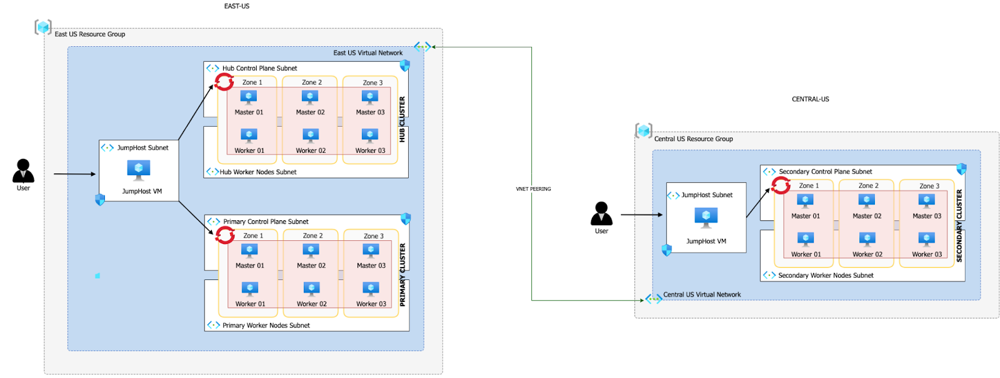
*Download a [Visio file](images/sample-architecture.vsdx) of this architecture* 

**Hub Cluster (East US Region):**
* This is the central control and management cluster of your multi-cluster environment.
* It hosts Red Hat Advanced Cluster Management (ACM), which is a powerful tool for managing and orchestrating multiple OpenShift clusters.
* Within the Hub Cluster, you have MultiClusterHub, which is a component of ACM that facilitates the management of multiple OpenShift clusters from a single control point.
* Additionally, you have OpenShift Data Foundation (ODF) Multicluster Orchestrator in the Hub Cluster. ODF provides data storage, management, and services across clusters.
* The Hub Cluster shares the same Virtual Network (VNET) with the Primary Cluster, but they use different subnets within that VNET.
* VNET peering is established between the Hub Cluster's VNET and the Secondary Cluster's dedicated VNET in the Central US region. This allows communication between the clusters.


**Primary Cluster (East US Region):**
* This cluster serves as the primary application deployment cluster.
* It has the Submariner Add-On, which is a component that enables network connectivity and service discovery between clusters.
* ODF is also deployed in the Primary Cluster, providing storage and data services to applications running in this cluster.
* By using Submariner and ODF in the Primary Cluster, you enhance the availability and data management capabilities of your applications.

**Secondary Cluster (Central US Region):**
* This cluster functions as a secondary or backup cluster for disaster recovery (DR) purposes.
* Similar to the Primary Cluster, it has the Submariner Add-On to establish network connectivity.
* ODF is deployed here as well, ensuring that data can be replicated and managed across clusters.
* The Secondary Cluster resides in its own dedicated VNET in the Central US region.

In summary, this multi-cluster topology is designed for high availability and disaster recovery. The Hub Cluster with ACM and ODF Multicluster Orchestrator serves as the central control point for managing and orchestrating the Primary and Secondary Clusters. The use of Submariner and ODF in both the Primary and Secondary Clusters ensures that applications can seamlessly failover to the Secondary Cluster in the event of a disaster, while data remains accessible and consistent across all clusters. The VNET peering between clusters enables secure communication and data replication between regions.

## Prerequisites

* [Azure CLI](https://learn.microsoft.com/en-us/cli/azure/install-azure-cli)
* [SShuttle](https://github.com/sshuttle/sshuttle) to create a SSH VPN (or create an  [Azure VPN](https://learn.microsoft.com/en-us/azure/vpn-gateway/vpn-gateway-about-vpngateways))

## Prepare Azure Account for Azure OpenShift

1. Log into the Azure CLI by running the following and then authorizing through your Web Browser

```bash 
az login
```

2. Make sure you have enough Quota (change the location if you’re not using East US)

```bash
az vm list-usage --location "East US" -o table
```

See [Addendum - Adding Quota to ARO account](https://cloud.redhat.com/experts/aro/private-cluster/#adding-quota-to-aro-account) if you have less than 36 Quota left for Total Regional vCPUs.

3. Register resource providers

```bash
az provider register -n Microsoft.RedHatOpenShift --wait
az provider register -n Microsoft.Compute --wait
az provider register -n Microsoft.Storage --wait
az provider register -n Microsoft.Authorization --wait
```

## Get Red Hat pull secret

1. Log into [https://cloud.redhat.com](https://cloud.redhat.com)
2. Browse to https://cloud.redhat.com/openshift/install/azure/aro-provisioned
3. Click the **Download pull secret** button and remember where you saved it, you’ll reference it later.

# Deploying the Hub Cluster 

### Environment Variables

Set some environment variables to use later, and create an Azure Resource Group.

1. Set the following environment variables

```
export AZR_RESOURCE_LOCATION=eastus
export AZR_RESOURCE_GROUP=rg-eastus
export AZR_CLUSTER=hub-cluster
export AZR_PULL_SECRET=~/Downloads/pull-secret.txt
export VIRTUAL_NETWORK=10.0.0.0/20
export CONTROL_SUBNET=10.0.0.0/24
export WORKER_SUBNET=10.0.1.0/24
export JUMPHOST_SUBNET=10.0.10.0/24
```

2. Create an Azure resource group

```az group create                		\
  --name $AZR_RESOURCE_GROUP   	        \
  --location $AZR_RESOURCE_LOCATION
  ```

  3. Create an Azure Service Principal

  ```
  AZ_SUB_ID=$(az account show --query id -o tsv)
AZ_SP_PASS=$(az ad sp create-for-rbac -n "${AZR_CLUSTER}-SP" --role contributor \
  --scopes "/subscriptions/${AZ_SUB_ID}/resourceGroups/${AZR_RESOURCE_GROUP}" 	\
  --query "password" -o tsv)
AZ_SP_ID=$(az ad sp list --display-name "${AZR_CLUSTER}-SP" --query "[0].appId" -o tsv)
```


### Networking

Create a virtual network with two empty subnets

1. Create virtual network

```
az network vnet create                                    	\
  --address-prefixes $VIRTUAL_NETWORK                    	\
  --name "$AZR_CLUSTER-aro-vnet-$AZR_RESOURCE_LOCATION"   	\
  --resource-group $AZR_RESOURCE_GROUP
```

2. Create control plane subnet

```  az network vnet subnet create                                  \
  --resource-group $AZR_RESOURCE_GROUP                            	\
  --vnet-name "$AZR_CLUSTER-aro-vnet-$AZR_RESOURCE_LOCATION"      	\
  --name "$AZR_CLUSTER-aro-control-subnet-$AZR_RESOURCE_LOCATION" 	\
  --address-prefixes $CONTROL_SUBNET 
  ```

3. Create worker subnet

```  az network vnet subnet create                                \
  --resource-group $AZR_RESOURCE_GROUP                            \
  --vnet-name "$AZR_CLUSTER-aro-vnet-$AZR_RESOURCE_LOCATION"      \
  --name "$AZR_CLUSTER-aro-worker-subnet-$AZR_RESOURCE_LOCATION"  \
  --address-prefixes $WORKER_SUBNET   
  ```

### Jump Host

With the cluster in a private network, we can create a jump host in order to connect to it. 

1. Create the jump subnet

```az network vnet subnet create                                \
  --resource-group $AZR_RESOURCE_GROUP                       	\
  --vnet-name "$AZR_CLUSTER-aro-vnet-$AZR_RESOURCE_LOCATION" 	\
  --name JumpSubnet                                          	\
  --address-prefixes $JUMPHOST_SUBNET    
  ```

2. Create a jump host

``` az vm create --name jumphost                 		\
    --resource-group $AZR_RESOURCE_GROUP     	        \
    --ssh-key-values $HOME/.ssh/id_rsa.pub   	        \
    --admin-username aro                     			\
    --image "RedHat:RHEL:9_1:9.1.2022112113" 		    \
    --subnet JumpSubnet                      			\
    --public-ip-address jumphost-ip          		    \
    --public-ip-sku Standard                 			\
    --vnet-name "$AZR_CLUSTER-aro-vnet-$AZR_RESOURCE_LOCATION"
```

3. Save the jump host public IP address

```JUMP_IP=$(az vm list-ip-addresses -g $AZR_RESOURCE_GROUP -n jumphost -o tsv \
--query '[].virtualMachine.network.publicIpAddresses[0].ipAddress')

echo $JUMP_IP
```

4. Use sshuttle to create a SSH VPN via the jump host (use a separate terminal session)

Replace the IP with the IP of the jump box from the previous step

```
sshuttle --dns -NHr "aro@${JUMP_IP}"  10.0.0.0/8
```

### Create the Cluster

This will take between 30 and 45 minutes

```
    az aro create                                                            	\
    --resource-group $AZR_RESOURCE_GROUP                                     	\
    --name $AZR_CLUSTER                                                     	\
    --vnet "$AZR_CLUSTER-aro-vnet-$AZR_RESOURCE_LOCATION"                       \
    --master-subnet "$AZR_CLUSTER-aro-control-subnet-$AZR_RESOURCE_LOCATION" 	\
    --worker-subnet "$AZR_CLUSTER-aro-worker-subnet-$AZR_RESOURCE_LOCATION" 	\
    --version 4.12.25                                                           \
    --apiserver-visibility Private                                           	\
    --ingress-visibility Private                                             	\
    --pull-secret @$AZR_PULL_SECRET                                          	\
    --client-id "${AZ_SP_ID}"                                               	\
    --client-secret "${AZ_SP_PASS}"
```

1. To connect, get OpenShift console URL

```
APISERVER=$(az aro show              	\
--name $AZR_CLUSTER                  	\
--resource-group $AZR_RESOURCE_GROUP 	\
-o tsv --query apiserverProfile.url)
echo $APISERVER
```

2. Get OpenShift credentials

```
ADMINPW=$(az aro list-credentials    	\
--name $AZR_CLUSTER                  	\
--resource-group $AZR_RESOURCE_GROUP 	\
--query kubeadminPassword            	\
-o tsv)
```

3. Log into OpenShift

```
oc login $APISERVER --username kubeadmin --password ${ADMINPW}
```

### Setting up the Hub Cluster with the Advanced Cluster Management for Kubernetes 

1. To install using the console, basically you should go to Operators > OperatorHub and search by **Advanced Cluster Management for Kubernetes**

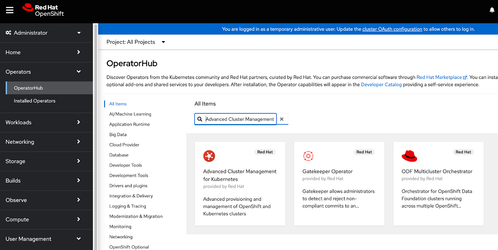 

2. Select the first one, then the following screen will be displayed:

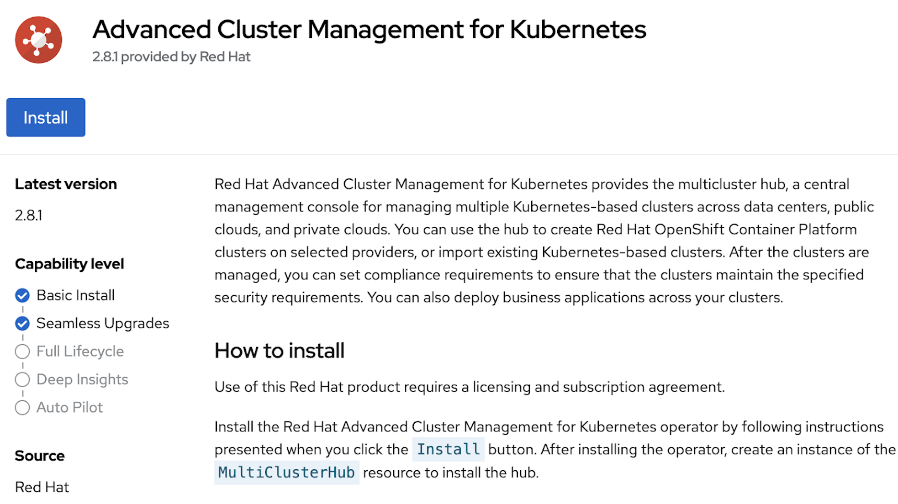 

3. Click to Install button and the following options will appear. Keep the default choices and click to install

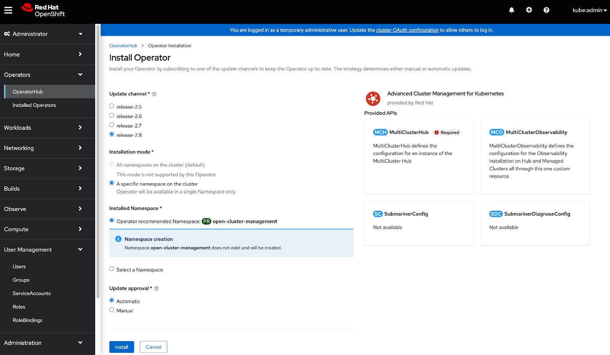 

4. The installation will begin

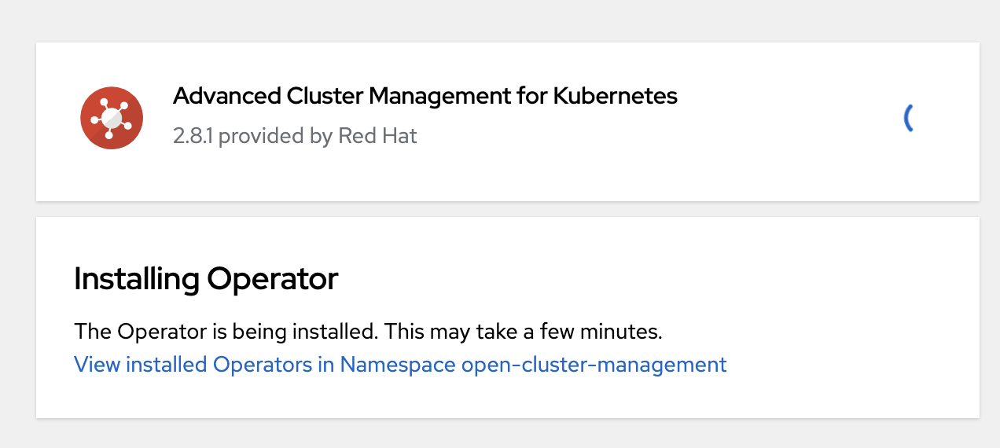

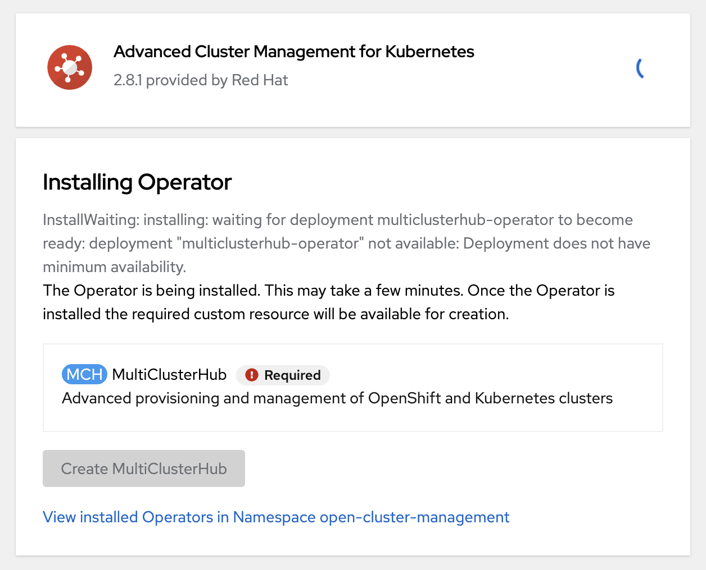

5. After the installation is complete you will have to create the MulticlusterHub:

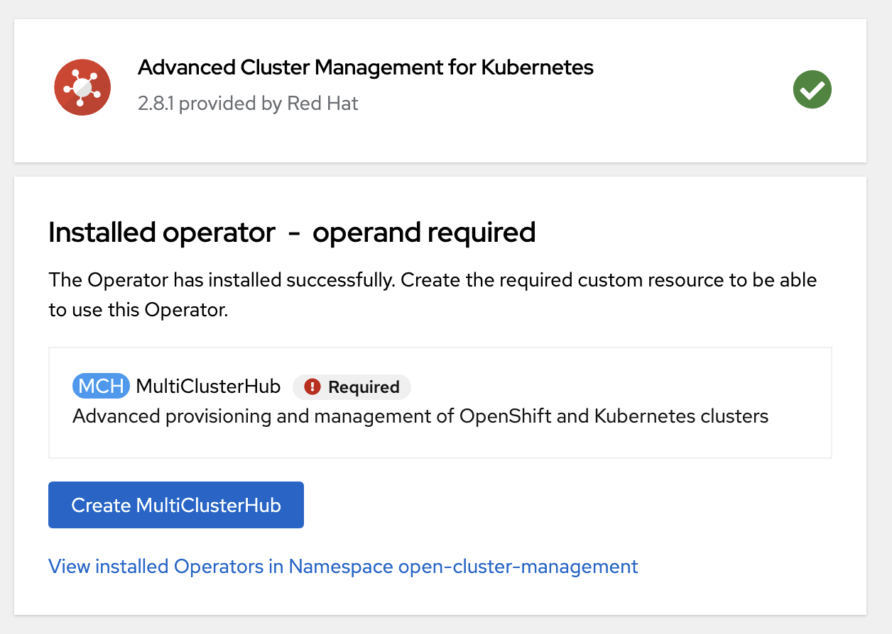

6. Click to create and you can keep the default settings:

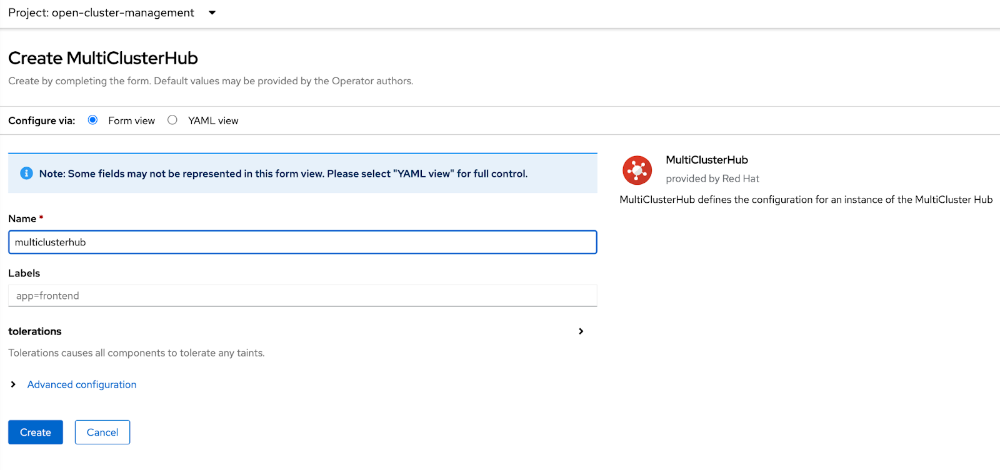 

7. In a few minutes will be ready and with the status of Running:

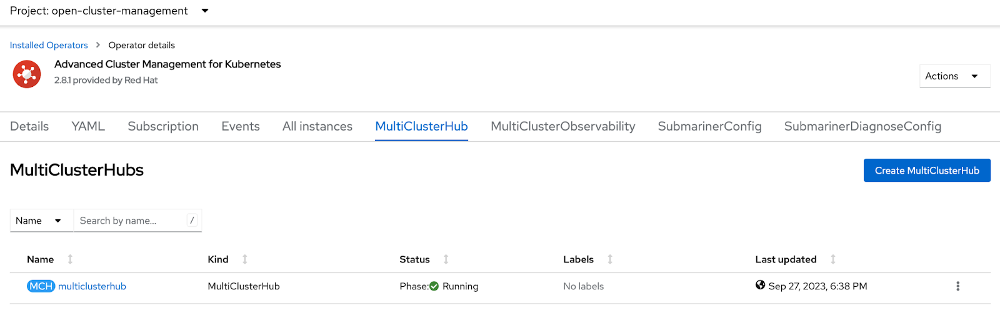

8. After the installation is done, now you will notice a new option within the menu:

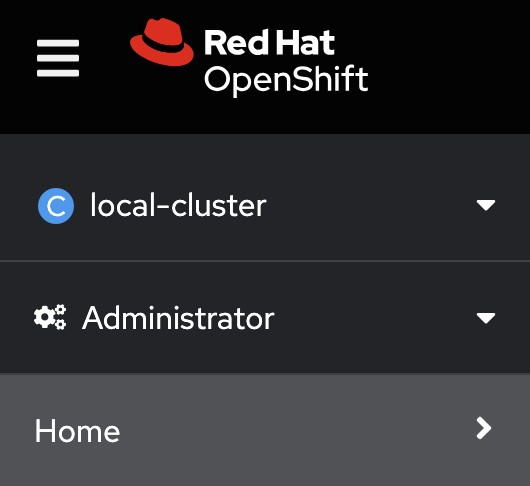

10. When local-cluster is selected you will see the dafaut configuration for your local cluster where the ACM was installed.

11. If you click you can change to see details of All Clusters:

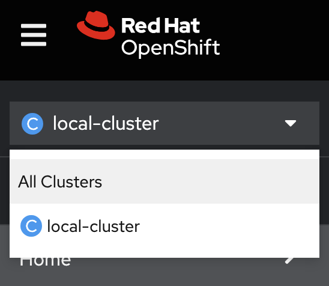

Then see the Overview panel from the Advanced Cluster Management:

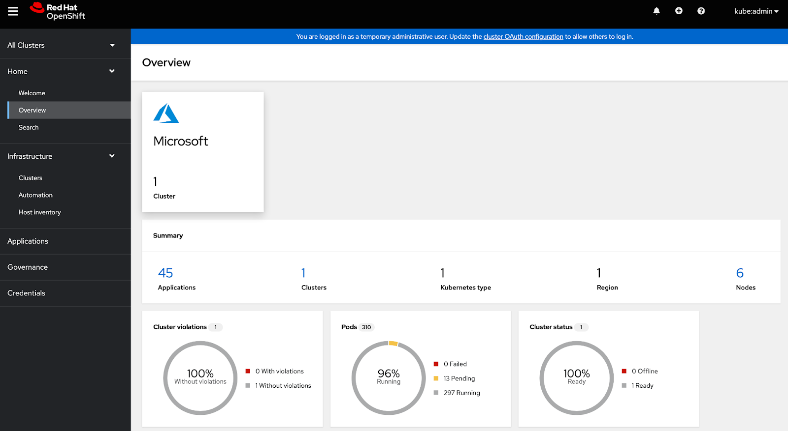 

### Setting up the Hub Cluster with the ODF Multicluster Orchestrator

1. To install using the console, you should go to Operators > OperatorHub and search by **ODF Multicluster Orchestrator**

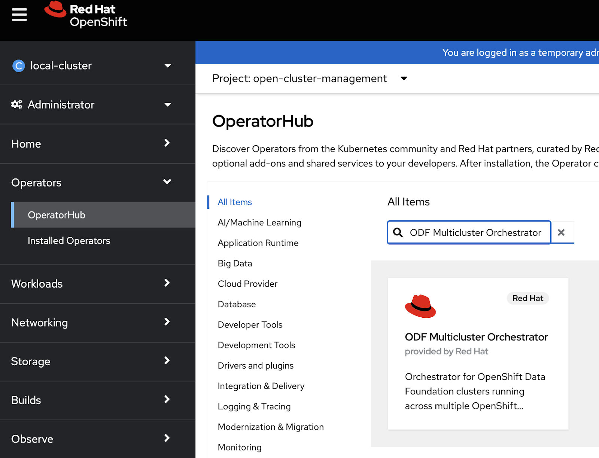 


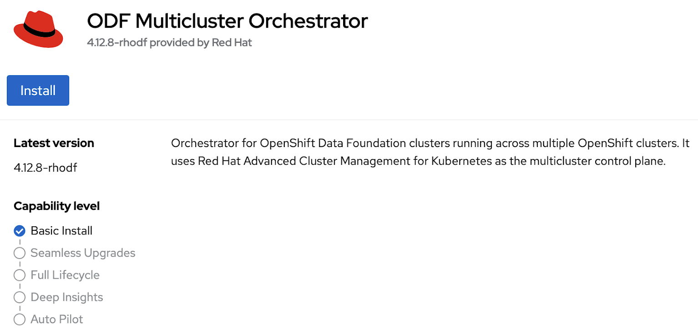 

3. In the next screen, you can keep the default settings then click to Install

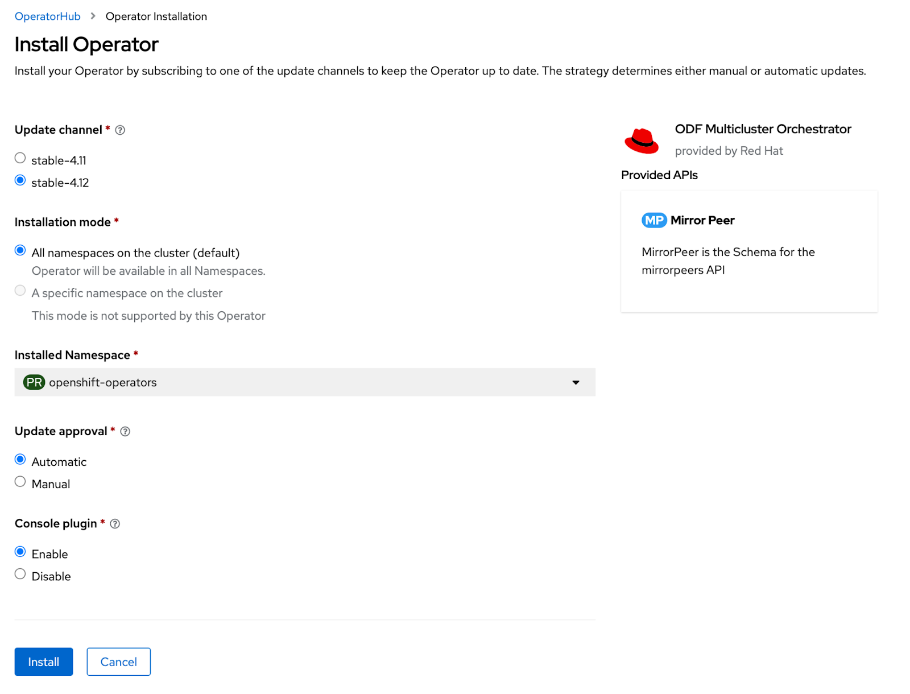 

4. The installation process will start and in a few minutes the installation will be completed:

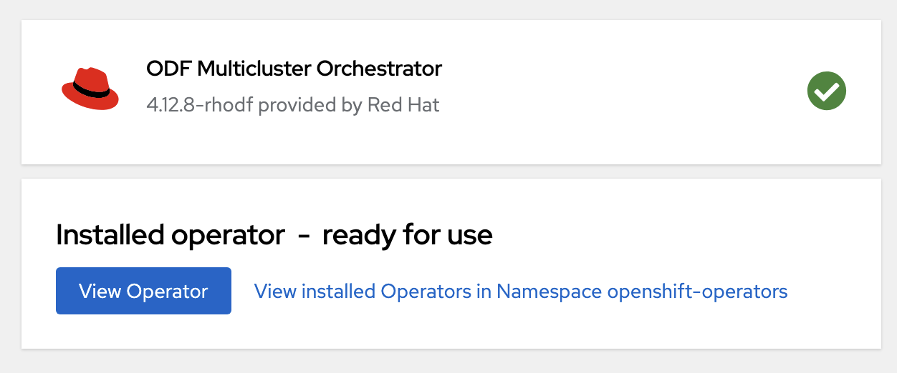

5. If you click to View Operator, you can confirm the details of the installation:

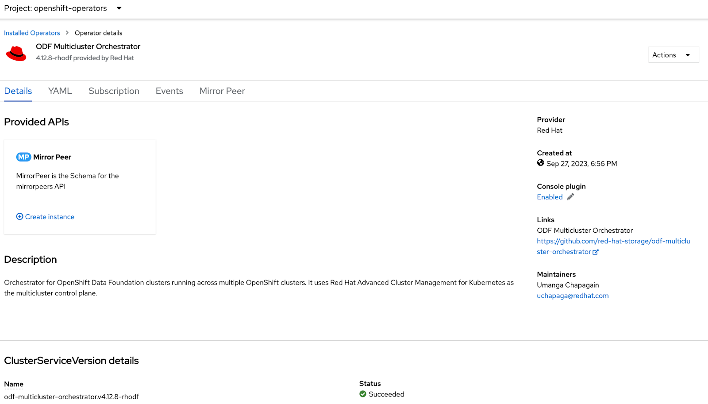

# Deploying the ARO Primary Cluster 

### Environment Variables

1. Set the following environment variables

```
export AZR_RESOURCE_LOCATION=eastus
export AZR_RESOURCE_GROUP=rg-eastus
export AZR_CLUSTER=primary-cluster
export AZR_PULL_SECRET=~/Downloads/pull-secret.txt
export VIRTUAL_NETWORK=10.0.0.0/20
export CONTROL_SUBNET=10.0.2.0/24
export WORKER_SUBNET=10.0.3.0/24
export JUMPHOST_SUBNET=10.0.10.0/24
export POD_CIDR=10.128.0.0/18
export SERVICE_CIDR=172.30.0.0/18
```

2. Create an Azure Service Principal


```
AZ_SUB_ID=$(az account show --query id -o tsv)
AZ_SP_PASS=$(az ad sp create-for-rbac -n "${AZR_CLUSTER}-SP" --role contributor \
  --scopes "/subscriptions/${AZ_SUB_ID}/resourceGroups/${AZR_RESOURCE_GROUP}" 	\
  --query "password" -o tsv)
AZ_SP_ID=$(az ad sp list --display-name "${AZR_CLUSTER}-SP" --query "[0].appId" -o tsv)
```

### Networking

Create two empty subnets on the existing virtual network

1. Create control plane subnet

```
  az network vnet subnet create                                   \
  --resource-group $AZR_RESOURCE_GROUP                            \
  --vnet-name "hub-cluster-aro-vnet-$AZR_RESOURCE_LOCATION"      	\
  --name "$AZR_CLUSTER-aro-control-subnet-$AZR_RESOURCE_LOCATION" \
  --address-prefixes $CONTROL_SUBNET 
  ```

2. Create worker subnet

```
  az network vnet subnet create                                   \
  --resource-group $AZR_RESOURCE_GROUP                            \
  --vnet-name "hub-cluster-aro-vnet-$AZR_RESOURCE_LOCATION"       \
  --name "$AZR_CLUSTER-aro-worker-subnet-$AZR_RESOURCE_LOCATION"  \
  --address-prefixes $WORKER_SUBNET   
  ```

### Jump Host

Since this Primary Cluster will use the same virtual network from the HUB Cluster, we will use the same jump host and there is no reason to create a new one.

1. Use sshuttle to create a SSH VPN via the jump host (use a separate terminal session)

{}Replace the IP with the IP of the jump box from the previous step{} 

```
sshuttle --dns -NHr "aro@${JUMP_IP}"  10.0.0.0/8
```

### Create the Cluster

{}Note: Pod and Service CIDRs CANNOT overlap with the secondary cluster and must be /18 minimum (because we are using Submariner). So we will use the parameters --pod-cidr and --service-cidr to avoid use the default ranges. Details about POD and Service CIDRs are [available here](https://learn.microsoft.com/en-us/azure/openshift/concepts-networking#networking-for-azure-red-hat-openshift).{} 

This will take between 30 and 45 minutes

```
    az aro create                                                            	\
    --resource-group $AZR_RESOURCE_GROUP                                     	\
    --name $AZR_CLUSTER                                                     	\
    --vnet "hub-cluster-aro-vnet-$AZR_RESOURCE_LOCATION"                      \
    --master-subnet "$AZR_CLUSTER-aro-control-subnet-$AZR_RESOURCE_LOCATION" 	\
    --worker-subnet "$AZR_CLUSTER-aro-worker-subnet-$AZR_RESOURCE_LOCATION" 	\
    --version 4.12.25                                                         \
    --apiserver-visibility Private                                           	\
    --ingress-visibility Private                                             	\
    --pull-secret @$AZR_PULL_SECRET                                          	\
    --client-id "${AZ_SP_ID}"                                               	\
    --client-secret "${AZ_SP_PASS}"                               						\
    --pod-cidr $POD_CIDR							                                        \
    --service-cidr $SERVICE_CIDR

```

1. To connect, get OpenShift console URL

```
APISERVER=$(az aro show              			\
--name $AZR_CLUSTER                  			\
--resource-group $AZR_RESOURCE_GROUP 	    \
-o tsv --query apiserverProfile.url)
echo $APISERVER
```

2. Get OpenShift credentials

```
ADMINPW=$(az aro list-credentials    		\
--name $AZR_CLUSTER                  			\
--resource-group $AZR_RESOURCE_GROUP 	\
--query kubeadminPassword            			\
-o tsv)
```

3. Log into OpenShift

```
oc login $APISERVER --username kubeadmin --password ${ADMINPW}
```

### Importing the Primary Cluster into the Advanced Cluster Management

1. To import this cluster into the ACM, login into the Hub Cluster Console then using the Advanced Cluster Management Menu, select **All Clusters**:

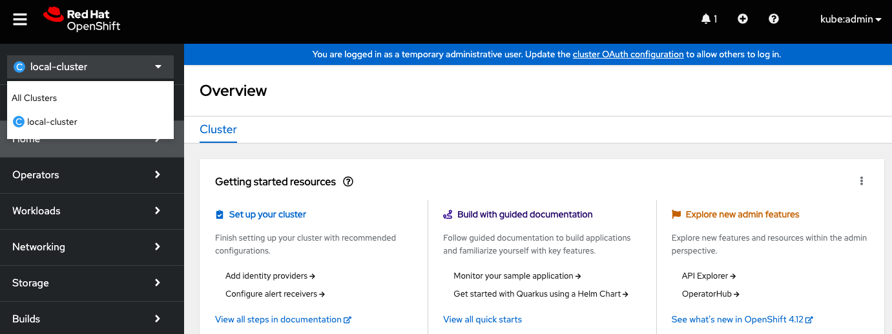

2. Then go to **Infrastructure** > **Clusters**

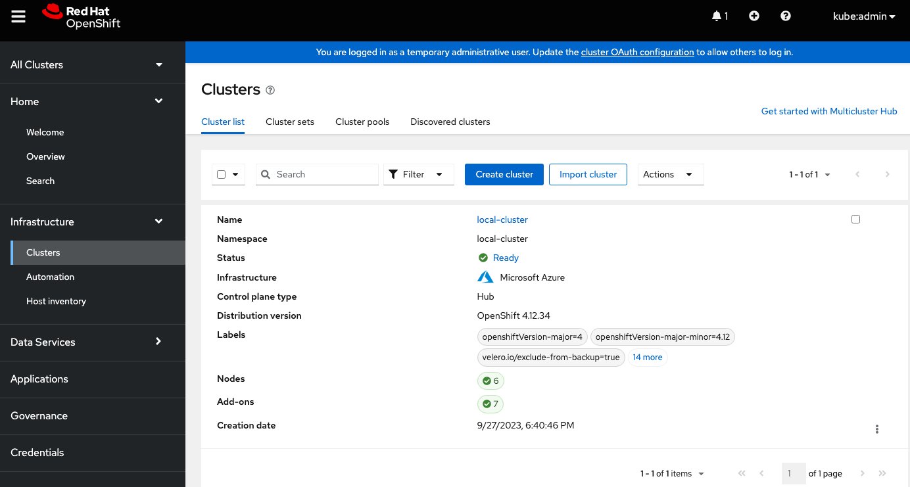

3. Now click on **Import cluster** and fill out with the appropriate information regarding the Primary Cluster:


4. When you click **Next** you will be presented to the below screen:


5. In this example you don’t need to change nothing. Just click **Next** again and you will be presented to the Review section:


6. Click on **Generate command** and you will be redirected to this screen:

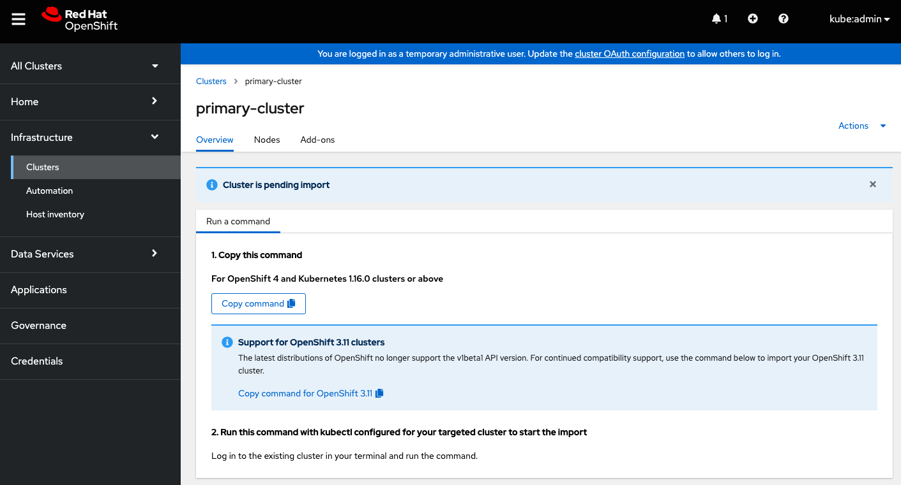

7. Click on **Copy command** and paste the command into the Primary Cluster. To do it, follow these steps:

8. Get OpenShift console URL

```
APISERVER=$(az aro show              	\
--name $AZR_CLUSTER                  	\
--resource-group $AZR_RESOURCE_GROUP 	\
-o tsv --query apiserverProfile.url)
echo $APISERVER
```

9. Get OpenShift credentials

```
ADMINPW=$(az aro list-credentials    	\
--name $AZR_CLUSTER                  	\
--resource-group $AZR_RESOURCE_GROUP 	\
--query kubeadminPassword            	\
-o tsv)
```

10. Log into OpenShift

```
oc login $APISERVER --username kubeadmin --password ${ADMINPW}
```

11. Paste the command and the output should be similar to it:

```
customresourcedefinition.apiextensions.k8s.io/klusterlets.operator.open-cluster-management.io created
namespace/open-cluster-management-agent created
serviceaccount/klusterlet created
clusterrole.rbac.authorization.k8s.io/klusterlet created
clusterrole.rbac.authorization.k8s.io/klusterlet-bootstrap-kubeconfig created
clusterrole.rbac.authorization.k8s.io/open-cluster-management:klusterlet-admin-aggregate-clusterrole created
clusterrolebinding.rbac.authorization.k8s.io/klusterlet created
Warning: would violate PodSecurity "restricted:v1.24": allowPrivilegeEscalation != false (container "klusterlet" must set securityContext.allowPrivilegeEscalation=false), unrestricted capabilities (container "klusterlet" must set securityContext.capabilities.drop=["ALL"]), runAsNonRoot != true (pod or container "klusterlet" must set securityContext.runAsNonRoot=true), seccompProfile (pod or container "klusterlet" must set securityContext.seccompProfile.type to "RuntimeDefault" or "Localhost")
deployment.apps/klusterlet created
secret/bootstrap-hub-kubeconfig created
klusterlet.operator.open-cluster-management.io/klusterlet created
```

12. From the ACM, select **Infrastructure** > **Clusters**. Then under Cluster sets, select the default:

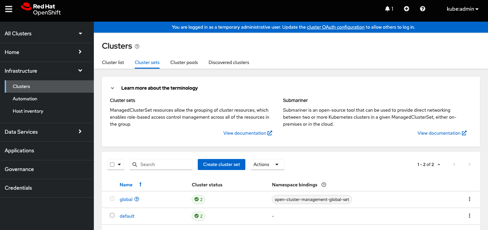

13. Now click on **Cluster list** and you will be able to see both clusters, the hub (named as local-cluster) and the primary-cluster:

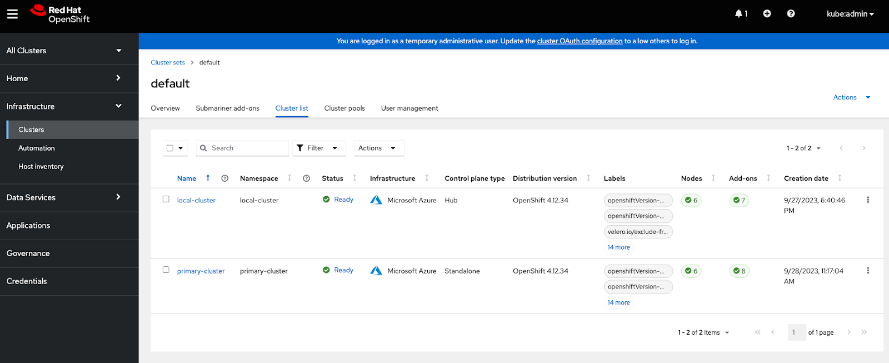

### Setting up the Primary Cluster with the Submariner Add-On


1. To deploy the Submariner Add-On, login into the Hub Cluster Console then using the Advanced Cluster Management Menu, select All Clusters:


2. Then go to **Infrastructure** > **Clusters**

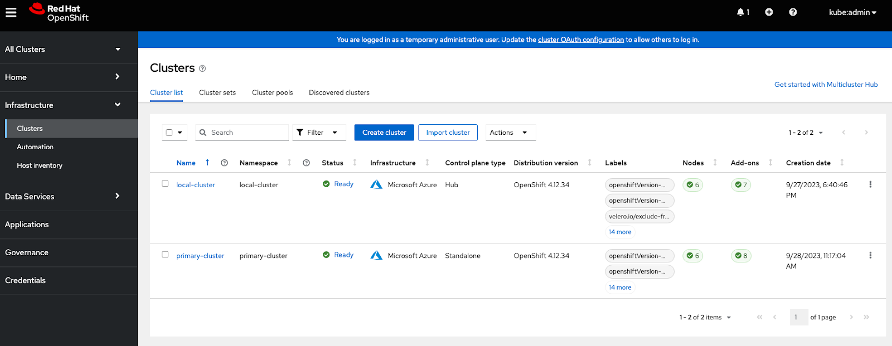

3. Click on **Cluster sets** then select the **default**

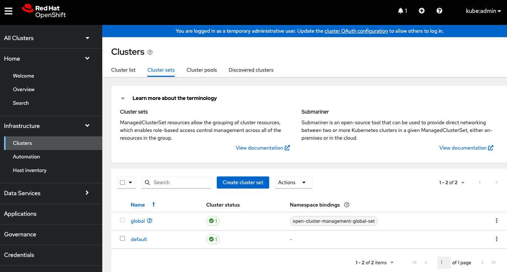

{}Note that the global cluster set exists by default and contains all of the managed clusters, imported or created. [More information here.](https://access.redhat.com/documentation/en-us/red_hat_advanced_cluster_management_for_kubernetes/2.8/html-single/clusters/index#managedclustersets_global){} 


4. After select the default cluster set, you will see the following screen where you should click on **Submariner add-ons**:


5. Now click on **Install Submariner add-ons** and set the configuration like below:

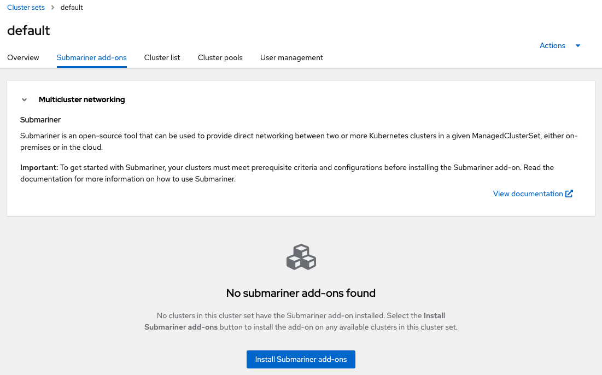

6. Add the **primary-cluster** as **Target clusters** then click **Next**

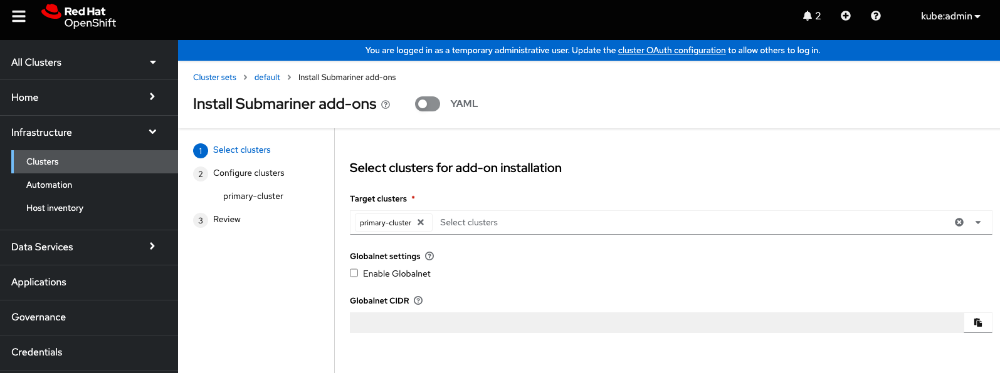

7. On the next screen keep the default settings and click **Next**:

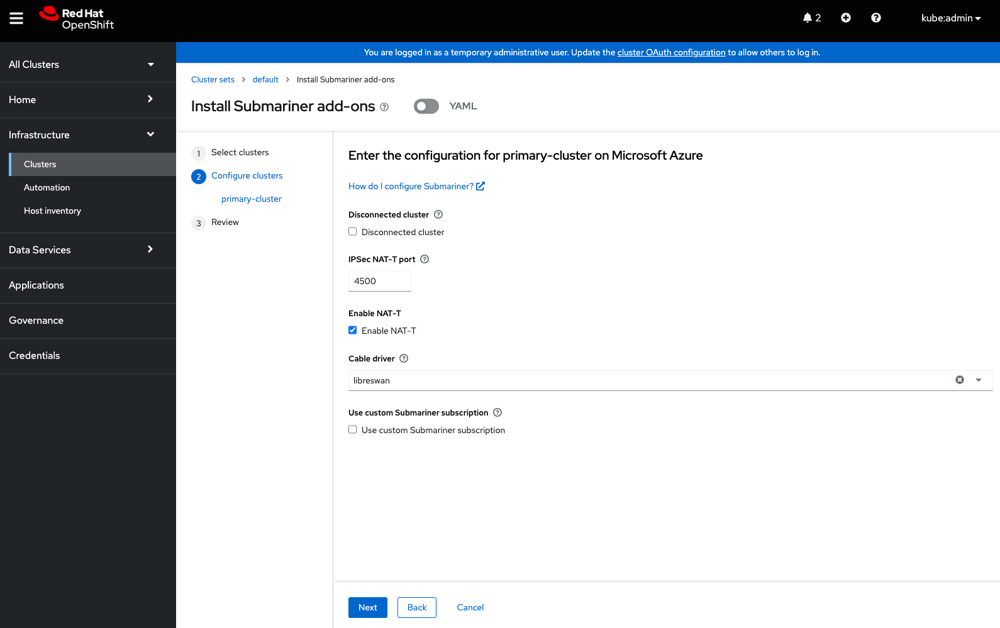

8. Review the configuration then click to **Install**

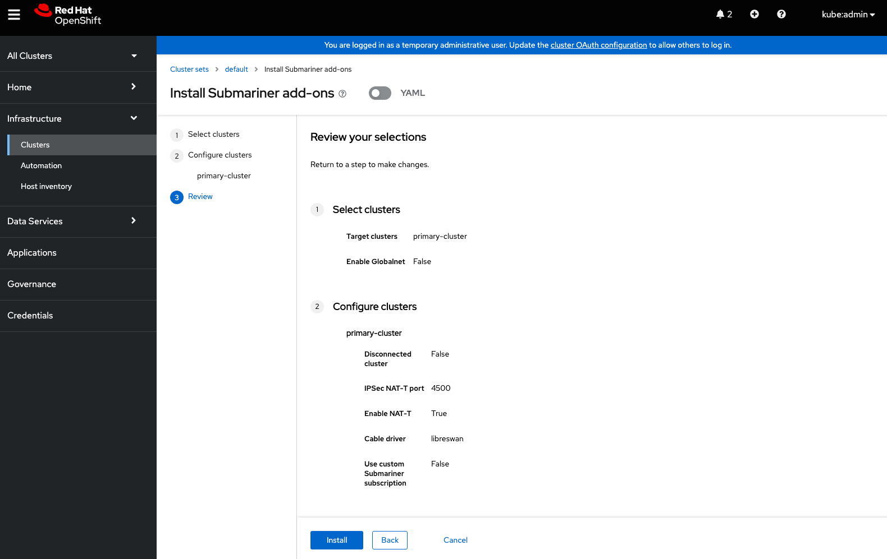

9. The installation will start and after 5-10 min the installation will be complete:

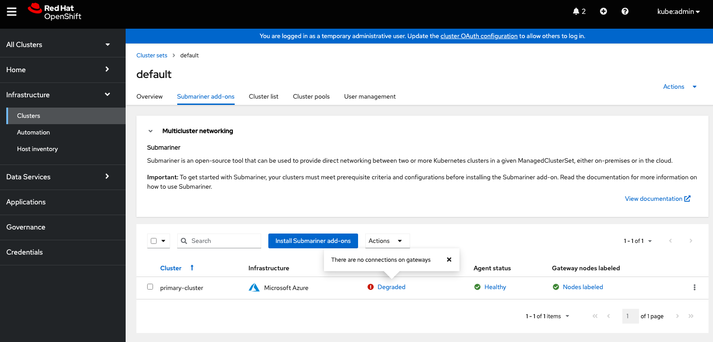


Since the secondary cluster isn't up and running with the Submariner add-on installed, you will see the message saying that the connection is Degraded (since there isn't a connection established yet). It will be fixed when the setup of the Submariner add-on is completed at the secondary cluster.

### Setting up the Primary Cluster with the ODF

1. In this document, there are all steps required to deploy the ODF into the Primary Cluster:
[https://cloud.redhat.com/experts/aro/odf/](https://cloud.redhat.com/experts/aro/odf/) 

{}Please note that when you subscribe to the ocs-operator and to odf-operator, you should change the channel from channel: stable-4.**11** to channel:stable-4.**12** since we are using the version 4.12 in this example.{} 

# Deploying the Secondary Cluster 

### Environment variables

1. Set the following environment variables

```
export AZR_RESOURCE_LOCATION=centralus
export AZR_RESOURCE_GROUP=rg-centralus
export AZR_CLUSTER=secondary-cluster
export AZR_PULL_SECRET=~/Downloads/pull-secret.txt
export VIRTUAL_NETWORK=192.168.0.0/20
export CONTROL_SUBNET=192.168.0.0/24
export WORKER_SUBNET=192.168.1.0/24
export JUMPHOST_SUBNET=192.168.10.0/24
export POD_CIDR=10.130.0.0/18
export SERVICE_CIDR=172.30.128.0/18
```

2. Create an Azure resource group

```az group create                	\
  --name $AZR_RESOURCE_GROUP   	    \
  --location $AZR_RESOURCE_LOCATION
```

3. Create an Azure Service Principal

```
AZ_SUB_ID=$(az account show --query id -o tsv)
AZ_SP_PASS=$(az ad sp create-for-rbac -n "${AZR_CLUSTER}-SP" --role contributor \
  --scopes "/subscriptions/${AZ_SUB_ID}/resourceGroups/${AZR_RESOURCE_GROUP}" 	\
  --query "password" -o tsv)
AZ_SP_ID=$(az ad sp list --display-name "${AZR_CLUSTER}-SP" --query "[0].appId" -o tsv)
```

### Networking

Create a virtual network with two empty subnets

1. Create virtual network

```
az network vnet create                                    	\
  --address-prefixes $VIRTUAL_NETWORK                      	\
  --name "$AZR_CLUSTER-aro-vnet-$AZR_RESOURCE_LOCATION"   	\
  --resource-group $AZR_RESOURCE_GROUP
 ```

 2. Create control plane subnet

```
  az network vnet subnet create                                   	\
  --resource-group $AZR_RESOURCE_GROUP                            	\
  --vnet-name "$AZR_CLUSTER-aro-vnet-$AZR_RESOURCE_LOCATION"      	\
  --name "$AZR_CLUSTER-aro-control-subnet-$AZR_RESOURCE_LOCATION" 	\
  --address-prefixes $CONTROL_SUBNET 
```

3. Create worker subnet

```
az network vnet subnet create                                     \
  --resource-group $AZR_RESOURCE_GROUP                            \
  --vnet-name "$AZR_CLUSTER-aro-vnet-$AZR_RESOURCE_LOCATION"      \
  --name "$AZR_CLUSTER-aro-worker-subnet-$AZR_RESOURCE_LOCATION"  \
  --address-prefixes $WORKER_SUBNET   
```

4. Create a peering between both VNETs (Hub Cluster in EastUS and Secondary Cluster in Central US)

```
export RG_EASTUS=rg-eastus
export RG_CENTRALUS=rg-centralus
export VNET_EASTUS=hub-cluster-aro-vnet-eastus
export VNET_CENTRALUS=secondary-cluster-aro-vnet-centralus

# Get the id for $VNET_EASTUS.
echo "Getting the id for $VNET_EASTUS"
VNET_EASTUS_ID=$(az network vnet show --resource-group $RG_EASTUS --name $VNET_EASTUS --query id --out tsv)

# Get the id for $VNET_CENTRALUS.
echo "Getting the id for $VNET_CENTRALUS"
VNET_CENTRALUS_ID=$(az network vnet show --resource-group $RG_CENTRALUS --name $VNET_CENTRALUS --query id --out tsv)

# Peer $VNET_EASTUS to $VNET_CENTRALUS.
echo "Peering $VNET_EASTUS to $VNET_CENTRALUS"
az network vnet peering create --name "Link"-$VNET_EASTUS-"To"-$VNET_CENTRALUS  \
  --resource-group $RG_EASTUS                                                   \
  --vnet-name $VNET_EASTUS                                                      \
  --remote-vnet $VNET_CENTRALUS_ID                                              \                         
  --allow-vnet-access                                                           \
  --allow-forwarded-traffic=True                                                \
  --allow-gateway-transit=True

# Peer$VNET_CENTRALUS to $VNET_EASTUS.
echo "Peering $VNET_CENTRALUS to $vNet1"
az network vnet peering create --name "Link"-$VNET_CENTRALUS-"To"-$VNET_EASTUS  \
  --resource-group $RG_CENTRALUS                                                 \
  --vnet-name $VNET_CENTRALUS                                                    \
  --remote-vnet $VNET_EASTUS_ID                                                  \
  --allow-vnet-access                                                            \
  --allow-forwarded-traffic=True                                                 \
  --allow-gateway-transit=True
```

### Jump Host

Since this cluster will reside in a different virtual network, we should create another jump host.

1. Create the jump subnet

```
az network vnet subnet create                                	\
  --resource-group $AZR_RESOURCE_GROUP                       	\
  --vnet-name "$AZR_CLUSTER-aro-vnet-$AZR_RESOURCE_LOCATION" 	\
  --name JumpSubnet                                          	\
  --address-prefixes $JUMPHOST_SUBNET                  
```

2. Create a jump host

```
 az vm create --name jumphost                \
    --resource-group $AZR_RESOURCE_GROUP     \
    --ssh-key-values $HOME/.ssh/id_rsa.pub   \
    --admin-username aro                     \
    --image "RedHat:RHEL:9_1:9.1.2022112113" \
    --subnet JumpSubnet                      \
    --public-ip-address jumphost-ip          \
    --public-ip-sku Standard                 \
    --vnet-name "$AZR_CLUSTER-aro-vnet-$AZR_RESOURCE_LOCATION"
```

3. Save the jump host public IP address

```
JUMP_IP=$(az vm list-ip-addresses -g $AZR_RESOURCE_GROUP -n jumphost -o tsv \
--query '[].virtualMachine.network.publicIpAddresses[0].ipAddress')

echo $JUMP_IP
```

4. Use sshuttle to create a SSH VPN via the jump host (use a separate terminal session)

Replace the IP with the IP of the jump box from the previous step

```
sshuttle --dns -NHr "aro@${JUMP_IP}"  192.168.0.0/8
```

### Create the Cluster

{}Note: Pod and Service CIDRs CANNOT overlap with the primary cluster and must be /18 minimum (because we are using Submariner). So we will use the parameters --pod-cidr and --service-cidr to avoid use the default ranges. Details about POD and Service CIDRs are [available here](https://learn.microsoft.com/en-us/azure/openshift/concepts-networking#networking-for-azure-red-hat-openshift).{} 


This will take between 30 and 45 minutes

```
 az aro create                                                            		\
    --resource-group $AZR_RESOURCE_GROUP                                     	\
    --name $AZR_CLUSTER                                                     	\
    --vnet "$AZR_CLUSTER-aro-vnet-$AZR_RESOURCE_LOCATION"                     \
    --master-subnet "$AZR_CLUSTER-aro-control-subnet-$AZR_RESOURCE_LOCATION" 	\
    --worker-subnet "$AZR_CLUSTER-aro-worker-subnet-$AZR_RESOURCE_LOCATION" 	\
    --version 4.12.25                                                         \
    --apiserver-visibility Private                                           	\
    --ingress-visibility Private                                             	\
    --pull-secret @$AZR_PULL_SECRET                                          	\
    --client-id "${AZ_SP_ID}"                                               	\
    --client-secret "${AZ_SP_PASS}"						                                \
    --pod-cidr $POD_CIDR								                                      \
    --service-cidr $SERVICE_CIDR
```

1. To connect on the cluster, get OpenShift console URL

```
APISERVER=$(az aro show              	\
--name $AZR_CLUSTER                  	\
--resource-group $AZR_RESOURCE_GROUP 	\
-o tsv --query apiserverProfile.url)
echo $APISERVER
```

2. Get OpenShift credentials

```
ADMINPW=$(az aro list-credentials    	\
--name $AZR_CLUSTER                  	\
--resource-group $AZR_RESOURCE_GROUP 	\
--query kubeadminPassword            	\
-o tsv)
```

3. Log into OpenShift

```
oc login $APISERVER --username kubeadmin --password ${ADMINPW}
```

### Importing the Secondary Cluster into the Advanced Cluster Management

1. To import this cluster into the ACM, login into the Hub Cluster Console then using the Advanced Cluster Management Menu, select All Clusters:


2. Then go to **Infrastructure** > **Clusters**


3. Now click on **Import cluster** and fill out with the appropriate information regarding the Primary Cluster:

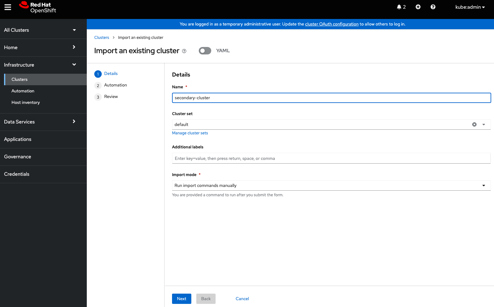

4. When you click **Next** you will be presented to the below screen. 

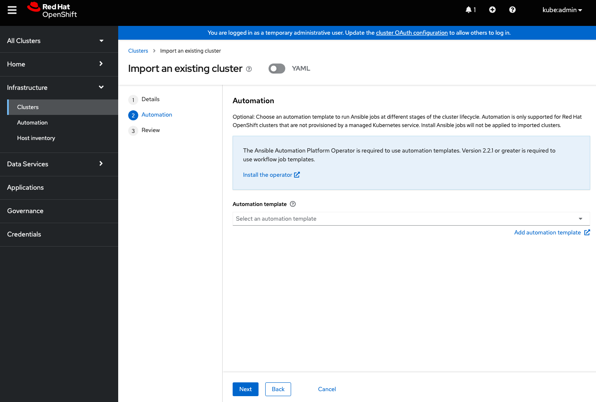

5. In this example, you don’t need to change anything. Just click **Next** again and you will be presented to the Review section:

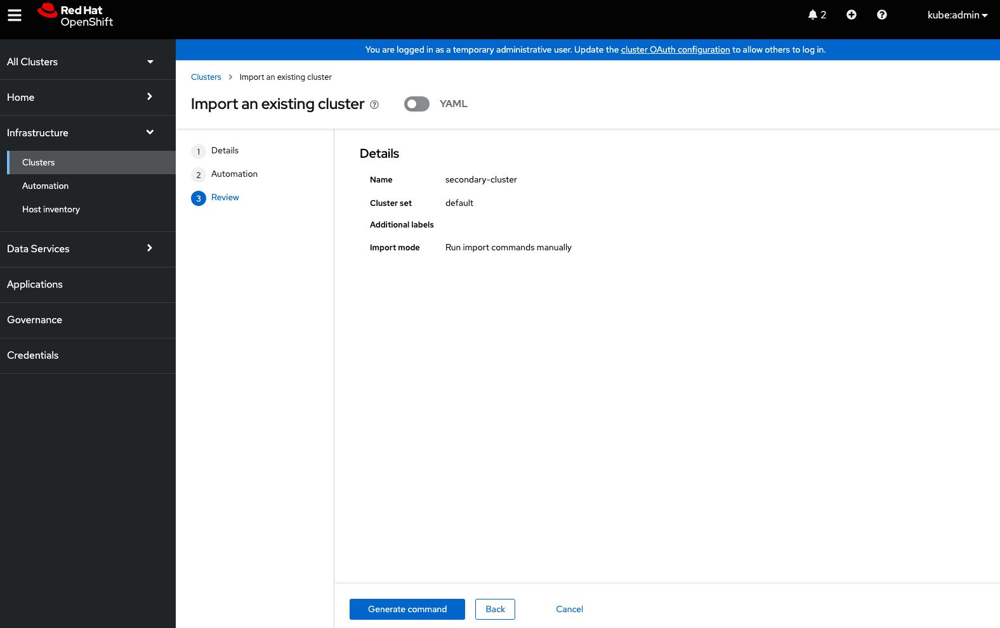

6. Click on **Generate command** and you will be redirected to this screen:

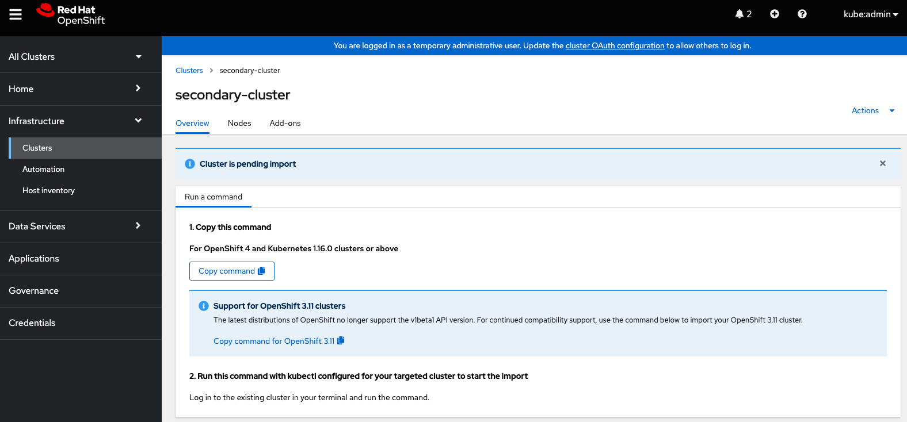

7. Click on **Copy command** and paste the command into the Primary Cluster. To do it, follow these steps:

8. Get OpenShift console URL

```
APISERVER=$(az aro show              	\
--name $AZR_CLUSTER                  	\
--resource-group $AZR_RESOURCE_GROUP 	\
-o tsv --query apiserverProfile.url)
echo $APISERVER
```

9. Get OpenShift credentials

```
ADMINPW=$(az aro list-credentials    	\
--name $AZR_CLUSTER                 	\
--resource-group $AZR_RESOURCE_GROUP 	\
--query kubeadminPassword            	\
-o tsv)
```

10. Log into OpenShift

```
oc login $APISERVER --username kubeadmin --password ${ADMINPW}
```

11. Paste the command and the output should be similar to it:

```
customresourcedefinition.apiextensions.k8s.io/klusterlets.operator.open-cluster-management.io created
namespace/open-cluster-management-agent created
serviceaccount/klusterlet created
clusterrole.rbac.authorization.k8s.io/klusterlet created
clusterrole.rbac.authorization.k8s.io/klusterlet-bootstrap-kubeconfig created
clusterrole.rbac.authorization.k8s.io/open-cluster-management:klusterlet-admin-aggregate-clusterrole created
clusterrolebinding.rbac.authorization.k8s.io/klusterlet created
Warning: would violate PodSecurity "restricted:v1.24": allowPrivilegeEscalation != false (container "klusterlet" must set securityContext.allowPrivilegeEscalation=false), unrestricted capabilities (container "klusterlet" must set securityContext.capabilities.drop=["ALL"]), runAsNonRoot != true (pod or container "klusterlet" must set securityContext.runAsNonRoot=true), seccompProfile (pod or container "klusterlet" must set securityContext.seccompProfile.type to "RuntimeDefault" or "Localhost")
deployment.apps/klusterlet created
secret/bootstrap-hub-kubeconfig created
klusterlet.operator.open-cluster-management.io/klusterlet created
```

12. From the ACM, select **Infrastructure** > **Clusters**. Then under Cluster sets, select the default:


13. Now click on **Cluster list** and you will be able to see all clusters, the hub (named as local-cluster), the primary-cluster, and the secondary-cluster:

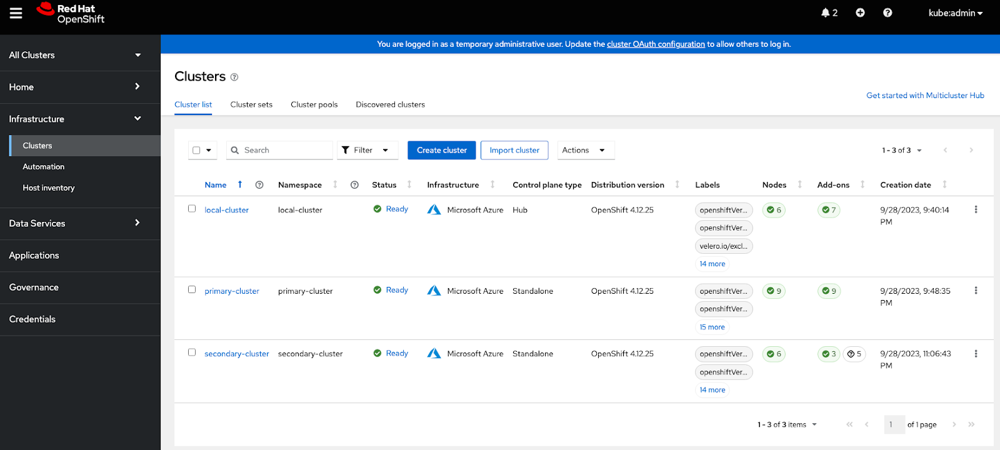

### Setting up the Secondary  Cluster with the Submariner Add-On

1. To deploy the Submariner Add-On, login into the Hub Cluster Console then using the Advanced Cluster Management Menu, select **All Clusters**:


2. Then go to **Infrastructure** > **Clusters**


3. Click on **Cluster sets** then select the **default**

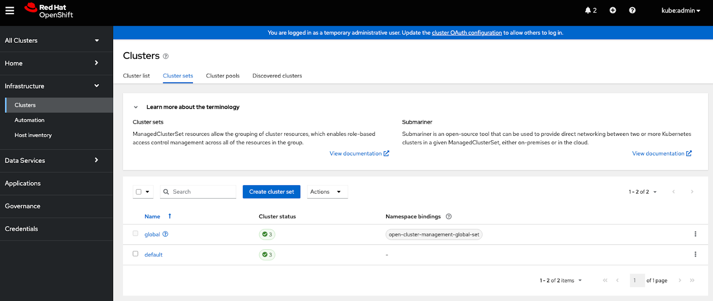

{}Note that the global cluster set exists by default and contains all of the managed clusters, imported or created. [More information here](https://access.redhat.com/documentation/en-us/red_hat_advanced_cluster_management_for_kubernetes/2.8/html-single/clusters/index#managedclustersets_global).{} 

4. After select the default cluster set, you will see the following screen where you should click on **Submariner add-ons**:

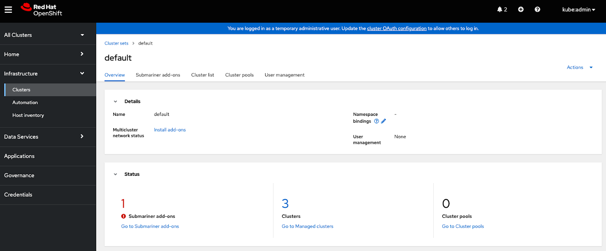


5. Now click on Install Submariner add-ons

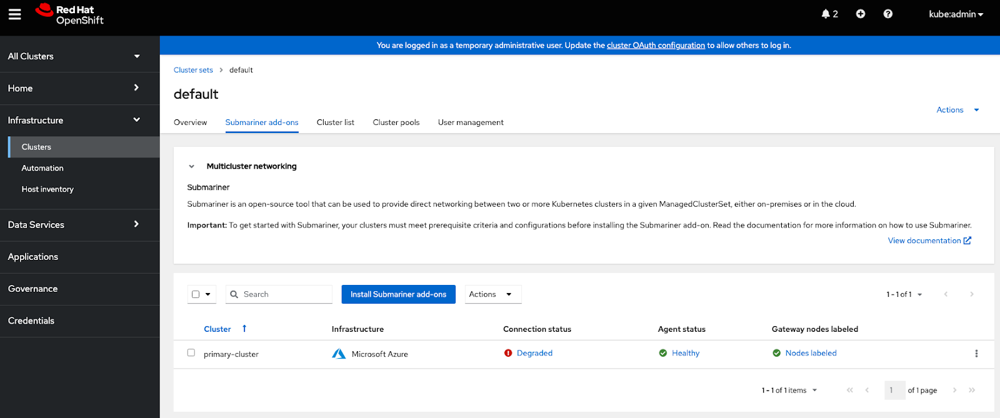

6. Add the **secondary-cluster** as **Target cluster**s then click **Next**

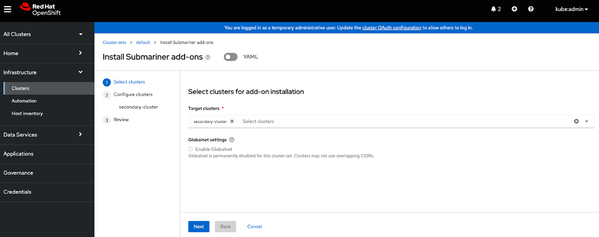

7. On the next screen keep the default settings for both clusters and click **Next**

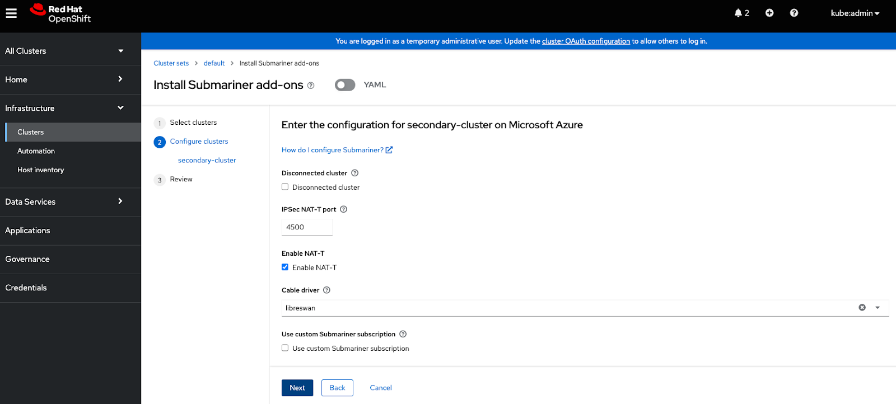

8. Review the configuration then click to **Install**

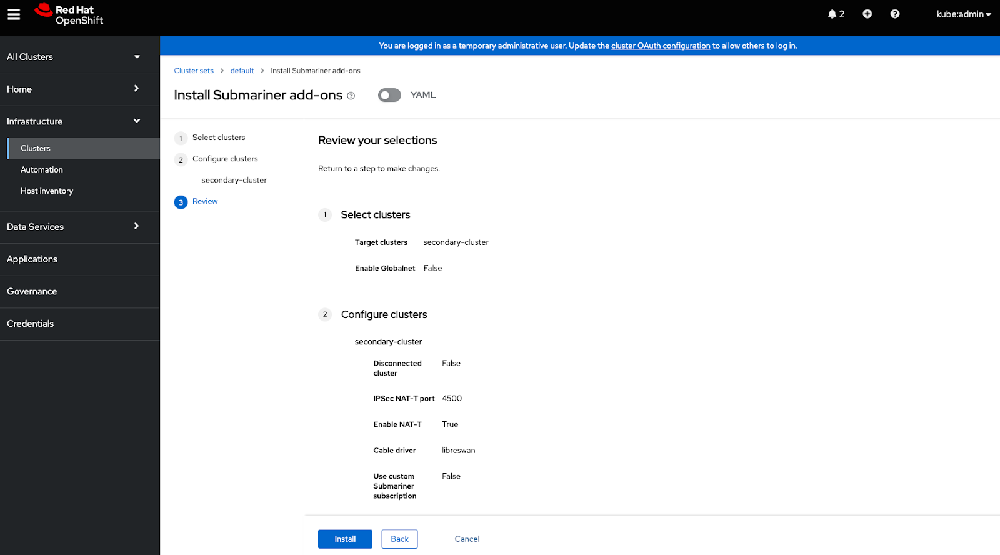


9. After a few minutes, the installation will be done and with **Healthy** status

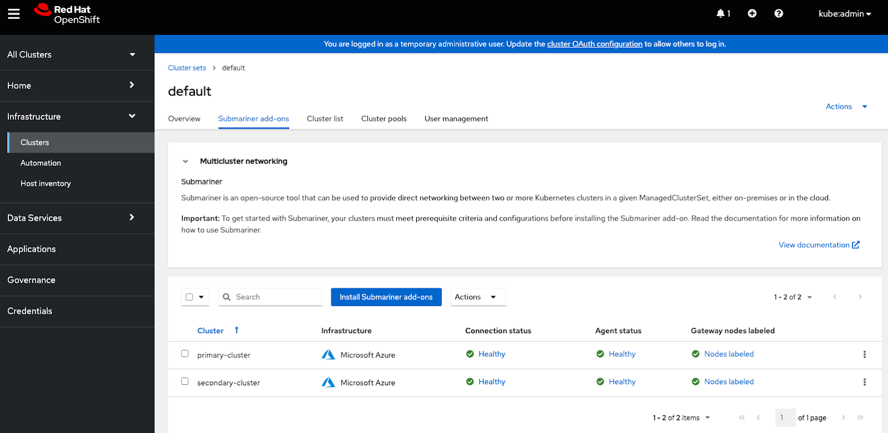

### Setting up the Secondary Cluster with the ODF

In this document, there are all steps required to deploy the ODF into the Primary Cluster:
[https://cloud.redhat.com/experts/aro/odf](https://cloud.redhat.com/experts/aro/odf)

{}Please note that when you subscribe to the ocs-operator and to odf-operator, you should change the channel from  channel: stable-4.**11** to channel:stable-4.**12** since we are using the version 4.12 in this example.{} 

# Finishing the setup of the disaster recovery solution

### Creating Disaster Recovery Policy on Hub cluster
 
1. On the ACM, go to **Data Services** > **Data Policies** and click on **Create DRPolicy**

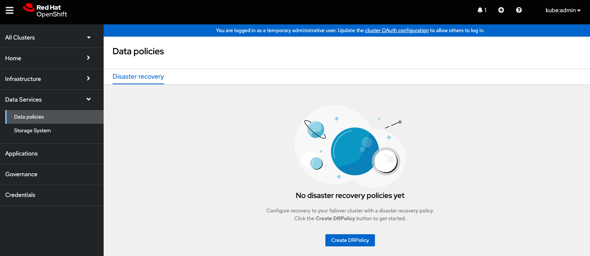

2. On the next screen, set a name for the policy, select the clusters where the replication will be enabled (primary and secondary), set the replication policy for asynchronous and the sync schedule, then click to Create.

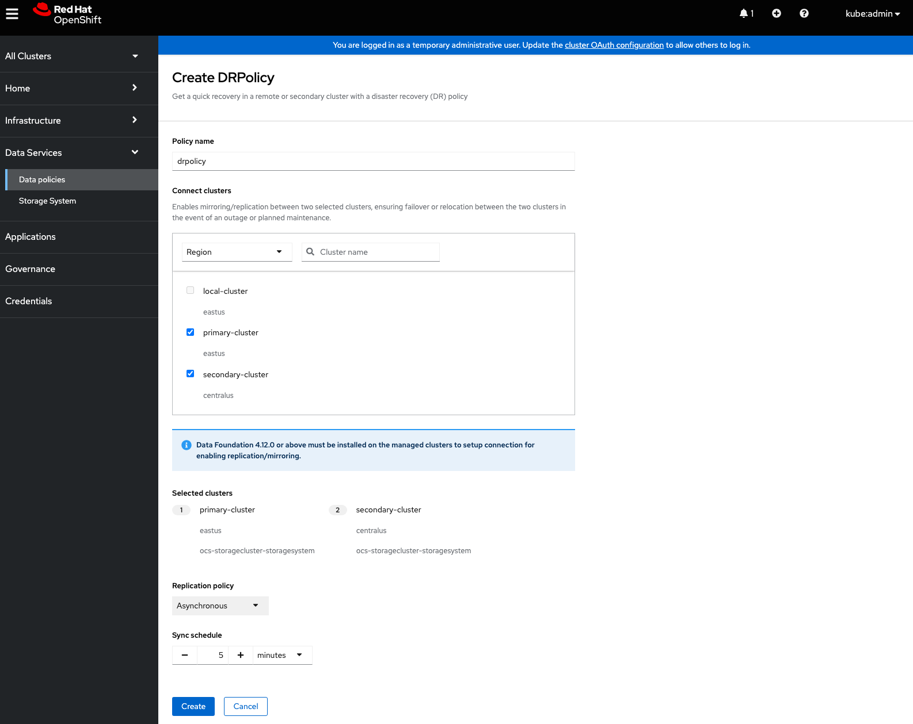

3. After the creation,  you should see something like it:

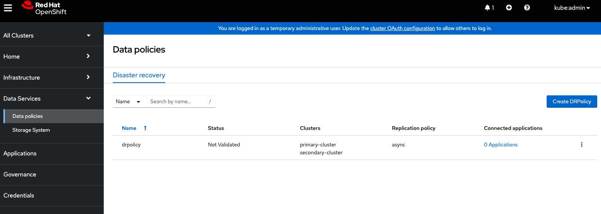

When a DRPolicy is created, along with it, two DRCluster resources are also created. It could take up to 10 minutes for all resources to be validated.  

4. Verify the names of the **DRClusters** on the Hub cluster accessing the console then go to  Operators > Installed Operators > OpenShift DR Hub Operator

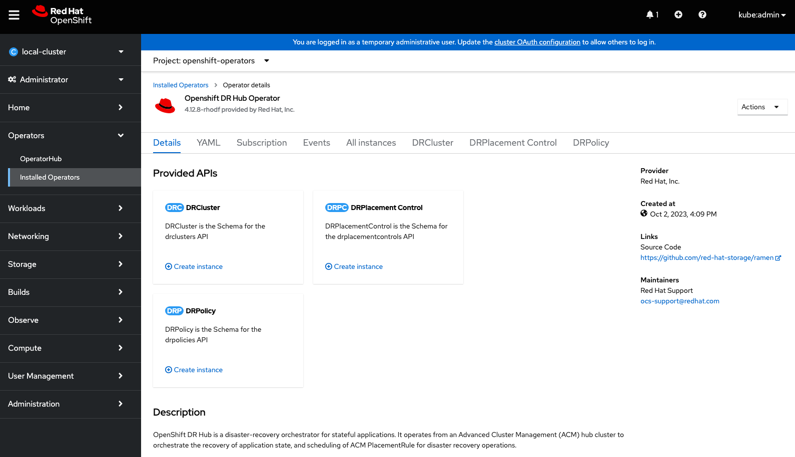

5. Select DRCluster and you will be able to see both clusters:

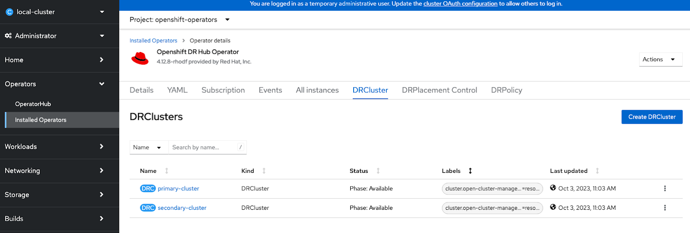

### Creating the Namespace, the Custom Resource Definition, and the PlacementRule

{}VolSync is not supported for ARO in ACM: [https://access.redhat.com/articles/7006295](https://access.redhat.com/articles/7006295) so if you  run into issues and file a support ticket, you will receive the information that ARO is not supported.{} 

1. First, log into the Hub Cluster and create a namespace for the application: 

```
cat <<EOF | oc apply -f -
apiVersion: v1
kind: Namespace
metadata:
 name: busybox-sample
EOF
```


Now, still logged into the Hub Cluster create a Custom Resource Definition (CRD) for the PlacementRule installed in the **busybox-sample** namespace. You can do this by applying the CRD YAML file before creating the **PlacementRule**. Here are the steps: 

1. Install the CRD for PlacementRule

```
cat <<EOF | oc apply -f -
apiVersion: apiextensions.k8s.io/v1
kind: CustomResourceDefinition
metadata:
  name: placerules.apps.open-cluster-management.io
spec:
  group: apps.open-cluster-management.io
  names:
    kind: PlacementRule
    listKind: PlacementRuleList
    plural: placerules
    singular: placerule
  scope: Namespaced
  versions:
    - name: v1
      served: true
      storage: true
      schema:
        openAPIV3Schema:
          type: object
EOF
```

2. Create the PlacementRule

```
cat <<EOF | oc apply -f -
apiVersion: apps.open-cluster-management.io/v1
kind: PlacementRule
metadata:
  name: busybox-placementrule
  namespace: busybox-sample
spec:
  clusterSelector:
    matchLabels:
      name: primary-cluster
EOF
```

### Creating a sample application

1. From the ACM panel, go to Applications > Create application

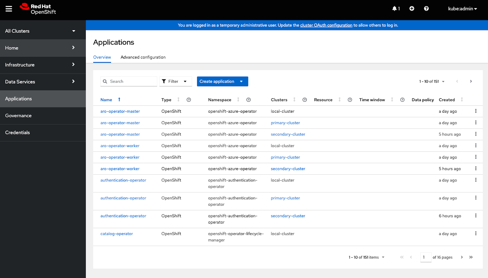

2. Select Subscription type

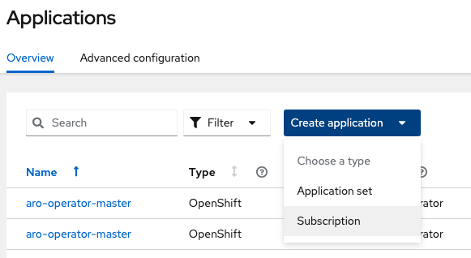

3. Set the name and namespace to be used

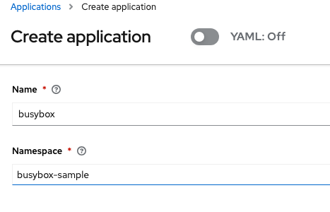

4. For the repository location choose Git, then fill in the fields as below

* URL: https://github.com/RamenDR/ocm-ramen-samples
* Branch: Main
* Path: busybox-odr

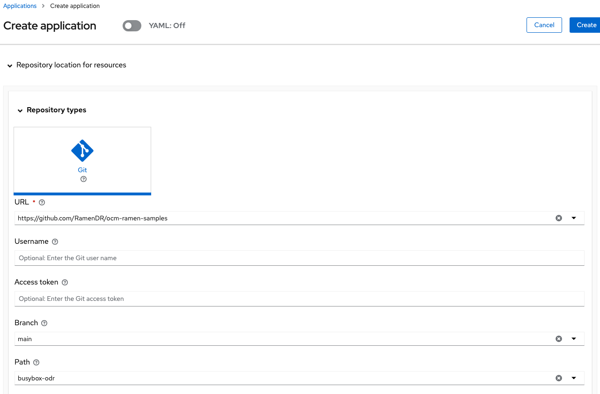

5. For the "**Select clusters for application deployment**", choose "**Select an existing placement configuration**" and set it to the Placement created on the previous step then click Create


6. After the creation, you should be able to see this screen


7. Edit the app subscription

```
oc edit subscription -n busybox-sample
# replace kind: **Placement** by kind: **PlacementRule**
```

8. Edit the Disaster recovery policy to connect our application busybox to it. Go to Data Services > Data policies


9. On the right side, click on the three dots then select Apply DRPolicy


10. Select busybox, type appname=busybox on the PVC label, then click Apply


11. Notice that the policy was connected to the application:


12. Go to Applications then select busybox


13. Check the Topology


14. Click on the Pod to see more details


15. Click on **Launch resource in Search** to see  where the application is running


Notice that the application is running in the **primary cluster**.

16. Go back to the ACM console > Applications


17. Select busybox


18. Under the menu Actions, click on **Failover application**:


Select the policy, set the secondary-cluster as target cluster then click on **Initiate**:


20. Close and go to Topology. In a few seconds you will see this result:


21. Click on the Pod again, then **Launch resource in Search**


22. Notice that the application is running in the **secondary-cluster** now


# Cleanup

Once you’re done it's a good idea to delete the cluster to ensure that you don’t get a surprise bill.

1. Delete the clusters and resources

```
az aro delete -y                \
  --resource-group rg-eastus    \
  --name hub-cluster

az aro delete -y                \
  --resource-group rg-eastus    \
  --name primary-cluster

az group delete --name rg-eastus

az aro delete -y                \
  --resource-group rg-centralus  \ 
  --name secondary-cluster

az group delete --name rg-centralus
```

# Additional reference resources:

* [Virtual Network Peering](https://learn.microsoft.com/en-us/azure/virtual-network/virtual-network-peering-overview)
* [Regional-DR solution for OpenShift Data Foundation](https://access.redhat.com/documentation/en-us/red_hat_openshift_data_foundation/4.12/html/configuring_openshift_data_foundation_disaster_recovery_for_openshift_workloads/rdr-solution)
* [Private ARO Cluster with access via JumpHost](https://mobb.ninja/docs/aro/private-cluster/)
* [Deploy ACM Submariner for connect overlay networks ARO - ROSA clusters](https://mobb.ninja/docs/redhat/acm/submariner/aro/)
* [Configure ARO with OpenShift Data Foundation](https://mobb.ninja/docs/aro/odf/)
* [OpenShift Regional Disaster Recovery with Advanced Cluster Management](https://red-hat-storage.github.io/ocs-training/training/ocs4/odf4-multisite-ramen.html#_create_drplacementcontrol_resource)
