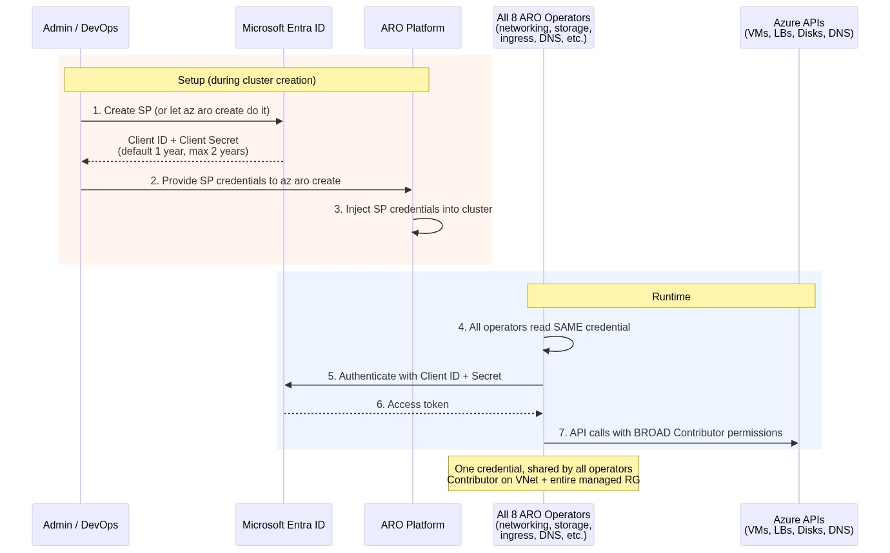
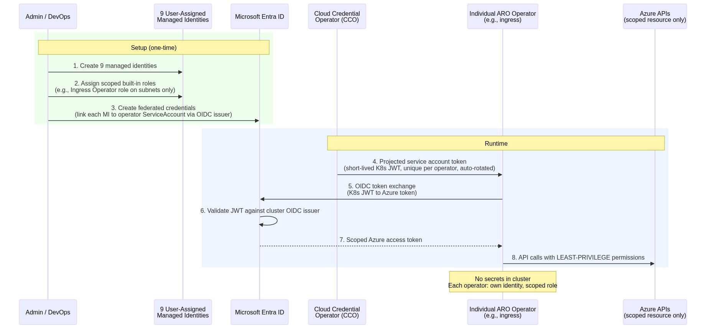
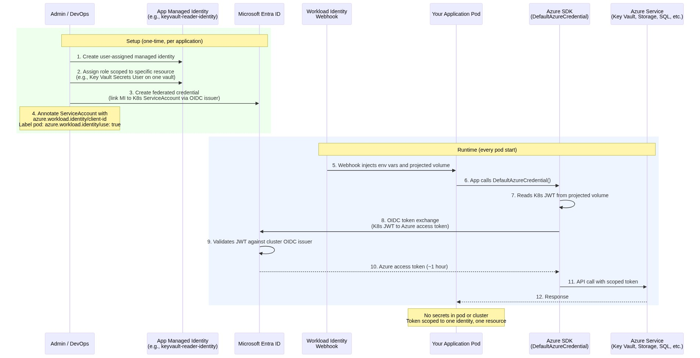

This is **Part 1** of a two-part series. This article covers what changes in authentication, why managed identity matters, and how to plan your move. [Part 2](migration-demo/) walks through a hands-on migration with two demo applications.

## TL;DR

**What changed and what stays the same?** Service principal (SP) remains fully supported; there is no deprecation timeline, and existing SP clusters continue to work. What changes with managed identity (MI) is how authentication works at both layers. At the cluster layer, a single shared credential with broad Contributor permissions is replaced by nine scoped managed identities. Each operator gets its own identity with only the permissions it needs, and no secrets are stored in the cluster. At the application layer, MI clusters enable workload identity, which lets your application pods authenticate to Azure services like Key Vault, Storage, and SQL Database without managing any credentials. This capability is not available on SP clusters. From a security perspective, MI is the recommended approach for all new ARO clusters.

**How do I move?** There is no in-place conversion. You deploy a new MI cluster alongside the existing one and migrate workloads using a blue-green approach. The migration effort depends on your workload complexity, not on the SP-to-MI change itself. Most applications need only Kubernetes manifest changes (replacing secret references with ServiceAccount annotations). This article (Part 1) covers what changes and why; [Part 2](migration-demo/) walks through a hands-on migration with two demo applications.

## Why We Wrote This

When we started working with customers on ARO managed identity, we found ourselves answering the same questions over and over: "What actually changes?" "Do we have to move?" "What happens to our apps?" The official Microsoft documentation is thorough, but the answers are scattered across half a dozen articles.

We wrote this article to put everything in one place. If you are an architect evaluating whether to adopt managed identity, or a team lead planning a migration from an existing SP cluster, this should give you what you need to make the decision and understand the path forward.

## What's Different: SP vs MI in ARO

There are two layers of identity in ARO:

1. **Cluster components**: how ARO's own operators (networking, storage, ingress, DNS, etc.) authenticate to Azure APIs
2. **Application workloads**: how your applications running on the cluster authenticate to Azure services

SP and MI handle both layers differently.

### Cluster Components: How Operators Authenticate

#### Service Principal Cluster

A single service principal is shared by all eight cluster operators. The SP has broad Contributor access to the VNet and the entire managed resource group. The ARO platform injects the SP credentials into the cluster, and operators read the same client ID and client secret at runtime.

This model is simple and has been running ARO clusters reliably since the beginning. The key operational requirement is that the customer must rotate the client secret before it expires (default 1 year, maximum 2 years). Rotation is performed via `az aro update`, not by manually editing cluster secrets.

#### Managed Identity Cluster

Each of the eight cluster operators gets its own user-assigned managed identity with only the Azure permissions it needs. A ninth identity (the cluster identity) manages federated credentials for the other eight. No secrets are stored in the cluster.

If one operator's identity is compromised, the blast radius is limited to that operator's resources only. Other operators are unaffected.

### Application Workloads: How Your Apps Authenticate

The choice between SP and MI also determines how your application pods can authenticate to Azure services like Key Vault, Storage, or SQL Database.

**On an SP cluster**, there is no OIDC issuer. Your applications must create their own service principals with secrets to access Azure services, which means managing credential rotation at the application layer as well.

**On an MI cluster**, the OIDC issuer is enabled. Your applications can use workload identity to authenticate without any secrets:

This is the same pattern used by ROSA with IAM Roles for Service Accounts (IRSA) and OSD with Workload Identity on GCP. The Azure SDK's `DefaultAzureCredential` handles the token exchange automatically, so your application code does not need to know which authentication method is being used.

{}**Workload identity is only available on MI clusters.** If your applications need secretless access to Azure services, managed identity is a prerequisite.{}

### Summary: What Changes at Each Layer

| Layer | Service Principal Cluster | Managed Identity Cluster |
|-------|--------------------------|-------------------------|
| **Cluster operators** | 1 shared SP with Contributor role | 9 scoped MIs with least-privilege roles |
| **Application workloads** | Apps manage their own SP credentials | Workload identity, secretless via OIDC |
| **Credentials in cluster** | Client secret (default 1-year expiry, max 2 years) | None; short-lived tokens, auto-rotated |
| **Blast radius** | Shared credential covers all operators | Each operator isolated to its own scope |
| **Credential management** | Customer rotates on schedule | Azure handles automatically |

{}**Diagram sources:** These authentication flows were compiled from [Managed identities for Azure resources](https://learn.microsoft.com/en-us/entra/identity/managed-identities-azure-resources/overview), [Understand managed identities in ARO](https://learn.microsoft.com/en-us/azure/openshift/howto-understand-managed-identities), [Deploy and configure an application using workload identity on ARO](https://learn.microsoft.com/en-us/azure/openshift/howto-deploy-configure-application), and [Demystifying Service Principals & Managed Identities](https://devblogs.microsoft.com/devops/demystifying-service-principals-managed-identities/). The official docs describe each model in isolation; these diagrams place them side-by-side in the ARO context to highlight the operational differences.{}

## Why Managed Identity

### Is MI a Must?

No. Service principal is fully supported for both existing and new ARO clusters. There is no deprecation timeline. If you have an SP cluster running today, it will continue to work.

### Why You Should Consider It Anyway

**1. No credentials to manage.** Service principal clusters work well, but they do require you to track and rotate the client secret before it expires. Managed identity removes this operational task entirely. Azure handles the credential lifecycle automatically with short-lived tokens that rotate without any manual intervention.

**2. Least-privilege per operator.** With a service principal, all operators share the same Contributor permissions, which is straightforward but broader than any single operator needs. Managed identity refines this by assigning each operator its own scoped Azure built-in role. The ingress operator can only manage ingress resources, the storage operator can only manage storage, reducing the potential impact if any single component is compromised.

**3. Workload identity for applications.** This is the capability that only MI clusters can provide. MI clusters include an OIDC issuer, which enables your application pods to authenticate to Azure services (Key Vault, Storage, SQL Database) using `DefaultAzureCredential`, with no secrets stored in the cluster or in your application configuration. On SP clusters, applications that access Azure services need their own service principals with secrets, which means managing credential rotation at the application layer as well.

**4. Consistent with other OpenShift managed services.** ROSA on AWS already uses IAM Roles for Service Accounts (IRSA) and OSD on GCP uses Workload Identity. Both follow the same pattern of short-lived, OIDC-based credentials scoped per component. ARO's managed identity model brings the same approach to Azure. Organizations running multiple OpenShift managed services will find a consistent security model across clouds.

**5. Future-ready for ARO Hosted Control Plane.** ARO Hosted Control Plane (HCP) is expected to use managed identity as its default authentication model. Adopting MI now helps prepare your team and workloads for this upcoming architecture.

**6. Tooling support.** The Azure Portal already automates MI setup: managed identities, role assignments, and federated credentials are created automatically when you deploy a new ARO cluster through the portal. The `az aro` CLI does not yet automate this, so CLI-based deployments currently require manual identity and role assignment setup. A simplified CLI experience is expected to be available soon.

### MI Operational Considerations

- You need **Contributor + User Access Administrator** (or Owner) permissions on the subscription, compared to Contributor only for SP.
- Before each cluster upgrade, you must reconcile federated credentials and set the `upgradeable-to` annotation on the cluster's CloudCredential resource. Without these steps, the upgrade is blocked. See [Upgrade an ARO cluster](https://learn.microsoft.com/en-us/azure/openshift/howto-upgrade-aro-openshift-cluster).
- The default Azure Files StorageClass is disabled (it relies on storage account keys). If your workloads need ReadWriteMany volumes, [create the StorageClass manually](https://learn.microsoft.com/en-us/azure/openshift/howto-configure-azure-file-storageclass).

## Migrating from SP to MI

### There Is No In-Place Migration

You cannot convert an existing SP cluster to MI. Managed identity can only be enabled on new clusters. The migration is a standard blue-green cluster migration with a few SP→MI-specific considerations. The migration effort depends on your workload complexity, not on the SP-to-MI change itself.

### Migration Methodology

**Phase 1: Prepare the new cluster**

1. Deploy a new MI-based ARO cluster alongside the existing SP cluster
2. Configure cluster-level settings (IDP, monitoring, network policies, pull secret)
3. Create Azure managed identities and federated credentials for each application that accesses Azure services

**Phase 2: Adapt application configurations**

The cluster infrastructure changes, but your application code may not need to. What changes depends on how your apps authenticate to Azure:

| Scenario | Code change? | Config change? |
|----------|-------------|---------------|
| App uses `DefaultAzureCredential` | **No** | **Yes**, replace K8s Secret with ServiceAccount annotation |
| App uses explicit `ClientSecretCredential` | **Yes**, change to `DefaultAzureCredential` | **Yes**, replace K8s Secret with ServiceAccount annotation |
| App uses connection strings or does not access Azure services | **No** | **No**, deploy as-is |

For apps that use the Azure SDK, the K8s manifest changes follow the same pattern: remove the Secret reference, add an annotated ServiceAccount with the managed identity client ID, add the workload identity pod label, and set `serviceAccountName`. The workload identity webhook automatically injects the credentials into the pod at runtime. [Part 2](migration-demo/) walks through these changes in detail with before-and-after manifests.

{}If your app already uses `DefaultAzureCredential`, ensure the Azure Identity SDK version includes `WorkloadIdentityCredential` support. Minimum versions: .NET Azure.Identity 1.9.0, Go azidentity 1.3.0, Java azure-identity 1.9.0, Node.js @azure/identity 3.2.0, Python azure-identity 1.13.0. Older SDK versions will not auto-detect workload identity, even if the webhook injects the correct environment variables.{}

**Phase 3: Deploy and validate**

1. Deploy workloads to the new MI cluster using your existing CI/CD pipelines (GitOps, Helm, or pipeline redeploy)
2. Validate each application's Azure service connectivity (Key Vault reads, storage writes, database queries)
3. Run integration tests or smoke tests

**Phase 4: Traffic cutover**

1. Shift traffic from the old cluster to the new cluster (DNS update, Azure Front Door, or load balancer reconfiguration)
2. Monitor for errors during the transition period
3. Keep the old SP cluster running as a rollback option until confident

**Phase 5: Decommission**

1. Decommission the old SP cluster after a validation period
2. Remove the old service principal and its app registration from Entra ID
3. Remove any application-level service principals that were used for Azure service access (these are replaced by workload identity)
4. Clean up the old resource group

## References

- [Managed identities for Azure resources](https://learn.microsoft.com/en-us/entra/identity/managed-identities-azure-resources/overview)
- [Understand managed identities in ARO](https://learn.microsoft.com/en-us/azure/openshift/howto-understand-managed-identities)
- [Create an ARO cluster with managed identities (CLI)](https://learn.microsoft.com/en-us/azure/openshift/howto-create-openshift-cluster?pivots=aro-deploy-az-cli)
- [Deploy and configure an application using workload identity on ARO](https://learn.microsoft.com/en-us/azure/openshift/howto-deploy-configure-application)
- [Rotate service principal credentials for ARO](https://learn.microsoft.com/en-us/azure/openshift/howto-service-principal-credential-rotation)
- [Demystifying Service Principals & Managed Identities](https://devblogs.microsoft.com/devops/demystifying-service-principals-managed-identities/)
- [MI and WI GA announcement (Microsoft)](https://techcommunity.microsoft.com/blog/appsonazureblog/azure-red-hat-openshift-managed-identity-and-workload-identity-now-generally-ava/4504940)
- [MI and WI GA announcement (Red Hat)](https://www.redhat.com/en/blog/general-availability-managed-identity-and-workload-identity-microsoft-azure-red-hat-openshift)
