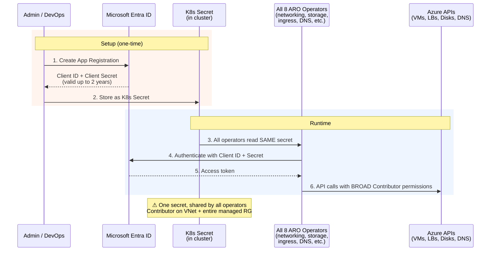
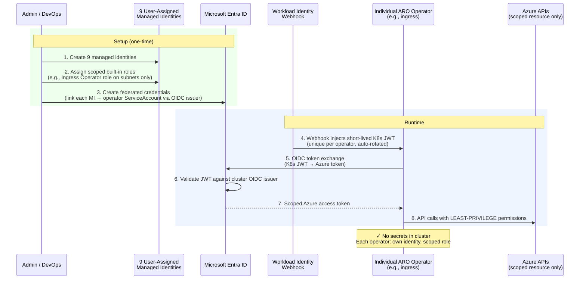
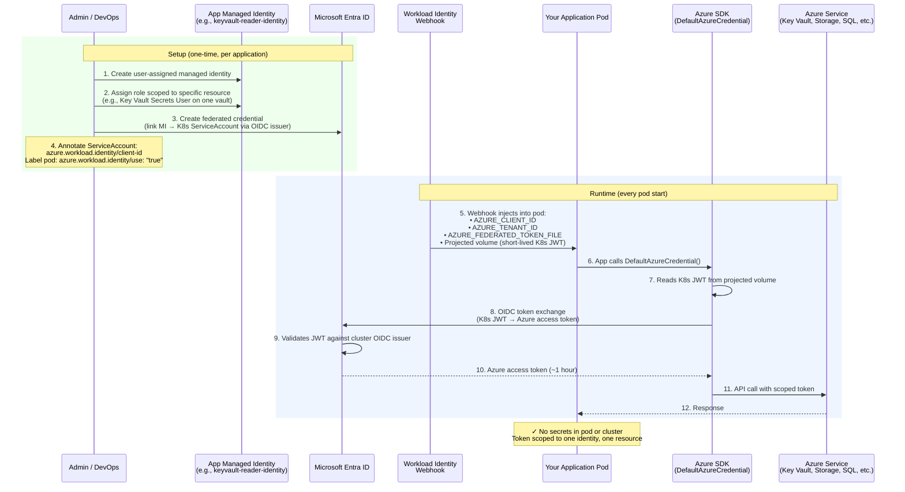

This is **Part 1** of a two-part series. This article covers what's different, why managed identity matters, and how to migrate. [Part 2](migration-demo.md) walks through a hands-on migration with two demo applications.

## TL;DR

**What's different?** Service principal is the proven model that has been running ARO clusters reliably since day one — it works well and requires only that you rotate the client secret before it expires. Managed identity takes this further by removing credential management entirely. No secrets are stored in the cluster, each operator gets only the permissions it needs, and your applications can authenticate to Azure services without managing any credentials at all. It is an evolution, not a replacement of something broken.

**Should I adopt MI?** Yes. Managed identity eliminates credential rotation as an operational burden, enforces least-privilege per operator, and is the only model that enables workload identity for your applications. It is the recommended approach for all new ARO clusters. Service principal remains fully supported and is still a practical choice for short-lived clusters like POCs or demos, but for any cluster you plan to run long-term, managed identity is the way to go.

**How do I migrate?** There is no in-place conversion — you need a new MI cluster. The migration itself is largely standard application migration using a blue-green approach. This article provides guidelines on the phases involved and highlights the SP-to-MI-specific considerations, such as which apps need code or config changes. In most cases, only Kubernetes manifest changes are needed.

## Why I Wrote This

When I started working with customers on ARO managed identity, I found myself answering the same questions over and over: "What actually changes?" "Do we have to move?" "What happens to our apps?" The official Microsoft documentation is thorough, but the answers are scattered across half a dozen articles — and none of them show you the full picture of how authentication actually works at runtime, or what the migration really involves.

I wrote this article to put everything in one place. If you are an architect evaluating whether to adopt managed identity, or a team lead planning a migration from an existing SP cluster, this should give you what you need to make the decision and understand the path forward.

## What's Different: SP vs MI in ARO

There are two layers of identity in ARO:

1. **Cluster components** — how ARO's own operators (networking, storage, ingress, DNS, etc.) authenticate to Azure APIs
2. **Application workloads** — how your applications running on the cluster authenticate to Azure services

SP and MI handle both layers differently.

### Cluster Components: How Operators Authenticate

#### Service Principal Cluster

A single service principal is shared by all eight cluster operators. They all read the same client ID and client secret from a Kubernetes Secret in the cluster. The SP has broad Contributor access to the VNet and the entire managed resource group.

This model is simple and has been running ARO clusters reliably since the beginning. The key operational requirement is that the customer must rotate the client secret before it expires (maximum 2 years).

#### Managed Identity Cluster

Each of the eight cluster operators gets its own user-assigned managed identity with only the Azure permissions it needs. A ninth identity (the cluster identity) manages federated credentials for the other eight. No secrets are stored in the cluster.

If one operator's identity is compromised, the blast radius is limited to that operator's resources only. Other operators are unaffected.

### Application Workloads: How Your Apps Authenticate

The choice between SP and MI also determines how your application pods can authenticate to Azure services like Key Vault, Storage, or SQL Database.

**On an SP cluster**, there is no OIDC issuer. Your applications must create their own service principals with secrets to access Azure services — the same long-lived secret problem at the application layer.

**On an MI cluster**, the OIDC issuer is enabled. Your applications can use workload identity to authenticate without any secrets:

This is the same pattern used by ROSA with IAM Roles for Service Accounts (IRSA) and OSD with Workload Identity on GCP. The Azure SDK's `DefaultAzureCredential` handles the token exchange automatically — your application code does not need to know which authentication method is being used.

{}**Workload identity is only available on MI clusters.** If your applications need secretless access to Azure services, managed identity is a prerequisite.{}

### Summary: What Changes at Each Layer

| Layer | Service Principal Cluster | Managed Identity Cluster |
|-------|--------------------------|-------------------------|
| **Cluster operators** | 1 shared SP with Contributor role | 9 scoped MIs with least-privilege roles |
| **Application workloads** | Apps manage their own SP credentials | Workload identity — secretless via OIDC |
| **Credentials in cluster** | Client secret (rotate before 2-year expiry) | None — short-lived tokens, auto-rotated |
| **Blast radius** | Shared credential covers all operators | Each operator isolated to its own scope |
| **Credential management** | Customer rotates on schedule | Azure handles automatically |

{}**Diagram sources:** These authentication flows were compiled from [Managed identities for Azure resources](https://learn.microsoft.com/en-us/entra/identity/managed-identities-azure-resources/overview), [Understand managed identities in ARO](https://learn.microsoft.com/en-us/azure/openshift/howto-understand-managed-identities), [Deploy and configure an application using workload identity on ARO](https://learn.microsoft.com/en-us/azure/openshift/howto-deploy-configure-application), and [Demystifying Service Principals & Managed Identities](https://devblogs.microsoft.com/devops/demystifying-service-principals-managed-identities/). The official docs describe each model in isolation — these diagrams place them side-by-side in the ARO context to highlight the operational differences.{}

## Why Managed Identity

### Is MI a Must?

No. Service principal is fully supported for both existing and new ARO clusters. There is no deprecation timeline. If you have an SP cluster running today, it will continue to work.

### Why You Should Consider It Anyway

**1. No credentials to manage.** Service principal clusters work well, but they do require you to track and rotate the client secret before it expires. Managed identity removes this operational task entirely — Azure handles the credential lifecycle automatically with short-lived tokens that rotate without any manual intervention.

**2. Least-privilege per operator.** With a service principal, all operators share the same Contributor permissions, which is straightforward but broader than any single operator needs. Managed identity refines this by assigning each operator its own scoped Azure built-in role — the ingress operator can only manage ingress resources, the storage operator can only manage storage — reducing the potential impact if any single component is compromised.

**3. Workload identity for applications.** This is the capability that only MI clusters can provide. MI clusters include an OIDC issuer, which enables your application pods to authenticate to Azure services (Key Vault, Storage, SQL Database) using `DefaultAzureCredential` — with no secrets stored in the cluster or in your application configuration. On SP clusters, applications that access Azure services need their own service principals with secrets, which means managing credential rotation at the application layer as well.

**5. Consistent with other OpenShift managed services.** ROSA on AWS already uses IAM Roles for Service Accounts (IRSA) and OSD on GCP uses Workload Identity — both follow the same pattern of short-lived, OIDC-based credentials scoped per component. ARO's managed identity model brings the same approach to Azure. Organizations running multiple OpenShift managed services will find a consistent security model across clouds.

**6. Where things are heading.** As of today, the Azure Portal defaults to MI when creating new ARO clusters, and the latest documentation leads with MI as the primary setup path. These are observable signals — not an official deprecation statement — but they suggest that MI is where the platform experience is converging.

### What About Existing SP Clusters?

If you already have ARO clusters running on service principal, they will continue to work — SP is fully supported with no deprecation timeline. Keep them as they are, and ensure you have a process to rotate the client secret before it expires. For any **new** ARO cluster, use managed identity.

### Things to Keep in Mind

Whichever model you use, there are operational considerations specific to each:

**Service principal clusters:**

- The client secret has a maximum lifetime of 2 years. You must [rotate the credential](https://learn.microsoft.com/en-us/azure/openshift/howto-service-principal-credential-rotation) before it expires — there is no automatic rotation or built-in reminder.
- If the secret expires, cluster operations that depend on Azure APIs (node scaling, load balancer updates, DNS, storage provisioning) will begin to fail.

**Managed identity clusters:**

- Initial setup requires more steps — 9 managed identities and 17-28 role assignments. The Azure Portal automates this, and a simplified CLI command (`az aro assign-roles`) is planned.
- You need **Contributor + User Access Administrator** (or Owner) permissions on the subscription, compared to Contributor only for SP.
- Before each cluster upgrade, you must reconcile federated credentials and set the `upgradeable-to` annotation on the cluster's CloudCredential resource. Without these steps, the upgrade is blocked. See [Upgrade an ARO cluster](https://learn.microsoft.com/en-us/azure/openshift/howto-upgrade-aro-openshift-cluster).
- The default Azure Files StorageClass is disabled (it relies on storage account keys). If your workloads need ReadWriteMany volumes, [create the StorageClass manually](https://learn.microsoft.com/en-us/azure/openshift/howto-configure-azure-file-storageclass).

For installation instructions, see the official guides:
- **Service principal:** [Tutorial: Create an ARO cluster](https://learn.microsoft.com/en-us/azure/openshift/tutorial-create-cluster)
- **Managed identity:** [Create an ARO cluster with managed identities](https://learn.microsoft.com/en-us/azure/openshift/howto-create-openshift-cluster?pivots=aro-deploy-az-cli)

## Migrating from SP to MI

### There Is No In-Place Migration

You cannot convert an existing SP cluster to MI. Managed identity can only be enabled on new clusters. The migration is a standard blue-green cluster migration with a few SP→MI-specific considerations. The migration effort depends on your workload complexity, not on the SP-to-MI change itself.

### Migration Methodology

**Phase 1: Prepare the new cluster**

1. Deploy a new MI-based ARO cluster alongside the existing SP cluster
2. Configure cluster-level settings (IDP, monitoring, network policies, pull secret)
3. Create Azure managed identities and federated credentials for each application that accesses Azure services

**Phase 2: Adapt application configurations**

The cluster infrastructure changes, but your application code may not need to. What changes depends on how your apps authenticate to Azure:

| Scenario | Code change? | Config change? |
|----------|-------------|---------------|
| App uses `DefaultAzureCredential` (Azure SDK) | **No** — SDK auto-detects workload identity | **Yes** — replace K8s Secret with ServiceAccount annotation |
| App uses explicit `ClientSecretCredential` | **Yes** — one-line change to `DefaultAzureCredential` | **Yes** — replace K8s Secret with ServiceAccount annotation |
| App does not access Azure services | **No** | **No** — deploy as-is |
| Stateful app with PVC (Azure Disk) | **No** | **Yes** — backup data, recreate PVC on new cluster, restore |
| App using Azure Files (RWX) | **No** | **Yes** — create StorageClass manually on MI cluster first |

For each app that accesses Azure services, the K8s manifest changes are:

- **Remove:** Secret references (`envFrom` or `env.valueFrom`) that inject `AZURE_CLIENT_ID`, `AZURE_CLIENT_SECRET`, `AZURE_TENANT_ID`
- **Add:** ServiceAccount with annotation `azure.workload.identity/client-id: <managed-identity-client-id>`
- **Add:** Pod label `azure.workload.identity/use: "true"`

The workload identity webhook automatically injects the credentials into the pod at runtime.

**Phase 3: Deploy and validate**

1. Deploy workloads to the new MI cluster using your existing CI/CD pipelines (GitOps, Helm, or pipeline redeploy)
2. Validate each application's Azure service connectivity (Key Vault reads, storage writes, database queries)
3. Run integration tests or smoke tests

**Phase 4: Traffic cutover**

1. Shift traffic from the old cluster to the new cluster (DNS update, Azure Front Door, or load balancer reconfiguration)
2. Monitor for errors during the transition period
3. Keep the old SP cluster running as a rollback option until confident

**Phase 5: Decommission**

1. Decommission the old SP cluster after a validation period
2. Remove the old service principal and its app registration from Entra ID
3. Clean up the old resource group

{}For a hands-on walkthrough of this methodology with two demo applications (stateless with Azure Key Vault and stateful with Azure Blob Storage + PVC), see [Part 2: Migrating Applications from SP to MI Cluster](migration-demo.md).{}

## References

- [Managed identities for Azure resources](https://learn.microsoft.com/en-us/entra/identity/managed-identities-azure-resources/overview)
- [Understand managed identities in ARO](https://learn.microsoft.com/en-us/azure/openshift/howto-understand-managed-identities)
- [Create an ARO cluster with managed identities (CLI)](https://learn.microsoft.com/en-us/azure/openshift/howto-create-openshift-cluster?pivots=aro-deploy-az-cli)
- [Deploy and configure an application using workload identity on ARO](https://learn.microsoft.com/en-us/azure/openshift/howto-deploy-configure-application)
- [Rotate service principal credentials for ARO](https://learn.microsoft.com/en-us/azure/openshift/howto-service-principal-credential-rotation)
- [Demystifying Service Principals & Managed Identities](https://devblogs.microsoft.com/devops/demystifying-service-principals-managed-identities/)
- [MI and WI GA announcement (Microsoft)](https://techcommunity.microsoft.com/blog/appsonazureblog/azure-red-hat-openshift-managed-identity-and-workload-identity-now-generally-ava/4504940)
- [MI and WI GA announcement (Red Hat)](https://www.redhat.com/en/blog/general-availability-managed-identity-and-workload-identity-microsoft-azure-red-hat-openshift)
