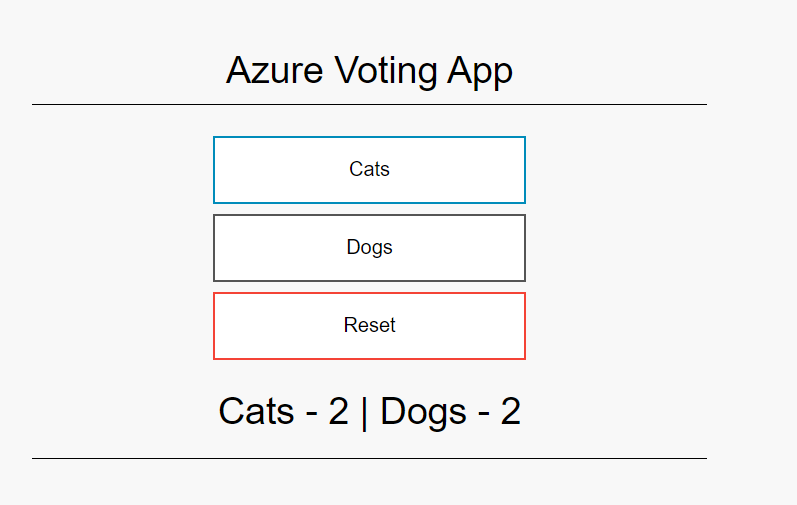

The Azure Service Operator (ASO) provides Custom Resource Definitions (CRDs) for Azure resources that can be used to create, update, and delete Azure services from an OpenShift cluster.

> This example uses ASO V1, which has now been replaced by ASO V2. ASO V2 does not (as of 5/19/2022) yet have an entry in the OCP OperatorHub, but is functional and should be preferred for use, especially if V1 isn't already installed on a cluster. MOBB has documented the [install of ASO V2 on ROSA]. MOBB has **not** tested running the two in parallel.

## Prerequisites

* [Azure CLI](https://docs.microsoft.com/en-us/cli/azure/install-azure-cli?view=azure-cli-latest)
* [An Azure Red Hat OpenShift (ARO) cluster](/quickstart-aro)

## Prepare your Azure Account and ARO Cluster

1. Set the following environment variables:

   > Note: modify the cluster name, region and resource group to match your cluster

   ```bash
   AZURE_TENANT_ID=$(az account show -o tsv --query tenantId)
   AZURE_SUBSCRIPTION_ID=$(az account show -o tsv --query id)
   CLUSTER_NAME="openshift"
   AZURE_RESOURCE_GROUP="openshift"
   AZURE_REGION="eastus"
   ```

1. Create a Service Principal with Contributor permissions to your subscription:

   > Note: You may want to lock this down to a specific resource group.

   ```bash
   read -r ASO_USER ASO_PASS < <(az ad sp create-for-rbac -n "$CLUSTER_NAME-ASO" \
    --role contributor --scopes /subscriptions/$AZURE_SUBSCRIPTION_ID -o tsv \
    --query "[name,password]" | xargs)
   ```

1. Create a secret containing your Service Principal credentials:

   ```bash
   cat <<EOF | oc apply -f -
   apiVersion: v1
   kind: Secret
   metadata:
     name: azureoperatorsettings
     namespace: openshift-operators
   stringData:
     AZURE_TENANT_ID: $AZURE_TENANT_ID
     AZURE_SUBSCRIPTION_ID: $AZURE_SUBSCRIPTION_ID
     AZURE_CLIENT_ID: $ASO_USER
     AZURE_CLIENT_SECRET: $ASO_PASS
     AZURE_CLOUD_ENV: AzurePublicCloud
   EOF
   ```

1. Deploy the ASO Operator:

   ```bash
   cat <<EOF | oc apply -f -
   apiVersion: operators.coreos.com/v1alpha1
   kind: Subscription
   metadata:
     labels:
       operators.coreos.com/azure-service-operator.openshift-operators: ""
     name: azure-service-operator
     namespace: openshift-operators
   spec:
     channel: stable
     installPlanApproval: Automatic
     name: azure-service-operator
     source: community-operators
     sourceNamespace: openshift-marketplace
     startingCSV: azure-service-operator.v1.0.28631
   EOF
   ```

## Deploy an Azure Redis Cache

1. Create a Project:

   ```bash
   oc new-project redis-demo
   ```

1. Allow the redis app to run as any user:

   ```bash
   oc adm policy add-scc-to-user anyuid -z default
   ```

1. Create a random string to use as the unique redis hostname:

   ```bash
   REDIS_HOSTNAME=$(cat /dev/urandom | tr -dc 'a-z0-9' | fold -w 8 | head -n 1)
   ```

1. Deploy a Redis service using the ASO Operator and an example application

   ```
   cat <<EOF | oc apply -f -
   apiVersion: azure.microsoft.com/v1alpha1
   kind: RedisCache
   metadata:
     name: $REDIS_HOSTNAME
   spec:
     location: $AZURE_REGION
     resourceGroup: $AZURE_RESOURCE_GROUP
     properties:
       sku:
         name: Basic
         family: C
         capacity: 1
       enableNonSslPort: true
   ---
   apiVersion: apps/v1
   kind: Deployment
   metadata:
     name: azure-vote-front
   spec:
     replicas: 1
     selector:
       matchLabels:
         app: azure-vote-front
     template:
       metadata:
         labels:
           app: azure-vote-front
       spec:
         containers:
         - name: azure-vote-front
           image: mcr.microsoft.com/azuredocs/azure-vote-front:v1
           resources:
             requests:
               cpu: 100m
               memory: 128Mi
             limits:
               cpu: 250m
               memory: 256Mi
           ports:
           - containerPort: 80
           env:
           - name: REDIS_NAME
             value: $REDIS_HOSTNAME
           - name: REDIS
             value: $REDIS_HOSTNAME.redis.cache.windows.net
           - name: REDIS_PWD
             valueFrom:
               secretKeyRef:
                 name: rediscache-$REDIS_HOSTNAME
                 key: primaryKey
   ---
   apiVersion: v1
   kind: Service
   metadata:
     name: azure-vote-front
   spec:
     ports:
     - port: 80
     selector:
       app: azure-vote-front
   ---
   apiVersion: route.openshift.io/v1
   kind: Route
   metadata:
     name: azure-vote
   spec:
     port:
       targetPort: 80
     tls:
       insecureEdgeTerminationPolicy: Redirect
       termination: edge
     to:
       kind: Service
       name: azure-vote-front
   EOF
   ```

1. Wait for Redis to be ready

    > This may take 10 to 15 minutes.

   ```bash
   watch oc get rediscache $REDIS_HOSTNAME
   ```

    the output should eventually show the following:

   ```
   NAME       PROVISIONED   MESSAGE
   l67for49   true          successfully provisioned
   ```

1. Get the URL of the example app

   ```bash
   oc get route azure-vote
   ```

1. Browse to the URL provided by the previous command and validate that the app is working



## Cleanup

1. Delete the project containing the demo app

   ```bash
   oc delete project redis-demo
   ```
