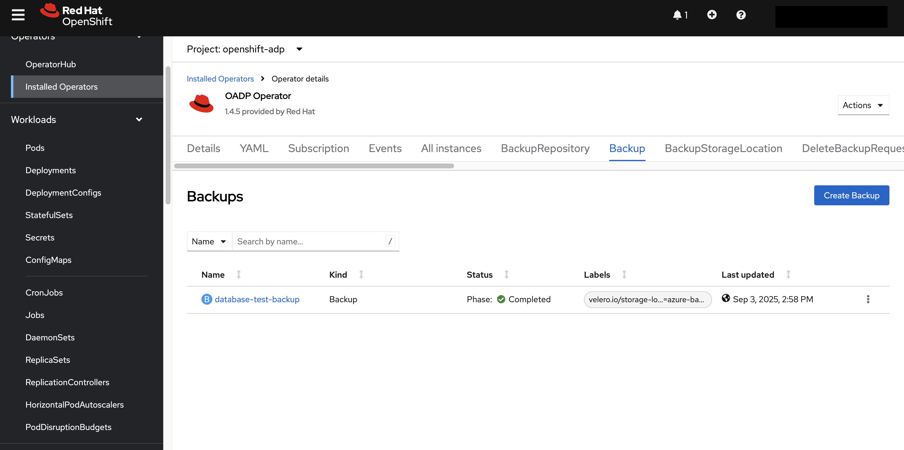
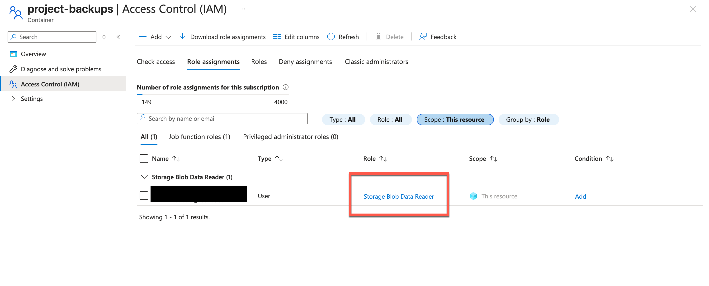
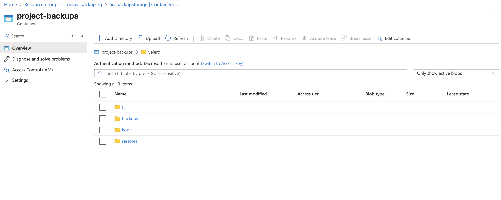

This guide demonstrates how to implement OpenShift API for Data Protection (OADP) for complete backup and recovery for Azure Red Hat OpenShift (ARO) clusters using a storage account.

OADP offers comprehensive disaster recovery protection, covering OpenShift Container Platform applications, application-related cluster resources, persistent volumes, and internal images. OADP is also capable of backing up both containerized applications and virtual machines (VMs). However, OADP does not serve as a disaster recovery solution for etcd or Operators.

OADP support is provided to customer workload namespaces, and cluster scope resources.

### Prerequisites Checklist

Before starting, ensure you have:
* An [ARO 4.14 cluster](/experts/aro/terraform-install) with cluster-admin access
* Configure [EntraID for authentication](experts/idp/group-claims/aro/)
* [Azure CLI](https://learn.microsoft.com/en-us/cli/azure/install-azure-cli?view=azure-cli-latest)
* [OpenShift CLI](https://docs.redhat.com/en/documentation/openshift_container_platform/4.19/html/cli_tools/openshift-cli-oc#installing-openshift-cli)
* Azure subscription with permissions to create storage accounts and resource groups


#### Step 1: Prepare Azure Resources
Create Azure infrastructure for OADP by establishing a storage account for backup data

##### 1.1 Create Resource Group for Storage Account
```bash
# Set variables
export ARO_RG="aro-cluster-rg"
export ARO_CLUSTER_NAME="aro-cluster"
export LOCATION="eastus" 
export STORAGE_ACCOUNT="aroprojectbackups"
export BACKUP_RG="aro-backup-rg"
export CONTAINER_NAME="aro-project"
export SUBSCRIPTION_ID=$(az account show --query id --output tsv)
export OADP_NAMESPACE="openshift-adp"
export TEST_PROJECT_NAME="database-test"
```

##### Create resource group for storage account

```bash
az group create \
  --name $BACKUP_RG \
  --location $LOCATION
```

##### 1.2 Create Azure Storage Account

```bash
az storage account create \
  --name $STORAGE_ACCOUNT \
  --resource-group $BACKUP_RG \
  --location $LOCATION \
  --sku Standard_LRS \
  --kind StorageV2 \
  --access-tier Hot \
  --allow-blob-public-access false \
  --allow-shared-key-access false
```

##### Create container (using Azure EntraID auth)

```bash
az storage container create \
  --name $CONTAINER_NAME \
  --account-name $STORAGE_ACCOUNT \
  --resource-group $BACKUP_RG \
  --auth-mode login
```

#### 1.3 Create Service Principal
Create service principal with appropriate permissions to access both storage and snapshot resources

```bash
export SERVICE_PRINCIPAL_NAME="aro-backup-sp"

SP_INFO=$(az ad sp create-for-rbac \
  --name $SERVICE_PRINCIPAL_NAME \
  --role Contributor \
  --scopes "/subscriptions/$SUBSCRIPTION_ID/resourceGroups/$BACKUP_RG")
```

##### Get service principal values
```bash
SP_CLIENT_ID=$(echo "${SP_INFO}" | jq -r .appId)
SP_CLIENT_SECRET=$(echo "${SP_INFO}" | jq -r .password)
SP_TENANT_ID=$(echo "${SP_INFO}" | jq -r .tenant)
```

##### Validate Client ID and Tenant ID values

```bash
echo "Service Principal Client ID: $SP_CLIENT_ID"
echo "Tenant ID: $SP_TENANT_ID"
```

##### Assign additional permissions for Storage account and ARO resource group for snapshot location

```bash
az role assignment create \
  --assignee $SP_CLIENT_ID \
  --role "Storage Blob Data Contributor" \
  --scope "/subscriptions/$SUBSCRIPTION_ID/resourceGroups/$BACKUP_RG/providers/Microsoft.Storage/storageAccounts/$STORAGE_ACCOUNT"

az role assignment create \
  --assignee $SP_CLIENT_ID \
  --role "Contributor" \
  --scope "/subscriptions/$SUBSCRIPTION_ID/resourceGroups/$ARO_RG"
```

#### Step 2: Install OADP Operator
OADP enables the backup of Kubernetes objects, internal images, and persistent volumes (PVs) associated with applications deployed on OpenShift. It can then restore these components, either entirely or filtered by namespace, PV, or label.


##### Connect to your ARO cluster first
oc login --user <kubeadmin> --password <aro-password> --server=<your-aro-api-server> 

##### 2.1 Install OADP Operator 1.4 via OperatorHub

You must be logged in as a user with `cluster-admin` privileges. You can install operator via [webconsole](https://docs.redhat.com/en/documentation/openshift_container_platform/4.10/html/backup_and_restore/application-backup-and-restore#oadp-installing-operator_installing-oadp-azure) 

Install operator in openshift-adp namespace

##### 2.2 Verify Operator Installation

##### Wait for operator to be ready (may take 2-3 minutes)
```bash
oc get csv -n openshift-adp
```

##### Check operator pods
```bash
oc get pods -n openshift-adp
```

Example output:
```
NAME                                READY   STATUS    RESTARTS   AGE
# oadp-operator-controller-manager-*  1/1     Running   0          2m
```

#### Step 3: Configure OADP with Data Mover
OADP includes a built-in Data Mover that you can use to move Container Storage Interface (CSI) volume snapshots to a remote object store. The built-in Data Mover allows you to restore stateful applications from the remote object store if a failure, accidental deletion, or corruption of the cluster occurs. It uses Kopia as the uploader mechanism to read the snapshot data and write to the unified repository.(in this case azure blob storage)

##### 3.1 Create cloud credentials secret

```bash
oc apply -f - <<EOF
apiVersion: v1
kind: Secret
metadata:
  name: cloud-credentials
  namespace: openshift-adp
type: Opaque
stringData:
  cloud: |
    AZURE_SUBSCRIPTION_ID=${SUBSCRIPTION_ID}
    AZURE_TENANT_ID=${SP_TENANT_ID}
    AZURE_CLIENT_ID=${SP_CLIENT_ID}
    AZURE_CLIENT_SECRET=${SP_CLIENT_SECRET}
EOF
```

#### 3.2 Create DataProtectionApplication

```bash
oc apply -f - <<EOF
apiVersion: oadp.openshift.io/v1alpha1
kind: DataProtectionApplication
metadata:
  name: azure-dpa
  namespace: openshift-adp
spec:
  backupLocations:
    - name: azure-backup
      velero:
        provider: azure
        default: true
        objectStorage:
          bucket: ${CONTAINER_NAME}
          prefix: backups
        config:
          resourceGroup: ${BACKUP_RG}
          storageAccount: ${STORAGE_ACCOUNT}
          subscriptionId: ${SUBSCRIPTION_ID}
          useAAD: 'true'
        credential:
          name: cloud-credentials
          key: cloud
  snapshotLocations:
    - name: azure-snapshot
      velero:
        provider: azure
        config:
          resourceGroup: ${SNAPSHOT_RG}
          subscriptionId: ${SUBSCRIPTION_ID}
          apiTimeout: 2m0s
        credential:
          name: cloud-credentials
          key: cloud  
  configuration:
    velero:
      defaultPlugins:
        - openshift
        - csi
        - azure
      defaultSnapshotMoveData: true
    nodeAgent:
      enable: true
      uploaderType: kopia
EOF
```

#### 3.3 Wait for DPA to be Ready

##### Check DPA status (wait for Reconcile Succeeded)
```bash
oc get dpa -n openshift-adp -o jsonpath='{.items[0].status.conditions[0].type}'
```

##### Check all OADP pods are running
```bash
oc get pods -n openshift-adp
```
Example output:
```bash
oc get pods -n openshift-adp

NAME                                                READY   STATUS      RESTARTS   AGE
node-agent-7m4tz                                    1/1     Running     0          20s
node-agent-blmhm                                    1/1     Running     0          20s
node-agent-ck7gn                                    1/1     Running     0          20s
openshift-adp-controller-manager-744cdc6589-bqzmx   1/1     Running     0          27h
repo-maintain-job-1756910770495-sztvg               0/1     Completed   0          3h47m
repo-maintain-job-1756914370506-ftg8l               0/1     Completed   0          167m
repo-maintain-job-1756917970513-ffdn4               0/1     Completed   0          107m
velero-7f6f5d6c54-tnrxx                             1/1     Running     0          20s
```

#### Step 4: Verify OADP Installation
To verify a successful installation of the OADP operator, you must check the status of the operator and its related resources in the OpenShift cluster. The verification can be performed using either the OpenShift web console or the oc command-line tool. 

##### 4.1 Check Backup Storage Location

##### Verify backup storage location
```bash
oc get backupstoragelocations -n openshift-adp
```

Example output:
```bash
NAME           PHASE       LAST VALIDATED   AGE   DEFAULT
azure-backup   Available   8s               12m   true
```

##### Check details and make sure backup location `Phase` is Available

```bash
oc describe backupstoragelocations azure-backup -n openshift-adp |grep Phase
```
Example output:
```
oc describe backupstoragelocations azure-backup -n openshift-adp |grep Phase
  Phase:                 Available
```
##### 4.2 Check Volume snapshot location
An Azure Disk CSI snapshot is stored within Azure's disk infrastructure, not in your blob storage bucket.The snapshotLocation is used to tell Velero where to interact with the underlying storage system's snapshot APIs.

##### Verify volume snapshot location
```bash
oc get volumesnapshotlocations -n openshift-adp
```
Example output:
```bash
oc get volumesnapshotlocations -n openshift-adp
NAME             AGE
azure-snapshot   15m
```

##### Check details for volume snapshot

```bash
oc describe volumesnapshotlocations azure-snapshot -n openshift-adp
```

#### Step 5: Create test database for validation of backup and restore
Creating a test database for validating backup and restore procedures is a critical component of a robust disaster recovery strategy. This process ensures that backups are viable and that the restoration process can be executed successfully when needed

##### 5.1 Create Test Namespace

```bash
oc new-project $TEST_PROJECT_NAME
```

##### 5.2 Create a database with persistent storage and services
```bash
cat << EOF | oc apply -f -
apiVersion: apps/v1
kind: Deployment
metadata:
  name: postgresql-test
  namespace: $TEST_PROJECT_NAME
spec:
  replicas: 1
  selector:
    matchLabels:
      app: postgresql-test
  template:
    metadata:
      labels:
        app: postgresql-test
    spec:
      securityContext:
        runAsNonRoot: true
      containers:
      - name: postgresql
        image: registry.redhat.io/rhel8/postgresql-13:latest
        ports:
        - containerPort: 5432
        env:
        - name: POSTGRESQL_USER
          value: "testuser"
        - name: POSTGRESQL_PASSWORD
          value: "testpassword"
        - name: POSTGRESQL_DATABASE
          value: "testdb"
        volumeMounts:
        - name: postgresql-data
          mountPath: /var/lib/pgsql/data
        securityContext:
          allowPrivilegeEscalation: false
          runAsNonRoot: true
          # The runAsUser is also removed here. OpenShift will use the
          # one defined at the pod level.
      volumes:
      - name: postgresql-data
        persistentVolumeClaim:
          claimName: postgresql-pvc
---
apiVersion: v1
kind: PersistentVolumeClaim
metadata:
  name: postgresql-pvc
  namespace: $TEST_PROJECT_NAME
spec:
  accessModes:
  - ReadWriteOnce
  resources:
    requests:
      storage: 1Gi
---
apiVersion: v1
kind: Service
metadata:
  name: postgresql-service
  namespace: $TEST_PROJECT_NAME
spec:
  selector:
    app: postgresql-test
  ports:
  - port: 5432
    targetPort: 5432
EOF
```


##### 5.3 Wait for pod to be ready

```bash
oc wait --for=condition=ready pod -l app=postgresql-test -n $TEST_PROJECT_NAME --timeout=300s
```

##### 5.4 Add test data

```bash
oc exec -it deployment/postgresql-test -n $TEST_PROJECT_NAME -- psql -U testuser -d testdb -c "
CREATE TABLE test_table (
    id SERIAL PRIMARY KEY,
    name VARCHAR(100),
    created_at TIMESTAMP DEFAULT CURRENT_TIMESTAMP
);
INSERT INTO test_table (name) VALUES ('Test Data 1'), ('Test Data 2'), ('Test Data 3');
SELECT * FROM test_table;"
```

#### Step 6: Create and Validate Backup

##### 6.1 Create Backup of Test Application

```bash
cat << EOF | oc apply -f -
apiVersion: velero.io/v1
kind: Backup
metadata:
  name: database-test-backup
  namespace: openshift-adp
spec:
  includedNamespaces:
  - $TEST_PROJECT_NAME
  storageLocation: azure-backup
  ttl: 720h0m0s
EOF
```

##### 6.2 Monitor Backup Progress

##### Get backup name

```bash
BACKUP_NAME=$(oc get backups -n openshift-adp --sort-by=.metadata.creationTimestamp -o jsonpath='{.items[-1].metadata.name}')
```
##### Check backup status - Make sure status shows that backup is completed

```bash
oc describe backup $BACKUP_NAME -n openshift-adp
```



### 6.3 Verify Backup in Azure

##### Check if backup files exist in storage account. Note you need to have Storage Blob Reader Role assigned to container within storage account





#### Step 7: Test Restore (Optional Validation)

##### 7.1 Delete Test Application
```bash
# Delete the test namespace to simulate disaster
oc delete project $TEST_PROJECT_NAME

# Verify it's gone
oc get projects | grep $TEST_PROJECT_NAME
```

##### 7.2 Restore from Backup
```bash
cat << EOF | oc apply -f -
apiVersion: velero.io/v1
kind: Restore
metadata:
  name: database-test-restore
  namespace: openshift-adp
spec:
  backupName: $BACKUP_NAME
  includedNamespaces:
    - $TEST_PROJECT_NAME
  restorePVs: true
EOF
```

#### 7.3 Verify Restore
```bash
# Get restore name
RESTORE_NAME=$(oc get restores -n openshift-adp --sort-by=.metadata.creationTimestamp -o jsonpath='{.items[-1].metadata.name}')

# Check restore status
oc get restore $RESTORE_NAME -n openshift-adp

# Verify test application is restored
oc get pods -n $TEST_PROJECT_NAME

# Check data is restored
```bash
oc exec -it deployment/postgresql-test -n $TEST_PROJECT_NAME -- psql -U testuser -d testdb -c "SELECT * FROM test_table;"
```

#### Step 8: Configure Backup Schedules (Optional)

##### 8.1 Create Daily Backup Schedule
```bash
cat << EOF | oc apply -f -
apiVersion: velero.io/v1
kind: Schedule
metadata:
  name: daily-backup
  namespace: openshift-adp
spec:
  schedule: "0 1 * * *"  # Daily at 1 AM
  template:
    includedNamespaces:
      - $TEST_PROJECT_NAME
    storagePolicy: snapshot
    ttl: 168h0m0s  # 7 days retention
EOF
```

To get additional information about OADP refer to [documentation](https://github.com/openshift/oadp-operator/blob/oadp-dev/docs/TROUBLESHOOTING.md)
