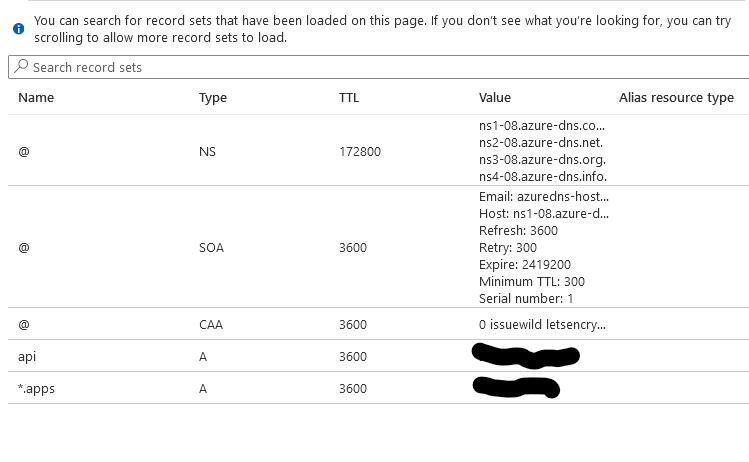

Guide to deploying `cert-manager` on an ARO cluster that's configured to use Azure Managed Identities to automate certificate management with cert-manager and Letsencrypt certificates to manage the `*.apps` and `api` endpoints.

> [!NOTE]
> This is for installing the operator on clusters that were built with Managed Identity support, **not** legacy Service Principal clusters. The procedure for installing on ARO legacy SP clusters can be found [here](./index.md).

## Prerequisites

* az cli (already installed in Azure Cloud Shell)
* oc cli
* jq (already installed in Azure Cloud Shell)
* An ARO cluster that is on OCP version 4.18+ *and* has been configured to use a custom domain name (e.g., `aro-cluster-1.acme.com`)

We'll go through this setup using the `bash` terminal on the Azure Cloud Shell. Be sure to always use the same terminal/session for all commands since we'll reference environment variables set or created through the steps.

> When an ARO cluster is built with a custom domain name it generates and uses self-signed certificates for its initial configuration. As a result, your browser will probably refuse to connect and you will get a warning from `oc` when you login to the cluster.

**Azure Cloud Shell - Bash**

> See [Azure Docs](https://docs.microsoft.com/en-us/cli/azure/install-azure-cli-linux?pivots=dnf) for alternative install options.

1. Install oc CLI

    Follow the instructions in [Installing the OpenShift CLI on Linux](https://docs.openshift.com/container-platform/4.12/cli_reference/openshift_cli/getting-started-cli.html#installing-the-openshift-cli-on-linux) to install `oc` CLI.

## Create DNS Zone & Managed Identity


In order for cert-manager to work with AzureDNS, we need to create the zone and add a CAA record as well as create a Managed Identity with a role that we can use to manage records in this zone so CertManager can use DNS01 authentication for validating requests.

This zone should be a public zone since letsencrypt will need to be able to read records created here.

>If you use a subdomain, please be sure to [create the NS records](https://docs.microsoft.com/en-us/azure/dns/delegate-subdomain) in your primary domain to the subdomain.

For ease of management, we're using the same resource group for domain as we have the cluster in.

1. Set your environment variables

You will need the name of the Azure resource group that your DNS zone is in (and potentially, another if the DNS zone is in a *different* resource group than your cluster):

   ```bash
   RESOURCEGROUP=<cluster_resourcegroup_name>
   DOMAIN=<dns_name_passed_at_cluster_build_time>
   CLUSTER=<name_of_cluster_passed_at_build_time>
   ```


1. Create Zone

   ```bash
   az network dns zone create -g $RESOURCEGROUP -n $DOMAIN
   ```

    >You will need to configure your nameservers to point to Azure. The output of running this zone create will show you the nameservers for this record that you will need to set up within your domain registrar.

1. Create API DNS record

   ```bash
   APIREC=$(az aro show -g $RESOURCEGROUP -n $CLUSTER --query apiserverProfile.ip -o tsv)
   az network dns record-set a add-record -g $RESOURCEGROUP -z $DOMAIN \
   -n api -a $APIREC
   ```

1. Create Wildcard DNS record

   ```bash
   WILDCARDREC=$(az aro show -n $CLUSTER -g $RESOURCEGROUP --query '{ingress:ingressProfiles[0].ip}' -o tsv)
   az network dns record-set a add-record -g $RESOURCEGROUP -z $DOMAIN \
   -n "*.apps" -a $WILDCARDREC
   ```

1. Add CAA Record

   >[CAA is a type of DNS record](https://letsencrypt.org/docs/caa/) that allows owners to specify which Certificate Authorities are allowed to issue certificates containing their domain names.

   ```bash
   az network dns record-set caa add-record -g $RESOURCEGROUP -z $DOMAIN \
   -n @ --flags 0 --tag "issuewild" --value "letsencrypt.org"
   ```

   You should be able to view the records in your console

   

   > Note - You may have to create NS records in your root zone for a subdomain if you use a subdomain zone to point to the subdomains name servers.

1. Set environment variables to build a new Managed Identity that cert-manager will use to interact with the DNS zone.

   ```bash
   CERT_MANAGER_NEW_IDENTITY_NAME="${CLUSTER}-cert-manager-id" 
   LETSENCRYPTEMAIL=<your_email>
   SUBSCRIPTION_ID=$(az account show -o tsv --query 'id')
   CLUSTER_OIDC_ISSUER_URL=$(az aro show --name $CLUSTER --resource-group $RESOURCEGROUP --query "clusterProfile.oidcIssuer" -o json | jq -r)
   CLUSTER_LOCATION=$(az aro show --name $CLUSTER -g $RESOURCEGROUP  --query 'location' --output tsv)
   CM_ID_OUTPUT=$(az identity create --name "$CERT_MANAGER_NEW_IDENTITY_NAME" --resource-group "$RESOURCEGROUP" --location "$CLUSTER_LOCATION")
   CLIENT_ID=$(echo $CM_ID_OUTPUT | jq -r '.clientId')
   PRINCIPAL_ID=$(echo $CM_ID_OUTPUT | jq -r '.principalId')

   az identity federated-credential create \
     --name "${CERT_MANAGER_NEW_IDENTITY_NAME}-cred" \
     --identity-name "${CERT_MANAGER_NEW_IDENTITY_NAME}" \
     --resource-group "$RESOURCEGROUP" \
     --issuer "$CLUSTER_OIDC_ISSUER_URL" \
     --subject "system:serviceaccount:cert-manager:cert-manager" \
     --audiences "api://AzureADTokenExchange"
   ```

1. Assign DNS Contributor to the Managed Identity with the DNS Zone as the scope:

   ```bash
   DNS_ID=$(az network dns zone show --name $DOMAIN --resource-group $RESOURCEGROUP --query "id" --output tsv)
   az role assignment create --assignee $PRINCIPAL_ID --role "DNS Zone Contributor" --scope $DNS_ID
   ```

1. Get OpenShift console URL

   ```bash
   az aro show -g $RESOURCEGROUP -n $CLUSTER --query "consoleProfile.url" -o tsv
   ```

1. Get OpenShift API URL

   ```bash
   az aro show -g $RESOURCEGROUP -n $CLUSTER --query "apiserverProfile.url" -o tsv
   ```

1. Get OpenShift credentials

   > You can use these to log in to the web console (will get a cert warning that you can bypass with typing "thisisunsafe" in a chrome browser or login with oc)

   ```bash
   az aro list-credentials --name $CLUSTER --resource-group $RESOURCEGROUP
   ```


## Log In to Cluster

1. Log in to your cluster through oc cli

   >You may need to flush your local dns resolver/cache before you can see the DNS/Hostnames. On Windows you can open up a command prompt as administrator and type "ipconfig /flushdns"

   ```bash
   apiServer=$(az aro show -g $RESOURCEGROUP -n $CLUSTER --query apiserverProfile.url -o tsv)
   loginCred=$(az aro list-credentials --name $CLUSTER --resource-group $RESOURCEGROUP --query "kubeadminPassword" -o tsv)
   oc login $apiServer -u kubeadmin -p $loginCred
   ```

   >You may get a warning that the certificate isn't trusted. We can ignore that now since we're in the process of adding a trusted certificate.


## Set up Cert-Manager

We'll install cert-manager from operatorhub. If you experience any issues installing here, it probably means that you didn't [provide a pull-secret](https://docs.microsoft.com/en-us/azure/openshift/howto-add-update-pull-secret) when you installed your ARO cluster.

1. Create namespace

   ```bash
   cat <<EOF | oc apply -f -
   apiVersion: v1
   kind: Namespace
   metadata:
     annotations:
       openshift.io/display-name:  Red Hat Certificate Manager Operator
     labels:
       openshift.io/cluster-monitoring: 'true'
     name: cert-manager-operator
   EOF
   ```

1. Switch openshift-cert-manager-operator project (namespace)

   ```bash
   oc project cert-manager-operator
   ```

1. Create OperatorGroup

   ```bash
   cat <<EOF | oc apply -f -
   apiVersion: operators.coreos.com/v1
   kind: OperatorGroup
   metadata:
     name: cert-manager-operator
   spec: {}
   EOF
   ```

1. Create subscription for cert-manager operator

   ```yaml
   cat <<EOF | oc apply -f -
   apiVersion: operators.coreos.com/v1alpha1
   kind: Subscription
   metadata:
     name: openshift-cert-manager-operator
     namespace: cert-manager-operator
   spec:
     channel: stable-v1
     installPlanApproval: Automatic
     name: openshift-cert-manager-operator
     source: redhat-operators
     sourceNamespace: openshift-marketplace
   EOF
   ```

   > *It will take a few minutes for this operator to install and complete its set up. May be a good time to take a coffee break :)*

1. Wait for cert-manager operator to finish installing.

   Our next steps can't complete until the operator has finished installing. Since many browsers will not connect to the console with a self-signed certificate, this is best verified using the CLI:

    ```bash
    oc describe subscription openshift-cert-manager-operator
    ```

  This will print quite a lot of detail about the `Subscription` resource, but the key lines should be near the bottom of the output:

   ```bash
   ...
     Installplan:
    API Version:  operators.coreos.com/v1alpha1
    Kind:         InstallPlan
    Name:         install-h9jlk
    Uuid:         62c9122f-d85b-421c-ade1-148d252123db
  Last Updated:   2026-06-29T16:41:21Z
  State:          AtLatestKnown
  ...
  ```

## Configure cert-manager to use Managed Identity

cert-manager has support for Azure Managed Identities, but there are a couple of additional commands necessary to enable it:

 ```bash
 oc project cert-manager
 oc annotate sa cert-manager "azure.workload.identity/client-id=${CLIENT_ID}"
 oc patch certmanager cluster --type=merge -p '{"spec":{"controllerConfig":{"overrideLabels": {"azure.workload.identity/use":"true"}}}}'
 ```

 This will cause the running `cert-manager` Pod to quickly restart and when it does it will have the necessary environment variables to use the Managed Identity created earlier.

### Configure Certificate Requestor

1. Create Cluster Issuer

  ```yaml
  cat <<EOF | oc apply -f -
  apiVersion: cert-manager.io/v1
  kind: ClusterIssuer
  metadata:
    name: letsencrypt-prod
  spec:
    acme:
      server: https://acme-v02.api.letsencrypt.org/directory
      email: $LETSENCRYPTEMAIL
      # This key doesn't exist, cert-manager creates it
      privateKeySecretRef:
        name: prod-letsencrypt-issuer-account-key
      solvers:
      - dns01:
          azureDNS:
            subscriptionID: $SUBSCRIPTION_ID
            resourceGroupName: $RESOURCEGROUP
            hostedZoneName: $DOMAIN
            environment: AzurePublicCloud
            managedIdentity:
              clientID: $CLIENT_ID
  EOF
  ```

1. Describe issuer

 ```bash
 oc describe clusterissuer letsencrypt-prod
 ```

   You should see some output that the issuer is Registered/Ready

   ```
   Conditions:
    Last Transition Time:  2022-06-17T17:29:37Z
    Message:               The ACME account was registered with the ACME server
    Observed Generation:   1
    Reason:                ACMEAccountRegistered
    Status:                True
    Type:                  Ready
   Events:                    <none>
   ```
   
### Create & Install API Certificate

1. Switch openshift-config project
/
   ```bash
   oc project openshift-config
   ```

1. Configure API certificate

   ```yaml
   cat <<EOF | oc apply -f -
   apiVersion: cert-manager.io/v1
   kind: Certificate
   metadata:
     name: openshift-api
     namespace: openshift-config
   spec:
     secretName: openshift-api-certificate
     issuerRef:
       name: letsencrypt-prod
       kind: ClusterIssuer
     dnsNames:
     - api.$DOMAIN
   EOF
   ```

1. View certificate status

   ```bash
   oc describe certificate openshift-api -n openshift-config
   ```

1. Apply the API Certificate

   If you're running these steps manually and you wait until the certificate is issued, you can tell the API server to use it with this command:

   ```bash
   oc patch apiserver cluster --type=merge -p $(jq -nc --arg dn "api.$DOMAIN" '{"spec":{"servingCerts": {"namedCertificates": [{"names": [$dn], "servingCertificate": {"name": "openshift-api-certificate"}}]}}}')
   ```

   Alternatively, if you're wanting this to run as a part of automation, you can use the OCP `Job` resource:

   ```yaml
   cat <<EOF | oc apply -f -
   apiVersion: rbac.authorization.k8s.io/v1
   kind: ClusterRole
   metadata:
     name: patch-cluster-api-cert
   rules:
     - apiGroups:
         - ""
       resources:
         - secrets
       verbs:
         - get
         - list
     - apiGroups:
         - config.openshift.io
       resources:
         - apiservers
       verbs:
         - get
         - list
         - patch
         - update
   ---
   apiVersion: rbac.authorization.k8s.io/v1
   kind: ClusterRoleBinding
   metadata:
     name: patch-cluster-api-cert
   roleRef:
     apiGroup: rbac.authorization.k8s.io
     kind: ClusterRole
     name: patch-cluster-api-cert
   subjects:
     - kind: ServiceAccount
       name: patch-cluster-api-cert
       namespace: openshift-config
   ---
   apiVersion: v1
   kind: ServiceAccount
   metadata:
     name: patch-cluster-api-cert
   ---
   apiVersion: batch/v1
   kind: Job
   metadata:
     name: patch-cluster-api-cert
     annotations:
       argocd.argoproj.io/hook: PostSync
       argocd.argoproj.io/hook-delete-policy: HookSucceeded
   spec:
     template:
       spec:
         containers:
           - image: image-registry.openshift-image-registry.svc:5000/openshift/cli:latest
             env:
               - name: API_HOST_NAME
                 value: api.$DOMAIN
             command:
               - /bin/bash
               - -c
               - |
                 #!/usr/bin/env bash
                 if oc get secret openshift-api-certificate -n openshift-config; then
                   oc patch apiserver cluster --type=merge -p '{"spec":{"servingCerts": {"namedCertificates": [{"names": ["'\$API_HOST_NAME'"], "servingCertificate": {"name": "openshift-api-certificate"}}]}}}'
                 else
                   echo "Could not execute sync as secret 'openshift-api-certificate' in namespace 'openshift-config' does not exist, check status of CertificationRequest"
                   exit 1
                 fi
             name: patch-cluster-api-cert
         dnsPolicy: ClusterFirst
         restartPolicy: Never
         terminationGracePeriodSeconds: 30
         serviceAccount: patch-cluster-api-cert
         serviceAccountName: patch-cluster-api-cert
   EOF
   ```

### Create & Install the `*.apps` Wildcard Certificate

1. Switch openshift-ingress project (namespace)

   ```bash
   oc project openshift-ingress
   ```

1. Configure Wildcard Certificate

   ```yaml
   cat <<EOF | oc apply -f -
   apiVersion: cert-manager.io/v1
   kind: Certificate
   metadata:
     name: openshift-wildcard
     namespace: openshift-ingress
   spec:
     secretName: openshift-wildcard-certificate
     issuerRef:
        name: letsencrypt-prod
        kind: ClusterIssuer
     commonName: "*.apps.$DOMAIN"
     dnsNames:
     - "*.apps.$DOMAIN"
   EOF
   ```

1. View certificate status

   ```bash
   oc describe certificate openshift-wildcard -n openshift-ingress
   ```

1. Install Wildcard Certificate

   As with the API server certificate, an `oc patch ...` command can be used directly:

   ```bash
   oc patch ingresscontroller default -n openshift-ingress-operator --type=merge --patch='{"spec": { "defaultCertificate": { "name": "openshift-wildcard-certificate" }}}'
   ```

   And again, if it's intended to be run as part of automation, use a `Job`:

   ```yaml
   cat <<EOF | oc apply -f -
   apiVersion: rbac.authorization.k8s.io/v1
   kind: ClusterRole
   metadata:
     name: patch-cluster-wildcard-cert
   rules:
     - apiGroups:
         - operator.openshift.io
       resources:
         - ingresscontrollers
       verbs:
         - get
         - list
         - patch
     - apiGroups:
         - ""
       resources:
         - secrets
       verbs:
         - get
         - list
   ---
   apiVersion: rbac.authorization.k8s.io/v1
   kind: ClusterRoleBinding
   metadata:
     name: patch-cluster-wildcard-cert
   roleRef:
     apiGroup: rbac.authorization.k8s.io
     kind: ClusterRole
     name: patch-cluster-wildcard-cert
   subjects:
     - kind: ServiceAccount
       name: patch-cluster-wildcard-cert
       namespace: openshift-ingress
   ---
   apiVersion: v1
   kind: ServiceAccount
   metadata:
     name: patch-cluster-wildcard-cert
   ---
   apiVersion: batch/v1
   kind: Job
   metadata:
     name: patch-cluster-wildcard-cert
     annotations:
       argocd.argoproj.io/hook: PostSync
       argocd.argoproj.io/hook-delete-policy: HookSucceeded
   spec:
     template:
       spec:
         containers:
           - image: image-registry.openshift-image-registry.svc:5000/openshift/cli:latest
             command:
               - /bin/bash
               - -c
               - |
                 #!/usr/bin/env bash
                 if oc get secret openshift-wildcard-certificate -n openshift-ingress; then
                   oc patch ingresscontroller default -n openshift-ingress-operator --type=merge --patch='{"spec": { "defaultCertificate": { "name": "openshift-wildcard-certificate" }}}'
                 else
                   echo "Could not execute sync as secret 'openshift-wildcard-certificate' in namespace 'openshift-ingress' does not exist, check status of CertificationRequest"
                   exit 1
                 fi
             name: patch-cluster-wildcard-cert
         dnsPolicy: ClusterFirst
         restartPolicy: Never
         terminationGracePeriodSeconds: 30
         serviceAccount: patch-cluster-wildcard-cert
         serviceAccountName: patch-cluster-wildcard-cert
   EOF
   ```


## Debugging

The cert-manager operator keeps track of requested but not yet issued `Certificate` resources using another resource called a `Challenge` which can be seen via the `oc` command:

```bash
oc describe challenges
```

DNS-based challenges will typically resolve (and the certificate will be issued) in less than two minutes. If they don't, looking at the messages from the specific challenge associated with the certificate will typically provide a detailed explanation of what's causing the issue.

This is a very [helpful guide in debugging certificates](https://cert-manager.io/docs/faq/acme/) as well.

## Validate Certificates

It will take a few minutes for the jobs to successfully complete.

Once the certificate requests are complete, you should no longer see a browser security warning and you should have a valid SSL lock in your browser and no more warnings about SSL when using the `oc` CLI.

You may want to open an InPrivate/Private browser tab to visit the console/api via the URLs you previously listed so you can see the new SSL cert without having to expire your cache.
