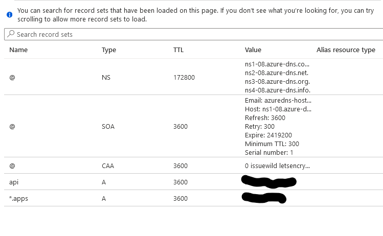
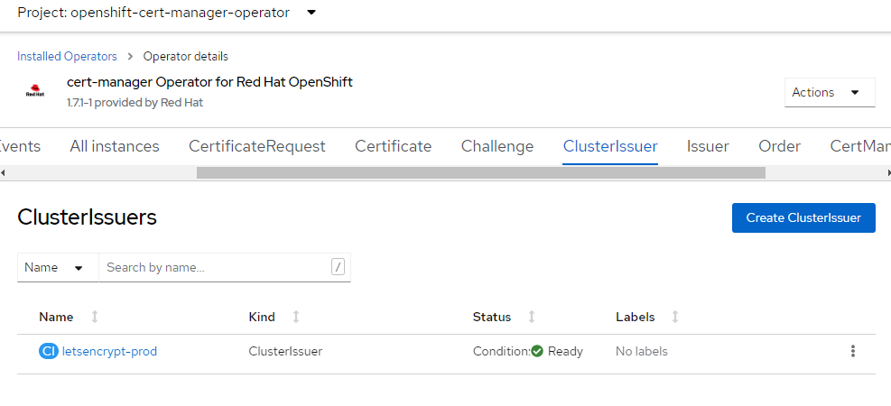

ARO guide to deploying an ARO cluster with custom domain and automating certificate management with cert-manager and letsencrypt certificates to manage the `*.apps` and `api` endpoints.

## Prerequisites

* az cli (already installed in Azure Cloud Shell)
* oc cli
* jq (already installed in Azure Cloud Shell)
* OpenShift 4.10+
* domain name to use (we will create zones for this domain name during this guide)

We'll go through this setup using the `bash` terminal on the Azure Cloud Shell. Be sure to always use the same terminal/session for all commands since we'll reference environment variables set or created through the steps.

**Azure Cloud Shell - Bash**

> See [Azure Docs](https://docs.microsoft.com/en-us/cli/azure/install-azure-cli-linux?pivots=dnf) for alternative install options.

1. Install oc CLI

    Follow the instructions in [Installing the OpenShift CLI on Linux](https://docs.openshift.com/container-platform/4.12/cli_reference/openshift_cli/getting-started-cli.html#installing-the-openshift-cli-on-linux) to install `oc` CLI.

### Prepare Azure Account for Azure OpenShift

1. Register resource providers

   ```bash
   az provider register -n Microsoft.RedHatOpenShift --wait
   az provider register -n Microsoft.Compute --wait
   az provider register -n Microsoft.Storage --wait
   az provider register -n Microsoft.Authorization --wait
   ```

### Get Red Hat pull secret

1. Log into cloud.redhat.com

1. Browse to https://cloud.redhat.com/openshift/install/azure/aro-provisioned

1. click **Copy pull secret** 

1. Back in the Azure Cloud Shell, enter the following. Instead of `<paste_your_secret>`, paste your actual secret on that line. To do so, right-click and choose paste.

    ```bash
    cat >> ./pull-secret.txt << EOF
    <paste_your_secret>
    EOF
    ```

## Deploy Azure OpenShift

### Variables and Resource Group

Set some environment variables to use later, and create an Azure Resource Group.

1. Set the following environment variables

   > Change the values to suit your environment

   ```bash
   PULL_SECRET=./pull-secret.txt  # the path to pull-secret
   LOCATION=southcentralus        # the location of your cluster
   RESOURCEGROUP=aro-rg           # the name of the resource group where you want to create your cluster
   CLUSTER=aro-cluster            # the name of your cluster
   DOMAIN=lab.domain.com          # Domain or subdomain zone for cluster & cluster api
   ```

1. Create an Azure resource group

   ```bash
   az group create \
   --name $RESOURCEGROUP \
   --location $LOCATION
   ```

### Networking

Create a virtual network with two empty subnets

1. Create virtual network

   ```bash
   az network vnet create \
      --resource-group $RESOURCEGROUP \
      --name aro-vnet \
      --address-prefixes 10.0.0.0/22
   ```

1. Create control plane subnet

   ```bash
   az network vnet subnet create \
   --resource-group $RESOURCEGROUP \
   --vnet-name aro-vnet \
   --name master-subnet \
   --address-prefixes 10.0.0.0/23 \
   --service-endpoints Microsoft.ContainerRegistry
   ```

1. Create machine subnet

   ```bash
   az network vnet subnet create \
   --resource-group $RESOURCEGROUP \
   --vnet-name aro-vnet \
   --name worker-subnet \
   --address-prefixes 10.0.2.0/23 \
   --service-endpoints Microsoft.ContainerRegistry
   ```

1. Disable network policies on the control plane subnet

   > This is required for the service to be able to connect to and manage the cluster.

   ```bash
   az network vnet subnet update \
   --name master-subnet \
   --resource-group $RESOURCEGROUP \
   --vnet-name aro-vnet \
   --disable-private-link-service-network-policies true
   ```

1. Create the cluster

   > This will take between 30 and 45 minutes.

   ```bash
   az aro create \
   --resource-group $RESOURCEGROUP \
   --name $CLUSTER \
   --vnet aro-vnet \
   --master-subnet master-subnet \
   --worker-subnet worker-subnet \
   --pull-secret $(cat $PULL_SECRET) \
   --domain $DOMAIN
   ```

1. Wait until the ARO cluster is fully provisioned.

## Create DNS Zones & Service Principal

In order for cert-manager to work with AzureDNS, we need to create the zone and add a CAA record as well as create a Service Principal that we can use to manage records in this zone so CertManager can use DNS01 authentication for validating requests.

This zone should be a public zone since letsencrypt will need to be able to read records created here.

>If you use a subdomain, please be sure to [create the NS records](https://docs.microsoft.com/en-us/azure/dns/delegate-subdomain) in your primary domain to the subdomain.

For ease of management, we're using the same resource group for domain as we have the cluster in.

1. Create Zone

   ```bash
   az network dns zone create -g $RESOURCEGROUP -n $DOMAIN
   ```

    >You will need to configure your nameservers to point to Azure. The output of running this zone create will show you the nameservers for this record that you will need to set up within your domain registrar.

1. Create API DNS record

   ```bash
   APIREC=$(az aro show -g $RESOURCEGROUP -n $CLUSTER --query apiserverProfile.ip -o tsv)
   az network dns record-set a add-record -g $RESOURCEGROUP -z $DOMAIN \
   -n api -a $APIREC
   ```

1. Create Wildcard DNS record

   ```bash
   WILDCARDREC=$(az aro show -n $CLUSTER -g $RESOURCEGROUP --query '{ingress:ingressProfiles[0].ip}' -o tsv)
   az network dns record-set a add-record -g $RESOURCEGROUP -z $DOMAIN \
   -n "*.apps" -a $WILDCARDREC
   ```

1. Add CAA Record

   >[CAA is a type of DNS record](https://letsencrypt.org/docs/caa/) that allows owners to specify which Certificate Authorities are allowed to issue certificates containing their domain names.

   ```bash
   az network dns record-set caa add-record -g $RESOURCEGROUP -z $DOMAIN \
   -n @ --flags 0 --tag "issuewild" --value "letsencrypt.org"
   ```

   You should be able to view the records in your console

   

   > Note - You may have to create NS records in your root zone for a subdomain if you use a subdomain zone to point to the subdomains name servers.

1. Set environment variables to build new service principal and credentials to allow cert-manager to create records in this zone.

   >AZURE_CERT_MANAGER_NEW_SP_NAME = the name of the service principal to create that will manage the DNS zone automation for cert-manager.

   ```bash
   AZURE_CERT_MANAGER_NEW_SP_NAME=aro-dns-sp
   LETSENCRYPTEMAIL=youremail@work.com
   DNS_SP=$(az ad sp create-for-rbac --name $AZURE_CERT_MANAGER_NEW_SP_NAME --output json)
   AZURE_CERT_MANAGER_SP_APP_ID=$(echo $DNS_SP | jq -r '.appId')
   AZURE_CERT_MANAGER_SP_PASSWORD=$(echo $DNS_SP | jq -r '.password')
   AZURE_TENANT_ID=$(echo $DNS_SP | jq -r '.tenant')
   AZURE_SUBSCRIPTION_ID=$(az account show --output json | jq -r '.id')
   ```

1. Restrict service principal - remove contributor role if it exists.

   >Note: If you get the error message `No matched assignments were found to delete`, that's fine, and it is safe to proceed. We're going to grant the DNS Management Role to it next.

   ```bash
   az role assignment delete --assignee $AZURE_CERT_MANAGER_SP_APP_ID --role Contributor
   ```

1. Grant DNS Zone Contributor to our Service Principal

   We'll grant [DNS Zone Contributor](https://docs.microsoft.com/en-us/azure/role-based-access-control/built-in-roles#dns-zone-contributor) to our DNS Service principal.

   ```bash
   az role assignment create --assignee $AZURE_CERT_MANAGER_SP_APP_ID --role befefa01-2a29-4197-83a8-272ff33ce314 --scope /subscriptions/$AZURE_SUBSCRIPTION_ID
   ```

1. Assign service principal to DNS zone

   ```bash
   DNS_ID=$(az network dns zone show --name $DOMAIN --resource-group $RESOURCEGROUP --query "id" --output tsv)
   az role assignment create --assignee $AZURE_CERT_MANAGER_SP_APP_ID --role "DNS Zone Contributor" --scope $DNS_ID
   ```

1. Get OpenShift console URL

   ```bash
   az aro show -g $RESOURCEGROUP -n $CLUSTER --query "consoleProfile.url" -o tsv
   ```

1. Get OpenShift API URL

   ```bash
   az aro show -g $RESOURCEGROUP -n $CLUSTER --query "apiserverProfile.url" -o tsv
   ```

1. Get OpenShift credentials

   > You can use these to log in to the web console (will get a cert warning that you can bypass with typing "thisisunsafe" in a chrome browser or login with oc)

   ```bash
   az aro list-credentials --name $CLUSTER --resource-group $RESOURCEGROUP
   ```


## Log In to Cluster

1. Log in to your cluster through oc cli

   >You may need to flush your local dns resolver/cache before you can see the DNS/Hostnames. On Windows you can open up a command prompt as administrator and type "ipconfig /flushdns"

   ```bash
   apiServer=$(az aro show -g $RESOURCEGROUP -n $CLUSTER --query apiserverProfile.url -o tsv)
   loginCred=$(az aro list-credentials --name $CLUSTER --resource-group $RESOURCEGROUP --query "kubeadminPassword" -o tsv)
   oc login $apiServer -u kubeadmin -p $loginCred
   ```

   >You may get a warning that the certificate isn't trusted. We can ignore that now since we're in the process of adding a trusted certificate.


## Set up Cert-Manager

We'll install cert-manager from operatorhub. If you experience any issues installing here, it probably means that you didn't [provide a pull-secret](https://docs.microsoft.com/en-us/azure/openshift/howto-add-update-pull-secret) when you installed your ARO cluster.

1. Create namespace

   ```bash
   cat <<EOF | oc apply -f -
   apiVersion: v1
   kind: Namespace
   metadata:
     annotations:
       openshift.io/display-name:  Red Hat Certificate Manager Operator
     labels:
       openshift.io/cluster-monitoring: 'true'
     name: cert-manager-operator
   EOF
   ```

1. Switch openshift-cert-manager-operator project (namespace)

   ```bash
   oc project cert-manager-operator
   ```

1. Create OperatorGroup

   ```bash
   cat <<EOF | oc apply -f -
   apiVersion: operators.coreos.com/v1
   kind: OperatorGroup
   metadata:
     name: cert-manager-operator
   spec: {}
   EOF
   ```

1. Create subscription for cert-manager operator

   ```yaml
   cat <<EOF | oc apply -f -
   apiVersion: operators.coreos.com/v1alpha1
   kind: Subscription
   metadata:
     name: openshift-cert-manager-operator
     namespace: cert-manager-operator
   spec:
     channel: stable-v1
     installPlanApproval: Automatic
     name: openshift-cert-manager-operator
     source: redhat-operators
     sourceNamespace: openshift-marketplace
   EOF
   ```

   > *It will take a few minutes for this operator to install and complete its set up. May be a good time to take a coffee break :)*

1. Wait for cert-manager operator to finish installing.

   Our next steps can't complete until the operator has finished installing. We recommend that you log in to your cluster console with the URL and credentials you captured after you ran the az aro create and view the installed operators to see that everything is complete and successful.

   

## Configure cert-manager LetsEncrypt

We're going to set up cert-manager to use DNS verification for letsencrypt certificates. We'll need to generate a service principal that can update the DNS zone and create short term records needed to validate certificate requests and associate this service principal with the cluster issuer.

### Configure Certificate Requestor

1. Switch openshift-cert-manager project (namespace)

   ```bash
   oc project cert-manager
   ```

1. Create azuredns-config secret for storing service principal credentials to manage zone.

   ```bash
   oc create secret generic azuredns-config --from-literal=client-secret=$AZURE_CERT_MANAGER_SP_PASSWORD -n cert-manager
   ```

1. Create Cluster Issuer

   ```yaml
   cat <<EOF | oc apply -f -
   apiVersion: cert-manager.io/v1
   kind: ClusterIssuer
   metadata:
     name: letsencrypt-prod
   spec:
     acme:
       server: https://acme-v02.api.letsencrypt.org/directory
       email: $LETSENCRYPTEMAIL
       # This key doesn't exist, cert-manager creates it
       privateKeySecretRef:
         name: prod-letsencrypt-issuer-account-key
       solvers:
       - dns01:
           azureDNS:
             clientID: $AZURE_CERT_MANAGER_SP_APP_ID
             clientSecretSecretRef:
               name: azuredns-config
               key: client-secret
             subscriptionID: $AZURE_SUBSCRIPTION_ID
             tenantID: $AZURE_TENANT_ID
             resourceGroupName: $RESOURCEGROUP
             hostedZoneName: $DOMAIN
             environment: AzurePublicCloud
   EOF
   ```

1. Describe issuer

   ```bash
   oc describe clusterissuer letsencrypt-prod
   ```

   You should see some output that the issuer is Registered/Ready

   ```
   Conditions:
    Last Transition Time:  2022-06-17T17:29:37Z
    Message:               The ACME account was registered with the ACME server
    Observed Generation:   1
    Reason:                ACMEAccountRegistered
    Status:                True
    Type:                  Ready
   Events:                    <none>
   ```

   Once the above command is complete, you should be able to log in to the OpenShift console, navigate to Installed Operators, click on the cert-manager Operator, make sure you're in the "openshift-cert-manager-operator" project, and click the ClusterIssuer tab. You should see a screen like this. Again, if you have an ssl error and use a chrome browser - type "thisisunsafe" to get in if you get an error its an invalid cert.

   

### Create & Install API Certificate

1. Switch openshift-config project
/
   ```bash
   oc project openshift-config
   ```

1. Configure API certificate

   ```yaml
   cat <<EOF | oc apply -f -
   apiVersion: cert-manager.io/v1
   kind: Certificate
   metadata:
     name: openshift-api
     namespace: openshift-config
   spec:
     secretName: openshift-api-certificate
     issuerRef:
       name: letsencrypt-prod
       kind: ClusterIssuer
     dnsNames:
     - api.$DOMAIN
   EOF
   ```

1. View certificate status

   ```bash
   oc describe certificate openshift-api -n openshift-config
   ```

1. Apply the API Certificate

   If you're running these steps manually and you wait until the certificate is issued, you can tell the API server to use it with this command:

   ```bash
   oc patch apiserver cluster --type=merge -p $(jq -nc --arg dn "api.$DOMAIN" '{"spec":{"servingCerts": {"namedCertificates": [{"names": [$dn], "servingCertificate": {"name": "openshift-api-certificate"}}]}}}')
   ```

   Alternatively, if you're wanting this to run as a part of automation, you can use the OCP `Job` resource:

   ```yaml
   cat <<EOF | oc apply -f -
   apiVersion: rbac.authorization.k8s.io/v1
   kind: ClusterRole
   metadata:
     name: patch-cluster-api-cert
   rules:
     - apiGroups:
         - ""
       resources:
         - secrets
       verbs:
         - get
         - list
     - apiGroups:
         - config.openshift.io
       resources:
         - apiservers
       verbs:
         - get
         - list
         - patch
         - update
   ---
   apiVersion: rbac.authorization.k8s.io/v1
   kind: ClusterRoleBinding
   metadata:
     name: patch-cluster-api-cert
   roleRef:
     apiGroup: rbac.authorization.k8s.io
     kind: ClusterRole
     name: patch-cluster-api-cert
   subjects:
     - kind: ServiceAccount
       name: patch-cluster-api-cert
       namespace: openshift-config
   ---
   apiVersion: v1
   kind: ServiceAccount
   metadata:
     name: patch-cluster-api-cert
   ---
   apiVersion: batch/v1
   kind: Job
   metadata:
     name: patch-cluster-api-cert
     annotations:
       argocd.argoproj.io/hook: PostSync
       argocd.argoproj.io/hook-delete-policy: HookSucceeded
   spec:
     template:
       spec:
         containers:
           - image: image-registry.openshift-image-registry.svc:5000/openshift/cli:latest
             env:
               - name: API_HOST_NAME
                 value: api.$DOMAIN
             command:
               - /bin/bash
               - -c
               - |
                 #!/usr/bin/env bash
                 if oc get secret openshift-api-certificate -n openshift-config; then
                   oc patch apiserver cluster --type=merge -p '{"spec":{"servingCerts": {"namedCertificates": [{"names": ["'\$API_HOST_NAME'"], "servingCertificate": {"name": "openshift-api-certificate"}}]}}}'
                 else
                   echo "Could not execute sync as secret 'openshift-api-certificate' in namespace 'openshift-config' does not exist, check status of CertificationRequest"
                   exit 1
                 fi
             name: patch-cluster-api-cert
         dnsPolicy: ClusterFirst
         restartPolicy: Never
         terminationGracePeriodSeconds: 30
         serviceAccount: patch-cluster-api-cert
         serviceAccountName: patch-cluster-api-cert
   EOF
   ```

### Create & Install the `*.apps` Wildcard Certificate

1. Switch openshift-ingress project (namespace)

   ```bash
   oc project openshift-ingress
   ```

1. Configure Wildcard Certificate

   ```yaml
   cat <<EOF | oc apply -f -
   apiVersion: cert-manager.io/v1
   kind: Certificate
   metadata:
     name: openshift-wildcard
     namespace: openshift-ingress
   spec:
     secretName: openshift-wildcard-certificate
     issuerRef:
        name: letsencrypt-prod
        kind: ClusterIssuer
     commonName: "*.apps.$DOMAIN"
     dnsNames:
     - "*.apps.$DOMAIN"
   EOF
   ```

   This will generate our API and wildcard certificate requests.  We'll now create two jobs that will install these certificates.

1. View certificate status

   ```bash
   oc describe certificate openshift-wildcard -n openshift-ingress
   ```


1. Install Wildcard Certificate

   As with the API server certificate, an `oc patch ...` command can be used directly:

   ```bash
   oc patch ingresscontroller default -n openshift-ingress-operator --type=merge --patch='{"spec": { "defaultCertificate": { "name": "openshift-wildcard-certificate" }}}'
   ```

   And again, if it's intended to be run as part of automation, use a `Job`:

   ```yaml
   cat <<EOF | oc apply -f -
   apiVersion: rbac.authorization.k8s.io/v1
   kind: ClusterRole
   metadata:
     name: patch-cluster-wildcard-cert
   rules:
     - apiGroups:
         - operator.openshift.io
       resources:
         - ingresscontrollers
       verbs:
         - get
         - list
         - patch
     - apiGroups:
         - ""
       resources:
         - secrets
       verbs:
         - get
         - list
   ---
   apiVersion: rbac.authorization.k8s.io/v1
   kind: ClusterRoleBinding
   metadata:
     name: patch-cluster-wildcard-cert
   roleRef:
     apiGroup: rbac.authorization.k8s.io
     kind: ClusterRole
     name: patch-cluster-wildcard-cert
   subjects:
     - kind: ServiceAccount
       name: patch-cluster-wildcard-cert
       namespace: openshift-ingress
   ---
   apiVersion: v1
   kind: ServiceAccount
   metadata:
     name: patch-cluster-wildcard-cert
   ---
   apiVersion: batch/v1
   kind: Job
   metadata:
     name: patch-cluster-wildcard-cert
     annotations:
       argocd.argoproj.io/hook: PostSync
       argocd.argoproj.io/hook-delete-policy: HookSucceeded
   spec:
     template:
       spec:
         containers:
           - image: image-registry.openshift-image-registry.svc:5000/openshift/cli:latest
             command:
               - /bin/bash
               - -c
               - |
                 #!/usr/bin/env bash
                 if oc get secret openshift-wildcard-certificate -n openshift-ingress; then
                   oc patch ingresscontroller default -n openshift-ingress-operator --type=merge --patch='{"spec": { "defaultCertificate": { "name": "openshift-wildcard-certificate" }}}'
                 else
                   echo "Could not execute sync as secret 'openshift-wildcard-certificate' in namespace 'openshift-ingress' does not exist, check status of CertificationRequest"
                   exit 1
                 fi
             name: patch-cluster-wildcard-cert
         dnsPolicy: ClusterFirst
         restartPolicy: Never
         terminationGracePeriodSeconds: 30
         serviceAccount: patch-cluster-wildcard-cert
         serviceAccountName: patch-cluster-wildcard-cert
   EOF
   ```


## Debugging

The cert-manager operator keeps track of requested but not yet issued `Certificate` resources using another resource called a `Challenge` which can be seen via the `oc` command:

```bash
oc describe challenges
```

DNS-based challenges will typically resolve (and the certificate will be issued) in less than two minutes. If they don't, looking at the messages from the specific challenge associated with the certificate will typically provide a detailed explanation of what's causing the issue.

This is a very [helpful guide in debugging certificates](https://cert-manager.io/docs/faq/acme/) as well.

## Validate Certificates

It will take a few minutes for the jobs to successfully complete.

Once the certificate requests are complete, you should no longer see a browser security warning and you should have a valid SSL lock in your browser and no more warnings about SSL on cli.

You may want to open an InPrivate/Private browser tab to visit the console/api via the URLs you previously listed so you can see the new SSL cert without having to expire your cache.

## Delete Cluster

Once you're done its a good idea to delete the cluster to ensure that you don't get a surprise bill.

1. Delete the cluster

    ```bash
   az aro delete -y \
      --resource-group $RESOURCEGROUP \
      --name $CLUSTER
    ```

1. Delete the Azure resource group

    > Only do this if there's nothing else in the resource group.

    ```bash
   az group delete -y \
      --name $RESOURCEGROUP
    ```
