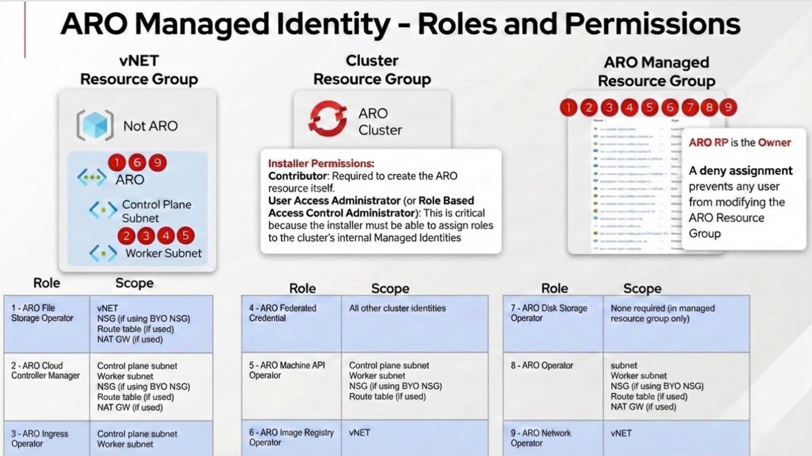
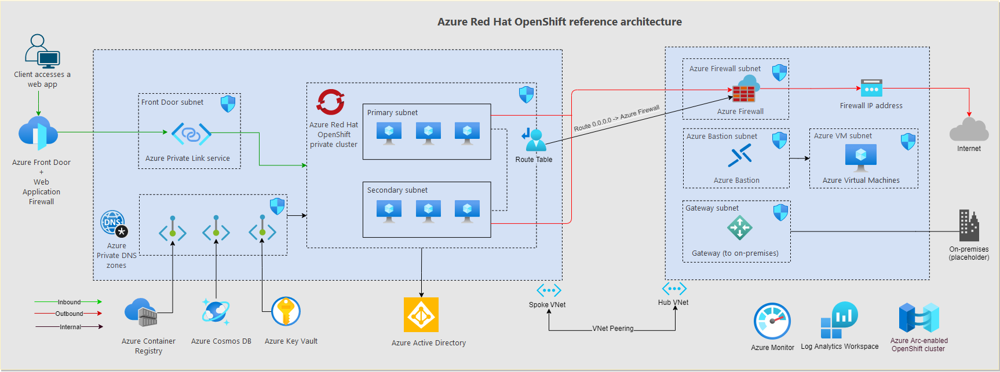

# Azure Red Hat OpenShift Operations Guide

**Day 1 Deployment & Day 2 Operations**

---

## Table of Contents

- [Introduction](#introduction)
- [Quick Reference](#quick-reference)
- [Part 1: Pre-Deployment Planning](#part-1-pre-deployment-planning)
  - [Prerequisites & Requirements](#prerequisites--requirements)
  - [Identity & Access Strategy](#identity--access-strategy)
  - [Network Architecture Planning](#network-architecture-planning)
  - [Network Security Groups](#network-security-groups)
  - [Cluster Configuration Planning](#cluster-configuration-planning)
  - [Storage Planning](#storage-planning)
  - [Compliance & Governance](#compliance--governance)
- [Part 2: Cluster Deployment (Day 1)](#part-2-cluster-deployment-day-1)
  - [Pre-Deployment Verification](#pre-deployment-verification)
  - [Network Infrastructure Deployment](#network-infrastructure-deployment)
  - [Managed Identity Setup](#managed-identity-setup)
  - [ARO Cluster Creation](#aro-cluster-creation)
  - [Post-Deployment Validation](#post-deployment-validation)
  - [Initial Configuration](#initial-configuration)
  - [Optional: Custom Domain Configuration](#optional-custom-domain-configuration)
  - [Optional: Private Cluster Access](#optional-private-cluster-access)
- [Part 3: Day 2 Operations](#part-3-day-2-operations)
  - [Tier 1: Critical Operations](#tier-1-critical-operations)
  - [Tier 2: Standard Operations](#tier-2-standard-operations)
  - [Tier 3: Optional Enhancements](#tier-3-optional-enhancements)
- [Part 4: Operational Excellence (Day N)](#part-4-operational-excellence-day-n)
- [Appendices](#appendices)
  - [Appendix A: Network Security Groups Deep Dive](#appendix-a-network-security-groups-deep-dive)
  - [Appendix B: Certificate Management](#appendix-b-certificate-management)
  - [Appendix C: Troubleshooting Guide](#appendix-c-troubleshooting-guide)
  - [Appendix D: Reference Information](#appendix-d-reference-information)

---

## Introduction

This technical guide provides comprehensive guidance for planning, deploying, and operating Azure Red Hat OpenShift (ARO) clusters. Whether you're deploying your first ARO cluster or managing production workloads, this guide covers the essential tasks and best practices for successful operations.

### Purpose of This Guide

This guide is designed to:
- Provide a structured approach to ARO cluster deployment and operations
- Establish best practices for production-ready ARO environments
- Serve as a reference for day-to-day operational tasks
- Guide troubleshooting and problem resolution
- Support both initial deployment (Day 1) and ongoing operations (Day 2 and beyond)

### Who Should Use This Guide

This guide is intended for:
- **Cloud Architects** planning ARO deployments
- **Platform Engineers** deploying and configuring ARO clusters
- **Site Reliability Engineers (SREs)** operating ARO environments
- **DevOps Engineers** integrating ARO with CI/CD pipelines
- **Security Teams** implementing security controls and compliance

### How to Use This Guide

The guide is organized chronologically to match the ARO lifecycle:

1. **Pre-Deployment Planning** - Review prerequisites, plan architecture, and make design decisions
2. **Day 1 Deployment** - Deploy infrastructure and create your ARO cluster
3. **Day 2 Operations** - Configure, secure, and integrate your cluster (organized by priority tier)
4. **Day N Operations** - Maintain and optimize your production environment
5. **Appendices** - Deep dives on specialized topics and comprehensive troubleshooting

**Checkboxes** throughout the guide indicate actionable tasks. Use them to track your progress through deployment and configuration.

**Priority Tiers** in Day 2 Operations help you focus:
- **Tier 1 (Critical)**: Essential operations required for production readiness
- **Tier 2 (Standard)**: Recommended operations for robust production environments
- **Tier 3 (Optional)**: Enhancements for specific use cases

### Document Conventions

| Convention | Meaning |
|------------|---------|
| - [ ] Checkbox | Actionable task or verification step |
| `code block` | Commands to execute or configuration snippets |
| **IMPORTANT** | Critical information requiring special attention |
| ⚠️ Warning | Actions that can cause issues if not carefully followed |
| 💡 Tip | Helpful suggestions and best practices |
| 📚 Reference | Links to additional documentation |

---

## Quick Reference

### Essential Commands

```bash
# Verify prerequisites
az provider show -n Microsoft.RedHatOpenShift --query "registrationState"
az aro get-versions --location <location>

# Get cluster credentials
az aro list-credentials --name <cluster> --resource-group <rg>

# Get cluster console URL
az aro show --name <cluster> --resource-group <rg> --query consoleProfile.url -o tsv

# Login to cluster
oc login <api-url> --username kubeadmin --password <password>

# Check cluster health
oc get nodes
oc get co  # cluster operators
oc get clusterversion
```

### Critical Prerequisites Checklist

- [ ] Azure subscription with 40+ available vCPU quota
- [ ] `Microsoft.RedHatOpenShift` resource provider registered
- [ ] Azure CLI version 2.30.0 or later installed
- [ ] Red Hat pull secret obtained (recommended)
- [ ] Network architecture planned (VNet, subnets, IP ranges)
- [ ] Identity strategy selected (Managed Identity strongly recommended)
- [ ] Cluster visibility decision made (Private vs Public)

### Resource Requirements (Minimum)

| Resource | Minimum | Recommended |
|----------|---------|-------------|
| vCPU Quota | 40 cores | 60+ cores |
| VNet CIDR | /26 | /24 or larger |
| Master Subnet | /27 (32 IPs) | /26 (64 IPs) |
| Worker Subnet | /27 (32 IPs) | /24 (256 IPs) |
| Master Nodes | 3x Standard_D8s_v5 | 3x Standard_D16s_v5 |
| Worker Nodes | 3x Standard_D4s_v5 | 6x Standard_D8s_v5 or larger |

### Contacts & Resources

| Resource | Link/Contact |
|----------|--------------|
| ARO Documentation | https://docs.microsoft.com/azure/openshift/ |
| OpenShift Documentation | https://docs.openshift.com/ |
| Red Hat Cloud Experts ARO Tutorials | https://cloud.redhat.com/experts/tags/aro/ |
| Microsoft Support | Azure Portal > Support |
| Red Hat Support | https://access.redhat.com/ |
| ARO Resource Provider GitHub | https://github.com/Azure/ARO-RP |

---

## Part 1: Pre-Deployment Planning

Proper planning is essential for a successful ARO deployment. This section covers all the decisions and prerequisites you need to address before creating your cluster.

### Prerequisites & Requirements

#### Azure Subscription Requirements

- [ ] **Verify Core Quota**
  ```bash
  # Check current quota usage
  az vm list-usage --location <location> --query "[?name.value=='standardDSv3Family']"
  
  # Request quota increase if needed (minimum 40 cores required)
  # Navigate to: Azure Portal > Subscriptions > Usage + quotas
  ```
  - Minimum: 40 vCPU cores (3x D8s_v5 masters + 3x D4s_v5 workers)
  - Recommended: 60+ vCPU cores for production workloads
  - Consider future scaling requirements

- [ ] **Register Azure Resource Providers**
  ```bash
  # Register Microsoft.RedHatOpenShift provider
  az provider register --namespace Microsoft.RedHatOpenShift --wait
  
  # Verify registration
  az provider show -n Microsoft.RedHatOpenShift --query "registrationState"
  # Should return: "Registered"
  
  # Also register other required providers
  az provider register --namespace Microsoft.Compute --wait
  az provider register --namespace Microsoft.Network --wait
  az provider register --namespace Microsoft.Storage --wait
  ```

- [ ] **Verify Required Permissions**
  
  For the user/service principal deploying the cluster:
  - **Contributor** role on the cluster resource group
  - **User Access Administrator** role on the cluster resource group
  - **Network Contributor** role on the VNet resource group (if different)
  
  ```bash
  # Check role assignments
  az role assignment list \
    --assignee <user-or-sp-object-id> \
    --scope /subscriptions/<sub-id>/resourceGroups/<rg>
  ```

#### Tools Installation

- [ ] **Azure CLI** (version 2.84 or later)
  ```bash
  # Install Azure CLI
  # macOS: brew install azure-cli
  # Linux: https://docs.microsoft.com/cli/azure/install-azure-cli
  # Windows: https://aka.ms/installazurecliwindows
  
  # Verify version
  az --version
  
  # Login to Azure
  az login
  az account set --subscription <subscription-id>
  ```

- [ ] **OpenShift CLI (oc)**
  ```bash
  # Download from Red Hat
  # https://mirror.openshift.com/pub/openshift-v4/clients/ocp/
  
  # Verify oc is installed
  oc version
  ```

- [ ] **kubectl** (optional, for Kubernetes-native commands)
  
  **Note:** The `oc` CLI includes `kubectl` functionality, so separate installation is typically not needed.
  
  If you need standalone kubectl:
  ```bash
  # Option 1: Extract kubectl from oc installation
  # kubectl is bundled with oc - create symlink or alias
  
  # Option 2: Download from Kubernetes official site
  # Linux
  curl -LO "https://dl.k8s.io/release/$(curl -L -s https://dl.k8s.io/release/stable.txt)/bin/linux/amd64/kubectl"
  chmod +x kubectl
  sudo mv kubectl /usr/local/bin/
  
  # macOS
  curl -LO "https://dl.k8s.io/release/$(curl -L -s https://dl.k8s.io/release/stable.txt)/bin/darwin/amd64/kubectl"
  chmod +x kubectl
  sudo mv kubectl /usr/local/bin/
  
  # Or use package manager
  # macOS: brew install kubectl
  # Linux: see https://kubernetes.io/docs/tasks/tools/install-kubectl-linux/
  
  # Verify installation
  kubectl version --client
  ```

- [ ] **Other Useful Tools**
  - `jq` - JSON processing (for parsing Azure CLI output)
  - `git` - For GitOps workflows
  - `helm` - For Helm chart deployments
  - `terraform` - If using Infrastructure as Code

#### Red Hat Integration

- [ ] **Obtain Red Hat Pull Secret** (Strongly Recommended)
  
  **Why it's important:**
  - Provides access to Red Hat Operator Hub and certified operators
  - Enables access to Red Hat Container Registry
  - View ARO clusters and accelerate issue resolution by opening support cases directly through the Red Hat Hybrid Cloud Console.
  - Free with Red Hat account
  
  **How to obtain:**
  1. Create a Red Hat account at https://console.redhat.com/
  2. Navigate to https://console.redhat.com/openshift/install/pull-secret
  3. Download your pull secret
  4. Save as `pull-secret.txt`
  
  ```bash
  # Verify pull secret format (should be valid JSON)
  cat pull-secret.txt | jq
  ```

- [ ] **Access to Red Hat Hybrid Cloud Console**
  - Account creation: https://console.redhat.com/
  - Useful for cluster insights, vulnerability scanning, and support

---

### Identity & Access Strategy

**CRITICAL DECISION:** Choose your identity model for the ARO cluster. **Managed Identity is strongly recommended** for all new deployments.

#### Decision: Managed Identity vs Service Principal

| Factor | Managed Identity (RECOMMENDED) | Service Principal (Legacy) |
|--------|-------------------------------|---------------------------|
| **Credential Management** | ✅ No long-lived credentials | ❌ Manual - requires rotation |
| **Security** | ✅ Short-lived OIDC tokens | ❌ Long-lived secrets |
| **Role Assignments** | ARO built-in roles (least privilege) | Broad Contributor roles |
| **Setup** | Create identities + assign roles before cluster creation | Create SP + assign roles before cluster creation |
| **Expiration** | ✅ Tokens auto-rotate | ❌ Credentials expire, need rotation |
| **Operational Overhead** | ✅ Low (no credential rotation) | ❌ High (credential lifecycle) |
| **Production Readiness** | ✅ Recommended | ⚠️ Not recommended |

#### Option 1: Managed Identity (RECOMMENDED)

**Overview:**
- ARO uses 9 user-assigned managed identities (1 cluster identity + 8 platform workload identities)
- You create the identities and assign ARO built-in roles **before** cluster creation
- ARO operators use these identities with workload identity/federated credentials
- No long-lived credentials to manage or rotate
- Follows principle of least privilege with operator-specific roles

**Architecture:**
<br>



**Setup Requirements:**

⚠️ **CRITICAL:** You must complete these steps **before** cluster creation:

1. **Create 9 user-assigned managed identities**: 1 cluster identity (`aro-cluster`) + 8 platform workload identities (one per operator listed above)

2. **Assign ARO built-in roles** to each identity:
   - Cluster identity → `Azure Red Hat OpenShift Federated Credential` role on all 8 operator identities
   - Each operator identity → operator-specific ARO built-in role at subnet or VNet scope:
     - `Azure Red Hat OpenShift Cloud Controller Manager`
     - `Azure Red Hat OpenShift Cluster Ingress Operator`
     - `Azure Red Hat OpenShift Machine API Operator`
     - `Azure Red Hat OpenShift Network Operator`
     - `Azure Red Hat OpenShift File Storage Operator`
     - `Azure Red Hat OpenShift Image Registry Operator`
     - `Azure Red Hat OpenShift Service Operator`

3. **Use `--enable-managed-identity` and `--assign-*` flags** during cluster creation to reference the identities

**Complete setup instructions:**
- [Microsoft Official Guide](https://learn.microsoft.com/en-us/azure/openshift/howto-create-openshift-cluster)
- [Red Hat Managed Identity Guide](https://cloud.redhat.com/experts/aro/miwi/)
- [Managed Identity Concepts](https://learn.microsoft.com/en-us/azure/openshift/howto-understand-managed-identities)

**Benefits:**
- ✅ **No service principal required** - eliminates long-lived credential management
- ✅ **Short-lived tokens only** - workload identity uses federated credentials (OIDC tokens)
- ✅ Least privilege access with operator-specific ARO built-in roles
- ✅ No credential rotation required
- ✅ Significantly better security posture
- ✅ Recommended for all production environments

#### Option 2: Service Principal (Legacy, Not Recommended)

**Only use if managed identity is not an option due to specific organizational constraints.**

**Setup Requirements:**
- Create Azure AD service principal with `Contributor` role
- Assign roles to VNet resource group and network resources
- Securely store credentials in Azure Key Vault
- Establish credential rotation process (default expiration: 1 year)

**See:** [Service Principal Setup Guide](https://learn.microsoft.com/en-us/azure/openshift/howto-create-service-principal)

**Drawbacks:**
- ❌ Requires manual credential rotation
- ❌ Credentials can be leaked if not properly secured
- ❌ Broader permissions than necessary (Contributor role vs. operator-specific roles)
- ❌ Increased operational overhead
- ❌ More operational overhead

---

### Network Architecture Planning

ARO clusters require careful network planning. This section helps you design your network topology.

A great getting starting reference is the [ARO Landing Zone Accelerator](https://learn.microsoft.com/en-us/azure/cloud-adoption-framework/scenarios/app-platform/azure-red-hat-openshift/landing-zone-accelerator)


#### Network Topology Decisions

- [ ] **Choose Network Topology**

  **Option A: Single VNet (Simpler)**
  - ARO cluster and all resources in one VNet
  - Easier to manage
  - Suitable for: Development, testing, small deployments
  
  **Option B: Hub-Spoke Topology (Enterprise)**
  - Hub VNet contains shared services (firewall, VPN gateway, DNS)
  - Spoke VNet contains ARO cluster
  - VNet peering connects hub and spoke
  - Suitable for: Production, multi-cluster, enterprise environments
  
  ARO Landing Zone Accelerator Architecture

  <br>


- [ ] **Choose Cluster Visibility**

  | Visibility | API Server | Ingress (*.apps) | Use Case |
  |-----------|------------|------------------|----------|
  | **Private** (Recommended) | Private IP | Private IP | Production, enterprise, security-sensitive |
  | **Public** | Public IP | Public IP | Development, testing, demos |
  
  **Private Cluster Considerations:**
  - Requires VPN, ExpressRoute, or Azure Bastion for access
  - API server only accessible from VNet or peered networks
  - Applications not directly exposed to internet (use Azure Front Door or App Gateway)
  - **Recommended for all production deployments**
  
  **Public Cluster Considerations:**
  - API server and applications publicly accessible
  - Easier initial setup
  - **Only recommended for sandbox/development environments**

- [ ] **Choose Egress/Outbound Connectivity Strategy**

  | Option | Description | Use Case |
  |--------|-------------|----------|
  | **LoadBalancer** (Default) | Public IP on Azure Load Balancer | Simple deployments, development |
  | **UserDefinedRouting (UDR)** | Custom route table, typically via firewall/NVA | Production, controlled egress, security compliance |
  | **Azure Firewall** | Managed firewall service | Enterprise, centralized security, logging |
  | **NAT Gateway** | Dedicated outbound connectivity | High-throughput scenarios, predictable IPs |
  
  **Egress Lockdown Feature:**
  - ARO clusters with Egress Lockdown enabled do NOT need direct internet access
  - All required Azure/Red Hat connections are proxied through the ARO service
  - Endpoints proxied automatically (no firewall rules needed):
    - `arosvc.azurecr.io` - System container images
    - `management.azure.com` - Azure APIs
    - `login.microsoftonline.com` - Authentication
    - Geneva monitoring endpoints
  - **Optional endpoints** for additional features (require firewall allowlist):
    - `registry.redhat.io`, `quay.io` - Red Hat operators from OperatorHub
    - `cert-api.access.redhat.com` - Red Hat Telemetry (opt-in only)
    - `api.openshift.com` - Check for cluster updates
  - See [Egress Restrictions](#egress-restrictions-and-firewall-configuration) for detailed endpoint list
  
  **UserDefinedRouting (UDR) for Private Clusters without Public IP:**
  - Create fully private cluster with NO public IP address
  - Requires `--outbound-type UserDefinedRouting` during cluster creation
  - **MUST** pre-configure route table with proper routes to Azure endpoints
  - Only works with `--apiserver-visibility Private` and `--ingress-visibility Private`
  - Customer is fully responsible for egress routing (ARO cannot manage it)
  - Supports configuring egress IPs per namespace/pod
  - See [Private Cluster without Public IP](#private-cluster-without-public-ip) for implementation

#### IP Address Planning

**CRITICAL:** Plan IP address ranges carefully. Overlapping ranges cause connectivity issues.

- [ ] **Plan VNet and Subnet CIDRs**

  | Resource | Minimum Size | Recommended Size | Example CIDR |
  |----------|--------------|------------------|--------------|
  | VNet | /26 (64 IPs) | /16 (65,536 IPs) | 10.0.0.0/16 |
  | Master Subnet | /27 (32 IPs) | /26 (64 IPs) | 10.0.0.0/26 |
  | Worker Subnet | /27 (32 IPs) | /24 (256 IPs) | 10.0.1.0/24 |
  
  **Master Subnet Sizing:**
  - Minimum 3 master nodes
  - Each master has 1 primary IP + potential for additional IPs
  - Plan for Azure reserved IPs (first 4 and last 1 in each subnet)
  
  **Worker Subnet Sizing:**
  - Initial: Minimum 3 worker nodes
  - Scaling: Plan for autoscaling (e.g., up to 100 nodes)
  - Each node: 1 primary IP
  - Load balancers: Additional IPs needed

- [ ] **Optional: Plan Multiple Worker Subnets for Node Segregation**

  You can deploy worker nodes across multiple subnets to achieve workload isolation, security segmentation, or compliance requirements.
  
  **Use Cases:**
  - **Security zones**: Separate PCI-compliant workloads from general workloads
  - **Network policies**: Different firewall rules per subnet
  - **Bandwidth/performance**: Dedicated network paths for specific workloads
  - **Compliance**: Physical/logical separation of regulated data
  
  **Architecture Example:**
  ```
  VNet (10.0.0.0/16)
  ├─ Master Subnet (10.0.0.0/26)
  ├─ Worker-General Subnet (10.0.1.0/24)     - General purpose workloads
  ├─ Worker-Database Subnet (10.0.2.0/24)    - Database workloads
  └─ Worker-Sensitive Subnet (10.0.3.0/24)   - PCI/HIPAA workloads
  ```
  
  **Implementation:**
  - Create multiple subnets in your VNet before cluster deployment
  - Deploy default worker MachineSet to first subnet during cluster creation
  - After cluster creation, create additional MachineSets targeting other subnets
  - Use node selectors/taints to schedule workloads to specific subnets
  
  **Important Considerations:**
  - All worker subnets must meet minimum /27 size requirement
  - Each subnet needs service endpoints for Microsoft.ContainerRegistry
  - NSG rules (if using BYO NSG) must be configured for all worker subnets
  - Managed identity permissions apply to all subnets
  
  **Complete guide:** [Segregate MachineSets Across Subnets](https://learn.microsoft.com/en-us/azure/openshift/howto-segregate-machinesets)

- [ ] **Plan OpenShift Network CIDRs**

  | Network | Default | Must Not Overlap With |
  |---------|---------|----------------------|
  | **Pod CIDR** | 10.128.0.0/14 | VNet, Peered VNets, On-Premises |
  | **Service CIDR** | 172.30.0.0/16 | VNet, Peered VNets, On-Premises |
  
  **Pod CIDR:**
  - Must be minimum /18 or larger
  - Default provides 16,384 pod IPs
  - Cannot be changed after cluster creation
  
  **Service CIDR:**
  - Must be minimum /18 or larger
  - Default provides 65,536 service IPs
  - Cannot be changed after cluster creation
  
{} Avoid using the following CIDR ranges for pod and service networks as they conflict with OVN-K:

100.64.0.0/16
100.88.0.0/16 {}

  ```bash
  # Specify custom CIDRs during cluster creation
  az aro create \
    ... \
    --pod-cidr <custom-pod-cidr> \
    --service-cidr <custom-service-cidr>
  ```

- [ ] **Verify No IP Overlap**
  
  Check for overlaps between:
  - VNet CIDR ↔ On-premises networks
  - VNet CIDR ↔ Peered VNets
  - Pod CIDR ↔ VNet/Peered VNets/On-premises
  - Service CIDR ↔ VNet/Peered VNets/On-premises
  
  **Common Overlap Issues:**
  - Default Pod CIDR (10.128.0.0/14) overlaps with on-prem 10.0.0.0/8
  - Default Service CIDR (172.30.0.0/16) overlaps with common VPN ranges
  - Solution: Use non-standard CIDRs like 100.64.0.0/14 for pods

#### Connectivity Planning

- [ ] **Plan Inbound Connectivity** (for private clusters)

  | Option | Use Case | Setup Complexity |
  |--------|----------|------------------|
  | **Point-to-Site VPN** | Individual developer access | Low |
  | **Site-to-Site VPN** | Office/datacenter connectivity | Medium |
  | **ExpressRoute** | Dedicated, high-bandwidth connection | High |
  | **Azure Bastion** | Jump box access (no VPN client needed) | Low |
  
  - See [Optional: Private Cluster Access](#optional-private-cluster-access) for setup details

- [ ] **Plan Application Exposure** (for private clusters)

  | Option | Use Case |
  |--------|----------|
  | **Azure Front Door** | Global load balancing, WAF, SSL offload, caching |
  | **Azure Application Gateway** | Regional load balancing, WAF, path-based routing |
  | **OpenShift Route** | Simple HTTP/HTTPS exposure (internal only for private clusters) |

---

### Network Security Groups

**DECISION POINT:** ARO-managed NSG vs. Bring Your Own NSG (BYO NSG)

#### Decision: ARO-Managed NSG vs BYO NSG

- [ ] **Choose NSG Management Model**

  | Factor | ARO-Managed NSG (RECOMMENDED) | BYO NSG |
  |--------|-------------------------------|---------|
  | **Setup Complexity** | ✅ Minimal - ARO creates and manages | ❌ Complex - pre-create and configure |
  | **Operational Overhead** | ✅ Low - ARO maintains rules | ❌ High - manual rule management |
  | **Compliance** | Suitable for most environments | Required if pre-creation mandated |
  | **Customization** | Limited (ARO controls) | Full control over rules |
  | **Risk of Misconfiguration** | ✅ Low | ⚠️ High - can break cluster |
  
  **Recommendation:**
  - Use **ARO-managed NSG** unless compliance/governance requires pre-creation
  - ARO automatically creates NSGs and maintains required rules
  - Reduces operational burden and configuration errors

#### If Using BYO NSG

⚠️ **WARNING:** Misconfigured NSGs can prevent cluster deployment or cause operational issues.

For complete BYO NSG setup, see [Appendix A: Network Security Groups Deep Dive](#appendix-a-network-security-groups-deep-dive)

**Summary of Requirements:**
- Pre-create NSGs before cluster deployment
- Attach to master and worker subnets (not individual NICs)
- Configure all required ARO service tag rules
- **Never delete or modify ARO-required rules** (priorities 500-3000)
- Identity permissions:
  - **With Managed Identity:** ARO built-in roles automatically assigned (no action needed)
  - **With Service Principal:** Manually assign Network Contributor role

---

### Cluster Configuration Planning

#### Cluster Sizing

- [ ] **Plan Master Node Configuration**

  | Scenario | VM Size | vCPU | Memory | Notes |
  |----------|---------|------|--------|-------|
  | **Minimum** | Standard_D8s_v5 | 8 | 32 GB | Required minimum |
  | **Production** | Standard_D16s_v5 | 16 | 64 GB | Recommended |
  | **Large Scale** | Standard_D32s_v5 | 32 | 128 GB | For very large clusters |
  
  - Master nodes: Always 3 nodes (fixed, cannot be changed)
  - Control plane etcd and API server run on master nodes
  - Cannot be scaled horizontally after creation
  - Vertical scaling (resize) possible through a support case

- [ ] **Plan Worker Node Configuration**

For complete list of supported instances see [ARO Support Policies](https://learn.microsoft.com/en-us/azure/openshift/support-policies-v4)

  | Workload Type | VM Size | vCPU | Memory | Example Use Case |
  |---------------|---------|------|--------|------------------|
  | **General Purpose** | Standard_D4s_v5 | 4 | 16 GB | Web apps, APIs, microservices |
  | **Compute Intensive** | Standard_F8s_v2 | 8 | 16 GB | Batch processing, analytics |
  | **Memory Intensive** | Standard_E8s_v5 | 8 | 64 GB | Databases, in-memory caches |
  | **GPU Workloads** | Standard_NC6s_v3 | 6 | 112 GB | ML training, inference |
  
  - Minimum: 3 worker nodes recommended
  - Can be scaled after cluster creation
  - Consider autoscaling requirements
  - Mix VM sizes using multiple MachineSets if needed

- [ ] **GPU Planning** (if required)

  ARO supports GPU workloads:
  - NC-series VMs (NVIDIA GPUs)
  - Requires NVIDIA GPU Operator
  - Requires NVIDIA device plugin
  - Plan for GPU node pools separate from general compute
  
  See [Tier 3: AI/ML and Advanced Workloads](#ai-ml-and-advanced-workloads) for GPU setup

#### Version Selection

- [ ] **Choose OpenShift Version**

  ```bash
  # List available ARO versions for your region
  az aro get-versions --location <location>
  ```
  
  **Version Selection Strategy:**
  - Use latest stable version for new deployments
  - For production: Use n-1 version (one behind latest) for proven stability
  - Check [ARO lifecycle](https://learn.microsoft.com/en-us/azure/openshift/support-lifecycle) for support windows
  - Plan for regular upgrades (quarterly recommended)

#### Domain Configuration

- [ ] **Decide: Custom Domain vs Default Domain**

  | Option | Format | Use Case |
  |--------|--------|----------|
  | **Default Domain** | `<random>.aroapp.io` | Quick setup, development, testing |
  | **Custom Domain** | `apps.mycompany.com` | Production, branded URLs |
  
  **Custom Domain Requirements:**
  - Control over DNS zone
  - Ability to create A records
  - Custom TLS certificates (or use cert-manager)
  - Post-deployment configuration required
  
  See [Optional: Custom Domain Configuration](#optional-custom-domain-configuration) for setup

---

### Storage Planning

#### Storage Requirements Assessment

- [ ] **Identify Storage Needs**

  | Application Type | Storage Type | Performance Tier |
  |------------------|--------------|------------------|
  | Stateless apps | None required | N/A |
  | Databases | Block storage (Azure Disk) | Premium SSD |
  | Shared files | File storage (Azure Files) | Premium or Standard |
  | Large objects | Blob storage (Azure Blob) | Hot/Cool tier |
  | High IOPS | Ultra Disk or managed Lustre | Ultra performance |

#### Default Storage Classes

ARO includes these storage classes by default:

| Storage Class | Provisioner | Use Case | Reclaim Policy |
|---------------|-------------|----------|----------------|
| `managed-csi` | Azure Disk CSI | General purpose block storage | Delete |
| `managed-premium` | Azure Disk CSI | High-performance block storage | Delete |
| `azurefile-csi` | Azure Files CSI | Shared file storage (RWX) | Delete |

**Note:** With managed identities enabled, the default `azurefile` StorageClass is disabled. Create custom StorageClass if needed.

- [ ] **Plan Additional Storage** (if required)

  **Azure Files CSI Driver:**
  - ReadWriteMany (RWX) access mode
  - Shared across multiple pods
  - Suitable for shared application data
  
  **Azure Blob CSI Driver:**
  - Large object storage
  - Mounting blob containers as volumes
  - Suitable for ML datasets, media files
  
  **OpenShift Data Foundation (ODF):**
  - Software-defined storage on ARO
  - Block, file, and object storage
  - Self-contained storage solution
  
  **NetApp Files:**
  - Enterprise NFS storage
  - High performance and features
  - Requires NetApp account

#### Encryption Planning

- [ ] **Plan Disk Encryption**

  **Option A: Azure Managed Keys (Default)**
  - Microsoft-managed encryption keys
  - No additional configuration
  - Enabled by default
  
  **Option B: Customer-Managed Keys (BYOK/CMK)**
  - Full control over encryption keys
  - Requires Azure Key Vault with purge protection
  - Encrypts both OS disks and data disks
  - **CRITICAL:** Customer responsible for key maintenance - key loss = cluster failure
  - Cannot be enabled on existing clusters (master nodes only for new clusters)
  - See [Encryption with Customer-Managed Keys](#encryption-with-customer-managed-keys) for implementation
  - Requires Disk Encryption Set
  
  **To use CMK:**
  ```bash
  # Create Key Vault and key
  az keyvault create -n <keyvault-name> -g <rg> -l <location> --enable-purge-protection
  az keyvault key create --vault-name <keyvault-name> -n <key-name> --protection software
  
  # Create Disk Encryption Set
  az disk-encryption-set create \
    -n <des-name> \
    -g <rg> \
    -l <location> \
    --source-vault <keyvault-id> \
    --key-url <key-url>
  
  # Use with ARO cluster creation
  az aro create ... --disk-encryption-set <des-id>
  ```
  
  See [Encrypt OS disks with a customer-managed key on Azure Red Hat OpenShift](https://learn.microsoft.com/en-us/azure/openshift/howto-byok) for details

---

### Compliance & Governance

#### Azure Policy

- [ ] **Plan Policy Enforcement**
  
  Common policies for ARO:
  - Enforce resource tagging
  - Require specific Azure regions
  - Enforce encryption at rest
  - Require diagnostic logging
  - Prevent public IP creation
  
  ```bash
  # Assign built-in policy to resource group
  az policy assignment create \
    --name <assignment-name> \
    --policy <policy-definition-id> \
    --scope /subscriptions/<sub-id>/resourceGroups/<rg>
  ```

#### Tagging Strategy

- [ ] **Define Resource Tags**

  | Tag Key | Example Value | Purpose |
  |---------|---------------|---------|
  | Environment | Production, Development, Test | Environment classification |
  | CostCenter | IT-001, Engineering-002 | Chargeback/showback |
  | Owner | teamname@company.com | Accountability |
  | Application | myapp | Application grouping |
  | Criticality | Critical, High, Medium, Low | SLA/support tier |
  
  ```bash
  # Apply tags during cluster creation
  az aro create ... --tags "Environment=Production" "CostCenter=IT" "Owner=platform-team"
  ```
- [ ] **Azure Policy to tag ARO resources**

  Use [Azure Policy](https://learn.microsoft.com/en-us/azure/openshift/howto-tag-resources) to Tag ARO resources
      
      
#### Backup and DR Planning

- [ ] **Plan Backup Strategy**
  
  **What to back up:**
  - Persistent Volumes (application data)
  - Cluster configuration (GitOps recommended)
  - Application manifests
  
  **Backup tools:**
  - OpenShift API for Data Protection (OADP) - Recommended
  - Velero (underlying OADP technology)
  - Azure Backup (for Azure-native backups)
  
  **Backup frequency:**
  - PVs: Based on RPO requirements (e.g., every 6 hours)
  - Configuration: On every change (GitOps)

- [ ] **Plan Disaster Recovery**
  
  **DR Strategies:**
  - **Backup/Restore:** Restore cluster in different region
  - **Active/Passive:** Standby cluster in DR region
  - **Active/Active:** Multi-cluster with traffic distribution
  
  **RPO/RTO targets:**
  - Recovery Point Objective (RPO): Maximum acceptable data loss
  - Recovery Time Objective (RTO): Maximum acceptable downtime
  - Document requirements and align backup strategy

---

## Part 2: Cluster Deployment (Day 1)

This section guides you through the actual deployment of your ARO cluster.

### Pre-Deployment Verification

Before creating your cluster, verify prerequisites:

- [ ] **Verify Azure CLI authentication** (`az account show`)
- [ ] **Verify Azure CLI version** (2.84 or later)
- [ ] **Create resource groups** for cluster and VNet (if separate)
- [ ] **Verify managed identities created** (if using managed identity)

---

### Network Infrastructure Deployment

#### VNet and Subnets Creation

Create a Virtual Network with two dedicated subnets for ARO:

**Requirements:**
- **VNet**: Any CIDR that doesn't overlap with existing networks (e.g., 10.0.0.0/16)
- **Master Subnet**: 
  - Minimum /27 (32 IPs)
  - Service endpoint for Microsoft.ContainerRegistry
  - Private link service network policies must be disabled
- **Worker Subnet**: 
  - Minimum /27 (32 IPs), recommended /24 for scaling
  - Service endpoint for Microsoft.ContainerRegistry

**Deployment:**
- [ARO with Managed Identities with AZ CLI](https://cloud.redhat.com/experts/aro/miwi/)
- [Terraform Examples](https://github.com/rh-mobb/terraform-aro) (includes VNet configuration)

#### BYO NSG Configuration (Optional)

⚠️ **Skip this section if using ARO-managed NSG (recommended)**

If bringing your own NSG:
- Create NSGs for master and worker subnets
- Configure required security rules (master ↔ worker communication, Azure service tags, ingress traffic)
- Attach NSGs to subnets
- Grant ARO identity permissions on NSGs (with managed identity, ARO built-in roles handle this automatically)

**Complete NSG requirements:** See [Appendix A: Network Security Groups Deep Dive](#appendix-a-network-security-groups-deep-dive)

---

### ARO Cluster Creation

Choose your deployment method based on your infrastructure-as-code preferences and organizational standards.

#### Deployment Methods

| Method | Best For | Complexity | Documentation |
|--------|----------|------------|---------------|
| **Terraform** | Production, Infrastructure-as-Code, Repeatable deployments | Medium | [Red Hat MOBB Examples](https://github.com/rh-mobb/terraform-aro) | [Azure Provider](https://registry.terraform.io/providers/hashicorp/azurerm/latest/docs/resources/redhat_openshift_cluster)
| **Azure CLI** | Quick deployments, Testing, Manual workflows | Low | [Microsoft Docs](https://learn.microsoft.com/en-us/azure/openshift/howto-create-openshift-cluster) |
| **ARM/Bicep** | Azure-native IaC, Integration with Azure DevOps | Medium | [Microsoft Docs](https://learn.microsoft.com/en-us/azure/openshift/quickstart-openshift-arm-bicep-template) |
| **Azure Portal** | First-time users, Visual workflow | Low | [Portal Quickstart](https://learn.microsoft.com/en-us/azure/openshift/quickstart-portal) |

---

#### Option 1: Terraform (Recommended for Production)

**Prerequisites:**
- Terraform >= 1.14.8
- Azure CLI authenticated (`az login`)
- Managed identities and role assignments created (see [Identity & Access Strategy](#identity--access-strategy))

**Red Hat MOBB Terraform Examples:**

The Red Hat MOBB team provides production-ready Terraform modules with various configurations:

📚 **Repository**: https://github.com/rh-mobb/terraform-aro

**Available Examples:**
- `private-cluster` - Private ARO with managed identities
- `public-cluster` - Public ARO cluster (dev/test)
- `byovnet` - Bring your own VNet
- `custom-domain` - ARO with custom domain
- `multiple-machinepools` - Multiple worker node pools

**Quick Start:**
```bash
# Clone the repository
git clone https://github.com/rh-mobb/terraform-aro.git
cd terraform-aro/examples/private-cluster

# Review and customize terraform.tfvars
cp terraform.tfvars.example terraform.tfvars
vi terraform.tfvars

# Initialize Terraform
terraform init

# Preview changes
terraform plan

# Deploy cluster (30-45 minutes)
terraform apply
```

**Official Terraform Provider:**

📚 **Provider Documentation**: https://registry.terraform.io/providers/hashicorp/azurerm/latest/docs/resources/redhat_openshift_cluster

**Minimal Example:**
```hcl
resource "azurerm_redhat_openshift_cluster" "aro" {
  name                = "aro-cluster"
  location            = "eastus"
  resource_group_name = azurerm_resource_group.aro.name

  cluster_profile {
    domain = "aro-cluster"
    version = "4.20.5"
  }

  network_profile {
    pod_cidr     = "10.128.0.0/14"
    service_cidr = "172.30.0.0/16"
  }

  main_profile {
    vm_size   = "Standard_D8s_v5"
    subnet_id = azurerm_subnet.master.id
  }

  worker_profile {
    vm_size      = "Standard_D4s_v5"
    disk_size_gb = 128
    node_count   = 3
    subnet_id    = azurerm_subnet.worker.id
  }

  api_server_profile {
    visibility = "Private"
  }

  ingress_profile {
    visibility = "Private"
  }

  service_principal {
    client_id     = var.client_id
    client_secret = var.client_secret
  }
}
```

**For Managed Identity Configuration**, see the [Red Hat MOBB examples](https://github.com/rh-mobb/terraform-aro) which include complete managed identity setup.

---

#### Option 2: Azure CLI

For detailed CLI deployment steps with all parameters and options, see:

📚 **Official Guide**: https://learn.microsoft.com/en-us/azure/openshift/howto-create-openshift-cluster

**Quick Command Reference:**

```bash
# Private cluster with managed identity (production)
az aro create \
  --resource-group <rg> \
  --location <Azure-location> \
  --name <cluster-name> \
  --vnet <vnet-name> \
  --master-subnet <master-subnet> \
  --worker-subnet <worker-subnet> \
  --apiserver-visibility Private \
  --ingress-visibility Private \
  --pull-secret @pull-secret.txt \
  --enable-managed-identity \
  --assign-cluster-identity <cluster-identity-id> \
  --assign-platform-workload-identity file-csi-driver <file-csi-identity-id> \
  --assign-platform-workload-identity cloud-controller-manager <ccm-identity-id> \
  --assign-platform-workload-identity ingress <ingress-identity-id> \
  --assign-platform-workload-identity image-registry <registry-identity-id> \
  --assign-platform-workload-identity machine-api <machine-api-identity-id> \
  --assign-platform-workload-identity cloud-network-config <network-identity-id> \
  --assign-platform-workload-identity aro-operator <operator-identity-id> \
  --assign-platform-workload-identity disk-csi-driver <disk-csi-identity-id>

# Monitor deployment
az aro show --name <cluster-name> --resource-group <rg> --query provisioningState -o tsv
```

**Common Optional Parameters:**
```bash
--domain <custom-domain>              # Custom domain
--worker-count <number>               # Worker nodes (default: 3)
--worker-vm-size <size>               # Worker VM size
--master-vm-size <size>               # Master VM size
--pod-cidr <cidr>                     # Pod network (default: 10.128.0.0/14)
--service-cidr <cidr>                 # Service network (default: 172.30.0.0/16)
--outbound-type UserDefinedRouting    # Private cluster without public IP
--disk-encryption-set <des-id>        # Customer-managed encryption
```

**Complete CLI deployment guide**: https://learn.microsoft.com/en-us/azure/openshift/howto-create-openshift-cluster

---

#### Option 3: ARM Template / Bicep

For declarative infrastructure deployment integrated with Azure DevOps or Azure Pipelines:

📚 **Official Guide**: https://learn.microsoft.com/en-us/azure/openshift/quickstart-openshift-arm-bicep-template

**Quick Deploy:**
```bash
az deployment group create \
  --resource-group <rg> \
  --template-file azuredeploy.json \
  --parameters azuredeploy.parameters.json
```

---

#### Option 4: Azure Portal

For visual deployment with step-by-step wizard:

📚 **Portal Quickstart**: https://learn.microsoft.com/en-us/azure/openshift/quickstart-portal

**Portal Deployment Steps:**
1. Navigate to Azure Portal → Create a resource → Search "Azure Red Hat OpenShift"
2. Fill in basics (subscription, resource group, cluster name, region)
3. Configure networking (VNet, subnets, visibility)
4. Configure authentication (managed identity or service principal)
5. Review and create

---

#### Deployment Validation

Regardless of deployment method, validate your cluster:

```bash
# Get cluster credentials
az aro list-credentials --name <cluster-name> --resource-group <rg>

# Get console URL
az aro show --name <cluster-name> --resource-group <rg> --query consoleProfile.url -o tsv

# Login with oc CLI
oc login <api-url> --username kubeadmin --password <password>

# Verify cluster health
oc get nodes
oc get clusteroperators
oc get clusterversion
```

**Expected deployment time**: 30-45 minutes

- [ ] **Create ARO Cluster with Service Principal**

  ```bash
  # Only use if managed identity is not an option
  az aro create \
    --resource-group ${RESOURCE_GROUP} \
    --location <Azure-location> \
    --name ${CLUSTER_NAME} \
    --vnet ${VNET_NAME} \
    --vnet-resource-group ${VNET_RG} \
    --master-subnet <master-subnet-name> \
    --worker-subnet <worker-subnet-name> \
    --client-id <service-principal-app-id> \
    --client-secret <service-principal-password> \
    --pull-secret @pull-secret.txt
  ```

---

### Post-Deployment Validation

After cluster creation completes, validate everything is working correctly.

- [ ] **Verify Cluster Status**
  ```bash
  # Check cluster provisioning state
  az aro show \
    --name ${CLUSTER_NAME} \
    --resource-group ${RESOURCE_GROUP} \
    --query "{Name:name, State:provisioningState, Visibility:apiserverProfile.visibility}" -o table
  
  # Should show: provisioningState = "Succeeded"
  ```

- [ ] **Get Cluster Credentials**
  ```bash
  # Get admin credentials
  az aro list-credentials \
    --name ${CLUSTER_NAME} \
    --resource-group ${RESOURCE_GROUP}
  
  # Save kubeadmin username and password
  ```

- [ ] **Get API Server and Console URLs**
  ```bash
  # Get API server URL
  az aro show \
    --name ${CLUSTER_NAME} \
    --resource-group ${RESOURCE_GROUP} \
    --query "{API:apiserverProfile.url, Console:consoleProfile.url}" -o table
  ```

- [ ] **Login to Cluster**
  
  **For Private Clusters:**
  - Must be connected via VPN, ExpressRoute, or Bastion
  - See [Optional: Private Cluster Access](#optional-private-cluster-access)
  
  ```bash
  # Get API server URL
  API_SERVER=$(az aro show -n ${CLUSTER_NAME} -g ${RESOURCE_GROUP} --query apiserverProfile.url -o tsv)
  
  # Get credentials
  KUBEADMIN_PASSWD=$(az aro list-credentials -n ${CLUSTER_NAME} -g ${RESOURCE_GROUP} --query kubeadminPassword -o tsv)
  
  # Login
  oc login ${API_SERVER} --username kubeadmin --password ${KUBEADMIN_PASSWD}
  ```

- [ ] **Verify Cluster Operators**
  ```bash
  # Check all cluster operators are available
  oc get clusteroperators
  
  # All operators should show:
  # AVAILABLE=True, PROGRESSING=False, DEGRADED=False
  
  # If any operators are not available, investigate:
  oc describe clusteroperator <operator-name>
  ```

- [ ] **Verify Nodes**
  ```bash
  # Check all nodes are Ready
  oc get nodes
  
  # Should see 3 master nodes and N worker nodes, all Ready
  
  # Check node details
  oc describe node <node-name>
  ```

- [ ] **Verify Cluster Version**
  ```bash
  # Check installed OpenShift version
  oc get clusterversion
  
  # Should match the version you requested
  ```

- [ ] **Access Console**
  
  ```bash
  # Open console URL in browser
  CONSOLE_URL=$(az aro show -n ${CLUSTER_NAME} -g ${RESOURCE_GROUP} --query consoleProfile.url -o tsv)
  echo "Console URL: ${CONSOLE_URL}"
  
  # Login with kubeadmin credentials
  ```

---

### Initial Configuration

Essential configurations to establish immediately after deployment:

- [ ] **Enable User Workload Monitoring** - Create ConfigMap in `openshift-monitoring` namespace ([guide](https://docs.openshift.com/container-platform/latest/monitoring/enabling-monitoring-for-user-defined-projects.html))

- [ ] **Deploy Cluster Logging Operator** - Install operator and create ClusterLogging instance ([guide](https://docs.openshift.com/container-platform/latest/logging/cluster-logging-deploying.html))

- [ ] **Using Cluster Logging Forwarder in ARO with Azure Monitor (Optional)** - Install operator for native forwarding to Azure Monitor and Azure Log Analytics ([guide](https://cloud.redhat.com/experts/aro/clf-to-azure/))

- [ ] **Enable API Audit Logging** - Update APIServer resource with audit policy (Default, WriteRequestBodies, or AllRequestBodies) ([guide](https://docs.openshift.com/container-platform/latest/security/audit-log-policy-config.html))

- [ ] **Create Admin Users/Groups** - Set up proper admin access via Azure AD or your IdP, then disable kubeadmin account ([guide](https://learn.microsoft.com/en-us/azure/openshift/configure-azure-ad-ui))

⚠️ **IMPORTANT:** Only disable kubeadmin after confirming alternative admin access works.

---

### Optional: Custom Domain Configuration

To use a custom domain instead of the default `*.aroapp.io`:

- [ ] **Get cluster IP addresses** (API server and ingress IPs)
- [ ] **Create DNS A records** (`api.<domain>` and `*.apps.<domain>`)
- [ ] **Update API server certificate** with custom TLS cert
- [ ] **Update ingress controller certificate** with wildcard TLS cert

**Complete guide:** [Custom Domain Configuration](https://cloud.redhat.com/experts/aro/custom-domain/)

---

### Optional: Private Cluster Access

For private clusters, establish access to the API server and console:

#### Access Options

| Method | Use Case | Setup Complexity |
|--------|----------|------------------|
| **Point-to-Site VPN** | Remote access, multiple users | Medium (30-45 min gateway creation) |
| **Azure Bastion** | Browser-based access via jump box | Low |
| **ExpressRoute/Site-to-Site VPN** | Enterprise connectivity | High |
| **Jump Box VM** | Simple solution for testing | Low |

**Detailed setup guides:**
- [Point-to-Site VPN](https://learn.microsoft.com/en-us/azure/vpn-gateway/vpn-gateway-howto-point-to-site-resource-manager-portal)
- [Azure Bastion](https://learn.microsoft.com/en-us/azure/bastion/quickstart-host-portal)
- [Private ARO Cluster Access](https://cloud.redhat.com/experts/aro/private-cluster/)

#### Option 3: ExpressRoute

For production environments with on-premises connectivity:

- [ ] **Set up ExpressRoute Circuit**
  - Work with network team to provision ExpressRoute circuit
  - Connect VNet to ExpressRoute gateway
  - Configure BGP peering
  - See: https://docs.microsoft.com/azure/expressroute/

---

### Optional: Private Cluster without Public IP

Create a fully private ARO cluster with **NO public IP address** using User-Defined Routing (UDR). This is required for organizations with strict security policies prohibiting public IPs.

⚠️ **IMPORTANT:** This configuration requires advanced networking knowledge. You are fully responsible for egress routing.

**Prerequisites:**
- Private API server (`--apiserver-visibility Private`)
- Private ingress (`--ingress-visibility Private`)  
- Pre-configured route table with routes to Azure endpoints
- Network Firewall or NVA for internet egress (if needed)

#### Implementation

- [ ] **Create Route Table with Required Routes**
  ```bash
  # Create route table
  az network route-table create \
    --resource-group <vnet-rg> \
    --name ${CLUSTER_NAME}-rt \
    --location <location>
  
  # Add route to Azure Resource Manager (required)
  az network route-table route create \
    --resource-group <vnet-rg> \
    --route-table-name ${CLUSTER_NAME}-rt \
    --name ToARM \
    --address-prefix management.azure.com/32 \
    --next-hop-type Internet
  
  # If using Azure Firewall for egress
  az network route-table route create \
    --resource-group <vnet-rg> \
    --route-table-name ${CLUSTER_NAME}-rt \
    --name ToInternet \
    --address-prefix 0.0.0.0/0 \
    --next-hop-type VirtualAppliance \
    --next-hop-ip-address <firewall-private-ip>
  
  # Associate route table with worker subnet
  az network vnet subnet update \
    --resource-group <vnet-rg> \
    --vnet-name <vnet-name> \
    --name <worker-subnet-name> \
    --route-table ${CLUSTER_NAME}-rt
  ```

- [ ] **Create Cluster with UDR Outbound Type**
  ```bash
  az aro create \
    --resource-group ${RESOURCE_GROUP} \
    --location <Azure-location> \
    --name ${CLUSTER_NAME} \
    --vnet <vnet-name> \
    --master-subnet <master-subnet-name> \
    --worker-subnet <worker-subnet-name> \
    --apiserver-visibility Private \
    --ingress-visibility Private \
    --outbound-type UserDefinedRouting \
    --enable-managed-identity \
    --assign-cluster-identity <cluster-identity> \
    --assign-platform-workload-identity file-csi-driver <file-csi-identity> \
    # ... (other platform workload identities)
  ```

- [ ] **Configure Egress IPs (Optional)**
  
  For private clusters with UDR, you can configure egress IPs per namespace:
  
  ```bash
  # Configure egress IP for a namespace
  cat <<EOF | oc apply -f -
  apiVersion: k8s.ovn.org/v1
  kind: EgressIP
  metadata:
    name: production-egress
  spec:
    egressIPs:
    - <ip-from-worker-subnet>
    namespaceSelector:
      matchLabels:
        env: production
  EOF
  ```

**References:**
- Official Guide: https://learn.microsoft.com/en-us/azure/openshift/howto-create-private-cluster-4x
- OpenShift Egress IPs: https://docs.redhat.com/en/documentation/openshift_container_platform/4.20/html/ovn-kubernetes_network_plugin/configuring-egress-ips-ovn

---

### Optional: Encryption with Customer-Managed Keys

Encrypt ARO cluster disks (OS and data) with your own encryption keys stored in Azure Key Vault. This provides full control over encryption keys but adds operational responsibility.

⚠️ **CRITICAL WARNINGS:**
- **Cannot be enabled on existing clusters** - Only during cluster creation
- **Only master nodes** for new clusters; workers can be added later via MachineSets
- **Customer is fully responsible** for key maintenance
- **Key loss = permanent cluster failure** - ARO SREs cannot recover
- **Key deletion/disabling = immediate cluster outage**

#### Prerequisites

- [ ] **Enable EncryptionAtHost Feature**
  ```bash
  # Register feature on subscription
  az feature register --namespace Microsoft.Compute --name EncryptionAtHost
  
  # Wait for registration
  az feature show --namespace Microsoft.Compute --name EncryptionAtHost
  # Wait until: "state": "Registered"
  
  # Re-register provider
  az provider register -n Microsoft.Compute
  ```

#### Implementation

- [ ] **Step 1: Create Azure Key Vault with Purge Protection**
  ```bash
  # Set variables
  export KEYVAULT_NAME="${CLUSTER_NAME}-kv-$(openssl rand -hex 2)"
  export KEYVAULT_KEY_NAME="${CLUSTER_NAME}-key"
  export DISK_ENCRYPTION_SET_NAME="${CLUSTER_NAME}-des"
  
  # Create Key Vault with purge protection (REQUIRED)
  az keyvault create \
    --name ${KEYVAULT_NAME} \
    --resource-group ${RESOURCE_GROUP} \
    --location ${LOCATION} \
    --enable-purge-protection true
  
  # Create encryption key
  az keyvault key create \
    --vault-name ${KEYVAULT_NAME} \
    --name ${KEYVAULT_KEY_NAME} \
    --protection software
  
  # Get Key Vault resource IDs
  KEYVAULT_ID=$(az keyvault show --name ${KEYVAULT_NAME} --query "id" -o tsv)
  KEYVAULT_KEY_URL=$(az keyvault key show \
    --vault-name ${KEYVAULT_NAME} \
    --name ${KEYVAULT_KEY_NAME} \
    --query "key.kid" -o tsv)
  ```

- [ ] **Step 2: Create Disk Encryption Set**
  ```bash
  # Create DES linked to Key Vault
  az disk-encryption-set create \
    --name ${DISK_ENCRYPTION_SET_NAME} \
    --location ${LOCATION} \
    --resource-group ${RESOURCE_GROUP} \
    --source-vault ${KEYVAULT_ID} \
    --key-url ${KEYVAULT_KEY_URL}
  
  # Get DES identity and resource ID
  DES_ID=$(az disk-encryption-set show \
    --name ${DISK_ENCRYPTION_SET_NAME} \
    --resource-group ${RESOURCE_GROUP} \
    --query 'id' -o tsv)
  
  DES_IDENTITY=$(az disk-encryption-set show \
    --name ${DISK_ENCRYPTION_SET_NAME} \
    --resource-group ${RESOURCE_GROUP} \
    --query "identity.principalId" -o tsv)
  ```

- [ ] **Step 3: Grant DES Access to Key Vault**
  ```bash
  # Grant wrap/unwrap/get permissions to DES identity
  az keyvault set-policy \
    --name ${KEYVAULT_NAME} \
    --resource-group ${RESOURCE_GROUP} \
    --object-id ${DES_IDENTITY} \
    --key-permissions wrapkey unwrapkey get
  ```

- [ ] **Step 4: Create Cluster with CMK**
  ```bash
  az aro create \
    --resource-group ${RESOURCE_GROUP} \
    --location <Azure-location> \
    --name ${CLUSTER_NAME} \
    --vnet <vnet-name> \
    --master-subnet <master-subnet> \
    --worker-subnet <worker-subnet> \
    --disk-encryption-set ${DES_ID} \
    --enable-managed-identity \
    # ... (other parameters)
  ```

- [ ] **Step 5: Verify Encryption**
  ```bash
  # Get cluster infrastructure resource group
  CLUSTER_RG=$(az aro show \
    --resource-group ${RESOURCE_GROUP} \
    --name ${CLUSTER_NAME} \
    --query 'clusterProfile.resourceGroupId' -o tsv | cut -d '/' -f 5)
  
  # Verify all disks use the DES
  az disk list \
    --resource-group ${CLUSTER_RG} \
    --query '[].encryption' -o table
  
  # Output should show diskEncryptionSetId pointing to your DES
  ```

- [ ] **Step 6: Enable CMK for Worker Nodes (Post-Deployment)**
  
  To enable CMK on existing or new worker nodes, modify the MachineSet:
  
  ```bash
  # Get existing MachineSet
  oc get machineset -n openshift-machine-api
  
  # Edit MachineSet to add diskEncryptionSet
  oc edit machineset <machineset-name> -n openshift-machine-api
  ```
  
  Add under `spec.template.spec.providerSpec.value`:
  ```yaml
  osDisk:
    diskSizeGB: 128
    managedDisk:
      storageAccountType: Premium_LRS
      diskEncryptionSet:
        id: <DES_ID>
  ```

**Key Maintenance Responsibilities:**
- Monitor key expiration and rotation
- Maintain Key Vault availability
- Test disaster recovery procedures
- Document key recovery procedures
- **Never delete or disable keys while cluster is running**

**References:**
- Official Guide: https://learn.microsoft.com/en-us/azure/openshift/howto-byok
- Disk Encryption Sets: https://learn.microsoft.com/en-us/azure/virtual-machines/disk-encryption

---

**✅ Day 1 Deployment Complete!**

Your ARO cluster is now deployed and validated. Proceed to [Part 3: Day 2 Operations](#part-3-day-2-operations) to configure and secure your cluster for production use.

---

## Part 3: Day 2 Operations

Day 2 operations cover the configuration, security, and integration tasks performed after initial cluster deployment. Tasks are organized into three tiers based on priority:

- **Tier 1 (Critical)**: Essential for production readiness
- **Tier 2 (Standard)**: Recommended for robust production environments
- **Tier 3 (Optional)**: Enhancements for specific use cases

---

## Tier 1: Critical Operations

These operations are essential for a production-ready ARO cluster.

### Identity & Access Management

#### Azure AD Integration

- [ ] **Configure Azure AD OAuth** - Create Azure AD app, configure OpenID Connect provider in cluster OAuth resource
- [ ] **Update redirect URI** - Add OAuth callback URL to Azure AD app registration
- [ ] **Test authentication** - Verify users can login via Azure AD

**Complete guide:** [Configure Azure AD authentication](https://learn.microsoft.com/en-us/azure/openshift/configure-azure-ad-ui)

#### RBAC Configuration

- [ ] **Create groups** for different access levels (cluster-admins, developers, viewers)
- [ ] **Assign cluster roles** to groups (`cluster-admin`, `edit`, `view`)
- [ ] **Create custom roles** if built-in roles don't meet requirements

**RBAC guide:** [OpenShift RBAC](https://docs.openshift.com/container-platform/latest/authentication/using-rbac.html)

---

### Monitoring & Observability

- [ ] **Configure Prometheus retention** - Update cluster-monitoring-config ConfigMap with retention period and storage (default: 15 days)
- [ ] **Enable Azure Monitor Container Insights** - Create Log Analytics workspace and link to ARO cluster
- [ ] **Create critical alerts** - Define PrometheusRule resources for node health, memory, disk, and application metrics

**Monitoring guides:**
- [Configuring Azure Monitor for Prometheus remove write](https://learn.microsoft.com/en-us/azure/openshift/howto-remotewrite-prometheus)
- [OpenShift Monitoring Stack](https://docs.openshift.com/container-platform/latest/monitoring/monitoring-overview.html)
- [Azure Monitor Integration](https://learn.microsoft.com/en-us/azure/azure-monitor/containers/container-insights-enable-arc-enabled-clusters)

---

### Backup & Disaster Recovery

- [ ] **Install OADP Operator** - Deploy OpenShift API for Data Protection from OperatorHub
- [ ] **Configure Azure Blob Storage** - Create storage account and container for backup storage
- [ ] **Create DataProtectionApplication** - Configure Velero with Azure provider and backup locations
- [ ] **Create backup schedules** - Define regular backup schedules for PVs, and cluster resources
- [ ] **Test restore procedures** - Validate backup/restore process in non-production environment

**Backup guides:**
- [OADP with Azure](https://cloud.redhat.com/experts/aro/oadp/)
- [ARO Backup Best Practices](https://learn.microsoft.com/en-us/azure/openshift/howto-create-a-backup)
- [ARO Disaster Recovery Planning](https://cloud.redhat.com/experts/aro/disaster-recovery/)

#### Backup Schedules

- [ ] **Create Application Backup Schedule**
  ```yaml
  apiVersion: velero.io/v1
  kind: Schedule
  metadata:
    name: app-backup
    namespace: openshift-adp
  spec:
    schedule: "0 */6 * * *"  # Every 6 hours
    template:
      defaultVolumesToRestic: true
      includedNamespaces:
      - production
      - staging
      storageLocation: velero-1
      ttl: 168h0m0s  # 7 days
  ```

---

### Security Hardening

#### Security Context Constraints

[Managing security context constraints](https://docs.redhat.com/en/documentation/openshift_container_platform/4.20/html/authentication_and_authorization/managing-pod-security-policies)
- [ ] **Review Default SCCs**
  ```bash
  # List all SCCs
  oc get scc
  
  # Review privileged SCC usage
  oc describe scc privileged
  ```

- [ ] **Create Custom SCC** (if needed)
  ```yaml
  apiVersion: security.openshift.io/v1
  kind: SecurityContextConstraints
  metadata:
    name: custom-restricted
  allowHostDirVolumePlugin: false
  allowHostIPC: false
  allowHostNetwork: false
  allowHostPID: false
  allowHostPorts: false
  allowPrivilegeEscalation: false
  allowPrivilegedContainer: false
  allowedCapabilities: []
  defaultAddCapabilities: []
  fsGroup:
    type: MustRunAs
  priority: null
  readOnlyRootFilesystem: false
  requiredDropCapabilities:
  - KILL
  - MKNOD
  - SETUID
  - SETGID
  runAsUser:
    type: MustRunAsRange
  seLinuxContext:
    type: MustRunAs
  supplementalGroups:
    type: RunAsAny
  volumes:
  - configMap
  - downwardAPI
  - emptyDir
  - persistentVolumeClaim
  - projected
  - secret
  ```

#### Network Policies

[Network Policy Guide](https://docs.redhat.com/en/documentation/openshift_container_platform/4.20/html/network_security/network-policy)

- [ ] **Enable Network Policies for Namespaces**
  ```yaml
  # Default deny all ingress
  apiVersion: networking.k8s.io/v1
  kind: NetworkPolicy
  metadata:
    name: deny-all-ingress
    namespace: production
  spec:
    podSelector: {}
    policyTypes:
    - Ingress
  
  ---
  # Allow ingress from specific namespaces
  apiVersion: networking.k8s.io/v1
  kind: NetworkPolicy
  metadata:
    name: allow-from-openshift-ingress
    namespace: production
  spec:
    podSelector: {}
    policyTypes:
    - Ingress
    ingress:
    - from:
      - namespaceSelector:
          matchLabels:
            network.openshift.io/policy-group: ingress
  ```

#### Secrets Management

- [ ] **Configure External Secrets** 
 
  [Azure Key Vault CSI on Azure Red Hat OpenShift](https://cloud.redhat.com/experts/misc/secrets-store-csi/azure-key-vault/)
 
  [Installing the HashiCorp Vault Secret CSI Driver]https://cloud.redhat.com/experts/misc/secrets-store-csi/hashicorp-vault/
 
  *Note: other methods can be use, these are just two common methods


---

## Tier 2: Standard Operations

These operations are recommended for robust production environments.

### Egress Restrictions and Firewall Configuration

Control and monitor outbound traffic from your ARO cluster using Azure Firewall, NVA, or User-Defined Routes.

#### Egress Lockdown Feature

With the **Egress Lockdown** feature (enabled by default on newer clusters), ARO clusters proxy all required Azure/Red Hat connections through the ARO service. This eliminates the need for direct internet access for core cluster operations.

**Endpoints Automatically Proxied** (no firewall rules needed):
| Endpoint | Purpose |
|----------|---------|
| `arosvc.azurecr.io` | ARO system container images |
| `arosvc.<region>.data.azurecr.io` | Regional system container images |
| `management.azure.com` | Azure Resource Manager APIs |
| `login.microsoftonline.com` | Azure AD authentication |
| `*.monitor.core.windows.net` | Geneva monitoring (Microsoft) |
| `*.monitoring.core.windows.net` | Geneva monitoring (Microsoft) |
| `*.blob.core.windows.net` | Geneva monitoring storage |
| `*.servicebus.windows.net` | Geneva monitoring service bus |
| `*.table.core.windows.net` | Geneva monitoring tables |

#### Optional Endpoints for Additional Features

If you want additional features (OperatorHub, Red Hat Telemetry, cluster updates), allow these endpoints in your firewall:

- [ ] **Red Hat Container Registries (for OperatorHub)**
  ```
  # Required for Red Hat and certified operators
  registry.redhat.io:443
  quay.io:443
  cdn.quay.io:443
  cdn01.quay.io:443
  cdn02.quay.io:443
  cdn03.quay.io:443
  cdn04.quay.io:443
  cdn05.quay.io:443
  cdn06.quay.io:443
  access.redhat.com:443
  registry.access.redhat.com:443
  registry.connect.redhat.com:443
  ```

- [ ] **Red Hat Telemetry (opt-in only)**
  ```
  cert-api.access.redhat.com:443
  api.access.redhat.com:443
  infogw.api.openshift.com:443
  console.redhat.com:443
  ```
  
  **Note:** Clusters are opted-out by default. To opt-in, update your pull secret.

- [ ] **OpenShift Updates**
  ```
  api.openshift.com:443           # Check for available updates
  mirror.openshift.com:443        # Download update content
  ```

- [ ] **Third-Party Container Registries**
  ```
  docker.io:443                   # Docker Hub
  gcr.io:443                      # Google Container Registry
  ghcr.io:443                     # GitHub Container Registry
  ```

#### Azure Firewall Configuration Example

  [End to End Example](https://cloud.redhat.com/experts/aro/private-cluster/)
  
- [ ] **Create Azure Firewall**
- [ ] **Create Firewall Application Rules**
- [ ] **Create Route Table to Force Traffic Through Firewall**

**References:**
- Egress Lockdown: https://learn.microsoft.com/en-us/azure/openshift/concepts-egress-lockdown
- Restrict Egress: https://learn.microsoft.com/en-us/azure/openshift/howto-restrict-egress
- Azure Firewall: https://learn.microsoft.com/en-us/azure/firewall/

---

### DNS Forwarding Configuration

Configure custom DNS forwarding to allow pods to resolve names from private DNS servers or custom domains.

#### Use Cases
- Resolve on-premises DNS names from pods
- Integrate with Azure Private DNS Zones
- Use custom/private DNS servers
- Resolve names from peered VNets with custom DNS

#### Configuration
ARO uses CoreDNS. Configure forwarding by modifying the DNS operator (`oc edit dns.operator/default`):
- **Specific domains**: Forward select zones to custom DNS servers
- **Global forwarding**: Forward all non-cluster queries to custom servers
- **Azure Private Link**: Forward `privatelink.*` zones to Azure DNS (168.63.129.16)
- **DNS caching**: Configure TTL for successful/denied responses

**Complete guide:** [DNS Forwarding on ARO](https://learn.microsoft.com/en-us/azure/openshift/dns-forwarding) | [Configure Custom DNS](https://learn.microsoft.com/en-us/azure/openshift/howto-custom-dns)

#### Troubleshooting DNS

**Quick diagnostics:**
```bash
# Check DNS operator status
oc get dns.operator/default

# Test DNS from pod
oc run -it --rm debug --image=nicolaka/netshoot --restart=Never -- nslookup example.com

# View CoreDNS logs
oc logs -n openshift-dns -l dns.operator.openshift.io/daemonset-dns=default
```

**Common issues:**
- DNS timeout → Check firewall allows UDP/53 to upstream DNS
- Custom domains not resolving → Verify zones in DNS operator config
- Slow resolution → Enable DNS caching

**References:**
- [DNS Forwarding Guide](https://learn.microsoft.com/en-us/azure/openshift/dns-forwarding)
- [OpenShift DNS Operator](https://docs.openshift.com/container-platform/latest/networking/dns-operator.html)

---

### Cluster Maintenance and Upgrades

{} For production clusters, open a [proactive](https://access.redhat.com/solutions/3521621) support case {}

Keep your ARO cluster up-to-date with the latest OpenShift features, security patches, and bug fixes.

#### Understanding ARO Version Support

- **Support Policy**: ARO supports current (n) and previous (n-1) OpenShift minor versions
- **Version Lifecycle**: Versions typically supported for 12-18 months after release
- **Monthly Updates**: Security and bug fix updates released monthly (z-stream)
- **EUS Channels**: Extended Update Support available for select versions (4.16, 4.18, 4.20, etc.)

**Check ARO Lifecycle:** https://learn.microsoft.com/en-us/azure/openshift/support-lifecycle

- [ ] **Check Available Versions for Your Region**
  ```bash
  # List available ARO versions
  az aro get-versions --location <location>
  ```

#### Pre-Upgrade Checklist

- [ ] **Verify cluster health** (`oc get clusteroperators`, `oc get nodes`)
- [ ] **Check credentials** - Verify managed identity role assignments or SP expiration
- [ ] **Backup critical data** - PVs, configurations (use OADP if configured)
- [ ] **Review release notes** - Check for breaking changes and deprecated APIs

#### Upgrade Methods

| Method | Use Case | Documentation |
|--------|----------|---------------|
| **OpenShift Console** | Interactive upgrades | Navigate to Administration → Cluster Settings |
| **CLI (`oc adm upgrade`)** | Scripted upgrades | [CLI Upgrade Guide](https://docs.openshift.com/container-platform/latest/updating/updating_a_cluster/updating-cluster-cli.html) 

**Quick CLI upgrade:**
```bash
# Set channel and upgrade
oc adm upgrade channel stable-4.19
oc adm upgrade --to-latest=true

# Monitor progress
oc get clusterversion --watch
```

#### EUS-to-EUS Upgrades

⚠️ **Must upgrade through intermediate versions** (e.g., 4.16 → 4.17 → 4.18)

**Example:** 4.16 → 4.18 requires: change to `stable-4.17` → upgrade → change to `eus-4.18` → upgrade

#### Post-Upgrade Validation

```bash
# Verify upgrade success
oc get clusterversion
oc get clusteroperators

# Check for deprecated APIs
oc get apiservices | grep -i deprecated
```


**References:**
- Upgrade Guide: https://learn.microsoft.com/en-us/azure/openshift/howto-upgrade
- OpenShift Updates: https://docs.redhat.com/en/documentation/openshift_container_platform/latest/html/updating_clusters/
- Upgrade Graph Tool: https://access.redhat.com/labs/ocpupgradegraph/

---

### Cluster Configuration Management

#### Infrastructure Nodes (optional)

- [ ] **Create infrastructure node MachineSet** - Dedicated nodes for cluster components (router, registry, monitoring)
- [ ] **Move infrastructure components** - Update IngressController, ImageRegistry, and monitoring to use infra nodes

**Guide:** [Creating Infrastructure MachineSets](https://learn.microsoft.com/en-us/azure/openshift/howto-infrastructure-nodes)

#### Autoscaling

- [ ] **Configure ClusterAutoscaler** - Set global scaling limits (max nodes, cores, memory)
- [ ] **Configure MachineAutoscaler** - Set per-MachineSet scaling bounds (min/max replicas)

**Guide:** [Cluster Autoscaling](https://docs.openshift.com/container-platform/latest/machine_management/applying-autoscaling.html)

---

### Advanced Storage

**Built-in storage classes:**
- `managed-csi` - Azure Disk (default)
- `managed-premium` - Premium SSD
- `azurefile-csi` - Azure Files (RWX support)

**Custom storage classes:**
- Create custom StorageClasses for specific performance tiers (Premium_LRS, etc.)
- Azure Blob CSI driver for object storage workloads

**Storage guides:**
- [Azure Disk CSI](https://docs.openshift.com/container-platform/latest/storage/container_storage_interface/persistent-storage-csi-azure-disk.html)
- [Azure Files CSI](https://docs.openshift.com/container-platform/latest/storage/container_storage_interface/persistent-storage-csi-azure-file.html)

---

### Azure Service Integration

#### Workload Identity for Applications (Recommended for Azure Resource Access)

**Workload Identity** allows applications running on ARO to securely access Azure resources (Key Vault, Storage, SQL, etc.) without storing credentials in secrets. It uses OIDC federation with managed identities.

**How It Works:**
1. Verify pod-identity-webhook is deployed (ARO prerequisite)
2. Create a user-assigned managed identity
3. Grant the identity permissions on Azure resources
4. Create a Kubernetes ServiceAccount with workload identity annotation
5. Create federated identity credential linking ServiceAccount to managed identity
6. Deploy application with ServiceAccount and required label
7. ARO's mutating webhook automatically injects Azure credentials

**Prerequisites:**
- ARO cluster with managed identity enabled
- `pod-identity-webhook` deployed in `openshift-cloud-credential-operator` namespace

---

**Complete Setup Guide:**

[Deploy and configure an application using workload identity on an Azure Red Hat OpenShift managed identity cluster](https://learn.microsoft.com/en-us/azure/openshift/howto-deploy-configure-application)
---

**How It Works (Behind the Scenes):**

1. ✅ Pod-identity-webhook mutates pod spec during creation
2. ✅ Kubernetes projects service account token to `/var/run/secrets/azure/tokens/azure-identity-token`
3. ✅ Token expiration: 3600 seconds (1 hour), auto-rotated
4. ✅ Azure SDK detects `AZURE_FEDERATED_TOKEN_FILE` environment variable
5. ✅ SDK exchanges Kubernetes token for Azure AD access token via OIDC federation
6. ✅ Access token has permissions based on managed identity's role assignments
7. ✅ **No credentials stored in cluster** - tokens are ephemeral and short-lived

**Common Use Cases:**
- Access Azure Key Vault secrets
- Read/write Azure Storage (Blob, Files, Queue, Table)
- Connect to Azure SQL Database with managed identity auth
- Access Azure Service Bus, Event Hubs, Cosmos DB
- Call Azure Resource Manager APIs

**Troubleshooting:**

```bash
# Verify pod-identity-webhook is running
oc get deployment pod-identity-webhook -n openshift-cloud-credential-operator

# Check webhook logs
oc logs -n openshift-cloud-credential-operator deployment/pod-identity-webhook

# Verify ServiceAccount annotation
oc get sa ${SERVICE_ACCOUNT_NAME} -n ${SERVICE_ACCOUNT_NAMESPACE} -o yaml

# Check federated credential
az identity federated-credential show \
  --name "${FEDERATED_IDENTITY_CREDENTIAL_NAME}" \
  --identity-name "${USER_ASSIGNED_IDENTITY_NAME}" \
  --resource-group "${RESOURCE_GROUP}"

# Verify role assignment
az role assignment list --assignee ${USER_ASSIGNED_IDENTITY_CLIENT_ID} --all
```

**References:**
- **Official ARO Guide:** https://learn.microsoft.com/en-us/azure/openshift/howto-deploy-configure-application
- [Azure Workload Identity Overview](https://learn.microsoft.com/en-us/entra/workload-id/workload-identities-overview)
- [Red Hat Managed Identity Guide](https://cloud.redhat.com/experts/aro/miwi/)

---

#### Azure Container Registry Integration

**Option 1: Workload Identity (Recommended for Managed Identity Clusters)**

- [ ] Use workload identity to authenticate to ACR without storing credentials. See [Workload Identity for Applications](#workload-identity-for-applications-recommended-for-azure-resource-access) section for complete setup.

**Option 2: Service Principal Pull Secret (Legacy)**

- [ ] **Configure ACR Pull Secret with Service Principal.** See [ACR with ARO](https://learn.microsoft.com/en-us/azure/openshift/howto-use-acr-with-aro) | [Guide on using Azure Container Registry in Private ARO clusters](https://cloud.redhat.com/experts/aro/aro-acr/)

**References:**
- [ACR with ARO](https://learn.microsoft.com/en-us/azure/openshift/howto-use-acr-with-aro)

### Cost Optimization

- [ ] **Resource Quotas** - Set namespace-level limits for CPU, memory, PVCs
- [ ] **LimitRanges** - Define default/max container resource requests
- [ ] **Azure Cost Management** - Tag resources, monitor costs, set budgets
- [ ] **Pod Disruption Budgets** - Ensure availability during maintenance
- [ ] **Right-size VMs** - Review node utilization, adjust VM sizes

**Cost optimization guide:** [ARO Cost Management](https://learn.microsoft.com/en-us/azure/openshift/howto-optimize-costs)

---

## Tier 3: Optional Enhancements

These enhancements are for specific use cases and advanced requirements.

### AI/ML and Advanced Workloads

For GPU workloads, Red Hat OpenShift AI, and advanced compute scenarios, see specialized guides:
- [GPU Configuration Guide](https://cloud.redhat.com/experts/aro/gpu/)
- [Red Hat OpenShift AI Setup](https://docs.redhat.com/en/documentation/red_hat_openshift_ai_self-managed/3.4/html/installing_and_uninstalling_openshift_ai_self-managed/installing-and-deploying-openshift-ai_install)
- [OpenShift Virtualization](https://cloud.redhat.com/experts/aro/aro-virt/)

### GitOps & CI/CD

For ArgoCD, Tekton, and CI/CD integration, see:
- [GitOps with OpenShift GitOps (ArgoCD)](https://docs.redhat.com/en/documentation/openshift_container_platform/4.20/html/gitops/index)
- [CI/CD with OpenShift Pipelines (Tekton)](https://docs.redhat.com/en/documentation/openshift_container_platform/4.20/html/pipelines/index)
- [Azure DevOps Integration](https://cloud.redhat.com/experts/misc/azure-dev-ops-with-managed-openshift/)
- [Configuring Cross-Tenant Azure DevOps Access from ArgoCD on ARO](https://cloud.redhat.com/experts/misc/cross-tenant-access-argocd-ado/)

### Multi-Cluster Management

For Advanced Cluster Management, Submariner, and multi-cluster setups, see:
- [Red Hat Advanced Cluster Management Guide](https://docs.redhat.com/en/documentation/red_hat_advanced_cluster_management_for_kubernetes/2.16)
- [Deploying Advanced Cluster Management and OpenShift Data Foundation for ARO Disaster Recovery](https://cloud.redhat.com/experts/aro/acm-odf-aro/)

---

## Part 4: Operational Excellence (Day N)

Ongoing operations to maintain cluster health and performance.

### Daily Operations

**Daily health check commands:**
```bash
# Cluster operators and nodes
oc get clusteroperators
oc get nodes

# Failed pods
oc get pods --all-namespaces --field-selector status.phase!=Running

# Resource utilization
oc adm top nodes
oc adm top pods --all-namespaces

# Backup status
oc get backup -n openshift-adp
```

**Daily tasks:**
- [ ] Review Prometheus/Azure Monitor alerts
- [ ] Check resource utilization trends
- [ ] Verify backup completion
- [ ] Review failed deployments or restarts

### Weekly Operations

- [ ] **Security updates** - Check for cluster updates (`oc adm upgrade`), review CVEs
- [ ] **Capacity planning** - Review node/storage utilization trends, autoscaler events
- [ ] **Cost analysis** - Review Azure Cost Management, identify anomalies, right-size resources
- [ ] **Incident review** - Document root causes, update runbooks

### Monthly Operations

- [ ] **DR test** - Test backup/restore in non-prod
- [ ] **Performance baseline review** - Update baselines, identify degradation patterns
- [ ] **Documentation updates** - Runbooks, diagrams, DR procedures

### Quarterly Operations

- [ ] **Major version upgrade planning** - Test in non-prod, schedule maintenance window
- [ ] **Architecture review** - Assess scaling, security posture, new capabilities
- [ ] **DR drill** - Full failover test, measure RTO/RPO
- [ ] **Training and knowledge sharing** - Team training, cross-training, documentation updates

### Incident Response

**Severity levels:** P1 (Critical - immediate), P2 (High - < 1hr), P3 (Medium - < 4hr), P4 (Low - < 1 day)

**Escalation:** On-call engineer → Team lead → Platform architect → Microsoft/Red Hat support

**Example SLA targets:**
- Cluster availability: 99.95%
- API response time: < 200ms (p95)
- Pod startup time: < 30s (p95)

**Change management:**
- Standard changes: Defined maintenance windows
- Emergency changes: As needed with approval
- Freeze periods: Quarter-end, holidays

---

## Appendices

## Appendix A: Network Security Groups Deep Dive

This appendix consolidates all Network Security Group (NSG) content for Azure Red Hat OpenShift deployments.

### Overview

Network Security Groups control network traffic to and from Azure resources in an Azure virtual network. For ARO clusters, NSGs play a critical role in securing communication between cluster components.

#### Decision: ARO-Managed vs BYO NSG

| Factor | ARO-Managed NSG (RECOMMENDED) | Bring Your Own NSG (BYO NSG) |
|--------|-------------------------------|------------------------------|
| **Setup Complexity** | ✅ Minimal - ARO creates automatically | ❌ Complex - manual pre-creation required |
| **Operational Overhead** | ✅ Low - ARO maintains rules | ❌ High - manual rule management |
| **Risk of Misconfiguration** | ✅ Low - ARO controls rules | ⚠️ High - can break cluster if misconfigured |
| **Compliance** | Suitable for most environments | Required if pre-creation mandated by policy |
| **Customization** | Limited (ARO controls priorities 500-3000) | Full control over all rules |
| **Troubleshooting** | ✅ Easier - known good configuration | ❌ Complex - many possible misconfigurations |

**Recommendation:** Use ARO-managed NSG unless organizational compliance requires pre-creation of NSGs.

---

### ARO-Managed NSG (Recommended)

When using ARO-managed NSGs:

- [ ] **Pre-Deployment:**
  - Verify no pre-existing NSGs attached to master or worker subnets
  - Document that NSGs will be created in the cluster infrastructure resource group
  - Plan for limited customization (priorities 3001+ available for custom rules)

- [ ] **During Deployment:**
  - ARO automatically creates NSGs during cluster creation
  - ARO creates required security rules (priorities 500-3000)
  - ARO attaches NSGs to subnets

- [ ] **Post-Deployment:**
  - Verify NSG creation:
    ```bash
    # Get cluster infrastructure resource group
    INFRA_RG=$(az aro show -n ${CLUSTER_NAME} -g ${RESOURCE_GROUP} --query 'clusterProfile.resourceGroupId' -o tsv | cut -d'/' -f5)
    
    # List NSGs in infrastructure resource group
    az network nsg list -g ${INFRA_RG} -o table
    ```
  
  - View ARO-managed rules:
    ```bash
    # View master NSG rules
    az network nsg rule list \
      --resource-group ${INFRA_RG} \
      --nsg-name <master-nsg-name> \
      -o table
    
    # View worker NSG rules
    az network nsg rule list \
      --resource-group ${INFRA_RG} \
      --nsg-name <worker-nsg-name> \
      -o table
    ```

---

### BYO NSG (Bring Your Own NSG)

⚠️ **WARNING:** BYO NSG requires precise configuration. Misconfigured NSGs can prevent cluster deployment or cause operational issues.

**Official ARO Guide:** [Bring Your Own NSG](https://learn.microsoft.com/en-us/azure/openshift/howto-bring-nsg)

---

#### When to Use BYO NSG

Use BYO NSG only when:
- Organizational security policy requires pre-creation of NSGs in a specific resource group
- Compliance mandates prohibit ARO from creating NSGs in the managed resource group
- You need full control to add/remove NSG rules during the cluster lifetime

**Typical Architecture:**

```
Base/VNet Resource Group (you control)
├─ Virtual Network
├─ Master Subnet → Your NSG attached
├─ Worker Subnet → Your NSG attached
└─ Your preconfigured NSGs

Managed Resource Group (ARO controls)
└─ Default NSG (created but NOT attached to subnets)
```

---

#### General Capabilities and Limitations

**Requirements:**
- ✅ MUST attach preconfigured NSGs to BOTH master and worker subnets BEFORE cluster creation
- ✅ Can use same NSG or different NSGs for master and worker subnets
- ✅ Can only be enabled at cluster creation time (NOT on existing clusters)
- ✅ Not configurable from Azure Portal (CLI only)

**How It Works:**
1. You create and attach NSGs to subnets before cluster creation
2. ARO creates cluster with `--enable-preconfigured-nsg` flag
3. ARO still creates a default NSG in managed resource group BUT doesn't attach it to subnets
4. You can modify your NSGs during cluster lifetime
5. You can detach/reattach NSGs at any time (including switching to ARO's default NSG)

**Critical Warnings:**

⚠️ **Manual NSG Updates Required:** When you create Kubernetes LoadBalancer services or OpenShift routes, you MUST manually update NSG rules. ARO does NOT automatically update your preconfigured NSGs (unlike the default ARO-managed NSG).

⚠️ **Prohibited DENY Rules:** Your NSGs MUST NOT have INBOUND/OUTBOUND DENY rules blocking these traffic flows (will break cluster):
- Master Subnet ↔ Master Subnet (all ports)
- Worker Subnet ↔ Worker Subnet (all ports)
- Master Subnet ↔ Worker Subnet (all ports)

⚠️ **NSG Flow Logs:** If using BYO NSG with flow logs, use [NSG Flow Logs](https://learn.microsoft.com/en-us/azure/network-watcher/nsg-flow-logs-overview) documentation (not the generic flow log docs).

---

#### BYO NSG Planning Checklist

- [ ] Understand you must manually update NSG rules for LoadBalancer services and routes
- [ ] Verify no DENY rules will block master↔master, worker↔worker, or master↔worker traffic
- [ ] Plan for NSG flow logs for troubleshooting
- [ ] Review [OpenShift network flows](https://docs.redhat.com/en/documentation/openshift_container_platform/latest/html/installation_configuration/configuring-firewall#network-flow-matrix-common_configuring-firewall) for minimal permissive rules
- [ ] Create testing procedure before production deployment

---

#### BYO NSG Implementation Guide

##### Step 1: Create VNet and Subnets

- [ ] **Create VNet and Subnets:**
  ```bash
  # Create VNet
  az network vnet create \
    --resource-group <vnet-rg> \
    --name <vnet-name> \
    --address-prefixes <vnet-cidr>
  
  # Create master subnet
  az network vnet subnet create \
    --resource-group <vnet-rg> \
    --vnet-name <vnet-name> \
    --name <master-subnet-name> \
    --address-prefixes <master-subnet-cidr> \
    --service-endpoints Microsoft.ContainerRegistry
  
  # Disable private link policies on master subnet
  az network vnet subnet update \
    --resource-group <vnet-rg> \
    --vnet-name <vnet-name> \
    --name <master-subnet-name> \
    --private-link-service-network-policies Disabled
  
  # Create worker subnet
  az network vnet subnet create \
    --resource-group <vnet-rg> \
    --vnet-name <vnet-name> \
    --name <worker-subnet-name> \
    --address-prefixes <worker-subnet-cidr> \
    --service-endpoints Microsoft.ContainerRegistry
  ```

##### Step 2: Create and Configure Preconfigured NSGs

**Option A: Start with Default Rules (Recommended)**

- [ ] **Create NSGs with Azure default rules:**
  ```bash
  # Create master NSG (starts with Azure default rules)
  az network nsg create \
    --resource-group <vnet-rg> \
    --name <cluster-name>-master-nsg \
    --location <location>
  
  # Create worker NSG (starts with Azure default rules)
  az network nsg create \
    --resource-group <vnet-rg> \
    --name <cluster-name>-worker-nsg \
    --location <location>
  ```

**Option B: Start with No Rules (Advanced)**

- [ ] **Create empty NSGs:**
  ```bash
  # You can create NSGs with no custom rules and add rules later
  # Azure still includes the default rules (AllowVNetInBound, etc.)
  ```

##### Step 3: Attach NSGs to Subnets

**CRITICAL:** NSGs MUST be attached BEFORE cluster creation.

- [ ] **Attach Master NSG to Master Subnet:**
  ```bash
  az network vnet subnet update \
    --resource-group <vnet-rg> \
    --vnet-name <vnet-name> \
    --name <master-subnet-name> \
    --network-security-group ${CLUSTER_NAME}-master-nsg
  
  # Verify attachment
  az network vnet subnet show \
    --resource-group <vnet-rg> \
    --vnet-name <vnet-name> \
    --name <master-subnet-name> \
    --query networkSecurityGroup.id -o tsv
  ```

- [ ] **Attach Worker NSG to Worker Subnet:**
  ```bash
  az network vnet subnet update \
    --resource-group <vnet-rg> \
    --vnet-name <vnet-name> \
    --name <worker-subnet-name> \
    --network-security-group ${CLUSTER_NAME}-worker-nsg
  
  # Verify attachment
  az network vnet subnet show \
    --resource-group <vnet-rg> \
    --vnet-name <vnet-name> \
    --name <worker-subnet-name> \
    --query networkSecurityGroup.id -o tsv
  ```

##### Step 4: Create ARO Cluster with BYO NSG

- [ ] **Create cluster with preconfigured NSG feature:**
  ```bash
  az aro create \
    --resource-group <base-resource-group> \
    --name <cluster-name> \
    --vnet <vnet-name> \
    --master-subnet <master-subnet-name> \
    --worker-subnet <worker-subnet-name> \
    --enable-preconfigured-nsg \
    --pull-secret @pull-secret.txt \
    # Add other cluster creation parameters as needed
  ```
  
  **Key Points:**
  - `--enable-preconfigured-nsg` flag is REQUIRED to use BYO NSG
  - If managed identity cluster: add managed identity flags
  - If service principal cluster: add `--client-id` and `--client-secret`
  - Cluster creation will fail if NSGs are not attached to both subnets

- [ ] **Verify cluster creation:**
  ```bash
  # Monitor cluster provisioning
  az aro show --name <cluster-name> --resource-group <rg> --query provisioningState -o tsv
  
  # Check that default NSG was created but NOT attached
  INFRA_RG=$(az aro show -n <cluster-name> -g <rg> --query 'clusterProfile.resourceGroupId' -o tsv | cut -d'/' -f5)
  az network nsg list -g ${INFRA_RG} -o table
  # You'll see an NSG in managed RG, but it won't be attached to subnets
  ```

##### Step 5: Update NSGs with Required Rules

After cluster creation, update your NSGs based on cluster requirements:

- [ ] **Required rules for public cluster access:**
  
  ```bash
  # For API server access (port 6443 on master subnet)
  # From Internet (or your source IPs) → master subnet port 6443
  
  # For OpenShift router/console access (ports 80/443)
  # From Internet (or your source IPs) → default-v4 public IP on worker load balancer ports 80/443
  
  # See cluster's default NSG (in managed RG) for reference
  az network nsg show -g ${INFRA_RG} -n <default-nsg-name>
  ```

- [ ] **Examine default NSG for reference:**
  
  ```bash
  # View default NSG rules (created but not attached)
  az network nsg rule list \
    --resource-group ${INFRA_RG} \
    --nsg-name <default-nsg-name> \
    -o table
  
  # Use these as a template for your preconfigured NSG
  ```

- [ ] **Example: Add rule for LoadBalancer service:**
  
  When you create a Kubernetes LoadBalancer service, you MUST manually add NSG rule:
  
  ```bash
  # Get service's public IP
  oc get svc <service-name> -o jsonpath='{.status.loadBalancer.ingress[0].ip}'
  
  # Add INBOUND rule to worker NSG
  az network nsg rule create \
    --resource-group <vnet-rg> \
    --nsg-name <worker-nsg-name> \
    --name AllowServicePort \
    --priority <priority> \
    --source-address-prefixes Internet \
    --destination-port-ranges <service-port> \
    --protocol Tcp \
    --access Allow \
    --direction Inbound
  ```

**Important NSG Rule Guidelines:**

See [OpenShift Network Flows](https://docs.redhat.com/en/documentation/openshift_container_platform/latest/html/installation_configuration/configuring-firewall#network-flow-matrix-common_configuring-firewall) for complete port requirements.

**AVOID these DENY rules** (will break cluster):
- Master Subnet ↔ Master Subnet
- Worker Subnet ↔ Worker Subnet  
- Master Subnet ↔ Worker Subnet

##### Step 6: Enable NSG Flow Logs (Recommended)

NSG flow logs are critical for troubleshooting BYO NSG configurations.

⚠️ **Important:** Use [NSG Flow Logs for Network Security Groups](https://learn.microsoft.com/en-us/azure/network-watcher/nsg-flow-logs-overview) documentation (not generic flow log docs).

- [ ] **Enable flow logs:**
  ```bash
  # Create storage account
  az storage account create \
    --name <storage-name> \
    --resource-group <vnet-rg> \
    --sku Standard_LRS
  
  # Enable flow logs for master NSG
  az network watcher flow-log create \
    --location <location> \
    --name master-flow-log \
    --nsg <master-nsg-name> \
    --resource-group <vnet-rg> \
    --storage-account <storage-name> \
    --enabled true
  
  # Enable flow logs for worker NSG
  az network watcher flow-log create \
    --location <location> \
    --name worker-flow-log \
    --nsg <worker-nsg-name> \
    --resource-group <vnet-rg> \
    --storage-account <storage-name> \
    --enabled true
  ```

---

---

### BYO NSG Day 2 Operations

#### Manual NSG Updates for LoadBalancer Services and Routes

⚠️ **CRITICAL:** ARO does NOT automatically update your preconfigured NSGs when you create LoadBalancer services or OpenShift routes. You MUST update NSG rules manually.

- [ ] **When creating LoadBalancer services:**
  ```bash
  # 1. Create the service
  oc expose deployment myapp --type=LoadBalancer --port=80
  
  # 2. Get the service's public IP
  LB_IP=$(oc get svc myapp -o jsonpath='{.status.loadBalancer.ingress[0].ip}')
  echo "LoadBalancer IP: ${LB_IP}"
  
  # 3. Manually add NSG rule to allow traffic
  az network nsg rule create \
    --resource-group <vnet-rg> \
    --nsg-name <worker-nsg-name> \
    --name Allow-myapp-80 \
    --priority <priority> \
    --source-address-prefixes Internet \
    --destination-address-prefixes ${LB_IP} \
    --destination-port-ranges 80 \
    --protocol Tcp \
    --access Allow \
    --direction Inbound
  ```

- [ ] **Check default NSG for automatic updates:**
  ```bash
  # The default NSG (in managed RG) IS still automatically updated
  # Use it as a reference for what rules you should add to your NSG
  
  INFRA_RG=$(az aro show -n <cluster> -g <rg> --query 'clusterProfile.resourceGroupId' -o tsv | cut -d'/' -f5)
  
  az network nsg rule list \
    --resource-group ${INFRA_RG} \
    --nsg-name <default-nsg> \
    -o table
  ```

#### Monitor for Misconfigured Rules

Azure Monitor can alert on misconfigured NSG rules that interfere with cluster operations.

- [ ] **Check for NSG configuration signals:**
  ```bash
  # Review Azure Monitor alerts for the cluster
  # Misconfigured rules trigger signals to help troubleshoot
  ```

- [ ] **Review NSG Flow Logs for denied traffic:**
  ```bash
  # Analyze flow logs for denied flows
  # Look for traffic that should be allowed but is being denied
  ```

#### Regular Maintenance

- [ ] **Verify no DENY rules blocking cluster traffic:**
  ```bash
  # Check for prohibited DENY rules
  az network nsg rule list \
    --resource-group <vnet-rg> \
    --nsg-name ${CLUSTER_NAME}-master-nsg \
    -o json > master-nsg-current.json
  
  # Compare with baseline (create baseline after initial setup)
  diff master-nsg-baseline.json master-nsg-current.json
  ```

- [ ] **Audit Rule Effectiveness:**
  ```bash
  # Check rule hit counts (if diagnostic logs enabled)
  # Query Log Analytics for rule match statistics
  ```

#### Adding Application-Specific Rules

- [ ] **Use Priority Range 3001+ for Custom Rules:**
  ```bash
  # Example: Allow specific application port from Azure Front Door
  az network nsg rule create \
    --resource-group <vnet-rg> \
    --nsg-name ${CLUSTER_NAME}-worker-nsg \
    --name AllowAppFromFrontDoor \
    --priority 3001 \
    --source-address-prefixes AzureFrontDoor.Backend \
    --destination-port-ranges 8080 \
    --protocol Tcp \
    --access Allow \
    --direction Inbound \
    --description "Allow app traffic from Azure Front Door"
  ```

- [ ] **Document Each Custom Rule:**
  - Create documentation spreadsheet with:
    - Rule name
    - Priority
    - Purpose
    - Business justification
    - Date added
    - Owner

#### NSG Monitoring and Alerts

- [ ] **Enable Diagnostic Logs:**
  ```bash
  # Create Log Analytics workspace if not exists
  az monitor log-analytics workspace create \
    --resource-group <vnet-rg> \
    --workspace-name ${CLUSTER_NAME}-diagnostics \
    --location <location>
  
  # Enable diagnostic settings on master NSG
  az monitor diagnostic-settings create \
    --name nsg-diagnostics \
    --resource /subscriptions/<sub-id>/resourceGroups/<vnet-rg>/providers/Microsoft.Network/networkSecurityGroups/${CLUSTER_NAME}-master-nsg \
    --logs '[{"category":"NetworkSecurityGroupEvent","enabled":true},{"category":"NetworkSecurityGroupRuleCounter","enabled":true}]' \
    --workspace /subscriptions/<sub-id>/resourcegroups/<vnet-rg>/providers/microsoft.operationalinsights/workspaces/${CLUSTER_NAME}-diagnostics
  
  # Repeat for worker NSG
  az monitor diagnostic-settings create \
    --name nsg-diagnostics \
    --resource /subscriptions/<sub-id>/resourceGroups/<vnet-rg>/providers/Microsoft.Network/networkSecurityGroups/${CLUSTER_NAME}-worker-nsg \
    --logs '[{"category":"NetworkSecurityGroupEvent","enabled":true},{"category":"NetworkSecurityGroupRuleCounter","enabled":true}]' \
    --workspace /subscriptions/<sub-id>/resourcegroups/<vnet-rg>/providers/microsoft.operationalinsights/workspaces/${CLUSTER_NAME}-diagnostics
  ```

- [ ] **Create Alerts for NSG Changes:**
  ```bash
  # Alert on NSG rule changes
  az monitor metrics alert create \
    --name nsg-rule-change-alert \
    --resource-group <vnet-rg> \
    --scopes /subscriptions/<sub-id>/resourceGroups/<vnet-rg> \
    --condition "total NetworkSecurityGroupEvent > 0" \
    --description "Alert when NSG rules are modified"
  ```

#### Critical Warnings for BYO NSG

⚠️ **NEVER:**
- Delete ARO-required rules (priorities 500-3000)
- Modify master-to-worker or worker-to-master communication rules
- Remove AzureLoadBalancer service tag rules
- Change rule priorities in the 500-3000 range

⚠️ **ALWAYS:**
- Test rule changes in non-production environment first
    --nsg-name <master-nsg-name> \
    --query "[?access=='Deny']" \
    -o table
  
  # Look for DENY rules blocking master↔master, worker↔worker, master↔worker
  ```

- [ ] **Document all custom rules:**
  - Maintain a change log for NSG rule modifications
  - Document purpose and requester for each custom rule
  - Keep NSG flow logs enabled for troubleshooting

- [ ] **Optional: Switch NSGs:**
  
  You can detach your preconfigured NSG and attach a different NSG (or the default ARO NSG):
  
  ```bash
  # Detach preconfigured NSG
  az network vnet subnet update \
    --resource-group <vnet-rg> \
    --vnet-name <vnet-name> \
    --name <worker-subnet-name> \
    --network-security-group ""
  
  # Attach default ARO NSG (from managed resource group)
  az network vnet subnet update \
    --resource-group <vnet-rg> \
    --vnet-name <vnet-name> \
    --name <worker-subnet-name> \
    --network-security-group ${INFRA_RG}/<default-nsg-name>
  
  # Cluster now behaves like a non-BYO NSG cluster
  ```

---

### NSG Rule Reference

**For complete NSG rule requirements**, refer to:
- The default NSG created in your cluster's managed resource group (use as template)
- [OpenShift Network Flow Matrix](https://docs.redhat.com/en/documentation/openshift_container_platform/latest/html/installation_configuration/configuring-firewall#network-flow-matrix-common_configuring-firewall)
- [ARO BYO NSG Official Guide](https://learn.microsoft.com/en-us/azure/openshift/howto-bring-nsg)

**Key requirements:**
- Allow master ↔ master communication (all ports)
- Allow worker ↔ worker communication (all ports)
- Allow master ↔ worker communication (all ports)
- Allow Azure Load Balancer health probes
- For public clusters: Allow Internet → port 6443 (API) and ports 80/443 (router)

---

## Appendix B: Certificate Management

This appendix provides comprehensive guidance on TLS certificate management for ARO clusters.

### Overview

ARO clusters use TLS certificates for:
- **API Server**: Secures the Kubernetes API endpoint
- **Ingress Controller**: Secures application routes (*.apps domain)
- **Internal Components**: Service mesh, operators, monitoring

### Certificate Management Options

| Option | Automation | Complexity | Cost | Recommended For |
|--------|------------|------------|------|-----------------|
| **cert-manager** | ✅ High | Medium | Free (Let's Encrypt) | Production, automated renewal |
| **Manual Certificates** | ❌ Low | Low | Varies | Simple deployments, custom CA |
| **Azure Key Vault** | ⚠️ Partial | High | $$$ | Enterprise, integration with Azure |

---

### Option 1: cert-manager (Recommended)

cert-manager automates certificate issuance and renewal using various CA providers including Let's Encrypt, Azure Key Vault, and HashiCorp Vault.

[End to End Guide](https://cloud.redhat.com/experts/aro/cert-manager/)
  
  cert-manager will automatically:
  1. Create a Certificate resource
  2. Issue certificate from Let's Encrypt
  3. Store in a Secret
  4. Update the Route with the certificate

- [ ] **Verify Route Certificate:**
  ```bash
  # Check certificate was issued
  oc get certificate -n production
  
  # Test HTTPS access
  curl -v https://myapp.apps.<cluster-domain>.com
  
  # Should show valid Let's Encrypt certificate
  ```

#### Certificate Monitoring

- [ ] **Monitor Certificate Expiration:**
  ```bash
  # List all certificates and their expiration
  oc get certificates -A -o custom-columns=\
  NAMESPACE:.metadata.namespace,\
  NAME:.metadata.name,\
  READY:.status.conditions[0].status,\
  EXPIRY:.status.notAfter
  
  # Check specific certificate details
  oc describe certificate <cert-name> -n <namespace>
  ```

- [ ] **Create Alert for Expiring Certificates:**
  ```yaml
  apiVersion: monitoring.coreos.com/v1
  kind: PrometheusRule
  metadata:
    name: certificate-expiry-alerts
    namespace: openshift-monitoring
  spec:
    groups:
    - name: certificates
      interval: 1h
      rules:
      - alert: CertificateExpiryWarning
        expr: certmanager_certificate_expiration_timestamp_seconds - time() < (30 * 24 * 3600)
        for: 1h
        labels:
          severity: warning
        annotations:
          summary: "Certificate {{ $labels.name }} expires in less than 30 days"
          description: "Certificate {{ $labels.name }} in namespace {{ $labels.namespace }} will expire in {{ $value | humanizeDuration }}"
      
      - alert: CertificateExpiryCritical
        expr: certmanager_certificate_expiration_timestamp_seconds - time() < (7 * 24 * 3600)
        for: 1h
        labels:
          severity: critical
        annotations:
          summary: "Certificate {{ $labels.name }} expires in less than 7 days"
          description: "Certificate {{ $labels.name }} in namespace {{ $labels.namespace }} will expire in {{ $value | humanizeDuration }}"
  ```

---

### Option 2: Manual Certificate Management

For simple deployments or when using a corporate CA.

#### API Server Certificate
This is managed by the ARO service. To request an update to Azure Red Hat OpenShift cluster certificates follow this [Guide](https://learn.microsoft.com/en-us/azure/openshift/howto-update-certificates)

#### Ingress Controller Certificate

- [ ] **Obtain Wildcard Certificate from CA:**
  - CN: `*.apps.<cluster-domain>.com`
  - SAN: `*.apps.<cluster-domain>.com`

- [ ] **Create Secret in openshift-ingress:**
  ```bash
  oc create secret tls apps-cert \
    --cert=apps-cert.pem \
    --key=apps-key.pem \
    -n openshift-ingress
  ```

- [ ] **Patch Ingress Controller:**
  ```bash
  oc patch ingresscontroller <ingress name> \
    -n openshift-ingress-operator \
    --type=merge \
    --patch='{"spec":{"defaultCertificate":{"name":"apps-cert"}}}'
  ```

*Note: the default IngressController is managed by the ARO service. To request an update to Azure Red Hat OpenShift cluster certificates follow this [Guide](https://learn.microsoft.com/en-us/azure/openshift/howto-update-certificates)
---

## Appendix C: Troubleshooting Guide

Comprehensive troubleshooting for common ARO issues.  ARO is a managed service, you can always open a support case.  [Open a support case with Red Hat](https://support.redhat.com/)

### NSG Troubleshooting

See [Appendix A: Network Security Groups Deep Dive](#appendix-a-network-security-groups-deep-dive) for NSG-specific troubleshooting.

---

### Authentication & RBAC Issues

#### Issue: Unable to Login with Azure AD

**Symptoms:**
- OAuth login fails
- "Invalid client" or "redirect URI mismatch" errors
- Users can't authenticate after Azure AD configuration

**Resolution:**
```bash
# Verify OAuth configuration
oc get oauth cluster -o yaml

# Check OAuth pods are running
oc get pods -n openshift-authentication

# Verify Azure AD app redirect URI matches
# Should be: https://oauth-openshift.apps.<cluster-domain>/oauth2callback/AzureAD

# Test OAuth endpoint
curl -k https://oauth-openshift.apps.<cluster-domain>/healthz

# Check for errors in authentication operator
oc logs -n openshift-authentication-operator deployment/authentication-operator

# Recreate OAuth pods if needed
oc delete pods -n openshift-authentication --all
```

#### Issue: User Has No Permissions After Login

**Symptoms:**
- User can login but sees "Forbidden" errors
- User not in expected groups
- RBAC not working as configured

**Resolution:**
```bash
# Check user's groups
oc get groups

# Verify user is in expected group
oc describe group <group-name>

# Check role bindings for the group
oc get rolebindings,clusterrolebindings -A | grep <group-name>

# Manually add user to group if needed
oc adm groups add-users <group-name> <user@domain.com>

# Grant cluster-admin for testing (NOT for production)
oc adm policy add-cluster-role-to-user cluster-admin <user@domain.com>
```

#### Issue: Service Account Permission Errors

**Symptoms:**
- Pods fail with "Forbidden" errors
- Service account can't access resources
- CI/CD pipeline fails due to permissions

**Resolution:**
```bash
# Check if service account exists
oc get sa <sa-name> -n <namespace>

# Check role bindings for service account
oc get rolebindings -n <namespace> -o json | jq '.items[] | select(.subjects[]?.name=="<sa-name>")'

# Grant edit role to service account in namespace
oc adm policy add-role-to-user edit system:serviceaccount:<namespace>:<sa-name> -n <namespace>

# Check SCC for service account
oc get scc -o json | jq '.items[] | select(.users[]? | contains("system:serviceaccount:<namespace>:<sa-name>"))'

# Grant SCC if needed (example: anyuid)
oc adm policy add-scc-to-user anyuid system:serviceaccount:<namespace>:<sa-name>
```

---

### Operator Health Issues

#### Issue: Cluster Operators Degraded

**Symptoms:**
- `oc get co` shows operators with DEGRADED=True
- Cluster functionality impaired
- Warnings or errors in cluster operator status

**Resolution:**
```bash
# List degraded operators
oc get co | grep -v "False.*False.*False"

# Check specific operator details
oc describe co <operator-name>

# Check operator pods
oc get pods -n openshift-<operator-namespace>

# Check operator logs
oc logs -n openshift-<operator-namespace> <pod-name>

# Common operators and their namespaces:
# - authentication: openshift-authentication-operator
# - ingress: openshift-ingress-operator
# - image-registry: openshift-image-registry
# - console: openshift-console-operator

# Force operator reconciliation (delete operator pods)
oc delete pods -n openshift-<operator-namespace> --all

# Check cluster version for upgrade issues
oc get clusterversion
oc describe clusterversion
```

---

### Storage Issues

#### Issue: PV Provisioning Failures

**Symptoms:**
- Pods stuck in `Pending` state
- PVCs not bound
- Events show "Failed to provision volume"

**Resolution:**
```bash
# Check PVC status
oc get pvc -n <namespace>

# Check PVC events
oc describe pvc <pvc-name> -n <namespace>

# Check available storage classes
oc get storageclass

# Verify CSI driver pods are running
oc get pods -n openshift-cluster-csi-drivers

# Check CSI driver logs
oc logs -n openshift-cluster-csi-drivers <csi-driver-pod>

# For Azure Disk CSI:
oc logs -n openshift-cluster-csi-drivers -l app=azure-disk-csi-driver

# For Azure Files CSI:
oc logs -n openshift-cluster-csi-drivers -l app=azure-file-csi-driver

# Check if identity has permissions (managed identity)
# Disk CSI driver needs permissions on managed resource group
az role assignment list --assignee <disk-csi-driver-identity-principal-id>

# Manually provision if needed (create PV manually)
# See storage documentation for manual PV creation
```

#### Issue: PV Not Mounting to Pod

**Symptoms:**
- Pod stuck in `ContainerCreating`
- Events show "Unable to mount volume"
- MountVolume.SetUp failed

**Resolution:**
```bash
# Check pod events
oc describe pod <pod-name> -n <namespace>

# Check node events
oc get events -n <namespace> --field-selector involvedObject.kind=Node

# Check if CSI node driver is running on the node
oc get pods -n openshift-cluster-csi-drivers -o wide | grep <node-name>

# Check node for disk attachment issues
az vm show -g <managed-rg> -n <vm-name> --query storageProfile.dataDisks

# Check if disk is attached but not mounted
oc debug node/<node-name>
# In debug pod:
lsblk
df -h

# Delete and recreate pod if mount is stuck
oc delete pod <pod-name> -n <namespace>
```

---

### Scaling Issues

#### Issue: Cluster Autoscaler Not Scaling

**Symptoms:**
- Pods pending but no new nodes created
- ClusterAutoscaler not adding nodes
- MachineSet not scaling despite demand

**Resolution:**
```bash
# Check ClusterAutoscaler status
oc get clusterautoscaler

# Check MachineAutoscaler
oc get machineautoscaler -n openshift-machine-api

# Check cluster-autoscaler-operator logs
oc logs -n openshift-machine-api -l cluster-autoscaler=default

# Check pending pods
oc get pods -A --field-selector status.phase=Pending

# Check resource requests causing pending
oc describe pod <pending-pod> -n <namespace>

# Verify MachineSet has correct min/max replicas
oc get machineset -n openshift-machine-api

# Check Azure quota availability
az vm list-usage --location <location> --query "[?name.value=='standardDSv3Family']"

# Manually scale MachineSet for testing
oc scale machineset <machineset-name> -n openshift-machine-api --replicas=<desired>
```

#### Issue: Nodes Stuck in NotReady

**Symptoms:**
- `oc get nodes` shows NotReady state
- Workloads not scheduling on node
- Node conditions show problems

**Resolution:**
```bash
# Check node status and conditions
oc get nodes
oc describe node <node-name>

# Check node conditions (Ready, MemoryPressure, DiskPressure, PIDPressure)
oc get node <node-name> -o jsonpath='{.status.conditions[*].type}{"\n"}{.status.conditions[*].status}'
```

 ARO is a managed service, you can always open a support case.  [Open a support case with Red Hat](https://support.redhat.com/)

---

### Networking Issues

#### Issue: Pod-to-Pod Communication Failures

**Symptoms:**
- Services can't reach other services
- Network policy blocking traffic
- DNS resolution failures

**Resolution:**
```bash
# Test DNS resolution from pod
oc run -it --rm debug --image=busybox --restart=Never -- nslookup kubernetes.default

# Test service connectivity
oc run -it --rm debug --image=curlimages/curl --restart=Never -- curl http://<service-name>.<namespace>.svc.cluster.local

# Check network policies
oc get networkpolicy -n <namespace>
oc describe networkpolicy <policy-name> -n <namespace>

# Check if SDN pods are running
oc get pods -n openshift-sdn

# Check OVN-Kubernetes pods (if using OVN)
oc get pods -n openshift-ovn-kubernetes

# Check for network plugin errors
oc logs -n openshift-sdn ds/sdn
oc logs -n openshift-ovn-kubernetes ds/ovnkube-node

# Verify pod network connectivity
oc debug node/<node-name>
# In debug pod:
chroot /host
ip route
iptables -L -n
```

#### Issue: External Connectivity Problems

**Symptoms:**
- Pods can't reach internet
- Egress traffic blocked
- DNS lookups to external domains fail

**Resolution:**
```bash
# Test external connectivity from pod
oc run -it --rm debug --image=curlimages/curl --restart=Never -- curl https://www.google.com

# Check egress firewall (if configured)
oc get egressfirewall -A

# Check egress IPs
oc get egressip

# Check Azure NSG outbound rules (if BYO NSG)
az network nsg rule list -g <vnet-rg> --nsg-name <worker-nsg> --query "[?direction=='Outbound']"

# Check if NAT Gateway or Azure Firewall is blocking
# Review Azure Firewall logs or NAT Gateway metrics

# Check CoreDNS
oc get pods -n openshift-dns
oc logs -n openshift-dns <dns-pod>

# Test DNS from node
oc debug node/<node-name>
chroot /host
dig @8.8.8.8 google.com
```

---

### Performance Issues

#### Issue: High API Server Latency

**Symptoms:**
- `oc` commands slow
- Timeouts accessing API
- Applications experiencing slow Kubernetes API calls

**Resolution:**

ARO is a managed service, you can always open a support case.  [Open a support case with Red Hat](https://support.redhat.com/)

#### Issue: High Worker Node CPU/Memory

**Symptoms:**
- Nodes at high utilization
- Pods being evicted
- Performance degradation

**Resolution:**
```bash
# Check node resource usage
oc adm top nodes
oc adm top pods -A

# Check node allocatable resources
oc describe node <node-name> | grep -A 10 Allocatable

# Check for pods without resource limits
oc get pods -A -o json | jq '.items[] | select(.spec.containers[].resources.limits == null) | .metadata.name'

# Set resource limits/requests on pods
# Implement LimitRanges in namespaces

# Check for misbehaving pods
oc get pods -A --sort-by=.status.containerStatuses[0].restartCount

# Scale up worker nodes if needed
oc scale machineset <machineset> -n openshift-machine-api --replicas=<number>
```

---

### General Troubleshooting Commands

ARO is a managed service, you can always open a support case.  [Open a support case with Red Hat](https://support.redhat.com/)

```bash
# Cluster health overview
oc get clusterversion
oc get clusteroperators
oc get nodes
oc get pods -A --field-selector status.phase!=Running

# Resource utilization
oc adm top nodes
oc adm top pods -A

# Events (last hour)
oc get events -A --sort-by='.lastTimestamp' | tail -50

# Degraded resources
oc get co | grep -v "False.*False.*False"

# Pending pods
oc get pods -A --field-selector status.phase=Pending

# Failed pods
oc get pods -A --field-selector status.phase=Failed

# Logs from failed pods
oc logs <pod-name> -n <namespace> --previous

# Node debugging
oc debug node/<node-name>

# Check cluster infrastructure
az aro show -n ${CLUSTER_NAME} -g ${RESOURCE_GROUP}

# Check managed identities
az identity list -g <rg> -o table

# Check NSG rules
az network nsg rule list -g <vnet-rg> --nsg-name <nsg-name> -o table
```

---

## Appendix D: Reference Information

### Azure Built-in Roles for ARO Managed Identities

| Role Name | Role ID | Purpose | Typical Scope |
|-----------|---------|---------|---------------|
| **Azure Red Hat OpenShift Federated Credential** | ef318e2a-8334-4a05-9e4a-295a196c6a6e | Manage federated credentials for platform identities | Cluster identities (all 8) |
| **Azure Red Hat OpenShift Cloud Controller Manager** | a1f96423-95ce-4224-ab27-4e3dc72facd4 | Manage load balancers, public IPs, and cloud resources | Subnets (master, worker) |
| **Azure Red Hat OpenShift Cluster Ingress Operator** | 0336e1d3-7a87-462b-b6db-342b63f7802c | Manage ingress resources and load balancers | Subnets (master, worker) |
| **Azure Red Hat OpenShift Disk Storage Operator** | (varies) | Manage disk storage resources | Managed resource group |
| **Azure Red Hat OpenShift File Storage Operator** | 0d7aedc0-15fd-4a67-a412-efad370c947e | Manage file storage resources | VNet, NSG (if BYO) |
| **Azure Red Hat OpenShift Image Registry Operator** | 8b32b316-c2f5-4ddf-b05b-83dacd2d08b5 | Manage image registry storage | VNet |
| **Azure Red Hat OpenShift Machine API Operator** | 0358943c-7e01-48ba-8889-02cc51d78637 | Create and manage virtual machines | Subnets (master, worker) |
| **Azure Red Hat OpenShift Network Operator** | be7a6435-15ae-4171-8f30-4a343eff9e8f | Manage networking resources | VNet |
| **Azure Red Hat OpenShift Service Operator** | 4436bae4-7702-4c84-919b-c4069ff25ee2 | Manage ARO service resources | Subnets (master, worker), NSG (if BYO) |

**Note:** These are ARO-specific built-in roles automatically assigned when using managed identities. They follow the principle of least privilege.

---

### Required Azure Endpoints and FQDNs

ARO clusters require outbound connectivity to the following endpoints:

#### Microsoft Azure Endpoints

| Endpoint | Port | Protocol | Purpose |
|----------|------|----------|---------|
| `*.blob.core.windows.net` | 443 | HTTPS | Azure Blob Storage |
| `*.table.core.windows.net` | 443 | HTTPS | Azure Table Storage |
| `*.servicebus.windows.net` | 443 | HTTPS | Azure Service Bus |
| `management.azure.com` | 443 | HTTPS | Azure Resource Manager |
| `login.microsoftonline.com` | 443 | HTTPS | Azure AD authentication |
| `*.azmk8s.io` | 443 | HTTPS | AKS/ARO management |

#### Red Hat Endpoints

| Endpoint | Port | Protocol | Purpose |
|----------|------|----------|---------|
| `quay.io` | 443 | HTTPS | Red Hat container registry |
| `*.quay.io` | 443 | HTTPS | Red Hat container registry (CDN) |
| `registry.redhat.io` | 443 | HTTPS | Red Hat container registry |
| `sso.redhat.com` | 443 | HTTPS | Red Hat SSO |
| `api.openshift.com` | 443 | HTTPS | OpenShift cluster manager |
| `console.redhat.com` | 443 | HTTPS | Red Hat Hybrid Cloud Console |

#### OpenShift/Kubernetes Endpoints

| Endpoint | Port | Protocol | Purpose |
|----------|------|----------|---------|
| `registry.access.redhat.com` | 443 | HTTPS | Container images |
| `*.registry.access.redhat.com` | 443 | HTTPS | Container images (CDN) |
| `docker.io` | 443 | HTTPS | Docker Hub (public images) |
| `gcr.io` | 443 | HTTPS | Google Container Registry |
| `ghcr.io` | 443 | HTTPS | GitHub Container Registry |

#### Azure Monitor / Telemetry (if using Azure Monitor)

| Endpoint | Port | Protocol | Purpose |
|----------|------|----------|---------|
| `*.ods.opinsights.azure.com` | 443 | HTTPS | Azure Monitor data ingestion |
| `*.oms.opinsights.azure.com` | 443 | HTTPS | Azure Monitor management |
| `*.monitoring.azure.com` | 443 | HTTPS | Azure Monitor |

**Note:** Use Azure Firewall application rules or NSG service tags where possible instead of allowing individual FQDNs.

---

### Supported Azure VM Sizes for ARO

**See:** https://docs.microsoft.com/azure/openshift/support-policies-v4#supported-virtual-machine-sizes

#### Master Nodes (Control Plane)

**Requirements:**
- Minimum 8 vCPU, 32 GB RAM
- Premium SSD support required
- Always 3 master nodes (cannot be changed)

#### Worker Nodes (Compute)
- Minimum of 3

---

### Supported OpenShift Versions

Check available versions for your region:
```bash
az aro get-versions --location <location>
```

**Version Support Policy:**
- ARO supports n and n-1 OpenShift versions
- Versions typically supported for 12-18 months after release
- Regular updates released monthly
- End-of-life versions deprecated with advance notice

**Check lifecycle:** https://learn.microsoft.com/en-us/azure/openshift/support-lifecycle

---

### Default Network CIDRs

| Network | Default CIDR | Purpose | Configurable |
|---------|--------------|---------|--------------|
| **Pod Network** | 10.128.0.0/14 | Pod IP addresses | Yes (at cluster creation only) |
| **Service Network** | 172.30.0.0/16 | Service ClusterIPs | Yes (at cluster creation only) |
| **VNet** | (user-defined) | Azure VNet | Yes |
| **Master Subnet** | (user-defined, min /27) | Control plane nodes | Yes |
| **Worker Subnet** | (user-defined, min /27) | Worker nodes | Yes |

**Important:**
- Pod and Service CIDRs cannot be changed after cluster creation
- Ensure no overlap with VNet, peered VNets, or on-premises networks
- Minimum subnet sizes:
  - Master: /27 (32 IPs, 27 usable after Azure reservations)
  - Worker: /27 minimum, /24 recommended for scaling

---

### Useful Links

#### Official Documentation
- **ARO Documentation**: https://docs.microsoft.com/azure/openshift/
- **OpenShift Documentation**: https://docs.openshift.com/
- **ARO GitHub**: https://github.com/Azure/ARO-RP
- **Azure CLI Reference**: https://docs.microsoft.com/cli/azure/aro

#### Managed Identity Resources
- **ARO Managed Identity Guide**: https://learn.microsoft.com/en-us/azure/openshift/howto-understand-managed-identities
- **Create ARO with Managed Identity**: https://learn.microsoft.com/en-us/azure/openshift/howto-create-openshift-cluster
- **Azure Managed Identity Docs**: https://learn.microsoft.com/en-us/entra/identity/managed-identities-azure-resources/

#### Support & Community
- **Red Hat Customer Portal**: https://access.redhat.com/
- **Red Hat Hybrid Cloud Console**: https://console.redhat.com/
- **ARO Support**: Azure Portal > Support + troubleshooting
- **OpenShift Community**: https://www.openshift.com/community

#### Training & Certification
- **Red Hat OpenShift Training**: https://www.redhat.com/en/services/training/all-courses-exams
- **Microsoft Learn - ARO**: https://learn.microsoft.com/training/browse/?products=azure-red-hat-openshift
- **OpenShift Interactive Learning**: https://learn.openshift.com/

---

