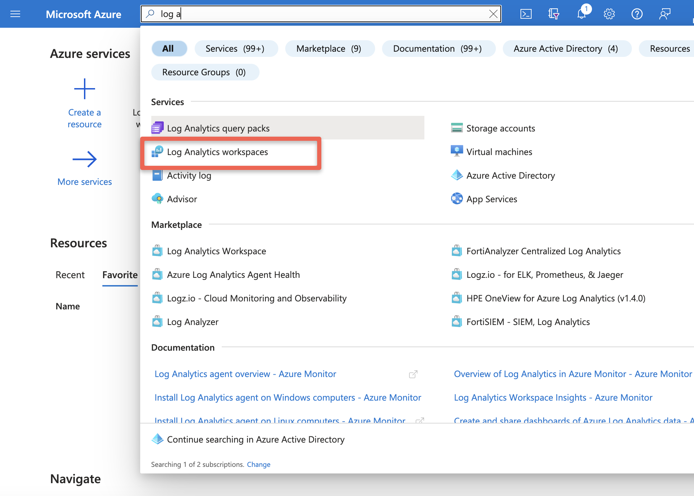
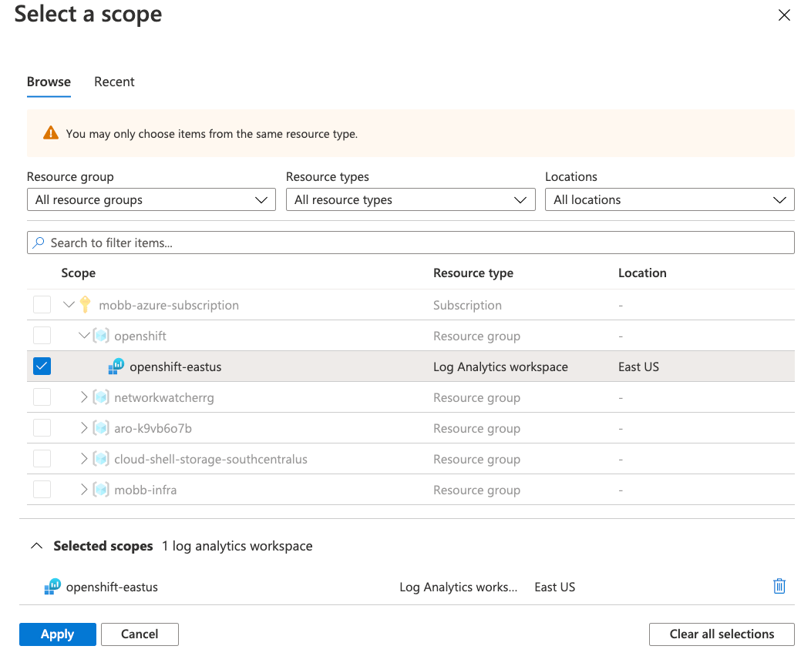
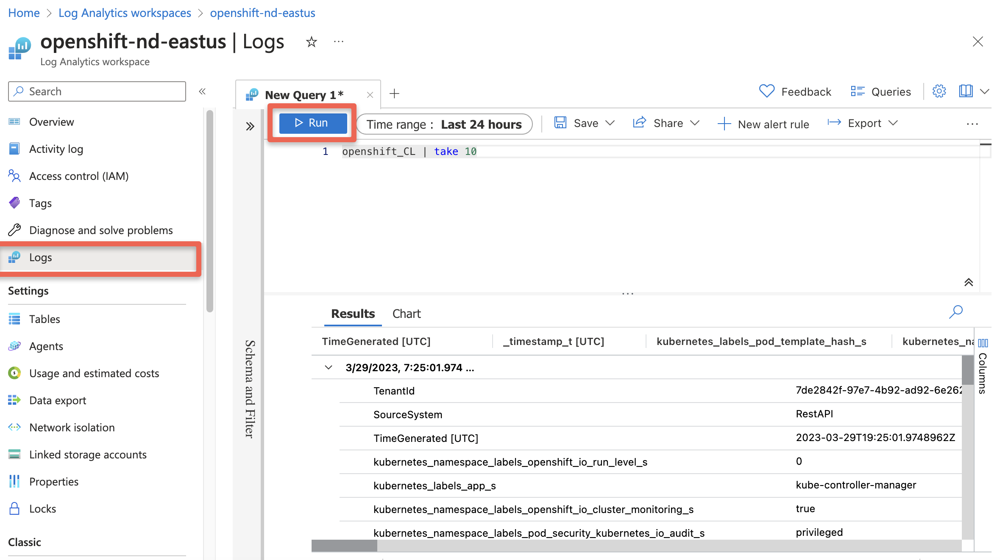

> **NOTE**: These instructions are now only necessary for clusters on verions less than or equal to 4.12. The OpenShift Cluster Logging Operator supports a simplified configuration with Azure Monitor as of verison 5.9, which is available on clusters of version 4.13 or greater. Ideally, clusters should be ugpraded to keep them in support, so that's a good first step to consider. If you ultimately still need the older procedure, see the [setup document here](/experts/aro/clf-to-azure/).

In Azure Red Hat OpenShift (ARO) you can fairly easily set up cluster logging to an in-cluster Elasticsearch using the OpenShift Elasticsearch Operator
and the Cluster Logging Operator, but what if you want to use the Azure native Log Analytics service?

There's a number of ways to do this, for example installing agents onto the VMs (in this case, it would be a DaemonSet with hostvar mounts) but that isn't ideal in a managed system like ARO.

Fluentd is the log collection and forwarding tool used by OpenShift, however it does not have native support for Azure Log Analytics. However Fluent-bit which supports many of the same protocols as Fluentd does have [native support](https://docs.fluentbit.io/manual/pipeline/outputs/azure) for Azure Log Analytics.

Armed with this knowledge we can create a fluent-bit service on the cluster to accept logs from fluentd and forward them to Azure Log Analytics.

## Prepare your ARO cluster

1. [Deploy](/experts/quickstart-aro) an ARO cluster

1. Set some environment variables

   ```bash
   export NAMESPACE=aro-clf-am
   export AZR_RESOURCE_LOCATION=eastus
   export AZR_RESOURCE_GROUP=openshift
   # this value must be unique
   export AZR_LOG_APP_NAME=$AZR_RESOURCE_GROUP-$AZR_RESOURCE_LOCATION
   ```

## Set up ARO Monitor workspace

1. Add the Azure CLI log extensions

   ```bash
   az extension add --name log-analytics
   ```

1. Create resource group

   > **If you plan to reuse the same group as your cluster skip this step**

   ```bash
   az group create -n $AZR_RESOURCE_GROUP -l $AZR_RESOURCE_LOCATION
   ```

1. Create workspace

   ```bash
   az monitor log-analytics workspace create \
    -g $AZR_RESOURCE_GROUP -n $AZR_LOG_APP_NAME \
    -l $AZR_RESOURCE_LOCATION
   ```

1. Create a secret for your Azure workspace

   ```bash
   WORKSPACE_ID=$(az monitor log-analytics workspace show \
    -g $AZR_RESOURCE_GROUP -n $AZR_LOG_APP_NAME \
    --query customerId -o tsv)
   SHARED_KEY=$(az monitor log-analytics workspace get-shared-keys \
    -g $AZR_RESOURCE_GROUP -n $AZR_LOG_APP_NAME \
    --query primarySharedKey -o tsv)
   ```

## Configure OpenShift

1. Create a Project to run the log forwarding in

   ```bash
   oc new-project $NAMESPACE
   ```

1. Create namespaces for logging operators

   ```bash
   kubectl create ns openshift-logging
   kubectl create ns openshift-operators-redhat
   ```

1. Add the MOBB chart repository to Helm

   ```bash
   helm repo add mobb https://rh-mobb.github.io/helm-charts/
   ```

1. Update your Helm repositories

   ```bash
   helm repo update
   ```

1. Deploy the OpenShift Elasticsearch Operator and the Red Hat OpenShift Logging Operator

   **> Note: You can skip this if you already have them installed, or install them via the OpenShift Console.**

   ```bash
   helm upgrade -n $NAMESPACE clf-operators \
    mobb/operatorhub --install \
    --values https://raw.githubusercontent.com/rh-mobb/helm-charts/main/charts/aro-clf-am/files/operators.yaml
   ```

1. Configure cluster logging forwarder

   ```bash
   helm upgrade -n $NAMESPACE clf \
    mobb/aro-clf-am --install \
    --set "azure.workspaceId=$WORKSPACE_ID" --set "azure.sharedKey=$SHARED_KEY"
   ```

## Check for logs in Azure

> Wait 5 to 15 minutes

1. Query our new Workspace

   ```bash
   az monitor log-analytics query -w $WORKSPACE_ID  \
      --analytics-query "openshift_CL | take 10" --output tsv
   ```

  or

1. Log into Azure[Azure Log Insights](https://portal.azure.com/#blade/Microsoft_Azure_Monitoring/AzureMonitoringBrowseBlade/logs) or you can login into portal and search for Log Analytics workspace

   

1. Select your workspace

   

1. Run the Query

   ```
   openshift_CL
      | take 10
   ```

   
