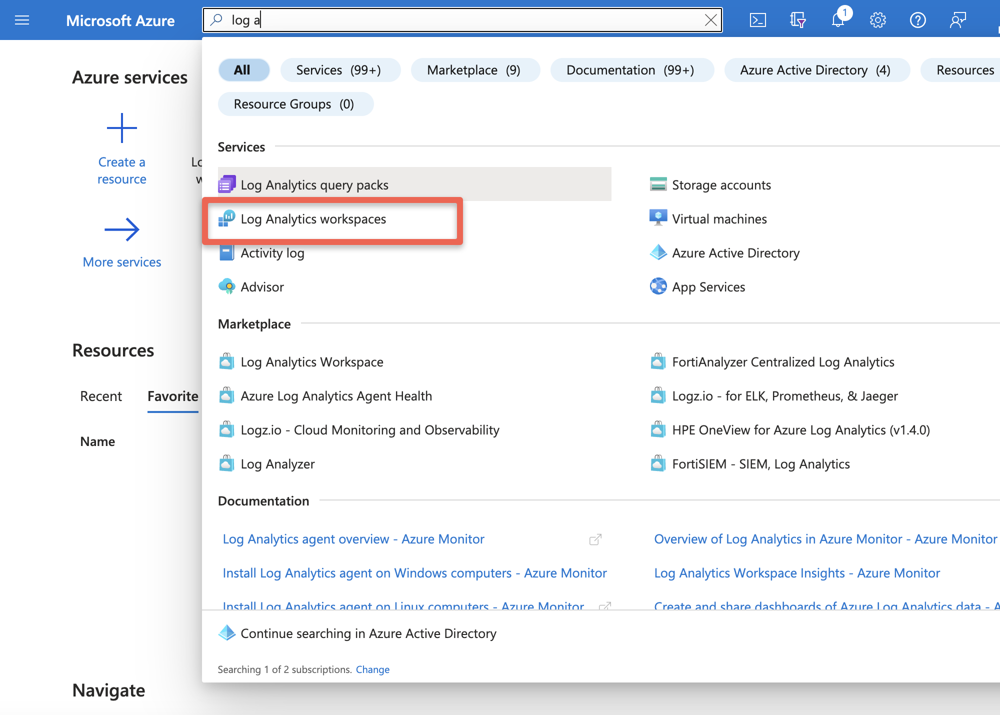

> **NOTE**: OpenShift Logging 5.9 supports native forwarding to Azure Monitor and Azure Log Analytics, which is available on clusters running OpenShift 4.13 or higher. For clusters running OpenShift 4.12 or earlier, see the [legacy setup document here](/experts/aro/clf-to-azure-old/) for help with configuration.

If you're running Azure Red Hat OpenShift (ARO), you may want to be able to view and query the logs the platform and your workloads generate in Azure Monitor. With the release of the Cluster Logging Operator version 5.9, this can be done in a single step with some YAML configuration.

## Prepare your ARO cluster

1. [Deploy](/experts/quickstart-aro) an ARO cluster

1. Follow the OpenShift documentation for [installing the OpenShift Logging Operator](https://docs.openshift.com/container-platform/4.14/logging/cluster-logging-deploying.html) for your version of OpenShift. These instructions cover the various methods (CLI, Web Console) of installation.

1. Set some environment variables

   ```bash
   export AZR_RESOURCE_LOCATION=eastus
   export AZR_RESOURCE_GROUP=openshift
   # this value must be unique
   export AZR_LOG_APP_NAME=$AZR_RESOURCE_GROUP-$AZR_RESOURCE_LOCATION
   ```

## Set up ARO Monitor workspace

1. Add the Azure CLI log extensions

   ```bash
   az extension add --name log-analytics
   ```

1. Create resource group

   > **If you plan to reuse the same group as your cluster skip this step**

   ```bash
   az group create -n $AZR_RESOURCE_GROUP -l $AZR_RESOURCE_LOCATION
   ```

1. Create workspace 

   ```bash
   az monitor log-analytics workspace create \
    -g $AZR_RESOURCE_GROUP -n $AZR_LOG_APP_NAME \
    -l $AZR_RESOURCE_LOCATION
   ```

1. Create a secret for your Azure workspace

   ```bash
   WORKSPACE_ID=$(az monitor log-analytics workspace show \
    -g $AZR_RESOURCE_GROUP -n $AZR_LOG_APP_NAME \
    --query customerId -o tsv)
   SHARED_KEY=$(az monitor log-analytics workspace get-shared-keys \
    -g $AZR_RESOURCE_GROUP -n $AZR_LOG_APP_NAME \
    --query primarySharedKey -o tsv)
   ```

## Configure OpenShift

1. Create a `Secret` to hold the shared key:

   ```bash
   oc -n openshift-logging create secret generic azure-monitor-shared-key --from-literal=shared_key=${SHARED_KEY}
   ```

1. Create a `ClusterLogging` resource. Because logs aren't staying on the cluster with a local store, this is quite simple:

   ```bash
   cat <<EOF | oc apply -f -
   apiVersion: logging.openshift.io/v1
   kind: ClusterLogging
   metadata:
     name: instance
     namespace: openshift-logging
   spec:
     collection:
       type: vector
       vector: {}
   EOF
   ```

1. Create a `ClusterLogForwarder` resource. This will contain the configuration to forward to Azure Monitor:

   ```bash
   cat <<EOF | oc apply -f -
   apiVersion: logging.openshift.io/v1
   kind: ClusterLogForwarder
   metadata:
     name: instance
     namespace: openshift-logging
   spec:
     outputs:
     - name: azure-monitor-app
       type: azureMonitor
       azureMonitor:
         customerId: $WORKSPACE_ID
         logType: aro_application_logs
       secret:
         name: azure-monitor-shared-key
     - name: azure-monitor-infra
       type: azureMonitor
       azureMonitor:
         customerId: $WORKSPACE_ID
         logType: aro_infrastructure_logs
       secret:
         name: azure-monitor-shared-key
     pipelines:
     - name: app-pipeline
       inputRefs:
       - application
       outputRefs:
       - azure-monitor-app
     - name: infra-pipeline
       inputRefs:
       - infrastructure
       outputRefs:
       - azure-monitor-infra
   EOF
   ```
   
See the [logging pipeline documentation](https://docs.openshift.com/container-platform/4.14/logging/log_collection_forwarding/configuring-log-forwarding.html#cluster-logging-collector-log-forwarding-about_configuring-log-forwarding) for the specifics of how to add `audit` logs to this configuration.

## Check for logs in Azure

> Wait 5 to 15 minutes

1. Query our new Workspace

   ```bash
   az monitor log-analytics query -w $WORKSPACE_ID  \
      --analytics-query "aro_infrastructure_logs_CL | take 10" --output tsv
   ```

  or

1. Log into Azure[Azure Log Insights](https://portal.azure.com/#blade/Microsoft_Azure_Monitoring/AzureMonitoringBrowseBlade/logs) or you can login into portal and search for Log Analytics workspace

   

1. Select your workspace

   

1. Run the Query

   ```
   aro_infrastructure_logs_CL
      | take 10
   ```

   
