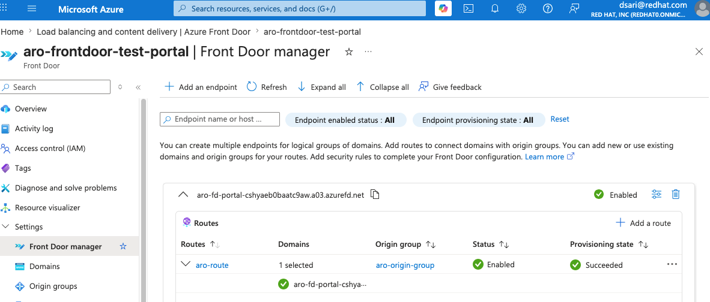

Azure Front Door Premium can expose applications running on an Azure Red Hat OpenShift (ARO) cluster while keeping the cluster ingress private. Azure Front Door receives public client traffic at the edge and reaches the ARO internal ingress load balancer through Azure Private Link.

This guide configures the following traffic flow:

```text
Internet client
    |
    v
Azure Front Door Premium
    |
    v
Azure Front Door managed private endpoint
    |
    v
Azure Private Link Service
    |
    v
ARO internal ingress load balancer
    |
    v
OpenShift ingress router
    |
    v
Application Route
```


Azure Front Door must send a `Host` header that matches an OpenShift Route. When the ARO ingress load balancer IP is used as the origin host name, set the Azure Front Door **origin host header** to the application Route hostname.

If the origin host header is left as the load balancer IP, the OpenShift router cannot match the request to a Route and returns `503 Application is not available`. The same requirement applies to Azure Front Door health probes.


## Scope and Design Considerations

This guide uses one application hostname and one Azure Front Door origin configuration.

A static origin host header is appropriate when an origin group represents a specific application hostname. If you need to publish multiple OpenShift Route hostnames, use one of the following patterns:

* Create a separate Azure Front Door origin or origin group for each application hostname, with the matching origin host header.
* Place a host-aware reverse proxy between Azure Front Door and the ARO ingress router.
* Disable health probes for a single-origin group only when the loss of origin-health monitoring is acceptable.

Do not configure one shared IP origin with a static host header and expect it to transparently route arbitrary application hostnames. Azure Front Door replaces the backend `Host` header with the configured origin host header.

## Prerequisites

* A private ARO cluster with private ingress
* Azure CLI with the `cdn` extension
* OpenShift CLI (`oc`)
* Access to the private ARO API
* Permission to create:
  * A subnet in the ARO virtual network
  * An Azure Private Link Service
  * An Azure Front Door Premium profile
  * DNS records for the application domain
* A DNS domain that you control
* An unused subnet CIDR within the ARO virtual network

Install or update the Azure CLI extension:

```bash
az extension add --name cdn --upgrade
```

Log in to Azure and OpenShift before continuing:

```bash
az login
oc whoami
```

Use the same terminal session throughout this guide because later commands reference previously defined environment variables.

## Set Environment Variables

Set the ARO cluster, Azure resource group, application hostname, and Azure Front Door names:

```bash
export ARO_CLUSTER="<aro-cluster-name>"
export ARO_RESOURCE_GROUP="<aro-resource-group>"
export APP_FQDN="<application-hostname-you-control>"

export AFD_PROFILE="<front-door-profile-name>"
export AFD_ENDPOINT="<globally-unique-front-door-endpoint-name>"
export AFD_ORIGIN_GROUP="aro-origin-group"
export AFD_ORIGIN="aro-ingress"
export AFD_ROUTE="aro-route"

export PLS_NAME="${ARO_CLUSTER}-frontdoor-pls"
export PLS_SUBNET_NAME="frontdoor-pls-subnet"
export PLS_SUBNET_PREFIX="<unused-subnet-cidr>"
```

Example:

```bash
export APP_FQDN="hello.apps.example.com"
export PLS_SUBNET_PREFIX="10.0.8.0/27"
```

Retrieve cluster and network information:

```bash
export LOCATION=$(az aro show \
  --resource-group "$ARO_RESOURCE_GROUP" \
  --name "$ARO_CLUSTER" \
  --query location \
  -o tsv)

export ARO_INFRA_RESOURCE_GROUP=$(az aro show \
  --resource-group "$ARO_RESOURCE_GROUP" \
  --name "$ARO_CLUSTER" \
  --query clusterProfile.resourceGroupId \
  -o tsv | awk -F/ '{print $NF}')

export WORKER_SUBNET_ID=$(az aro show \
  --resource-group "$ARO_RESOURCE_GROUP" \
  --name "$ARO_CLUSTER" \
  --query workerProfiles[0].subnetId \
  -o tsv)

export VNET_RESOURCE_GROUP=$(echo "$WORKER_SUBNET_ID" | awk -F/ '{print $5}')
export VNET_NAME=$(echo "$WORKER_SUBNET_ID" | awk -F/ '{print $9}')
```

Confirm that both the API and ingress are private:

```bash
az aro show \
  --resource-group "$ARO_RESOURCE_GROUP" \
  --name "$ARO_CLUSTER" \
  --query '{
    apiVisibility:apiserverProfile.visibility,
    ingressVisibility:ingressProfiles[0].visibility,
    infrastructureResourceGroup:clusterProfile.resourceGroupId
  }' \
  -o yaml
```

Expected output:

```yaml
apiVisibility: Private
ingressVisibility: Private
```

## Deploy a Test Application

Create a project and deploy a small HTTP application:

```bash
oc new-project afd-test

oc create deployment hello \
  --image=quay.io/openshift/origin-hello-openshift:latest

oc expose deployment hello --port=8080

oc expose service hello \
  --hostname="$APP_FQDN"
```

Wait for the deployment:

```bash
oc rollout status deployment/hello -n afd-test
```

Verify the Route:

```bash
oc get route hello -n afd-test
```

Save the Route hostname:

```bash
export APP_ROUTE=$(oc get route hello \
  --namespace afd-test \
  --output jsonpath='{.spec.host}')

echo "$APP_ROUTE"
```

The value of `APP_ROUTE` must match `APP_FQDN`.

## Identify the ARO Ingress Load Balancer

Find the internal load balancer frontend associated with the worker subnet:

```bash
for LB in $(az network lb list \
  --resource-group "$ARO_INFRA_RESOURCE_GROUP" \
  --query '[].name' \
  -o tsv); do

  az network lb frontend-ip list \
    --resource-group "$ARO_INFRA_RESOURCE_GROUP" \
    --lb-name "$LB" \
    --query "[?subnet.id=='${WORKER_SUBNET_ID}'].{
      loadBalancer:'$LB',
      frontendName:name,
      privateIPAddress:privateIPAddress,
      subnet:subnet.id
    }" \
    -o table
done
```

Set the load balancer and frontend configuration names from the output:

```bash
export INGRESS_LB="<internal-load-balancer-name>"
export INGRESS_FRONTEND_CONFIG="<frontend-ip-configuration-name>"
```

Retrieve the ingress load balancer IP and frontend configuration ID:

```bash
export INGRESS_LB_IP=$(az network lb frontend-ip show \
  --resource-group "$ARO_INFRA_RESOURCE_GROUP" \
  --lb-name "$INGRESS_LB" \
  --name "$INGRESS_FRONTEND_CONFIG" \
  --query privateIPAddress \
  -o tsv)

export INGRESS_FRONTEND_CONFIG_ID=$(az network lb frontend-ip show \
  --resource-group "$ARO_INFRA_RESOURCE_GROUP" \
  --lb-name "$INGRESS_LB" \
  --name "$INGRESS_FRONTEND_CONFIG" \
  --query id \
  -o tsv)

echo "$INGRESS_LB_IP"
```

## Validate OpenShift Host-Based Routing

From a system that can reach the private ingress load balancer, request the load balancer IP without a matching Route hostname:

```bash
curl -sS -D - -o /dev/null \
  "http://${INGRESS_LB_IP}/"
```

Expected result:

```text
HTTP/1.0 503 Service Unavailable
```

Repeat the request with the valid OpenShift Route hostname:

```bash
curl -sS -D - \
  -H "Host: ${APP_ROUTE}" \
  "http://${INGRESS_LB_IP}/"
```

Expected result:

```text
HTTP/1.1 200 OK

Hello OpenShift!
```

This establishes the expected router behavior:

```text
Ingress IP with IP Host header       -> 503
Ingress IP with matching Route Host  -> 200
```

## Create a Dedicated Private Link Service Subnet

List the virtual network address space and existing subnets:

```bash
az network vnet show \
  --resource-group "$VNET_RESOURCE_GROUP" \
  --name "$VNET_NAME" \
  --query '{
    addressSpace:addressSpace.addressPrefixes,
    subnets:subnets[].{
      name:name,
      prefix:addressPrefix,
      prefixes:addressPrefixes
    }
  }' \
  -o yaml
```

Confirm that `PLS_SUBNET_PREFIX` is unused and falls within the virtual network address space.

Create a dedicated subnet for the Private Link Service:

```bash
az network vnet subnet create \
  --resource-group "$VNET_RESOURCE_GROUP" \
  --vnet-name "$VNET_NAME" \
  --name "$PLS_SUBNET_NAME" \
  --address-prefixes "$PLS_SUBNET_PREFIX" \
  --disable-private-link-service-network-policies true
```

Verify the subnet:

```bash
az network vnet subnet show \
  --resource-group "$VNET_RESOURCE_GROUP" \
  --vnet-name "$VNET_NAME" \
  --name "$PLS_SUBNET_NAME" \
  --query '{
    prefix:addressPrefix,
    privateLinkServiceNetworkPolicies:privateLinkServiceNetworkPolicies
  }' \
  -o yaml
```

Expected output:

```yaml
privateLinkServiceNetworkPolicies: Disabled
```


Use a dedicated subnet for the Private Link Service rather than changing network policies on the ARO control-plane or worker subnet.


Retrieve the subnet resource ID:

```bash
export PLS_SUBNET_ID=$(az network vnet subnet show \
  --resource-group "$VNET_RESOURCE_GROUP" \
  --vnet-name "$VNET_NAME" \
  --name "$PLS_SUBNET_NAME" \
  --query id \
  -o tsv)
```

## Create the Azure Private Link Service

Create a Private Link Service attached to the ARO ingress load balancer frontend:

```bash
az network private-link-service create \
  --resource-group "$ARO_RESOURCE_GROUP" \
  --name "$PLS_NAME" \
  --location "$LOCATION" \
  --lb-frontend-ip-configs "$INGRESS_FRONTEND_CONFIG_ID" \
  --subnet "$PLS_SUBNET_ID" \
  --private-ip-address-version IPv4 \
  --private-ip-allocation-method Dynamic
```

Retrieve its resource ID:

```bash
export PLS_ID=$(az network private-link-service show \
  --resource-group "$ARO_RESOURCE_GROUP" \
  --name "$PLS_NAME" \
  --query id \
  -o tsv)
```

Verify the Private Link Service:

```bash
az network private-link-service show \
  --resource-group "$ARO_RESOURCE_GROUP" \
  --name "$PLS_NAME" \
  --query '{
    provisioningState:provisioningState,
    frontendConfigurations:loadBalancerFrontendIpConfigurations[].id,
    natConfigurations:ipConfigurations[].{
      name:name,
      privateIPAddress:privateIPAddress,
      allocationMethod:privateIPAllocationMethod,
      subnet:subnet.id
    }
  }' \
  -o yaml
```

## Create Azure Front Door Premium in the Azure Portal

This guide uses the Azure Portal to create the Azure Front Door resources. In validation, the equivalent Azure CLI resources were accepted by the control plane but remained at `deploymentStatus: NotStarted`, and the endpoint returned `404 CONFIG_NOCACHE`. Creating the Front Door profile and route through the Portal successfully published the configuration to the Front Door data plane.

The Portal workflow follows this order:

```text
Front Door profile
  -> Endpoint
      -> Route
          -> Origin group
              -> Origin
```

You complete the innermost resource first, then return through each parent form:

```text
Add origin
  -> Add origin group
      -> Add route
          -> Create Front Door profile
```

### Create the Front Door Profile

1. In the Azure Portal, search for **Front Door and CDN profiles**.

2. Select **Create**.

3. Select **Azure Front Door**.

4. Select **Custom create**.

5. Configure the profile:

   ```text
   Subscription:     <ARO subscription>
   Resource group:   <ARO resource group>
   Name:             <Front Door profile name>
   Tier:             Azure Front Door Premium
   ```

   Azure Front Door Premium is required for Private Link origins.

6. Do not select **Review + Create** yet. Continue to the endpoint configuration on the same profile creation page.

### Add an Endpoint

1. In the **Endpoint** tab or section, select **Add an endpoint**.

2. Configure the endpoint:

   ```text
   Endpoint name:  <globally unique endpoint name>
   Status:         Enabled
   ```

3. Add the endpoint.

The new endpoint appears within the Front Door profile creation page.

### Add a Route

1. Within the endpoint that you just created, select **Add a route**.

2. Configure the route:

   ```text
   Route name:               aro-route
   Domains:                  <default azurefd.net endpoint>
   Patterns to match:        /*
   Accepted protocols:       HTTP and HTTPS
   Redirect HTTP to HTTPS:   Disabled
   Forwarding protocol:      HTTP only
   Caching:                  Disabled
   Link to default domain:   Enabled
   Status:                   Enabled
   ```

3. Do not add the route yet. From within the route form, select **Add a new origin group**.

### Add an Origin Group

1. In the origin group form, configure:

   ```text
   Name:                         aro-origin-group
   Session affinity:             Disabled
   Health probes:                Enabled
   Path:                         /
   Protocol:                     HTTP
   Request type:                 HEAD
   Interval:                     30 seconds
   Sample size:                  4
   Successful samples required:  3
   Additional latency:           50 milliseconds
   ```

2. Do not add the origin group yet. From within the origin group form, select **Add an origin**.

### Add the ARO Origin

Configure the origin:

```text
Name:                 aro-ingress
Origin type:          Custom
Host name:            <ARO ingress load balancer private IP>
Origin host header:   <OpenShift application Route hostname>
HTTP port:            80
HTTPS port:           443
Priority:             1
Weight:               1000
Status:               Enabled
Enable Private Link:  Yes
Private Link region:  <ARO region>
Private Link target:  <Private Link Service created earlier>
Target subresource:   Leave blank
Request message:      Azure Front Door access to private ARO ingress
```

The two most important values are:

```text
Host name:
<ARO ingress load balancer private IP>

Origin host header:
<OpenShift application Route hostname>
```

For example:

```text
Host name:
10.0.3.254

Origin host header:
hello-afd-test.apps.example.westus2.aroapp.io
```

The origin host header must match an existing OpenShift Route. Do not set it to the load balancer IP. Otherwise, the OpenShift ingress router cannot match the request or health probe to an application Route and returns `503 Application is not available`.

1. Select **Add** to finish the origin.

You are returned to the origin group form, where the new origin should now be listed.

### Finish the Origin Group

1. Review the health-probe settings and confirm that the new `aro-ingress` origin is listed.
2. Select **Add** to finish the origin group.

You are returned to the route form, where `aro-origin-group` should now be selected as the route’s origin group.

### Finish the Route

1. Review the route configuration.

2. Confirm:

   ```text
   Domain:                  Default azurefd.net endpoint
   Pattern:                 /*
   Accepted protocols:      HTTP and HTTPS
   Forwarding protocol:     HTTP only
   Origin group:            aro-origin-group
   Link to default domain:  Enabled
   ```

3. Select **Add** to finish the route.

You are returned to the Front Door profile creation page. The endpoint should now show the nested route and origin group configuration.

### Review and Create the Front Door Profile

1. Review the profile and endpoint configuration.

2. Confirm that the hierarchy resembles:

   ```text
   <Front Door profile>
     -> <endpoint>
         -> aro-route
             -> aro-origin-group
                 -> aro-ingress
   ```

3. Select **Review + create**, if shown.

4. Select **Create** to deploy the Front Door profile.

After deployment, approve the new managed private endpoint request on the Azure Private Link Service before testing the Front Door endpoint.

<br />


<br />

### Approve the Azure Front Door Private Endpoint Connection

After the Front Door profile is created, Azure Front Door creates a managed private endpoint request against the Private Link Service.

1. In the Azure Portal, search for **Private Link services**.

2. Open the Private Link Service created earlier.

3. Select **Private endpoint connections**.

4. Locate the new connection with status **Pending**.

5. Select the pending connection.

6. Select **Approve**.

7. Enter an optional approval message, such as:

   ```text
   Approved for Azure Front Door
   ```

8. Confirm that the connection status changes to **Approved**.

A new Azure Front Door profile creates a new managed private endpoint request, even when it uses an existing Private Link Service. Approve each new request before testing the Front Door endpoint.

Allow several minutes for the approved private connection and Front Door configuration to propagate.

## Validate the Default Front Door Endpoint

Copy the default endpoint hostname from:

```text
Azure Front Door profile
  -> Front Door manager
      -> Endpoint
```

Set it as an environment variable:

```bash
export AFD_ENDPOINT_HOSTNAME="<endpoint-name>.azurefd.net"
```

Test the endpoint:

```bash
curl -sS \
  -w '\nHTTP status: %{http_code}\n' \
  "http://${AFD_ENDPOINT_HOSTNAME}/"
```

Expected output:

```text
Hello OpenShift!

HTTP status: 200
```

Run repeated tests:

```bash
for i in {1..6}; do
  date
  curl -sS -o /dev/null \
    -w 'HTTP %{http_code}\n' \
    "http://${AFD_ENDPOINT_HOSTNAME}/"
  sleep 30
done
```

All requests should return `HTTP 200`.

The successful request flow is:

```text
Client Host:
<endpoint>.azurefd.net

Azure Front Door origin host header:
<application-route-hostname>

ARO ingress router:
Matches the application Route and returns 200
```

In Azure Portal, check the **Origin Health Percentage** metric for the Front Door profile after the configuration has propagated.

## Configure a Custom Domain

Create an Azure Front Door custom-domain object:

```bash
export AFD_CUSTOM_DOMAIN_NAME=$(echo "$APP_FQDN" | tr '.' '-')

az afd custom-domain create \
  --resource-group "$ARO_RESOURCE_GROUP" \
  --profile-name "$AFD_PROFILE" \
  --custom-domain-name "$AFD_CUSTOM_DOMAIN_NAME" \
  --host-name "$APP_FQDN" \
  --certificate-type ManagedCertificate \
  --minimum-tls-version TLS12
```

Retrieve the DNS validation token:

```bash
export AFD_VALIDATION_TOKEN=$(az afd custom-domain show \
  --resource-group "$ARO_RESOURCE_GROUP" \
  --profile-name "$AFD_PROFILE" \
  --custom-domain-name "$AFD_CUSTOM_DOMAIN_NAME" \
  --query validationProperties.validationToken \
  -o tsv)
```

Create the required `_dnsauth` TXT record in the authoritative DNS zone for `APP_FQDN`.

The exact command depends on the DNS provider. For Azure DNS, set the DNS zone and relative record name:

```bash
export DNS_RESOURCE_GROUP="<dns-resource-group>"
export DNS_ZONE="<dns-zone>"
export DNS_RECORD_NAME="<relative-application-record-name>"
```

For example, if `APP_FQDN` is `hello.apps.example.com` and the DNS zone is `example.com`, the relative record name is `hello.apps`.

Create the validation record:

```bash
az network dns record-set txt add-record \
  --resource-group "$DNS_RESOURCE_GROUP" \
  --zone-name "$DNS_ZONE" \
  --record-set-name "_dnsauth.${DNS_RECORD_NAME}" \
  --value "$AFD_VALIDATION_TOKEN"
```

Check the validation state:

```bash
az afd custom-domain show \
  --resource-group "$ARO_RESOURCE_GROUP" \
  --profile-name "$AFD_PROFILE" \
  --custom-domain-name "$AFD_CUSTOM_DOMAIN_NAME" \
  --query domainValidationState \
  -o tsv
```

After the domain is validated, associate it with the existing route in the Portal:

```text
Azure Front Door profile
  -> Front Door manager
      -> Endpoint
          -> aro-route
              -> Domains
```

Select the validated custom domain, retain the default Front Door domain while testing, and save the route.

Create a CNAME record that points the application hostname to the Azure Front Door endpoint:

```bash
az network dns record-set cname set-record \
  --resource-group "$DNS_RESOURCE_GROUP" \
  --zone-name "$DNS_ZONE" \
  --record-set-name "$DNS_RECORD_NAME" \
  --cname "$AFD_ENDPOINT_HOSTNAME"
```

Allow time for DNS and Front Door certificate provisioning to complete.

## Validate the Configuration

Confirm the OpenShift Route:

```bash
oc get route hello -n afd-test
```

Confirm the Azure Front Door origin:

```bash
az afd origin show \
  --resource-group "$ARO_RESOURCE_GROUP" \
  --profile-name "$AFD_PROFILE" \
  --origin-group-name "$AFD_ORIGIN_GROUP" \
  --origin-name "$AFD_ORIGIN" \
  --query '{
    hostName:hostName,
    originHostHeader:originHostHeader,
    provisioningState:provisioningState
  }' \
  -o yaml
```

Test the custom application hostname:

```bash
curl -sS \
  -w '\nHTTP status: %{http_code}\n' \
  "https://${APP_FQDN}/"
```

Expected output:

```text
Hello OpenShift!

HTTP status: 200
```

Run repeated tests:

```bash
for i in {1..6}; do
  date
  curl -sS -o /dev/null \
    -w 'HTTP %{http_code}\n' \
    "https://${APP_FQDN}/"
  sleep 30
done
```

All requests should return `HTTP 200`.

In Azure Portal, check the **Origin Health Percentage** metric for the Front Door profile. A healthy origin should report successful probes after the configuration has propagated.

## Troubleshooting

### Azure Front Door returns `404 CONFIG_NOCACHE`

A response similar to the following usually means Front Door did not match an active frontend route:

```text
HTTP/1.1 404 Not Found
X-Cache: CONFIG_NOCACHE
```

Verify:

* The route is enabled.
* `linkToDefaultDomain` is enabled when testing the default `azurefd.net` hostname.
* The route pattern includes `/*`.
* The incoming hostname is associated with the route.
* The Front Door configuration has had time to propagate.

Do not override the request `Host` header with an unregistered custom domain when testing the default `azurefd.net` endpoint. Front Door performs frontend route matching before it contacts the origin.

### OpenShift returns `503 Application is not available`

This response proves that Front Door reached the OpenShift ingress router, but the router could not match the request to a Route.

Compare the OpenShift Route hostname and Front Door origin host header:

```bash
oc get route hello \
  --namespace afd-test \
  --output jsonpath='{.spec.host}{"\n"}'

az afd origin show \
  --resource-group "$ARO_RESOURCE_GROUP" \
  --profile-name "$AFD_PROFILE" \
  --origin-group-name "$AFD_ORIGIN_GROUP" \
  --origin-name "$AFD_ORIGIN" \
  --query originHostHeader \
  -o tsv
```

These values must match exactly.

Validate the Route directly:

```bash
curl -sS -D - \
  -H "Host: ${APP_ROUTE}" \
  "http://${INGRESS_LB_IP}/"
```

### Health probes return `503`

Ensure that:

* The origin host header is set to the application Route hostname.
* The probe path exists.
* The application returns `200 OK` for the selected probe method.
* `HEAD` is replaced with `GET` when the application does not support `HEAD`.

Test `HEAD` directly:

```bash
curl -sS -I \
  -H "Host: ${APP_ROUTE}" \
  "http://${INGRESS_LB_IP}/"
```

Only `200 OK` is considered a successful Azure Front Door health probe response.

### Private Link connection is not working

Check the Private Link Service connection:

```bash
az network private-link-service show \
  --resource-group "$ARO_RESOURCE_GROUP" \
  --name "$PLS_NAME" \
  --query 'privateEndpointConnections[].{
    status:privateLinkServiceConnectionState.status,
    description:privateLinkServiceConnectionState.description
  }' \
  -o yaml
```

The status must be `Approved`.

A new Azure Front Door profile creates a new managed private endpoint request, even when it uses the same Private Link Service. Approve each new request.

### Direct access to the ingress IP times out

The ingress load balancer is private. Confirm that the system running `curl` still has a valid network path into the ARO virtual network, such as VPN, ExpressRoute, jump host access, or an active SSH tunnel.

A timeout from the client does not necessarily mean the OpenShift Route is unavailable.

## Clean Up

Delete the Azure Front Door profile through the Portal, or use Azure CLI:

```bash
az afd profile delete \
  --resource-group "$ARO_RESOURCE_GROUP" \
  --profile-name "$AFD_PROFILE" \
  --yes
```

Delete the Private Link Service:

```bash
az network private-link-service delete \
  --resource-group "$ARO_RESOURCE_GROUP" \
  --name "$PLS_NAME"
```

Delete the dedicated subnet:

```bash
az network vnet subnet delete \
  --resource-group "$VNET_RESOURCE_GROUP" \
  --vnet-name "$VNET_NAME" \
  --name "$PLS_SUBNET_NAME"
```

Delete the test project:

```bash
oc delete project afd-test
```

Delete any DNS records created for this guide after they are no longer required.

## Additional Resources

* [Secure your origin with Private Link in Azure Front Door Premium](https://learn.microsoft.com/en-us/azure/frontdoor/private-link)
* [Origins and origin groups in Azure Front Door](https://learn.microsoft.com/en-us/azure/frontdoor/origin)
* [Azure Front Door health probes](https://learn.microsoft.com/en-us/azure/frontdoor/health-probes)
* [Create an Azure Private Link Service using Azure CLI](https://learn.microsoft.com/en-us/azure/private-link/create-private-link-service-cli)
* [Azure Red Hat OpenShift documentation](https://learn.microsoft.com/en-us/azure/openshift/)