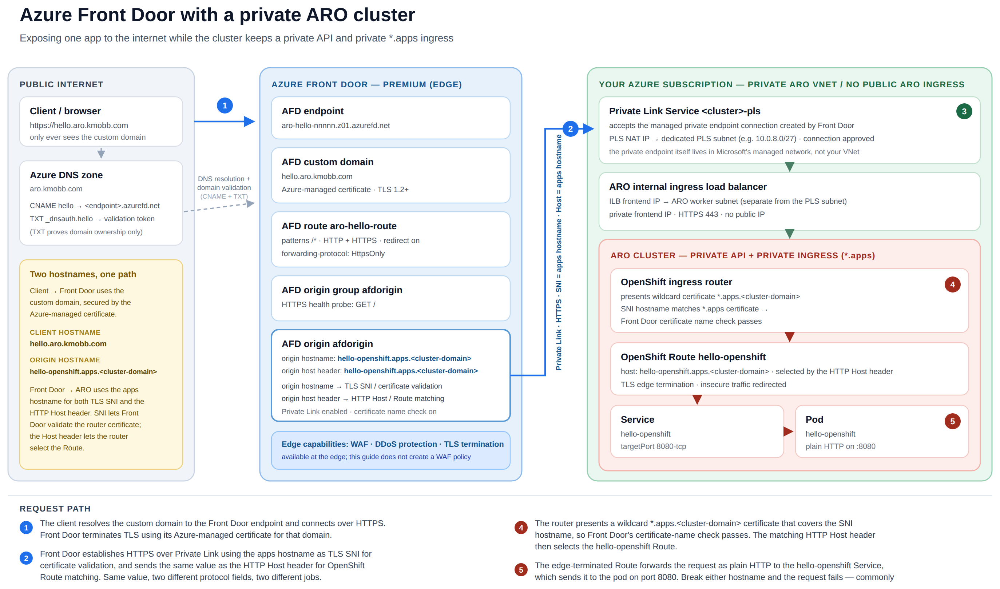

Securely expose an Internet facing application on a private ARO Cluster using Azure Front Door.

When you create a cluster on ARO you have several options in making the cluster public or private.  With a public cluster you are allowing Internet traffic to the api and *.apps endpoints.  With a private cluster you can make either or both the api and .apps endpoints private.

How can you allow Internet access to an application running on your private cluster where the .apps endpoint is private?  This document will guide you through using Azure Front Door to expose your applications to the Internet.  There are several advantages of this approach, namely your cluster and all the resources in your Azure account can remain private, providing you an extra layer of security.  Azure Front Door operates at the edge so we are controlling traffic before it even gets into your Azure account.  On top of that, Azure Front Door also offers WAF and DDoS protection, certificate management and SSL offloading just to name a few benefits.

This guide keeps Azure Front Door’s origin hostname and origin host header aligned with the OpenShift Route hostname under the cluster apps domain. On the HTTPS connection from Front Door to the private ARO ingress, the origin hostname is used for TLS SNI and certificate name verification against the OpenShift router’s wildcard certificate. Front Door also sends the same hostname in the HTTP Host header, which allows the OpenShift router to select the matching Route.

## Architecture Diagram

The following diagram shows the end-to-end request path from a public client through Azure Front Door Premium and Private Link to the private ARO ingress. It also highlights how the OpenShift apps hostname is used for both TLS SNI and the HTTP Host header, while serving different purposes for certificate validation and Route matching.


<br />

## Prerequisites

* az cli
* oc cli
* jq cli
* a custom domain
* a DNS zone that you can easily modify

> The available Azure Front Door Private Link arguments can vary depending on the Azure CLI and cdn extension version. This guide includes commands for both supported argument formats.

Make sure to use the same terminal session while going through this guide for all commands as we will reference environment variables set or created throughout the guide.

## Get Started

  * Create a private ARO cluster.

    Follow this guide to [Create a private ARO cluster](/experts/aro/private-cluster)
    or simply run this [bash script](../private-cluster/create-cluster.sh)

## Set Environment Variables

1. Manually set environment variables

   ```bash
   AROCLUSTER=<cluster name>

   ARORG=<resource group for the cluster>

   AFD_NAME=<name you want to use for the front door instance>

   DOMAIN='e.g. aro.kmobb.com'

   ARO_APP_FQDN='e.g. hello.aro.kmobb.com'

   AFD_CUSTOM_DOMAIN_NAME='hello-aro-kmobb-com'

   DNS_ZONE_RG='<resource group containing your Azure DNS zone>'
   ```

   > `DOMAIN` is the domain you will be adding to Azure DNS to manage.
   >
   > `ARO_APP_FQDN` is the FQDN you want for your application, e.g. `hello.aro.kmobb.com`.
   >
   > `AFD_CUSTOM_DOMAIN_NAME` is your FQDN with dots replaced by dashes, e.g. `hello-aro-kmobb-com`.
   >
   > `DNS_ZONE_RG` is the resource group for your Azure DNS zone. This may be the ARO resource group if you create a new zone for this guide, or a shared DNS resource group if the zone already exists.

1. Set environment variables with Bash

   ```bash
   UNIQUEID=$RANDOM

   ARO_RGNAME=$(az aro show -n $AROCLUSTER -g $ARORG --query "clusterProfile.resourceGroupId" -o tsv | sed 's/.*\///')

   LOCATION=$(az aro show --name $AROCLUSTER --resource-group $ARORG --query location -o tsv)

   INTERNAL_LBNAME=$(az network lb list --resource-group $ARO_RGNAME --query "[? contains(name, 'internal')].name" -o tsv)

   WORKER_SUBNET_NAME=$(az aro show --name $AROCLUSTER --resource-group $ARORG --query 'workerProfiles[0].subnetId' -o tsv | sed 's/.*\///')

   WORKER_SUBNET_ID=$(az aro show --name $AROCLUSTER --resource-group $ARORG --query 'workerProfiles[0].subnetId' -o tsv)

   VNET_NAME=$(echo "$WORKER_SUBNET_ID" | sed -E 's|.*/virtualNetworks/([^/]+)/subnets/.*|\1|')

   LBCONFIG_ID=$(az network lb frontend-ip list -g $ARO_RGNAME --lb-name $INTERNAL_LBNAME --query "[? contains(subnet.id,'$WORKER_SUBNET_ID')].id" -o tsv)

   LBCONFIG_IP=$(az network lb frontend-ip list -g $ARO_RGNAME --lb-name $INTERNAL_LBNAME --query "[? contains(subnet.id,'$WORKER_SUBNET_ID')].privateIPAddress" -o tsv)

   APPS_DOMAIN=$(az aro show -n $AROCLUSTER -g $ARORG --query 'consoleProfile.url' -o tsv | sed 's|https://console-openshift-console.||;s|/||')

   ARO_ROUTE_HOST=hello-openshift.$APPS_DOMAIN

   PLS_SUBNET_NAME="${AROCLUSTER}-pls-subnet"
   PLS_SUBNET_PREFIX="10.0.8.0/27"
   ```

   > Choose a `PLS_SUBNET_PREFIX` that is inside your ARO virtual network address space and does not overlap with existing ARO, jumphost, or other subnets.

## Create a Private Link Service

After we have the cluster up and running, we need to create a private link service.  The private link service will provide private and secure connectivity between the Front Door Service and our cluster.

1. Create a dedicated subnet for the Private Link Service

   ```bash
   az network vnet subnet create \
      --name $PLS_SUBNET_NAME \
      --resource-group $ARORG \
      --vnet-name $VNET_NAME \
      --address-prefixes $PLS_SUBNET_PREFIX \
      --disable-private-link-service-network-policies true
   ```

1. Create the Private Link Service targeting the ARO internal ingress load balancer

   ```bash
   az network private-link-service create \
      --name $AROCLUSTER-pls \
      --resource-group $ARORG \
      --private-ip-address-version IPv4 \
      --private-ip-allocation-method Dynamic \
      --vnet-name $VNET_NAME \
      --subnet $PLS_SUBNET_NAME \
      --lb-frontend-ip-configs $LBCONFIG_ID

   privatelink_id=$(az network private-link-service show -n $AROCLUSTER-pls -g $ARORG --query 'id' -o tsv)
   ```

## Create and Configure an instance of Azure Front Door

1. Create a Front Door Instance

   ```bash
   az afd profile create \
   --resource-group $ARORG \
   --profile-name $AFD_NAME \
   --sku Premium_AzureFrontDoor

   afd_id=$(az afd profile show -g $ARORG --profile-name $AFD_NAME --query 'id' -o tsv)
   ```

1. Create an endpoint for the ARO Internal Load Balancer

   ```bash
   az afd endpoint create \
   --resource-group $ARORG \
   --enabled-state Enabled \
   --endpoint-name 'aro-ilb'$UNIQUEID \
   --profile-name $AFD_NAME
   ```

1. Create a Front Door Origin Group that will point to the ARO Internal Loadbalancer

   ```bash
   az afd origin-group create \
   --origin-group-name 'afdorigin' \
   --probe-path '/' \
   --probe-protocol Https \
   --probe-request-type GET \
   --profile-name $AFD_NAME \
   --resource-group $ARORG \
   --probe-interval-in-seconds 120 \
   --sample-size 4 \
   --successful-samples-required 3 \
   --additional-latency-in-milliseconds 50
   ```

1. Create a Front Door Origin with the above Origin Group that will point to the ARO Internal Loadbalancer

   Both `--host-name` and `--origin-host-header` must use the cluster's apps wildcard domain (e.g. `hello-openshift.apps.<cluster-domain>`). Azure Front Door requires certificate name verification (`enforceCertificateNameCheck`) for private link origins, and the OpenShift router's wildcard certificate only covers `*.apps.<cluster-domain>`, not your custom domain or the load balancer's IP address. Using the apps domain ensures the certificate check passes and that the HTTP Host header matches the OpenShift Route.

   ```bash
   az afd origin create \
   --enable-private-link true \
   --private-link-resource $privatelink_id \
   --private-link-location $LOCATION \
   --private-link-request-message 'Private link service from AFD' \
   --weight 1000 \
   --priority 1 \
   --http-port 80 \
   --https-port 443 \
   --origin-group-name 'afdorigin' \
   --enabled-state Enabled \
   --host-name $ARO_ROUTE_HOST \
   --origin-host-header $ARO_ROUTE_HOST \
   --origin-name 'afdorigin' \
   --profile-name $AFD_NAME \
   --resource-group $ARORG
   ```

   > Newer Azure CLI/cdn extension versions use `--shared-private-link-resource` instead of the older private link flags. The JSON shape below matches the current resource model accepted by the CLI.

   ```bash
   shared_private_link_resource=$(jq -cn \
      --arg id "$privatelink_id" \
      --arg location "$LOCATION" \
      --arg message "Private link service from AFD" \
      '{
         "privateLink": {
         "id": $id
         },
         "privateLinkLocation": $location,
         "requestMessage": $message
      }')

   az afd origin create \
      --shared-private-link-resource "$shared_private_link_resource" \
      --weight 1000 \
      --priority 1 \
      --http-port 80 \
      --https-port 443 \
      --origin-group-name 'afdorigin' \
      --enabled-state Enabled \
      --host-name $ARO_ROUTE_HOST \
      --origin-host-header $ARO_ROUTE_HOST \
      --origin-name 'afdorigin' \
      --profile-name $AFD_NAME \
      --resource-group $ARORG
   ```

1. Approve the private link connection

   ```bash
   privatelink_pe_id=$(az network private-link-service show -n $AROCLUSTER-pls -g $ARORG --query 'privateEndpointConnections[0].id' -o tsv)

   az network private-endpoint-connection approve \
   --description 'Approved' \
   --id $privatelink_pe_id
   ```

1. Add your custom domain to Azure Front Door

   ```bash
   az afd custom-domain create \
   --certificate-type ManagedCertificate \
   --custom-domain-name $AFD_CUSTOM_DOMAIN_NAME \
   --host-name $ARO_APP_FQDN \
   --minimum-tls-version TLS12 \
   --profile-name $AFD_NAME \
   --resource-group $ARORG

   custom_domain_id=$(az afd custom-domain show -g $ARORG \
   --profile-name $AFD_NAME \
   --custom-domain-name $AFD_CUSTOM_DOMAIN_NAME \
   --query 'id' -o tsv)
   ```

1. Create an Azure Front Door endpoint for your custom domain

   ```bash
   az afd endpoint create \
   --resource-group $ARORG \
   --enabled-state Enabled \
   --endpoint-name 'aro-hello-'$UNIQUEID \
   --profile-name $AFD_NAME
   ```

1. Add an Azure Front Door route for your custom domain

   The `--forwarding-protocol HttpsOnly` setting ensures Front Door connects to the origin over HTTPS, allowing Front Door to send the Route hostname as TLS SNI and validate the OpenShift router wildcard certificate. The corresponding HTTP Host header is used for OpenShift Route matching.

   ```bash
   az afd route create \
   --endpoint-name 'aro-hello-'$UNIQUEID \
   --forwarding-protocol HttpsOnly \
   --https-redirect Enabled \
   --origin-group 'afdorigin' \
   --profile-name $AFD_NAME \
   --resource-group $ARORG \
   --route-name 'aro-hello-route' \
   --supported-protocols "[Http,Https]" \
   --patterns-to-match "[/*]" \
   --formatted-custom-domains "[{\"id\":\"$custom_domain_id\"}]"
   ```

1. Update DNS

   Get a validation token from Front Door so Front Door can validate your domain

   ```bash
   afdToken=$(az afd custom-domain show \
   --resource-group $ARORG \
   --profile-name $AFD_NAME \
   --custom-domain-name $AFD_CUSTOM_DOMAIN_NAME \
   --query "validationProperties.validationToken" \
   -o tsv)
   ```

1. Create a DNS Zone

   If you already have an Azure DNS zone, skip zone creation and set:

   ```bash
   DNS_ZONE_RG='<existing DNS zone resource group>'
   ```

   ```bash
   az network dns zone create -g $DNS_ZONE_RG -n $DOMAIN
   ```

   > You will need to configure your nameservers to point to Azure. The output of running this zone create will show you the nameservers for this record that you will need to set up within your domain registrar.

   Create a new text record in your DNS server

   ```bash
   az network dns record-set txt add-record \
   -g $DNS_ZONE_RG -z $DOMAIN \
   -n _dnsauth.$(echo $ARO_APP_FQDN | sed 's/\..*//') \
   --value $afdToken
   ```

1. Check if the domain has been validated:

   > Domain validation can take several hours. Your FQDN will not resolve correctly through Front Door until the custom domain is validated and the route is active at the edge.

   ```bash
   az afd custom-domain show \
   -g $ARORG \
   --profile-name $AFD_NAME \
   --custom-domain-name $AFD_CUSTOM_DOMAIN_NAME \
   --query '{validation:domainValidationState, deployment:deploymentStatus}'
   ```

   Also check whether the custom domain is active on the route:

   ```bash
   az afd route show \
   -g $ARORG \
   --profile-name $AFD_NAME \
   --endpoint-name aro-hello-$UNIQUEID \
   --route-name aro-hello-route \
   --query '{deployment:deploymentStatus, customDomainActive:customDomains[0].isActive}'
   ```

   > Front Door custom domain validation and route deployment are separate operations. The custom domain can show `Approved` before the route is active at the edge. If the application still returns an Azure Front Door `404 CONFIG_NOCACHE`, wait for route deployment and edge propagation, then retry before changing the origin configuration.

1. Add a CNAME record to DNS

   Get the Azure Front Door endpoint:

   ```bash
   afdEndpoint=$(az afd endpoint show -g $ARORG --profile-name $AFD_NAME \
   --endpoint-name aro-hello-$UNIQUEID --query "hostName" -o tsv)
   ```

   Create a CNAME record for the application

   ```bash
   az network dns record-set cname set-record \
   -g $DNS_ZONE_RG -z $DOMAIN \
   -n $(echo $ARO_APP_FQDN | sed 's/\..*//') \
   -c $afdEndpoint
   ```

## Deploy an Application

Now let's deploy a simple application to verify the Front Door configuration.

1. Log into your OpenShift cluster

   > Before deploying the application, run `oc` from a host that can reach both the private API endpoint and the private OAuth/apps routes. This can be a VPN-connected workstation, a jumphost, or a local SSH tunnel that forwards the required private hostnames. Avoid assuming that the newest `oc` client will run on older jumphost images; use a compatible client for that host.

   A great way to establish this connectivity is with a VPN connection.  Follow this [guide](/experts/aro/vpn/) to setup a VPN connection with your Azure account.

   ```bash
   kubeadmin_password=$(az aro list-credentials --name $AROCLUSTER --resource-group $ARORG --query kubeadminPassword --output tsv)

   apiServer=$(az aro show -g $ARORG -n $AROCLUSTER --query apiserverProfile.url -o tsv)

   oc login $apiServer -u kubeadmin -p $kubeadmin_password
   ```

1. Create a new OpenShift project and deploy the hello-openshift application

   ```bash
   oc new-project hello-openshift

   oc new-app --image=quay.io/openshift/origin-hello-openshift --name=hello-openshift
   ```

1. Create a TLS edge-terminated route using the apps wildcard domain

   The Route uses a hostname under the cluster apps domain. Front Door uses the same hostname as its origin hostname for TLS SNI and certificate validation, and as its origin host header for OpenShift Route matching.

   ```bash
   cat << EOF | oc apply -f -
   apiVersion: route.openshift.io/v1
   kind: Route
   metadata:
     name: hello-openshift
     namespace: hello-openshift
   spec:
     host: $ARO_ROUTE_HOST
     tls:
       termination: edge
       insecureEdgeTerminationPolicy: Redirect
     to:
       kind: Service
       name: hello-openshift
       weight: 100
     port:
       targetPort: 8080-tcp
     wildcardPolicy: None
   EOF
   ```

1. Check the DNS settings of your application

   > Notice that the application URL is routed through Azure Front Door at the edge.  The only way this application running on your cluster can be accessed is through Azure Front Door which is connected to your cluster through a private endpoint.

   ```bash
   nslookup $ARO_APP_FQDN
   ```

   Sample output:

   ```
   Non-authoritative answer:
   hello.aro.kmobb.com	canonical name = aro-hello-13947-dxh0ahd7fzfyexgx.z01.azurefd.net.
   aro-hello-13947-dxh0ahd7fzfyexgx.z01.azurefd.net	canonical name = star-azurefd-prod.trafficmanager.net.
   star-azurefd-prod.trafficmanager.net	canonical name = dual.part-0013.t-0009.t-msedge.net.
   dual.part-0013.t-0009.t-msedge.net	canonical name = part-0013.t-0009.t-msedge.net.
   Name:	part-0013.t-0009.t-msedge.net
   Address: 13.107.213.41
   ```

## Test the Application

Point your browser to your custom domain (e.g. `https://hello.aro.kmobb.com`). You should see "Hello OpenShift!".

## Verify the Origin Hostname Is Required

  To prove that Front Door must send a hostname that matches the OpenShift route and router certificate, temporarily change the origin hostname and origin host header to a non-matching apps-domain hostname. Without a matching hostname, the OpenShift router cannot route the request.

1. Set the origin to a non-matching hostname

   ```bash
   az afd origin update \
   --origin-name 'afdorigin' \
   --origin-group-name 'afdorigin' \
   --profile-name $AFD_NAME \
   --resource-group $ARORG \
   --host-name 'does-not-exist.'$APPS_DOMAIN \
   --origin-host-header 'does-not-exist.'$APPS_DOMAIN
   ```

1. Test the application (it should fail)

   ```bash
   curl -s -o /dev/null -w "%{http_code}" https://$ARO_APP_FQDN
   ```

   After propagation, the request should fail, commonly with `503` from Front Door or `404` from the OpenShift router. The exact transition can take several minutes.

1. Restore the origin settings

   ```bash
   az afd origin update \
   --origin-name 'afdorigin' \
   --origin-group-name 'afdorigin' \
   --profile-name $AFD_NAME \
   --resource-group $ARORG \
   --host-name $ARO_ROUTE_HOST \
   --origin-host-header $ARO_ROUTE_HOST
   ```

   > Wait for the restored origin settings to propagate before retesting. During propagation, responses can temporarily remain `503` or `404`.

1. Test again (it should work)

   ```bash
   curl -s -o /dev/null -w "%{http_code}" https://$ARO_APP_FQDN
   ```

   You should receive a `200`, confirming that the origin hostname and Host header must remain aligned with the OpenShift Route hostname for TLS validation and Route matching.

## How SNI Works in This Configuration

The SNI flow through Azure Front Door to your private ARO cluster works as follows:

1. **Client → Front Door**: The client connects to Azure Front Door using your custom domain (e.g. `hello.aro.kmobb.com`). Front Door terminates TLS and presents its managed certificate for your custom domain.
2. **Front Door → Origin (Private Link)**: Front Door uses the configured origin hostname as TLS SNI when establishing the HTTPS connection to the origin. Because that hostname is under the cluster apps domain, it matches the OpenShift router wildcard certificate. Front Door separately sends the same hostname as the HTTP Host header through `--origin-host-header`, allowing the router to select the matching Route.
3. **OpenShift Router**: The OpenShift router receives the HTTPS connection for a hostname covered by its wildcard apps certificate. After TLS termination, the router uses the route hostname/Host header to forward the request to the matching hello-openshift route.
4. **Router → Pod**: The router terminates TLS (edge termination) and forwards the request as HTTP to the hello-openshift pod.

The custom domain (`hello.aro.kmobb.com`) is only used between the client and Front Door. Between Front Door and the origin, the apps wildcard domain is used so the OpenShift router's TLS certificate is valid for the connection.

## Clean Up

Delete the Front Door profile before deleting the Private Link Service or cluster. Front Door creates a private endpoint connection against the Private Link Service, and that connection can block PLS deletion until Front Door is removed or the private endpoint connection is explicitly deleted.

```bash
az afd profile delete \
   -g $ARORG \
   --profile-name $AFD_NAME 

privatelink_pe_id=$(az network private-link-service show \
   -n $AROCLUSTER-pls -g $ARORG \
   --query 'privateEndpointConnections[0].id' -o tsv)

az network private-endpoint-connection delete \
   --yes \
   --id $privatelink_pe_id

az network private-link-service delete \
   -g $ARORG \
   -n $AROCLUSTER-pls
```

If all resources were created in one resource group for a disposable test, delete that resource group:

```bash
az group delete -g $ARORG
```

If you created the ARO cluster with Terraform, prefer Terraform cleanup so state stays consistent:

```bash
terraform destroy
```

If you used an existing/shared DNS zone, remove the DNS records separately:

```bash
az network dns record-set txt delete \
-g $DNS_ZONE_RG -z $DOMAIN \
-n _dnsauth.$(echo $ARO_APP_FQDN | sed 's/\..*//')

az network dns record-set cname delete \
-g $DNS_ZONE_RG -z $DOMAIN \
-n $(echo $ARO_APP_FQDN | sed 's/\..*//')
```
