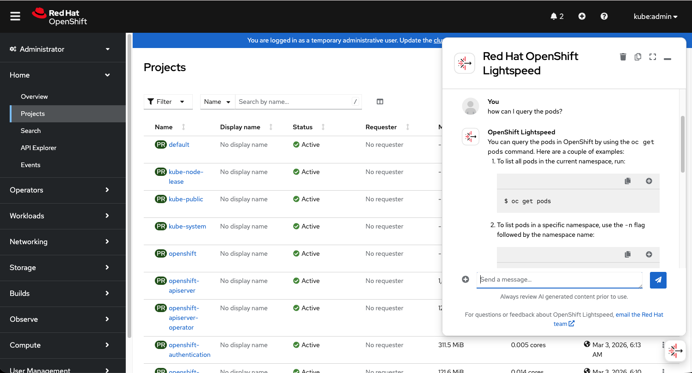

This guide walks through setting up OpenShift Lightspeed backed by Azure AI Foundry services for the LLM.

## Prerequisites

* An ARO Cluster is already installed.
* Permissions to use/register Microsoft Cognitive Services

Command line tools used in this guide:
* aws cli
* jq
 

## Set up environment

Create environment variables. 

```bash
export AZ_SUB_ID=$(az account show --query 'id' -o tsv)
export AZR_RESOURCE_GROUP=dpenagos-demo
export AI_ACCOUNT_NAME=test-ai-dpenagos
export DEPLOYMENT_MODEL_NAME=gpt-4o-mini
export API_VERSION="2025-01-01-preview"
export REGION=eastus
```

Install the necessary operator, OpenShift Lightspeed Operator from OpenShift console.

## Prepare the LLM for serving OpenShift Lightspeed

1. Create the Azure Cognitive Service.

    ```bash
    az cognitiveservices account create -n ${AI_ACCOUNT_NAME} -g ${AZR_RESOURCE_GROUP} --kind OpenAI --sku S0 -l ${REGION} --custom-domain ${AI_ACCOUNT_NAME} --yes
    ```

1. Create the deployment. In this case we will use the model gpt-4o-mini.

    ```bash
    az cognitiveservices account deployment create \
       --name ${AI_ACCOUNT_NAME} \
       --resource-group ${AZR_RESOURCE_GROUP} \
       --deployment-name ${DEPLOYMENT_MODEL_NAME}\
       --model-name gpt-4o-mini \
       --model-version 2024-07-18 \
       --model-format OpenAI \
       --sku-capacity 250 \
       --sku-name GlobalStandard \
       --subscription ${AZ_SUB_ID}
    ```


1. Validate the deployment exists.

    ```bash
    az cognitiveservices account deployment list -g ${AZR_RESOURCE_GROUP} -n ${AI_ACCOUNT_NAME}
    ```

1. Retrieve the endpoint's url and api-token.

    ```bash
    ENDPOINT=$(az cognitiveservices account show --name ${AI_ACCOUNT_NAME}  --resource-group ${AZR_RESOURCE_GROUP} --query properties.endpoint -o tsv)
    DEPLOYMENT_URL="${ENDPOINT}openai/deployments/${DEPLOYMENT_MODEL_NAME}/chat/completions?api-version=${API_VERSION}"
    echo ${DEPLOYMENT_URL}

    API_TOKEN=$(az cognitiveservices account keys list --name "${AI_ACCOUNT_NAME}" --resource-group "${AZR_RESOURCE_GROUP}" | jq -r '.key1')
    ```

1. We must use an app registration to get access to the AI service.

    ```bash
    AZ_SP=$(az ad sp create-for-rbac -n "dpenagos-aro-ia" --role contributor --scopes "/subscriptions/${AZ_SUB_ID}/resourceGroups/${AZR_RESOURCE_GROUP}")
    APP_ID=$(echo ${AZ_SP} | jq -r '.appId')
    PASS=$(echo ${AZ_SP} | jq -r '.password')
    TENANT=$(echo ${AZ_SP} | jq -r '.tenant')
    ```
1. Prepare the data, since this must be encoded base 64.

    ```bash
    APP_ID_B64=$(echo -n ${APP_ID} | base64)
    PASS_B64=$(echo -n ${PASS} | base64)
    TENANT_B64=$(echo -n ${TENANT} | base64)
    API_TOKEN_B64=$(echo -n ${API_TOKEN} | base64)
    ```

## OpenShift LightSpeed Configuration

1. Create the secret with the credentials and the OLSConfig.

    ```bash
    cat <<EOF | oc apply -f -
    kind: Secret
    apiVersion: v1
    metadata:
      name: azure-api-keys
      namespace: openshift-lightspeed
    data:
      apitoken: ${API_TOKEN_B64}
      client_id: ${APP_ID_B64}
      client_secret: ${PASS_B64}
      tenant_id: ${TENANT_B64}
    type: Opaque
    ---
    apiVersion: ols.openshift.io/v1alpha1
    kind: OLSConfig
    metadata:
      labels:
        app.kubernetes.io/created-by: lightspeed-operator
        app.kubernetes.io/instance: olsconfig-sample
        app.kubernetes.io/managed-by: kustomize
        app.kubernetes.io/name: olsconfig
        app.kubernetes.io/part-of: lightspeed-operator
      name: cluster
    spec:
      llm:
        providers:
          - credentialsSecretRef:
              name: azure-api-keys
            deploymentName: gpt-4o-mini
            models:
            - name: gpt-4o-mini
            name: OpenAI
            type: azure_openai
            url: '${DEPLOYMENT_URL}'        
      ols:
        conversationCache:
        postgres:
            credentialsSecret: lightspeed-postgres-secret
            dbName: postgres
            maxConnections: 2000
            sharedBuffers: 256MB
            user: postgres
        type: postgres
        defaultModel: gpt-4o-mini
        defaultProvider: OpenAI
        deployment:
        console:
            replicas: 1
        replicas: 1
        logLevel: INFO
    olsDataCollector:
        logLevel: INFO
    EOF
    ```

1. We should wait a couple of minutes until the lightspeed pod server is running. 

    ```bash
    oc get pods -n openshift-lightspeed
    ```

## Test. 

To test, try querying the OpenShift Lightspeed in ARO.


## Cleanup

1. Delete OpenShift configurations

    ```
    oc delete OLSConfig/cluster
    oc delete secret azure-api-keys -n openshift-lightspeed
    ```
1. Uninstall the OpenShift Lightspeed Operator from the Operator Hub in the OpenShift console.

1. Delete the cognitive services account and the service principal

    ```
    az cognitiveservices account delete \
    --name ${AI_ACCOUNT_NAME} \
    --resource-group ${AZR_RESOURCE_GROUP} 

    az cognitiveservices account purge \
    --name ${AI_ACCOUNT_NAME} \
    --resource-group ${AZR_RESOURCE_GROUP} \
    --location ${REGION}

    az ad sp delete --id ${APP_ID}

    ```