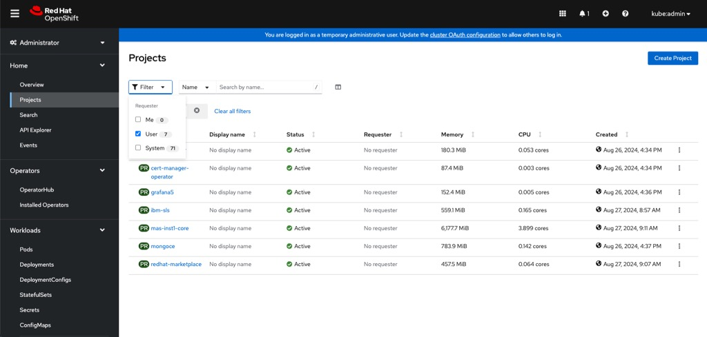

IBM Maximo Application Suite (MAS) is a set of applications for asset monitoring, management, predictive maintenance and reliability planning.  When combined with Azure Red Hat OpenShift ( ARO ), this frees up your Maximo and operations team to focus on what is important to them ( Maximo ) rather than having to worry about managing and building clusters.

This document outlines how to get quickly get started with ARO and installing Maximo all through automation.


## Prerequisites
* an ARO Cluster (see [Deploying ARO with Terraform](/experts/aro/terraform-install/))
* oc cli
* ansible cli
* a Maximo License Key
<br>

> Note: You must log into your ARO cluster via your oc cli before going through the following steps.

## Prepare the Environment

> Note: This guide re-uses environment variables from the [Deploying ARO using azurerm Terraform Provider](/experts/aro/terraform-install/) guide. If you have an existing cluster, you'll need to set them appropriately for the cluster.

1. Run this these commands to set some environment variables to use throughout (Terraform commands need to be run in the directory you ran Terraform)
<br>

<b>Maximo environment variables.</b>
    
You do need both an IBM entitlement key and a Maximo license ID and file.  These can be obtained from IBM.</b>

```bash
export IBM_ENTITLEMENT_KEY=XYZ
export MAS_CONFIG_DIR=~/tmp/masconfig
export DRO_CONTACT_EMAIL=name@company.com
export DRO_CONTACT_FIRSTNAME=First
export DRO_CONTACT_LASTNAME=Last
export MAS_INSTANCE_ID=inst1
export SLS_LICENSE_ID=
export SLS_LICENSE_FILE=
mkdir -p $MAS_CONFIG_DIR
```

<br>

<b>OpenShift Environment Variables </b>

```bash
export CLUSTER=${TF_VAR_cluster_name}

INGRESS_SECRET_NAME=$(oc get secret -n openshift-ingress -o json | jq -r '.items[] | select(.metadata.name|contains("ingress")) | .metadata.name')

az aro list --query \
    "[?name=='$CLUSTER'].{ ResourceGroup:resourceGroup,Location:location}" \
    -o tsv | read -r RESOURCEGROUP LOCATION
```
    

## Prepare the Storage Accounts for MAS

1. Change the default storage class

```bash
  oc patch storageclass managed-csi -p '{"metadata": {"annotations":{"storageclass.kubernetes.io/is-default-class":"false"}}}'
```

1. Create an Azure Premium Disk for Maximo

    ```yaml
    cat << EOF | oc apply -f -
    apiVersion: storage.k8s.io/v1
    kind: StorageClass
    metadata:
      name: managed-premium
      annotations: 
        storageclass.kubernetes.io/is-default-class: 'true'
    provisioner: kubernetes.io/azure-disk
    parameters:
      kind: Managed
      storageaccounttype: Premium_LRS
    reclaimPolicy: Delete
    allowVolumeExpansion: true
    volumeBiningMode: WaitForFirstConsumer
    EOF
    ```

1. Create an Azure Premium File Storage for Maximo

    ```yaml
    cat << EOF | oc apply -f -
    apiVersion: storage.k8s.io/v1
    kind: StorageClass
    metadata:
      name: azurefiles-premium
    provisioner: file.csi.azure.com
    parameters:
      protocol: nfs
      networkEndpointType: privateEndpoint
      location: $LOCATION
      resourceGroup: $RESOURCEGROUP
      skuName: Premium:LRS
    reclaimPolicy: Retain
    allowVolumeExpansion: true
    volumeBiningMode: Immediate
    EOF
    ```

## Install IBM Maximo Application Suite with Ansible

IBM has provided an ansible playbook to automate the installation of Maximo and all the required dependencies making it very easy and repeatable to get started with Maximo.

Click [here](https://ibm-mas.github.io/ansible-devops/playbooks/oneclick-core) to learn more about the OneClick Install of Maximo.

1. Install the Maximo Ansible collection

```bash
ansible-galaxy collection install ibm.mas_devops
```

1. Run the Ansible playbook
```bash
ansible-playbook ibm.mas_devops.oneclick_core
```

And that's it!! ... it will take about 90 minutes for the installation to complete follow along the ansible log messages if you like.

You can also open the OpenShift web console and view the projects and resources the playbook is creating.



When the playbook finishes, you will see the following showing the installation is complete along with the MAS Admin Dashboard with username and password to use.


Open the MAS Dashboard URL in your browser and log in with the given username and password.


> Note: If you are using the default aroapp.io domain that comes with ARO, the URL will show it's insecure due to an untrusted CA.
For a production level Maximo installation with ARO, the cluster should be created with a [custom domain](https://cloud.redhat.com/experts/aro/cert-manager/) where you control the certificates.  Follow these [directions](https://www.ibm.com/docs/en/mas-cd/continuous-delivery?topic=management-manual-certificate) from IBM in manually appling the certificates for MAS.


