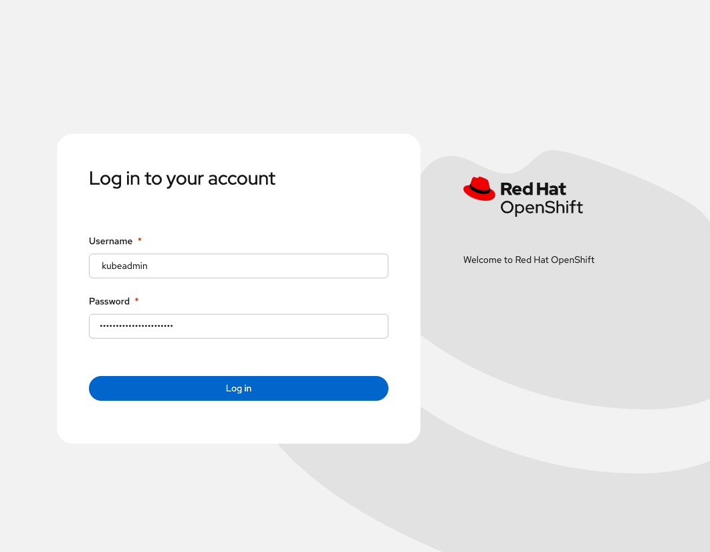
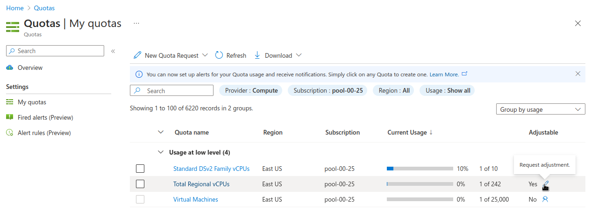

A quickstart guide to deploying an Azure Red Hat OpenShift (ARO) cluster by using Azure CLI.

For new clusters, use Azure managed identities with platform workload identity federation when possible. This avoids long-lived service principal credentials for ARO platform operations.

## Video Walkthrough

If you prefer a more visual medium, you can watch [Paul Czarkowski](https://twitter.com/pczarkowski) walk through this quickstart on [YouTube](https://youtu.be/VYfCltxoh40).

<iframe width="560" height="315" src="https://www.youtube.com/embed/VYfCltxoh40" title="YouTube video player" frameborder="0" allow="accelerometer; autoplay; clipboard-write; encrypted-media; gyroscope; picture-in-picture" allowfullscreen></iframe>


## Prerequisites

### Azure CLI

_Obviously you'll need to have an Azure account to configure the CLI against._

{}
The standard service-principal deployment in this quickstart works with supported Azure CLI versions. Creating ARO with managed identities and platform workload identity federation requires Azure CLI 2.84.0 or later.
{}

**macOS**

{}See [Install Azure CLI on macOS](https://learn.microsoft.com/en-us/cli/azure/install-azure-cli-macos) for alternative install options.{}

1. Install Azure CLI using homebrew

    ```bash
    brew update && brew install azure-cli
    ```

**Linux (RHEL / Fedora / similar, using `dnf`)**

{}For Ubuntu, Debian, or other distributions, use the steps in [Install the Azure CLI on Linux](https://learn.microsoft.com/en-us/cli/azure/install-azure-cli-linux) for your package manager.{}

1. Import the Microsoft Keys

    ```bash
    sudo rpm --import https://packages.microsoft.com/keys/microsoft.asc
    ```

1. Add the Microsoft Yum Repository

    ```bash
    cat << EOF | sudo tee /etc/yum.repos.d/azure-cli.repo
    [azure-cli]
    name=Azure CLI
    baseurl=https://packages.microsoft.com/yumrepos/azure-cli
    enabled=1
    gpgcheck=1
    gpgkey=https://packages.microsoft.com/keys/microsoft.asc
    EOF
    ```

1. Install Azure CLI

    ```bash
    sudo dnf install -y azure-cli
    ```

Confirm your installation: 

```bash
az version --query '"azure-cli"' --output tsv
```

### Prepare the Azure account for ARO

1. Log into the Azure CLI by running the following and then authorizing through your Web Browser. If you have more than one subscription, list them and select the one where you will deploy the cluster.

    ```bash
    az login
    az account list -o table
    az account set --subscription "<id-or-name>"
    ```

1. Make sure you have enough quota in the **same Azure region** you plan to use for the cluster (below, `eastus` matches the default `AZR_RESOURCE_LOCATION` used later; change both if you use another region). Confirm current vCPU requirements in [Create an Azure Red Hat OpenShift cluster](https://learn.microsoft.com/en-us/azure/openshift/create-cluster) (prerequisites and sizing).

    ```bash
    az vm list-usage --location eastus -o table
    ```

    See [Addendum - Adding Quota to ARO account](#adding-quota-to-aro-account) if you do not have enough quota left for **Total Regional vCPUs** (Azure Red Hat OpenShift requires a minimum of 44 cores to create a cluster; verify against current Microsoft documents).

1. Register resource providers

    ```bash
    az provider register -n Microsoft.RedHatOpenShift --wait
    az provider register -n Microsoft.Compute --wait
    az provider register -n Microsoft.Storage --wait
    az provider register -n Microsoft.Authorization --wait
    ```

### Get Red Hat pull secret

{}
A Red Hat pull secret is strongly recommended and is used by the deployment command in this guide. Without a pull secret, access to Red Hat container catalog images and many OperatorHub entries is limited. To deploy without one, omit the `--pull-secret` argument from the `az aro create` command.
{}

1. Log into <https://console.redhat.com>

1. Browse to <https://console.redhat.com/openshift/install/azure/aro-provisioned>

1. Click the **Download pull secret** button and save the file to a known path (for example the default `AZR_PULL_SECRET` path used below). Restrict access to the file and do not commit it to source control; for example on macOS or Linux: `chmod 600 ~/Downloads/pull-secret.txt`.

## Choose a credential method

ARO supports two cluster credential models:

- **Managed identities with platform workload identity federation**: Recommended for new clusters. Azure user-assigned managed identities hold the required Azure RBAC permissions, and OpenShift platform operators authenticate by using federated service account tokens.
- **Service principal**: Uses an application client ID and client secret for Azure access.

{}
An existing service-principal-based ARO cluster cannot be converted in place to use managed identities. To adopt managed identities, create a new cluster and migrate workloads to it.
{}

For the managed-identity deployment workflow, follow [Deploy ARO with Managed Identities and Workload Identity Federation](../miwi/).

The remaining deployment steps in this quickstart use the service-principal credential model.

## Deploy ARO using the service-principal credential model

### Variables and Resource Group

Set some environment variables to use later, and create an Azure Resource Group.

1. Set the following environment variables

    {}Change the values to suit your environment, but these defaults should work. Resource names must comply with [Azure naming rules](https://learn.microsoft.com/en-us/azure/azure-resource-manager/management/resource-name-rules) and length limits. Run all following commands in the same shell so the exported variables apply.{}

    ```bash
    export AZR_RESOURCE_LOCATION=eastus
    export AZR_RESOURCE_GROUP=aro-rg
    export AZR_CLUSTER=aro-cluster
    export AZR_PULL_SECRET=~/Downloads/pull-secret.txt
    ```

1. Create an Azure resource group

    ```bash
    az group create \
      --name "$AZR_RESOURCE_GROUP" \
      --location "$AZR_RESOURCE_LOCATION" \
      --tags Environment=Lab Purpose=ARO-Quickstart
    ```


### Networking

Create a virtual network with two empty subnets

1. Create virtual network

    ```bash
    az network vnet create \
      --address-prefixes 10.0.0.0/22 \
      --name "$AZR_CLUSTER-aro-vnet-$AZR_RESOURCE_LOCATION" \
      --resource-group "$AZR_RESOURCE_GROUP"
    ```

1. Create control plane subnet

    ```bash
    az network vnet subnet create \
      --resource-group "$AZR_RESOURCE_GROUP" \
      --vnet-name "$AZR_CLUSTER-aro-vnet-$AZR_RESOURCE_LOCATION" \
      --name "$AZR_CLUSTER-aro-control-subnet-$AZR_RESOURCE_LOCATION" \
      --address-prefixes 10.0.0.0/23
    ```

1. Create machine subnet

    ```bash
    az network vnet subnet create \
      --resource-group "$AZR_RESOURCE_GROUP" \
      --vnet-name "$AZR_CLUSTER-aro-vnet-$AZR_RESOURCE_LOCATION" \
      --name "$AZR_CLUSTER-aro-machine-subnet-$AZR_RESOURCE_LOCATION" \
      --address-prefixes 10.0.2.0/23
    ```

1. [Disable network policies for Private Link Service](https://learn.microsoft.com/en-us/azure/private-link/disable-private-link-service-network-policy?tabs=private-link-network-policy-cli) on the control plane subnet

    {}Optional. The ARO RP will disable this for you if you skip this step.{}

    ```bash
    az network vnet subnet update \
      --name "$AZR_CLUSTER-aro-control-subnet-$AZR_RESOURCE_LOCATION" \
      --resource-group "$AZR_RESOURCE_GROUP" \
      --vnet-name "$AZR_CLUSTER-aro-vnet-$AZR_RESOURCE_LOCATION" \
      --private-link-service-network-policies Disabled
    ```

1. OpenShift version (optional)

    New clusters use a **supported default** OpenShift version for your region unless you choose one explicitly. List the exact versions you can install (they change over time as Microsoft and Red Hat add releases):

    ```bash
    az aro get-versions --location "$AZR_RESOURCE_LOCATION" -o table
    ```

    {}To **pin** a build, add `--version` with a full version string from that output (for example `4.18.12`) to the `az aro create` command below. Omit `--version` to let the platform pick the default for new clusters.{}

1. Create the service-principal-based cluster

    {}The cluster installation typically takes 45-50 minutes, but we recommend budgeting an hour or more.{}

    {}
    The command below creates a service-principal-based ARO cluster. For new clusters, use the [managed identity and workload identity federation guide](../miwi/) unless you have a specific requirement for the service-principal credential model.
    {}

    ```bash
    az aro create \
      --resource-group "$AZR_RESOURCE_GROUP" \
      --name "$AZR_CLUSTER" \
      --vnet "$AZR_CLUSTER-aro-vnet-$AZR_RESOURCE_LOCATION" \
      --master-subnet "$AZR_CLUSTER-aro-control-subnet-$AZR_RESOURCE_LOCATION" \
      --worker-subnet "$AZR_CLUSTER-aro-machine-subnet-$AZR_RESOURCE_LOCATION" \
      --master-vm-size Standard_D8s_v5 \
      --worker-vm-size Standard_D4s_v5 \
      --worker-count 3 \
      --pull-secret @"$AZR_PULL_SECRET"
    ```

    To create the cluster on a **specific OpenShift version** from `az aro get-versions`, append `--version X.Y.Z` to the same command (use the exact string from the table for your region).

1. Get OpenShift console URL

    ```bash
    az aro show \
      --name "$AZR_CLUSTER" \
      --resource-group "$AZR_RESOURCE_GROUP" \
      -o tsv --query consoleProfile
    ```

1. Get OpenShift credentials

    ```bash
    az aro list-credentials \
      --name "$AZR_CLUSTER" \
      --resource-group "$AZR_RESOURCE_GROUP" \
      -o tsv
    ```

1. Use the URL and the credentials provided by the output of the last two commands to log into OpenShift via a web browser.




1. Deploy an application to OpenShift

    {}See the following video for a guide on easy application deployment on OpenShift.{}

    <iframe width="560" height="315" src="https://www.youtube.com/embed/8uFUFJS9TA4?start=0:43" title="YouTube video player" frameborder="0" allow="accelerometer; autoplay; clipboard-write; encrypted-media; gyroscope; picture-in-picture" allowfullscreen></iframe>

### Delete Cluster

Once you're done it is a good idea to delete the cluster so you avoid unexpected charges.

{}
These cleanup steps apply to the service-principal deployment in this quickstart. For a managed-identity cluster, follow the [cleanup instructions in the managed identity guide](../miwi/) to account for pre-created identities and role assignments.
{}

1. Delete the cluster

    {}The `-y` flag skips confirmation prompts and is convenient for lab teardown; omit it if you want to be prompted before deletion.{}

    ```bash
    az aro delete -y \
      --resource-group "$AZR_RESOURCE_GROUP" \
      --name "$AZR_CLUSTER"
    ```

1. Delete the Azure resource group

    {}Only do this if there is nothing else in the resource group. `az group delete` removes all resources in that group.{}

    ```bash
    az group delete -y \
      --name "$AZR_RESOURCE_GROUP"
    ```

## Addendum

### Adding Quota to ARO account



1. [Create an Azure Support Request](https://portal.azure.com/#blade/Microsoft_Azure_Support/HelpAndSupportBlade/newsupportrequest)

1. Set **Issue Type** to "Service and subscription limits (quotas)"

1. Set **Quota Type** to "Compute-VM (cores-vCPUs) subscription limit increases"

1. Click **Next Solutions >>**

1. Click **Enter details**

1. Set **Deployment Model** to "Resource Manager"

1. Set **Locations** to "(US) East US"

1. Set **Types** to "Standard"

1. Under **Standard** check "DSv4" and "DSv5"

1. Set **New vCPU Limit** for each (example "60")

1. Click **Save and continue**

1. Click **Review + create >>**

1. Wait until quota is increased.
