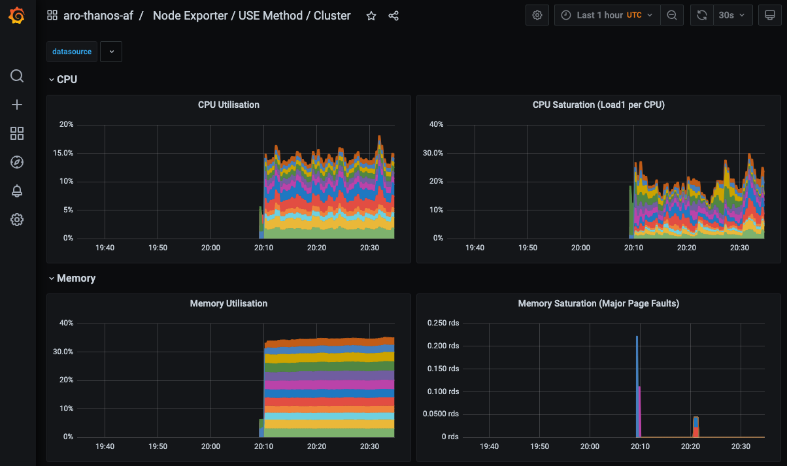

[Azure Red Hat Openshift](https://azure.microsoft.com/en-us/products/openshift/#overview) clusters have built in metrics and logs that can be viewed by both Administrators and Developers via the OpenShift Console. But there are many reasons you might want to store and view these metrics and logs from outside of the cluster.

The OpenShift developers have anticipated this needs and have provided ways to ship both metrics and logs outside of the cluster. In Azure we have the Azure Blob storage service which is perfect for storing the data.

In this guide we'll be setting up [Thanos](https://thanos.io/) and [Grafana Agent](https://grafana.com/docs/agent/latest/) to forward cluster and user workload metrics to Azure Blob as well the Cluster Logging Operator to forward logs to [Loki](https://grafana.com/oss/loki/) which stores the logs in Azure Blob.

## Prerequisites

* [Azure CLI](https://learn.microsoft.com/en-us/cli/azure/install-azure-cli)
* [Terraform](https://www.terraform.io/downloads)
* [OC CLI](https://docs.openshift.com/container-platform/4.11/cli_reference/openshift_cli/getting-started-cli.html)
* [Helm](https://helm.sh/docs/intro/install/)
* [Git](https://git-scm.com/book/en/v2/Getting-Started-Installing-Git)

## Preparation

> Note: This guide was written on Fedora Linux (using the zsh shell) running inside Windows 11 WSL2. You may need to modify these instructions slightly to suit your Operating System / Shell of choice.

1. Create some environment variables to be reused through this guide

   > Modify these values to suit your environment, especially the storage account name which must be globally unique.

   ```bash
   export CLUSTER="aro-${USERNAME}"
   export WORKDIR="/tmp/${CLUSTER}"
   export NAMESPACE=mobb-aro-obs
   export AZR_STORAGE_ACCOUNT_NAME="aro${USERNAME}obs"
   mkdir -p ${WORKDIR}
   cd "${WORKDIR}"
   ```

1. Log into Azure CLI

   ```bash
   az login
   ```

## Create ARO Cluster

> You can skip this step if you already have a cluster, or if you want to create it another way.

This will create a default ARO cluster named `aro-${USERNAME}`, you can modify the TF variables/Makefile to change settings, just update the environment variables loaded above to suit.

1. clone down the Black Belt ARO Terraform repo

   ```bash
   git clone https://github.com/rh-mobb/terraform-aro.git
   cd terraform-aro
   ```

1. Initialize, Create a plan, and apply

   ```bash
   make create
   ```

   This should take about 35 minutes and the final lines of the output should look like

   ```
   azureopenshift_redhatopenshift_cluster.cluster: Still creating... [35m30s elapsed]
   azureopenshift_redhatopenshift_cluster.cluster: Still creating... [35m40s elapsed]
   azureopenshift_redhatopenshift_cluster.cluster: Creation complete after 35m48s [id=/subscriptions/e7f88b1a-04fc-4d00-ace9-eec077a5d6af/resourceGroups/my-tf-cluster-rg/providers/Microsoft.RedHatOpenShift/openShiftClusters/my-tf-cluster]
   ```

1. Save, display the ARO credentials, and login

   ```bash
   az aro list --query \
      "[?name=='${CLUSTER}'].{Name:name,Console:consoleProfile.url,API:apiserverProfile.url, ResourceGroup:resourceGroup,Location:location}" \
      -o tsv |  read -r NAME CONSOLE API RESOURCEGROUP LOCATION
   az aro list-credentials -n $NAME -g $RESOURCEGROUP \
      -o tsv | read -r OCP_PASS OCP_USER
   oc login ${API} --username ${OCP_USER} --password ${OCP_PASS}
   echo "$ oc login ${API} --username ${OCP_USER} --password ${OCP_PASS}"
   echo "Login to ${CONSOLE} as ${OCP_USER} with password ${OCP_PASS}"
   ```

1. Now would be a good time to use the output of this command to log into the OCP Console, you can always run `echo "Login to ${CONSOLE} as ${OCP_USER} with password ${OCP_PASS}"` at any time to remind yourself of the URL and credentials.

### Configure additional Azure resources

These steps create the Storage Account (and two storage containers) in the same Resource Group as the ARO cluster to make cleanup easier. You may want to change it, especially if you plan to host metrics and logs for multiple clusters in the one Storage Account.

1. Create Azure Storage Account and Storage Containers

   ```bash
   # Create Storage Account
   az storage account create \
      --name $AZR_STORAGE_ACCOUNT_NAME \
      --resource-group $RESOURCEGROUP \
      --location $LOCATION \
      --sku Standard_RAGRS \
      --kind StorageV2
   # Fetch the Azure storage key
   AZR_STORAGE_KEY=$(az storage account keys list -g "${RESOURCEGROUP}" \
      -n "${AZR_STORAGE_ACCOUNT_NAME}" --query "[0].value" -o tsv)
   # Create Azure Storage Containers
   az storage container create --name "${CLUSTER}-metrics" \
     --account-name "${AZR_STORAGE_ACCOUNT_NAME}" \
     --account-key "${AZR_STORAGE_KEY}"
   az storage container create --name "${CLUSTER}-logs" \
     --account-name "${AZR_STORAGE_ACCOUNT_NAME}" \
     --account-key "${AZR_STORAGE_KEY}"
   ```

### Configure MOBB Helm Repository

Helm charts do a lot of the heavy lifting for us, and reduce the need for us to copy/paste a pile of YAML. The Managed OpenShift Black Belt team maintain these charts [here](https://github.com/rh-mobb/helm-charts/).

1. Add the MOBB chart repository to your Helm

   ```bash
   helm repo add mobb https://rh-mobb.github.io/helm-charts/
   ```

1. Update your Helm repositories

   ```bash
   helm repo update
   ```

1. Create a namespace to use

   ```bash
   oc new-project "${NAMESPACE}"
   ```

### Update the Pull Secret and enable OperatorHub

This is required to provide credentials to the cluster to pull various Red Hat images in order to enable and configure the Operator Hub.

1. Download a Pull secret from [Red Hat Cloud Console](https://console.redhat.com/openshift/downloads#tool-pull-secret) and save it in `${SCRATCHDIR}/pullsecret.txt`

1. Update the cluster's pull secret using the [mobb/aro-pull-secret](https://github.com/rh-mobb/helm-charts/tree/main/charts/aro-pull-secret) Helm Chart

   ```bash
   # Annotate resources for Helm
   oc -n openshift-config annotate secret \
      pull-secret meta.helm.sh/release-name=pull-secret
   oc -n openshift-config annotate secret \
      pull-secret meta.helm.sh/release-namespace=openshift-config
   oc -n openshift-config label secret \
      pull-secret app.kubernetes.io/managed-by=Helm
   # Update pull secret (change path needed)
   cat << EOF > "${WORKDIR}/pullsecret.yaml"
   pullSecret: |
     $(< "${WORKDIR}/pull-secret.txt")
   EOF
   helm upgrade --install pull-secret mobb/aro-pull-secret \
      -n openshift-config --values "${WORKDIR}/pullsecret.yaml"
   # Enable Operator Hub
   oc patch configs.samples.operator.openshift.io cluster --type=merge \
      -p='{"spec":{"managementState":"Managed"}}'
   oc patch operatorhub cluster --type=merge \
      -p='{"spec":{"sources":[
        {"name":"redhat-operators","disabled":false},
        {"name":"certified-operators","disabled":false},
        {"name":"community-operators","disabled":false},
        {"name":"redhat-marketplace","disabled":false}
      ]}}'
   ```


1. Wait for OperatorHub pods to be ready

   ```bash
   watch oc -n openshift-marketplace get pods
   ```

   ```
   NAME                                    READY   STATUS    RESTARTS      AGE
   certified-operators-xm674               1/1     Running   0             117s
   community-operators-c5pcq               1/1     Running   0             117s
   marketplace-operator-7696c9454c-wgtzp   1/1     Running   1 (30m ago)   47m
   redhat-marketplace-sgnsg                1/1     Running   0             117s
   redhat-operators-pdbg8                  1/1     Running   0             117s
   ```

## Configure Metrics Federation to Azure Blob Storage

Next we can configure Metrics Federation to Azure Blob Storage. This is done by deploying the Grafana Operator (to install Grafana to view the metrics later) and the Resource Locker Operator (to configure the User Workload Metrics) and then the `mobb/aro-thanos-af` Helm Chart to Deploy and Configure Thanos and Grafana Agent to store and retrieve the metrics in Azure Blob.

### Grafana Operator

1. Deploy the Grafana Operator

   ```bash
   # Create a file containing the Grafana operator
   mkdir -p $WORKDIR/metrics
   cat <<EOF > $WORKDIR/metrics/grafana-operator.yaml
   subscriptions:
     - name: grafana-operator
       channel: v4
       installPlanApproval: Automatic
       source: community-operators
       sourceNamespace: openshift-marketplace
       startingCSV: grafana-operator.v4.7.0

   operatorGroups:
     - name: ${NAMESPACE}
       targetNamespace: ~
   EOF
   # Deploy the Grafana Operator using Helm
   helm upgrade -n "${NAMESPACE}" clf-operators \
      mobb/operatorhub --install \
      --values "${WORKDIR}/metrics/grafana-operator.yaml"
   # Wait for the Grafana Operator to be installed
   while ! oc get grafana; do sleep 5; echo -n .; done
   ```

   After a few minutes you should see the following

   ```
   error: the server doesn't have a resource type "grafana"
   error: the server doesn't have a resource type "grafana"
   No resources found in mobb-aro-obs namespace.
   ```


### Resource Locker Operator

1. Deploy the Resource Locker Operator

   ```bash
   # Create the namespace `resource-locker-operator`
   oc create namespace resource-locker-operator
   # Create a file containing the Grafana operator
   cat <<EOF > $WORKDIR/resource-locker-operator.yaml
   subscriptions:
   - name: resource-locker-operator
     channel: alpha
     installPlanApproval: Automatic
     source: community-operators
     sourceNamespace: openshift-marketplace
     namespace: resource-locker-operator
   operatorGroups:
   - name: resource-locker
     namespace: resource-locker-operator
     targetNamespace: all
   EOF
   # Deploy the Resource Locker Operator using Helm
   helm upgrade -n resource-locker-operator resource-locker-operator \
      mobb/operatorhub --install \
      --values "${WORKDIR}"/resource-locker-operator.yaml
   # Wait for the Operators to be installed
   while ! oc get resourcelocker; do sleep 5; echo -n .; done
   ```

   After a few minutes you should see the following

   ```
   error: the server doesn't have a resource type "resourcelocker"
   error: the server doesn't have a resource type "resourcelocker"
   No resources found in mobb-aro-obs namespace.
   ```

### Configure Metrics Federation

1. Deploy `mobb/aro-thanos-af` Helm Chart to configure metrics federation

   ```bash
   helm upgrade -n "${NAMESPACE}" aro-thanos-af \
      --install mobb/aro-thanos-af --version 0.4.1 \
      --set "aro.storageAccount=${AZR_STORAGE_ACCOUNT_NAME}" \
      --set "aro.storageAccountKey=${AZR_STORAGE_KEY}" \
      --set "aro.storageContainer=${CLUSTER}-metrics" \
      --set "enableUserWorkloadMetrics=true"
  ```

## Configure Logs Federation to Azure Blob Storage

Next we need to deploy the Cluster Logging and Loki Operators so that we can use the `mobb/aro-clf-blob` Helm Chart to deploy and configure Cluster Log Forwarding and the Loki Stack to store metrics in Azure Blob.

### Deploy Operators

1. Deploy the cluster logging and loki operators

   ```bash
   # Create nanespaces
   oc create ns openshift-logging
   oc create ns openshift-operators-redhat
   # Configure and deploy operators
   mkdir -p "${WORKDIR}/logs"
   cat << EOF > "${WORKDIR}/logs/log-operators.yaml"
   subscriptions:
   - name: cluster-logging
     channel: stable
     installPlanApproval: Automatic
     source: redhat-operators
     sourceNamespace: openshift-marketplace
     namespace: openshift-logging
     startingCSV: cluster-logging.5.5.2
   - name: loki-operator
     channel: stable
     installPlanApproval: Automatic
     source: redhat-operators
     sourceNamespace: openshift-marketplace
     namespace: openshift-operators-redhat
     startingCSV: loki-operator.5.5.2
   operatorGroups:
   - name: openshift-logging
     namespace: openshift-logging
     targetNamespace: openshift-logging
   - name: openshift-operators-redhat
     namespace: openshift-operators-redhat
     targetNamespace: all
   EOF
   # Deploy the OpenShift Loki Operator and the Red Hat OpenShift Logging Operator
   helm upgrade -n $NAMESPACE clf-operators \
      mobb/operatorhub --install \
      --values "${WORKDIR}/logs/log-operators.yaml"
   # Wait for the Operators to be installed
   while ! oc get clusterlogging; do sleep 5; echo -n .; done
   while ! oc get lokistack; do sleep 5; echo -n .; done
   ```

### Deploy and Configure Cluster Logging and Loki

1. Configure the loki stack to log to Azure Blob

   > Note: Only Infrastructure and Application logs are configured to forward by default to reduce storage and traffic. You can add the argument `--set clf.audit=true` to also forward debug logs.

   ```bash
   helm upgrade -n "${NAMESPACE}" aro-clf-blob \
      --install mobb/aro-clf-blob --version 0.1.1 \
      --set "azure.storageAccount=${AZR_STORAGE_ACCOUNT_NAME}" \
      --set "azure.storageAccountKey=${AZR_STORAGE_KEY}" \
      --set "azure.storageContainer=${CLUSTER}-logs"
   ```

1. Wait for the logging stack to come online

   ```bash
   watch oc -n openshift-logging get pods
   ```

   ```
   NAME                                           READY   STATUS    RESTARTS   AGE
   cluster-logging-operator-8469d5479f-kzh4j      1/1     Running   0          2m10s
   collector-gbqpr                                2/2     Running   0          61s
   collector-j7f4j                                2/2     Running   0          40s
   collector-ldj2k                                2/2     Running   0          58s
   collector-pc82l                                2/2     Running   0          56s
   collector-qrzlb                                2/2     Running   0          58s
   collector-vsj7z                                2/2     Running   0          56s
   logging-loki-compactor-0                       1/1     Running   0          89s
   logging-loki-distributor-565c84c54f-4f24j      1/1     Running   0          89s
   logging-loki-gateway-69d68bc47f-rfp8t          2/2     Running   0          88s
   logging-loki-index-gateway-0                   1/1     Running   0          88s
   logging-loki-ingester-0                        0/1     Running   0          89s
   logging-loki-querier-96c699b7d-fjdrr           1/1     Running   0          89s
   logging-loki-query-frontend-796d85bf5b-cb4dh   1/1     Running   0          88s
   logging-view-plugin-98cf668b-dbdkd             1/1     Running   0          107s
   ```

1. Sometimes the log collector needs to be restarted for logs to flow correctly into Loki.  Wait a few minutes then run the following

   ```bash
   oc -n openshift-logging rollout restart daemonset collector
   ```

## Validate Metrics and Logs

Now that the Metrics and Log forwarding is set up we can view them in Grafana.

1. Fetch the `Route` for `Grafana`

   ```bash
   oc -n "${NAMESPACE}" get route grafana-route
   ```

1. Browse to the provided route address and login using your OpenShift credentials (username `kubeadmin`, password `echo $OCP_PASS`).

1. View an existing dashboard such as **mobb-aro-obs** -> **Node Exporter** -> **USE Method** -> **Cluster**.

   

1. Click the Explore (compass) Icon in the left hand menu, select "Loki (Application)" in the dropdown and search for `{kubernetes_namespace_name="mobb-aro-obs"}`

   

## Debugging loki

If you don't see logs in Grafana you can validate that Loki is correctly storing them by querying it directly like so.

1. Port forward to the Loki Service

   ```bash
   oc port-forward -n openshift-logging svc/logging-loki-gateway-http 8080:8080
   ```

1. Make sure you can curl the Loki service and get a list of labels

   > You can get the bearer token from the login command screen in the OCP Dashboard

   ```bash
   curl -k -H "Authorization: Bearer <BEARER TOKEN>" \
   'https://localhost:8080/api/logs/v1/infrastructure/loki/api/v1/labels'
   ```

1. You can also use the [Loki CLI](https://github.com/grafana/loki/releases)

   ```
   logcli --bearer-token="<BEARER TOKEN>" --tls-skip-verify --addr https://localhost:
   8080/api/logs/v1/infrastructure/ labels
   ```

## Cleanup

Assuming you didn't deviate from the guide then you created everything in the Resource Group of the ARO cluster and you can simply destroy our Terraform stack and everything will be cleaned up.

1. Delete the ARO cluster

   ```bash
   cd "${WORKDIR}/terraform-aro"
   make delete
   ```
