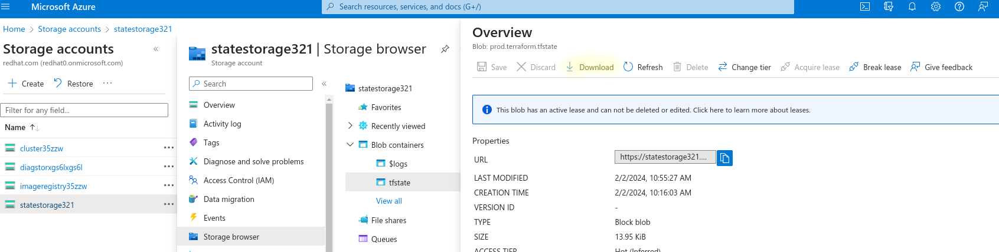

## Overview

Infrastructure as Code has become one of the most prevalent ways in which to deploy and install code for go reason, especially on the cloud. This lab will use the popular tool Terraform in order to create a clear repeatable process in which to install an Azure Managed Openshift(ARO) cluster and all the required components.

### Terraform

Terraform is an open-source IaC tool developed by HashiCorp. It provides a consistent and unified language to describe infrastructure across various cloud providers such as AWS, Azure, Google Cloud, and many others. With Terraform, you can define your infrastructure in code and store it inside of `git`. This makes it easy to version, share, and reproduce.

This article will go over using the Terraform's official [azurerm provider](https://registry.terraform.io/providers/hashicorp/azurerm/latest/docs) in order to deploy an ARO Cluster into our Azure environment.

### Azure's Terraform Provider

[Azurerm](https://registry.terraform.io/providers/hashicorp/azurerm/latest/docs) is one of Azure's official Terraform provider, which contains the [Azurerm Red Hat Openshift Cluster Module](https://registry.terraform.io/providers/hashicorp/azurerm/latest/docs/resources/redhat_openshift_cluster#ip_address) that is used for the deployment of Azure Managed Red Hat Openshift(ARO).

{}This lab will also be using resources from the [azuread module](https://registry.terraform.io/providers/hashicorp/azuread/latest/docs).{}

## Pre-Requisits

* [ROSA CLI](https://docs.openshift.com/rosa/rosa_install_access_delete_clusters/rosa_getting_started_iam/rosa-installing-rosa.html)
* [Terraform](https://developer.hashicorp.com/terraform/install)
* (Optional) Resource Group and [Storage Account](https://learn.microsoft.com/en-us/azure/storage/common/storage-account-overview#storage-account-name) used to store state information
  * Create a blob container named `tfstate` using the storage account

Create the following environment variables

```sh
export CLIENT_ID=xxxxxx
export GUID=$(tr -dc a-z0-9 </dev/urandom | head -c 6; echo)
export CLUSTER_DOMAIN=$GUID.azure.mobb.ninja

# Resource group and storage provider class for state storage
export STORAGE_ACCOUNT_RESOURCE_GROUP=xxxxxxx
export STORAGE_ACCOUNT_NAME=xxxxxxx
export STORAGE_CONTAINER_NAME=tfstate
```

## Create Terraform Config

1. To start create a new directory for our Terraform Config containing a `main.tf`, `variables.tf`, and `terraform.tfvars` file.

    ```sh
    mkdir aro_terraform_install
    cd aro_terraform_install
    touch main.tf variables.tf terraform.tfvars
    ```

    `main.tf` will hold the main Terraform configuration

    `variables.tf` contains the required inputs during our apply process

    `terraform.tfvars` contain the input values for our variables.tf and should be the only file modified when doing subsequent deployments

### Configure Provider and Backend Storage

The [azurerm provider](https://registry.terraform.io/providers/hashicorp/azurerm/latest/docs) gives us access to modules used to install the different Azure resources required.

The [azurerm backend](https://developer.hashicorp.com/terraform/language/settings/backends/azurerm) will be used to store our `tfstate` file. This file is how Terrform is able to keep state information on deployments and will contain sensitive data so it should not be stored in source control or an unencrypted state.

1. Add the [azurerm provider](https://registry.terraform.io/providers/hashicorp/azurerm/latest/docs) to your `main.tf` file

    ```sh
    cat <<EOF > main.tf
    terraform {
      required_providers {
        azurerm = {
          source = "hashicorp/azurerm"
          version = "3.89.0"
        }
      }

      // Backend state is recommended but not required, this block can be removed for testing environments
      backend "azurerm" {
        resource_group_name  = "$STORAGE_ACCOUNT_RESOURCE_GROUP"
        storage_account_name = "$STORAGE_ACCOUNT_NAME"
        container_name       = "$STORAGE_CONTAINER_NAME"
        key                  = "example.terraform.tfstate"
      }
    }

    provider "azurerm" {
      features {}

      skip_provider_registration = true
    }

    EOF
    ```

    {} Note that the Backend `azurerm` his is not required but it is recommended in order to store the state file. {}

### Reference Install Service Principle

This article will assume that the user has an existing Enterprise Application and Service Principle that can be used for the install of the ARO cluster.

If you want to create a new Application/SP the [example in the module's full documentation](https://registry.terraform.io/providers/hashicorp/azurerm/latest/docs/resources/redhat_openshift_cluster#ip_address) can be referenced for how to do that.

1. Reference the `Service Principle` in `main.tf` using the [azuread_service_principal data source](https://registry.terraform.io/providers/hashicorp/azuread/latest/docs/data-sources/service_principal)

    ```sh
    cat <<EOF >> main.tf

    ####################
    # Reference Service Principal
    ####################

    data "azuread_service_principal" "example" {
      client_id = var.client_id
    }
    EOF
    ```

1. Note we are referencing the variable `client_id` in snippet above. Meaning we need to add `client_id` to our `variables.tf`

    ```sh
    cat <<EOF > variables.tf
    variable "client_id" {
        type = string
    }


    variable "client_password" {
        type = string
    }
    EOF
    ```

1. Finally lets add our client information to the `terraform.tfvars`

    ```properties
    cat <<EOF > terraform.tfvars 
    client_id = "$CLIENT_ID"
    EOF
    ```

    {}Note that we also created a `client_password` variable (that will be used later) but did **not** add it to our `terraform.tfvars`. This is so that we are able to check our `terraform.tfvars` file into source code, without expsing sensitive data. You will be required to enter the `client_password` during the `terraform apply` command in the future  {}

### Reference Red Hat's Service Principle

1. Red Hat has a specific Service Principle that must be referenced, **DO NOT** change this value, this is not a SP that you control

    ```sh
    
    cat <<EOF >> main.tf

    data "azuread_service_principal" "redhatopenshift" {
      // This is the Azure Red Hat OpenShift RP service principal id, do NOT delete it
      client_id = "f1dd0a37-89c6-4e07-bcd1-ffd3d43d8875"
    }
    EOF
    ```

### Create Resource Groups

1. Create Resource Groups using the [azurerm_resource_group](https://registry.terraform.io/providers/hashicorp/azurerm/latest/docs/resources/resource_group) module

    ```sh
    cat <<EOF >> main.tf

    ####################
    # Create Resource Groups
    ####################

    resource "azurerm_resource_group" "example" {
      name     = var.resource_group_name
      location = var.location
    }

    EOF
    ```

   {}The `data` blocks in this provider are generally used for referencing existing Azure Objects and the `resource` blocks are used for the creation of new resources {}

1. Create the `resource_group_name` and `location` variables

    ```sh
    cat <<EOF >> variables.tf

    variable "resource_group_name" {
        type = string
        default = "aro-example-resource-group"
    }

    variable "location" {
        type = string
        default = "eastus"
    }
    EOF
    ```

    {}This time we created values with a `default`, so there is no need to modify our `terraform.tfvars` for now{}

### Create Virtual Networks (subnets)

1. Create the required vnet and subnets using the [azurerm_virtual_network](https://registry.terraform.io/providers/hashicorp/azurerm/latest/docs/resources/virtual_network) and [azurerm_subnet](https://registry.terraform.io/providers/hashicorp/azurerm/latest/docs/resources/subnet) modules.

    ```sh
    cat <<EOF >> main.tf

    ####################
    # Create Virtual Network
    ####################

    resource "azurerm_virtual_network" "example" {
      name                = "aro-cluster-vnet"
      address_space       = ["10.0.0.0/22"]
      location            = azurerm_resource_group.example.location
      resource_group_name = azurerm_resource_group.example.name
    }

    resource "azurerm_subnet" "main_subnet" {
      name                 = "main-subnet"
      resource_group_name  = azurerm_resource_group.example.name
      virtual_network_name = azurerm_virtual_network.example.name
      address_prefixes     = ["10.0.0.0/23"]
      service_endpoints    = ["Microsoft.Storage", "Microsoft.ContainerRegistry"]
    }

    resource "azurerm_subnet" "worker_subnet" {
      name                 = "worker-subnet"
      resource_group_name  = azurerm_resource_group.example.name
      virtual_network_name = azurerm_virtual_network.example.name
      address_prefixes     = ["10.0.2.0/23"]
      service_endpoints    = ["Microsoft.Storage", "Microsoft.ContainerRegistry"]
    }
    EOF
    ```

    {}Note that terraform resources can reference themselves, `azurerm_resource_group.example.name` gets the name of our previously created resource group{}

### Create Network Roles

1. Create the network roles using the [azurerm_role_assignment](https://registry.terraform.io/providers/hashicorp/azurerm/latest/docs/resources/role_assignment) module.

    ```sh
    cat <<EOF >> main.tf

    ####################
    # Setup Network Roles
    ####################


    resource "azurerm_role_assignment" "role_network1" {
      scope                = azurerm_virtual_network.example.id
      role_definition_name = "Network Contributor"
      // Note: remove "data." prefix to create a new service principal
      principal_id         = data.azuread_service_principal.example.object_id
    }

    resource "azurerm_role_assignment" "role_network2" {
      scope                = azurerm_virtual_network.example.id
      role_definition_name = "Network Contributor"
      principal_id         = data.azuread_service_principal.redhatopenshift.object_id
    }
    EOF
    ```

### Create Azure Managed Red Hat Openshift(ARO) Cluster

 1. Finally create the ARO cluster with the [azurerm_redhat_openshift_cluster](https://registry.terraform.io/providers/hashicorp/azurerm/latest/docs/resources/redhat_openshift_cluster) module.

    ```sh
    cat <<EOF >> main.tf

    ####################
    # Create Azure Red Hat OpenShift Cluster
    ####################

    resource "azurerm_redhat_openshift_cluster" "example" {
      name                = var.cluster_name
      location            = azurerm_resource_group.example.location
      resource_group_name = azurerm_resource_group.example.name

      cluster_profile {
        domain = var.cluster_domain
        version = var.cluster_version
        pull_secret = var.pull_secret
      }

      network_profile {
        pod_cidr     = "10.128.0.0/14"
        service_cidr = "172.30.0.0/16"
      }

      main_profile {
        vm_size   = "Standard_D8s_v3"
        subnet_id = azurerm_subnet.main_subnet.id
      }

      api_server_profile {
        visibility = "Public"
      }

      ingress_profile {
        visibility = "Public"
      }

      worker_profile {
        vm_size      = "Standard_D4s_v3"
        disk_size_gb = 128
        node_count   = 3
        subnet_id    = azurerm_subnet.worker_subnet.id
      }

      service_principal {
        client_id     = data.azuread_service_principal.example.client_id
        client_secret = var.client_password
      }

      depends_on = [
        azurerm_role_assignment.role_network1,
        azurerm_role_assignment.role_network2,
      ]
    }
    EOF
    ```

1. And update the `variables.tf` file to include the newly referenced vars

    ```sh
    cat <<EOF >> variables.tf

    variable "cluster_name" {
        type = string
        default = "MyExampleCluster"
    }

    variable "cluster_domain" {
        type = string
        default = "$CLUSTER_DOMAIN"
    }

    variable "cluster_version" {
        type = string
        default = "4.12.25"
    }

    // Needs to be passed in to the cli, format should be:
    // '{"auths":{"cloud.openshift.com":{"auth":"xxxxxxxxxxxxxxxxxxxxxxxxxxxxxxxxxxxxxxxxxxxx=","email":"jland@redhat.com"},"quay.io":{"auth":"xxxxxxxxxxxxxxxxxxxxxxxxxxxxxxxxxxx=","email":"jland@redhat.com"},"registry.connect.redhat.com":{"auth":"xxxxxxxxxxxxxxxxxxxxxxxxxxxxxxxxx=","email":"jland@redhat.com"},"registry.redhat.io":{"auth":"xxxxxxxxxxxxxxxxxxxxxxxxxxxxxxxxxxxxxxx=","email":"jland@redhat.com"}}}'
    variable "pull_secret" {
        type = string
    }
    EOF
    ```

    {}`pull_secret` is another variable that will be required at `apply` time. Your pull secret can be retrieved from the [Red Hat Hybrid Cloud Console](https://console.redhat.com/openshift/install/pull-secret){}

### Add Output

 1. As one last quick post step lets add the `console_url` to our Terraform command's output

    ```sh
    cat <<EOF >> main.tf

    ####################
    # Output Console URL
    ####################

    output "console_url" {
      value = azurerm_redhat_openshift_cluster.example.console_url
    }
    EOF
    ```

## Run Terraform

Only thing left is to run and validate our Terraform config works succesfully

   1. Run `terraform init` in order to download the required providers
   1. Inside the directly optionally run `terraform plan` in order to view the resources that will be created during the apply.
   1. Run `terraform apply` to start the creation of the resources, this should prompt you for
       * **Client Password:** Password used for the Service Principle referenced above
       * **Pull Secret:** Red Hat pull secret retrieved from [Red Hat Hybrid Cloud Console](https://console.redhat.com/openshift/install/pull-secret). Paste it in exactly as copied
   1. It will take a  while for the ARO cluster to complete installation, but one the apply is completed a Openshift ARO Cluster should be successfully installed and accessible

      {}The `kubeadmin` password can be retrieved with the command
      +
      `az aro list-credentials --name <CLUSTER_NAME> --resource-group aro-example-resource-group -o tsv --query kubeadminPassword`
      {}

  If there are issues with the commands compare your terraform configuration to the solution [here](https://github.com/jland-redhat/documentation/tree/main/content/aro/terraform-install/solution).

## Stretch Goal

Retrieve your `tfstate` file from the Blob Storage container created earlier (or locally if the backend was not used). Review the information stored inside of the state file to identify the different Azure Resources that were created when the `terraform apply` command was run.



## Conclusion

This article demonstrates the deployment of OpenShift clusters in a consistent manner using Terraform and the azurerm provider. The provided configuration is highly adaptable, allowing for more intricate and customizable deployments. For instance, it could easily be modified for the use of a custom domain zone with your cluster.

Utilizing this provider allows your enterprise to streamline maintenance efforts, as the centralized `main.tf` and `variable.tf` files require minimal changes. Deploying new Azure Red Hat OpenShift (ARO) clusters simply involves updating the variables in the `terraform.tfvars` file.
