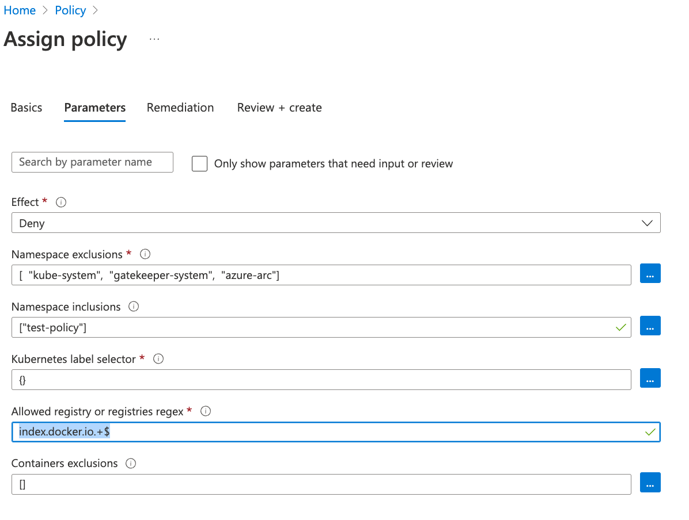

[Azure Policy](https://docs.microsoft.com/en-us/azure/governance/policy/overview) helps to enforce organizational standards and to assess compliance at-scale. Azure Policy supports [arc enabled kubernetes cluster](https://docs.microsoft.com/en-us/azure/azure-arc/kubernetes/overview) with both build-in and custom policies to ensure kubernetes resources are compliant. This article demonstrates how to make Azure Redhat Openshift cluster compliant with azure policy.

## Prerequisites

* Azure CLI
* Openshift CLI
* Azure Openshift Cluster (ARO Cluster)

## Deploy Azure Policy


* Deploy Azure Arc and Enable Azure Policy Add-on

```bash
az connectedk8s connect -n [Cluster_Name] -g [Resource_Group_Name]
az k8s-extension create --cluster-type connectedClusters --cluster-name [Cluster_Name] --resource-group [Resource_Group_Name] --extension-type Microsoft.PolicyInsights --name azurepolicy
```

* Verify Azure Arc and Azure Policy Add-on

```
oc get pod -n azure-arc
NAME                                         READY   STATUS    RESTARTS   AGE
cluster-metadata-operator-6d4b957d65-5ts9b   2/2     Running   0          3h31m
clusterconnect-agent-d5d6c6848-kbmfc         3/3     Running   0          3h31m
clusteridentityoperator-6f5bf5c94-6qxlm      2/2     Running   0          3h31m
config-agent-54b48fb5d9-wll42                2/2     Running   0          3h31m
controller-manager-69fd59cf7-lf2mf           2/2     Running   0          3h31m
extension-manager-695f99c94d-q6zmw           2/2     Running   0          3h31m
flux-logs-agent-88588c88-j9xf8               1/1     Running   0          3h31m
kube-aad-proxy-74d5747967-jhxq2              2/2     Running   0          3h31m
metrics-agent-854dfbdc74-948bn               2/2     Running   0          3h31m
resource-sync-agent-77f8bb95d4-94dpm         2/2     Running   0          3h31m
```

```
oc get pod -n gatekeeper-system
NAME                                             READY   STATUS    RESTARTS   AGE
gatekeeper-audit-bbdd45779-lbsmf                 1/1     Running   0          3h25m
gatekeeper-controller-manager-59864c84f4-25pt2   1/1     Running   0          3h25m
gatekeeper-controller-manager-59864c84f4-sztck   1/1     Running   0          3h25m
```

## Demo a simple policy

This policy will allow only images from a specific registry.

* Open Azure Portal Policy Services
* Click on Assign Policy
* Select the subscription and ARO cluster resource group as the scope
* Select "Kubernetes cluster containers should only use allowed images" in the "policy definition" field
* Click Next -> fill out namespace inclusion as ["test-policy"] -> Allowed Registry Regex as "index.docker.io.+$"

* Save the result. The policy will take effect after around 30 minutes.

```
oc get K8sAzureContainerAllowedImages #Get the latest policy
oc get K8sAzureContainerAllowedImages azurepolicy-k8sazurecontainerallowedimages-5a0572fab674dfdfb636 -o yaml
apiVersion: constraints.gatekeeper.sh/v1beta1
kind: K8sAzureContainerAllowedImages
metadata:
  annotations:
    azure-policy-assignment-id: /subscriptions/${subscription_id}/resourceGroups/shaozhen-tf-rg/providers/Microsoft.Authorization/policyAssignments/9f9d73056d5f422bb3bbbc5f
    azure-policy-definition-id: /providers/Microsoft.Authorization/policyDefinitions/febd0533-8e55-448f-b837-bd0e06f16469
    azure-policy-definition-reference-id: ""
    azure-policy-setdefinition-id: ""
    constraint-installed-by: azure-policy-addon
  creationTimestamp: "2022-07-25T16:19:12Z"
  generation: 2
  labels:
    managed-by: azure-policy-addon
  name: azurepolicy-k8sazurecontainerallowedimages-5a0572fab674dfdfb636
  resourceVersion: "169521"
  uid: 0e25efc6-0099-4e3c-86a9-a223dd01e13d
spec:
  enforcementAction: deny
  match:
    excludedNamespaces:
    - kube-system
    - gatekeeper-system
    - azure-arc
    kinds:
    - apiGroups:
      - ""
      kinds:
      - Pod
    namespaces:
    - test-policy
  parameters:
    excludedContainers: []
    imageRegex: index.docker.io.+$
```
* Policy Engine denies images from quay.io

```
oc run -ti --image quay.io/alpine test -- /bin/sh
Error from server ([azurepolicy-k8sazurecontainerallowedimages-5a0572fab674dfdfb636] Container image quay.io/alpine for container test has not been allowed.): admission webhook "validation.gatekeeper.sh" denied the request: [azurepolicy-k8sazurecontainerallowedimages-5a0572fab674dfdfb636] Container image quay.io/alpine for container test has not been allowed.
```

## References

* [Azure Policy Overview](https://docs.microsoft.com/en-us/azure/governance/policy/overview)
* [Azure Arc-enabled kubernetes](https://docs.microsoft.com/en-us/azure/azure-arc/kubernetes/overview)
* [Understand Azure Policy for Kubernetes](https://docs.microsoft.com/en-us/azure/governance/policy/concepts/policy-for-kubernetes)
* [Azure Arc-enabled kubernetes built-in policy](https://docs.microsoft.com/en-us/azure/azure-arc/kubernetes/policy-reference)

