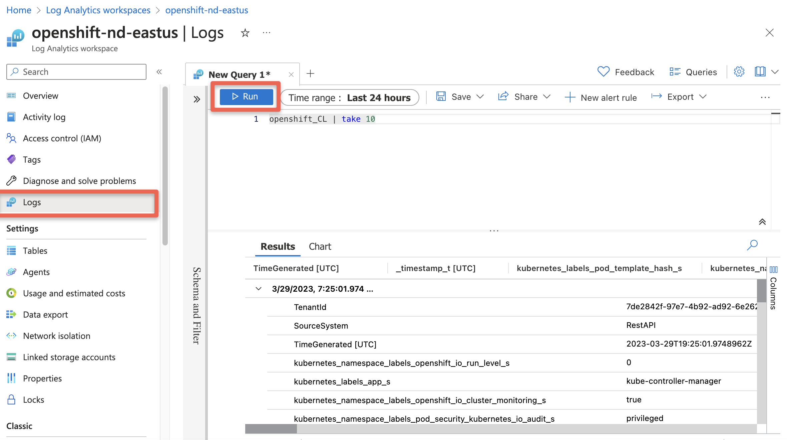

**Paul Czarkowski, Steve Mirman, Nerav Doshi**

*03/29/2023*oc log

In Azure Red Hat OpenShift (ARO) you can fairly easily set up cluster logging to an in-cluster Elasticsearch using the OpenShift Elasticsearch Operator
and the Cluster Logging Operator, but what if you want to use the Azure native Log Analytics service?

There's a number of ways to do this, for example installing agents onto the VMs (in this case, it would be a DaemonSet with hostvar mounts) but that isn't ideal in a managed system like ARO.

Fluentd is the log collection and forwarding tool used by OpenShift, however it does not have native support for Azure Log Analytics. However Fluent-bit which supports many of the same protocols as Fluentd does have [native support](https://docs.fluentbit.io/manual/pipeline/outputs/azure) for Azure Log Analytics.

Armed with this knowledge we can create a fluent-bit service on the cluster to accept logs from fluentd and forward them to Azure Log Analytics.

## Prepare your ARO cluster

1. [Deploy](/docs/quickstart-aro) an ARO cluster

1. Set some environment variables

   ```bash
   export NAMESPACE=aro-clf-am
   export AZR_RESOURCE_LOCATION=eastus
   export AZR_RESOURCE_GROUP=openshift
   # this value must be unique
   export AZR_LOG_APP_NAME=$AZR_RESOURCE_GROUP-$AZR_RESOURCE_LOCATION
   ```

## Set up ARO Monitor workspace

1. Add the Azure CLI log extensions

   ```bash
   az extension add --name log-analytics
   ```

1. Create resource group

   > **If you plan to reuse the same group as your cluster skip this step**

   ```bash
   az group create -n $AZR_RESOURCE_GROUP -l $AZR_RESOURCE_LOCATION
   ```

1. Create workspace

   ```bash
   az monitor log-analytics workspace create \
    -g $AZR_RESOURCE_GROUP -n $AZR_LOG_APP_NAME \
    -l $AZR_RESOURCE_LOCATION
   ```

1. Create a secret for your Azure workspace

   ```bash
   WORKSPACE_ID=$(az monitor log-analytics workspace show \
    -g $AZR_RESOURCE_GROUP -n $AZR_LOG_APP_NAME \
    --query customerId -o tsv)
   SHARED_KEY=$(az monitor log-analytics workspace get-shared-keys \
    -g $AZR_RESOURCE_GROUP -n $AZR_LOG_APP_NAME \
    --query primarySharedKey -o tsv)
   ```

## Configure OpenShift

1. Create a Project to run the log forwarding in

   ```bash
   oc new-project $NAMESPACE
   ```

1. Create namespaces for logging operators

   ```bash
   kubectl create ns openshift-logging
   kubectl create ns openshift-operators-redhat
   ```

1. Add the MOBB chart repository to Helm

   ```bash
   helm repo add mobb https://rh-mobb.github.io/helm-charts/
   ```

1. Update your Helm repositories

   ```bash
   helm repo update
   ```

1. Deploy the OpenShift Elasticsearch Operator and the Red Hat OpenShift Logging Operator

   **> Note: You can skip this if you already have them installed, or install them via the OpenShift Console.**

   ```bash
   helm upgrade -n $NAMESPACE clf-operators \
    mobb/operatorhub --version 0.1.1 --install \
    --values https://raw.githubusercontent.com/rh-mobb/helm-charts/main/charts/aro-clf-am/files/operators.yaml
   ```

1. Configure cluster logging forwarder

   ```bash
   helm upgrade -n $NAMESPACE clf \
    mobb/aro-clf-am --install \
    --set "azure.workspaceId=$WORKSPACE_ID" --set "azure.sharedKey=$SHARED_KEY"
   ```

## Check for logs in Azure

> Wait 5 to 15 minutes

1. Query our new Workspace

   ```bash
   az monitor log-analytics query -w $WORKSPACE_ID  \
      --analytics-query "openshift_CL | take 10" --output tsv
   ```

  or

1. Log into Azure[Azure Log Insights](https://portal.azure.com/#blade/Microsoft_Azure_Monitoring/AzureMonitoringBrowseBlade/logs) or you can login into portal and search for Log Analytics workspace

   ! [screenshot of Log analytics workspace](./images/loganalyticsportal.png)

1. Select your workspace

   

1. Run the Query

   ```
   openshift_CL
      | take 10
   ```

   
