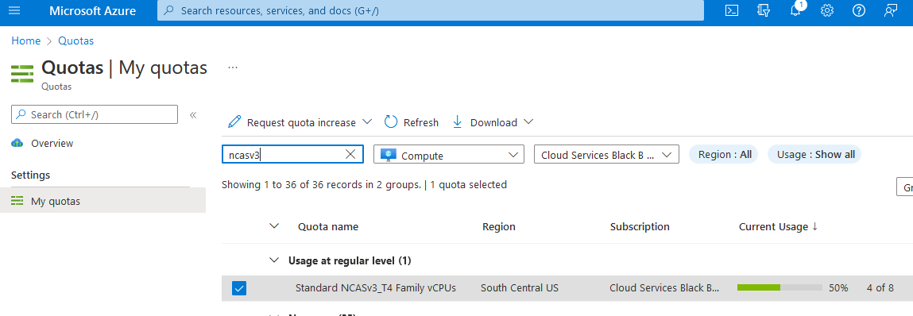

ARO guide to running Nvidia GPU workloads.

## Prerequisites

* oc cli
* jq, moreutils, and gettext package
* ARO 4.10

If you need to install an ARO cluster, please read our [ARO Quick start guide](https://mobb.ninja/docs/quickstart-aro/). Please be sure if you're installing or using an existing ARO cluster that it is 4.10.x or higher.

>As of OpenShift 4.10, it is no longer necessary to set up entitlements to use the nVidia Operator. This has greatly simplified the setup of the cluster for GPU workloads.

Linux:

```bash
sudo dnf install jq moreutils gettext
```

MacOS
```bash
brew install jq moreutils gettext
```

### Helm Prerequisites

If you plan to use Helm to deploy the GPU operator, you will need do the following

1. Add the MOBB chart repository to your Helm

    ```bash
    helm repo add mobb https://rh-mobb.github.io/helm-charts/
    ```

1. Update your repositories

    ```bash
    helm repo update
    ```

## GPU Quota

All GPU quotas in Azure are 0 by default. You will need to login to the azure portal and request GPU quota. There is a lot of competition for GPU workers, so you may have to provision an ARO cluster in a region where you can actually reserve GPU.
ARO supports the following GPU workers:
* NC4as T4 v3
* NC6s v3
* NC8as T4 v3
* NC12s v3
* NC16as T4 v3
* NC24s v3
* NC24rs v3
* NC64as T4 v3

>Please remember that when you request quota that Azure is per core.  To request a single NC4as T4 v3 node, you will need to request quota in groups of 4. If you wish to request an NC16as T4 v3 you will need to request quota of 16.

1. Login to azure

   Login to [portal.azure.com](portal.azure.com), type "quotas" in search by, click on Compute and in the search box type "NCAsv3_T4". Select the region your cluster is in (select checkbox) and then click Request quota increase and ask for quota (I chose 8 so i can build two demo clusters of NC4as T4s).

2. Configure quota

   

## Log in to your ARO cluster

1. Login to OpenShift - we'll use the kubeadmin account here but you can login with your user account as long as you have cluster-admin.

   ```bash
   oc login <apiserver> -u kubeadmin -p <kubeadminpass>
   ```

## Pull secret (Conditional)

We'll update our pull secret to make sure that we can install operators as well as connect to cloud.redhat.com.

   >If you have already re-created a full pull secret with cloud.redhat.com enabled you can skip this step

### Using Helm

1. Before Deploying the chart you need it to adopt the existing pull secret

   ```bash
   kubectl -n openshift-config annotate secret \
    pull-secret meta.helm.sh/release-name=pull-secret
   kubectl -n openshift-config annotate secret \
     pull-secret meta.helm.sh/release-namespace=openshift-config
   kubectl -n openshift-config label secret \
     pull-secret app.kubernetes.io/managed-by=Helm
   ```

1. Download your new pull secret from **https://console.redhat.com/openshift/downloads -> Tokens -> Pull secret** and use it to update create the pull secret in your cluster.

1. Update the pull secret

   > This chart will merge the in-cluster pull secret with the new pull secret.

   ```
   helm upgrade --install pull-secret mobb/aro-pull-secret \
     -n openshift-config --set-file pullSecret=$HOME/Downloads/pull-secret.txt
   ```

1. Enable Operator Hub

   ```bash
   oc patch configs.samples.operator.openshift.io cluster --type=merge \
         -p='{"spec":{"managementState":"Managed"}}'
   oc patch operatorhub cluster --type=merge \
         -p='{"spec":{"sources":[
           {"name":"redhat-operators","disabled":false},
           {"name":"certified-operators","disabled":false},
           {"name":"community-operators","disabled":false},
           {"name":"redhat-marketplace","disabled":false}
         ]}}'
   ```

1. Skip to [GPU Machine Set](#gpu-machine-set)

### Manually

1. Log into [cloud.redhat.com](cloud.redhat.com)

1. Browse to https://cloud.redhat.com/openshift/install/azure/aro-provisioned

1. click the **Download pull secret** button and save it as pull-secret.txt

   >The following steps will need to be ran in the same working directory as your pull-secret.txt

1. Export existing pull secret

   ```bash
   oc get secret pull-secret -n openshift-config -o json | jq -r '.data.".dockerconfigjson"' | base64 --decode > export-pull.json
   ```

1. Merge downloaded pull secret with system pull secret to add cloud.redhat.com

   ```bash
   jq -s '.[0] * .[1]' export-pull.json pull-secret.txt | tr -d "\n\r" > new-pull-secret.json
   ```

1. Upload new secret file

   ```bash
   oc set data secret/pull-secret -n openshift-config --from-file=.dockerconfigjson=new-pull-secret.json
   ```

> You may need to wait for about ~1hr for everything to sync up with cloud.redhat.com.

1. Delete secrets

   ```bash
   rm pull-secret.txt export-pull.json new-pull-secret.json
   ```

## GPU Machine Set

ARO still uses Kubernetes Machinsets to create a machine set.  I'm going to export the first machine set in my cluster (az 1) and use that as a template to build a single GPU machine in southcentralus region 1.

### Helm

1. Create a new machine-set (replicas of 1), see the Chart's [values](https://github.com/rh-mobb/helm-charts/blob/main/charts/aro-gpu/values.yaml) file for configuration options

   ```
   helm upgrade --install -n openshift-machine-api \
      gpu mobb/aro-gpu
   ```

1. Switch to the proper namespace (project):

    ```bash
    oc project openshift-machine-api
    ```

1. Wait for the new GPU nodes to be available

   ```bash
   watch oc get machines
   ```

1. Skip to [Install Nvidia GPU Operator](#install-nvidia-gpu-operator)

### Manually

1. View existing machine sets

   >For ease of set up, I'm going to grab the first machine set and use that as the one I will clone to create our GPU machine set.

   ```bash
   MACHINESET=$(oc get machineset -n openshift-machine-api -o=jsonpath='{.items[0]}' | jq -r '[.metadata.name] | @tsv')
   ```

2. Save a copy of example machine set

   ```bash
   oc get machineset -n openshift-machine-api $MACHINESET -o json > gpu_machineset.json
   ```

3. Change the .metadata.name field to a new unique name

   >I'm going to create a unique name for this single node machine set that shows nvidia-worker-<region><az> that follows a similar pattern as all the other machine sets.

   ```bash
   jq '.metadata.name = "nvidia-worker-southcentralus1"' gpu_machineset.json| sponge gpu_machineset.json
   ```

4. Ensure spec.replicas matches the desired replica count for the MachineSet

    ```bash
    jq '.spec.replicas = 1' gpu_machineset.json| sponge gpu_machineset.json
    ```

5. Change the .spec.selector.matchLabels.machine.openshift.io/cluster-api-machineset field to match the .metadata.name field

   ```bash
   jq '.spec.selector.matchLabels."machine.openshift.io/cluster-api-machineset" = "nvidia-worker-southcentralus1"' gpu_machineset.json| sponge gpu_machineset.json
   ```

6. Change the .spec.template.metadata.labels.machine.openshift.io/cluster-api-machineset to match the .metadata.name field

   ```bash
   jq '.spec.template.metadata.labels."machine.openshift.io/cluster-api-machineset" = "nvidia-worker-southcentralus1"' gpu_machineset.json| sponge gpu_machineset.json
   ```

7. Change the spec.template.spec.providerSpec.value.vmSize to match the desired GPU instance type from Azure.

   >The machine we're using is Standard_NC4as_T4_v3.

   ```bash
   jq '.spec.template.spec.providerSpec.value.vmSize = "Standard_NC4as_T4_v3"' gpu_machineset.json | sponge gpu_machineset.json
   ```

8.  Change the spec.template.spec.providerSpec.value.zone to match the desired zone from Azure

    ```bash
    jq '.spec.template.spec.providerSpec.value.zone = "1"' gpu_machineset.json | sponge gpu_machineset.json
    ```

9. Delete the .status section of the yaml file

   ```bash
   jq 'del(.status)' gpu_machineset.json | sponge gpu_machineset.json
   ```

10. Verify the other data in the yaml file.

#### Create GPU machine set

These steps will create the new GPU machine. It may take 10-15 minutes to provision a new GPU machine. If this step fails, please login to the [azure portal](https://portal.azure.com) and ensure you didn't run across availability issues. You can go "Virtual Machines" and search for the worker name you created above to see the status of VMs.

1. Create GPU Machine set

   ```bash
   oc create -f gpu_machineset.json
   ```

   >This command will take a few minutes to complete.

1. Verify GPU machine set

   Machines should be getting deployed. You can view the status of the machine set with the following commands

   ```bash
   oc get machineset -n openshift-machine-api
   oc get machine -n openshift-machine-api
   ```

   Once the machines are provisioned, which could take 5-15 minutes, machines will show as nodes in the node list.

   ```bash
   oc get nodes
   ```

   You should see a node with the "nvidia-worker-southcentralus1" name it we created earlier.

## Install Nvidia GPU Operator

This will create the nvidia-gpu-operator name space, set up the operator group and install the Nvidia GPU Operator.

### Helm

1. Create namespaces

    ```bash
    oc create namespace openshift-nfd
    oc create namespace nvidia-gpu-operator
    ```

1. Use the `mobb/operatorhub` chart to deploy the needed operators

    ```bash
    helm upgrade -n nvidia-gpu-operator nvidia-gpu-operator \
      mobb/operatorhub --install \
      --values https://raw.githubusercontent.com/rh-mobb/helm-charts/main/charts/nvidia-gpu/files/operatorhub.yaml
    ```

1. Wait until the two operators are running

    ```bash
    watch kubectl get pods -n openshift-nfd
    ```

    ```
    NAME                                      READY   STATUS    RESTARTS   AGE
    nfd-controller-manager-7b66c67bd9-rk98w   2/2     Running   0          47s
    ```

    ```bash
    watch oc get pods -n nvidia-gpu-operator
    ```

    ```
    NAME                            READY   STATUS    RESTARTS   AGE
    gpu-operator-5d8cb7dd5f-c4ljk   1/1     Running   0          87s
    ```

1. Install the Nvidia GPU Operator chart


    ```bash
    helm upgrade --install -n nvidia-gpu-operator nvidia-gpu \
      mobb/nvidia-gpu --disable-openapi-validation
    ```

1. Skip to [Validate GPU](#validate-gpu)


### Manually

1. Create Nvidia namespace

   ```yaml
   cat <<EOF | oc apply -f -
   apiVersion: v1
   kind: Namespace
   metadata:
     name: nvidia-gpu-operator
   EOF
   ```

1. Create Operator Group

   ```yaml
   cat <<EOF | oc apply -f -
   apiVersion: operators.coreos.com/v1
   kind: OperatorGroup
   metadata:
     name: nvidia-gpu-operator-group
     namespace: nvidia-gpu-operator
   spec:
    targetNamespaces:
    - nvidia-gpu-operator
   EOF
   ```

1. Get latest nvidia channel
    
   ```bash
   CHANNEL=$(oc get packagemanifest gpu-operator-certified -n openshift-marketplace -o jsonpath='{.status.defaultChannel}')
   ```
> If your cluster was created without providing the pull secret, the cluster won't include samples or operators from Red Hat or from certified partners. This will result in the following error message: 
> 
> *Error from server (NotFound): packagemanifests.packages.operators.coreos.com "gpu-operator-certified" not found.* 
>
> To add your Red Hat pull secret on an Azure Red Hat OpenShift cluster, [follow this guidance](https://learn.microsoft.com/en-us/azure/openshift/howto-add-update-pull-secret).

1. Get latest nvidia package

   ```bash
   PACKAGE=$(oc get packagemanifests/gpu-operator-certified -n openshift-marketplace -ojson | jq -r '.status.channels[] | select(.name == "'$CHANNEL'") | .currentCSV')
   ```

1. Create Subscription

   ```yaml
   envsubst  <<EOF | oc apply -f -
   apiVersion: operators.coreos.com/v1alpha1
   kind: Subscription
   metadata:
     name: gpu-operator-certified
     namespace: nvidia-gpu-operator
   spec:
     channel: "$CHANNEL"
     installPlanApproval: Automatic
     name: gpu-operator-certified
     source: certified-operators
     sourceNamespace: openshift-marketplace
     startingCSV: "$PACKAGE"
   EOF
   ```

1. Wait for Operator to finish installing

   >Don't proceed until you have verified that the operator has finished installing. It's also a good point to ensure that your GPU worker is online.

   


#### Install Node Feature Discovery Operator

The node feature discovery operator will discover the GPU on your nodes and appropriately label the nodes so you can target them for workloads.  We'll install the NFD operator into the opneshift-ndf namespace and create the "subscription" which is the configuration for NFD.

Official Documentation for Installing [Node Feature Discovery Operator](https://docs.openshift.com/container-platform/4.10/hardware_enablement/psap-node-feature-discovery-operator.html)

1. Set up Name Space

   ```yaml
   cat <<EOF | oc apply -f -
   apiVersion: v1
   kind: Namespace
   metadata:
     name: openshift-nfd
   EOF
   ```

1. Create OperatorGroup

   ```yaml
   cat <<EOF | oc apply -f -
   apiVersion: operators.coreos.com/v1
   kind: OperatorGroup
   metadata:
     generateName: openshift-nfd-
     name: openshift-nfd
     namespace: openshift-nfd
   EOF
   ```

1. Create Subscription

   ```yaml
   cat <<EOF | oc apply -f -
   apiVersion: operators.coreos.com/v1alpha1
   kind: Subscription
   metadata:
     name: nfd
     namespace: openshift-nfd
   spec:
     channel: "stable"
     installPlanApproval: Automatic
     name: nfd
     source: redhat-operators
     sourceNamespace: openshift-marketplace
   EOF
   ```
1. Wait for Node Feature discovery to complete installation

   You can login to your openshift console and view operators or simply wait a few minutes. The next step will error until the operator has finished installing.

1. Create NFD Instance

   ```yaml
   cat <<EOF | oc apply -f -
   kind: NodeFeatureDiscovery
   apiVersion: nfd.openshift.io/v1
   metadata:
     name: nfd-instance
     namespace: openshift-nfd
   spec:
     customConfig:
       configData: |
         #    - name: "more.kernel.features"
         #      matchOn:
         #      - loadedKMod: ["example_kmod3"]
         #    - name: "more.features.by.nodename"
         #      value: customValue
         #      matchOn:
         #      - nodename: ["special-.*-node-.*"]
     operand:
       image: >-
         registry.redhat.io/openshift4/ose-node-feature-discovery@sha256:07658ef3df4b264b02396e67af813a52ba416b47ab6e1d2d08025a350ccd2b7b
       servicePort: 12000
     workerConfig:
       configData: |
         core:
         #  labelWhiteList:
         #  noPublish: false
           sleepInterval: 60s
         #  sources: [all]
         #  klog:
         #    addDirHeader: false
         #    alsologtostderr: false
         #    logBacktraceAt:
         #    logtostderr: true
         #    skipHeaders: false
         #    stderrthreshold: 2
         #    v: 0
         #    vmodule:
         ##   NOTE: the following options are not dynamically run-time
         ##          configurable and require a nfd-worker restart to take effect
         ##          after being changed
         #    logDir:
         #    logFile:
         #    logFileMaxSize: 1800
         #    skipLogHeaders: false
         sources:
         #  cpu:
         #    cpuid:
         ##     NOTE: whitelist has priority over blacklist
         #      attributeBlacklist:
         #        - "BMI1"
         #        - "BMI2"
         #        - "CLMUL"
         #        - "CMOV"
         #        - "CX16"
         #        - "ERMS"
         #        - "F16C"
         #        - "HTT"
         #        - "LZCNT"
         #        - "MMX"
         #        - "MMXEXT"
         #        - "NX"
         #        - "POPCNT"
         #        - "RDRAND"
         #        - "RDSEED"
         #        - "RDTSCP"
         #        - "SGX"
         #        - "SSE"
         #        - "SSE2"
         #        - "SSE3"
         #        - "SSE4.1"
         #        - "SSE4.2"
         #        - "SSSE3"
         #      attributeWhitelist:
         #  kernel:
         #    kconfigFile: "/path/to/kconfig"
         #    configOpts:
         #      - "NO_HZ"
         #      - "X86"
         #      - "DMI"
           pci:
             deviceClassWhitelist:
               - "0200"
               - "03"
               - "12"
             deviceLabelFields:
         #      - "class"
               - "vendor"
         #      - "device"
         #      - "subsystem_vendor"
         #      - "subsystem_device"
         #  usb:
         #    deviceClassWhitelist:
         #      - "0e"
         #      - "ef"
         #      - "fe"
         #      - "ff"
         #    deviceLabelFields:
         #      - "class"
         #      - "vendor"
         #      - "device"
         #  custom:
         #    - name: "my.kernel.feature"
         #      matchOn:
         #        - loadedKMod: ["example_kmod1", "example_kmod2"]
         #    - name: "my.pci.feature"
         #      matchOn:
         #        - pciId:
         #            class: ["0200"]
         #            vendor: ["15b3"]
         #            device: ["1014", "1017"]
         #        - pciId :
         #            vendor: ["8086"]
         #            device: ["1000", "1100"]
         #    - name: "my.usb.feature"
         #      matchOn:
         #        - usbId:
         #          class: ["ff"]
         #          vendor: ["03e7"]
         #          device: ["2485"]
         #        - usbId:
         #          class: ["fe"]
         #          vendor: ["1a6e"]
         #          device: ["089a"]
         #    - name: "my.combined.feature"
         #      matchOn:
         #        - pciId:
         #            vendor: ["15b3"]
         #            device: ["1014", "1017"]
         #          loadedKMod : ["vendor_kmod1", "vendor_kmod2"]
   EOF
   ```

1. Verify NFD is ready.

   This operator should say Available in the status

   

#### Apply nVidia Cluster Config

We'll now apply the nvidia cluster config. Please read the [nvidia documentation](https://docs.nvidia.com/datacenter/cloud-native/gpu-operator/openshift/install-gpu-ocp.html) on customizing this if you have your own private repos or specific settings. This will be another process that takes a few minutes to complete.

1. Apply cluster config

   ```yaml
   cat <<EOF | oc apply -f -
   apiVersion: nvidia.com/v1
   kind: ClusterPolicy
   metadata:
     name: gpu-cluster-policy
   spec:
     migManager:
       enabled: true
     operator:
       defaultRuntime: crio
       initContainer: {}
       runtimeClass: nvidia
       deployGFD: true
     dcgm:
       enabled: true
     gfd: {}
     dcgmExporter:
       config:
         name: ''
     driver:
       licensingConfig:
         nlsEnabled: false
         configMapName: ''
       certConfig:
         name: ''
       kernelModuleConfig:
         name: ''
       repoConfig:
         configMapName: ''
       virtualTopology:
         config: ''
       enabled: true
       use_ocp_driver_toolkit: true
     devicePlugin: {}
     mig:
       strategy: single
     validator:
       plugin:
         env:
           - name: WITH_WORKLOAD
             value: 'true'
     nodeStatusExporter:
       enabled: true
     daemonsets: {}
     toolkit:
       enabled: true
   EOF
   ```

1. Verify Cluster Policy

   Login to OpenShift console and browse to operators and make sure you're in nvidia-gpu-operator namespace. You should see it say State: Ready once everything is complete.

   

## Validate GPU

It may take some time for the nVidia Operator and NFD to completely install and self-identify the machines. These commands can be ran to help validate that everything is running as expected.

1.  Verify NFD can see your GPU(s)

    ```bash
    oc describe node | egrep 'Roles|pci-10de' | grep -v master
    ```

      You should see output like:

    ```bash
    Roles:              worker
                    feature.node.kubernetes.io/pci-10de.present=true
    ```

1. Verify node labels

   You can see the node labels by logging into the OpenShift console -> Compute -> Nodes -> nvidia-worker-southcentralus1-<id>.  You should see a bunch of nvidia GPU labels and the pci-10de device from above.

   

1. Nvidia SMI tool verification

   ```bash
   oc project nvidia-gpu-operator
   for i in $(oc get pod -lopenshift.driver-toolkit=true --no-headers |awk '{print $1}'); do echo $i; oc exec -it $i -- nvidia-smi ; echo -e '\n' ;  done
   ```

   You should see output that shows the GPUs available on the host such as this example screenshot. (Varies depending on GPU worker type)

   

2. Create Pod to run a GPU workload

   ```yaml
   oc project nvidia-gpu-operator
   cat <<EOF | oc apply -f -
   apiVersion: v1
   kind: Pod
   metadata:
     name: cuda-vector-add
   spec:
     restartPolicy: OnFailure
     containers:
       - name: cuda-vector-add
         image: "quay.io/giantswarm/nvidia-gpu-demo:latest"
         resources:
           limits:
             nvidia.com/gpu: 1
         nodeSelector:
           nvidia.com/gpu.present: true
   EOF
   ```

3. View logs

   ```bash
   oc logs cuda-vector-add --tail=-1
   ```

   >Please note, if you get an error "Error from server (BadRequest): container "cuda-vector-add" in pod "cuda-vector-add" is waiting to start: ContainerCreating", try running "oc delete pod cuda-vector-add" and then re-run the create statement above. I've seen issues where if this step is ran before all of the operator consolidation is done it may just sit there.

   You should see Output like the following (mary vary depending on GPU):

   ```bash
   [Vector addition of 5000 elements]
   Copy input data from the host memory to the CUDA device
   CUDA kernel launch with 196 blocks of 256 threads
   Copy output data from the CUDA device to the host memory
   Test PASSED
   Done
   ```

4. If successful, the pod can be deleted

   ```bash
   oc delete pod cuda-vector-add
   ```
