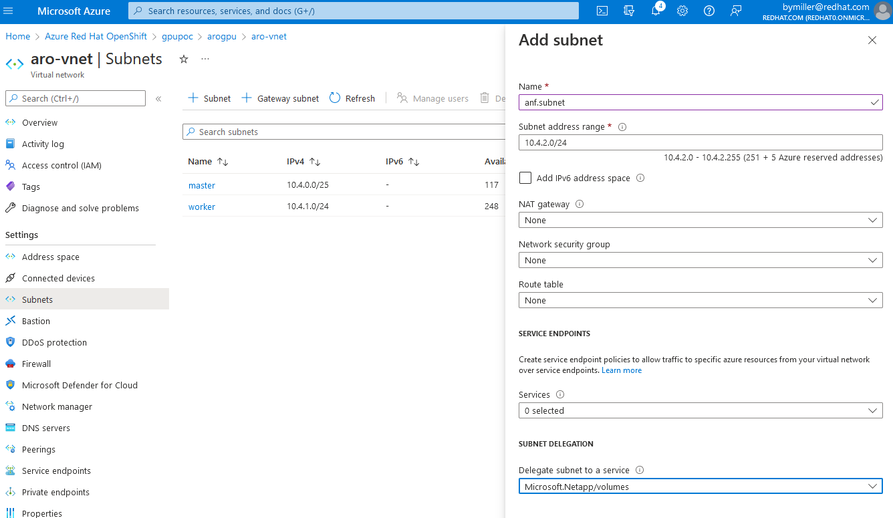
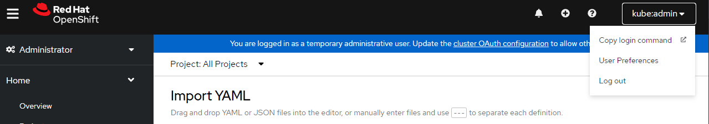
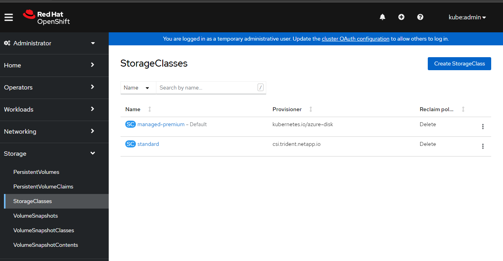
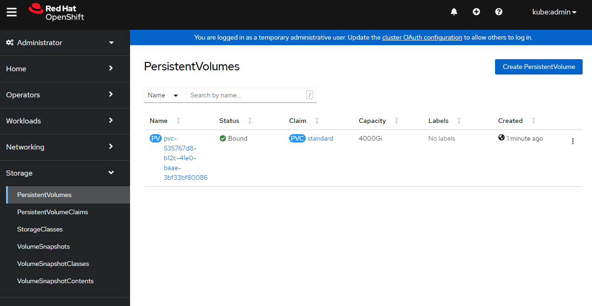
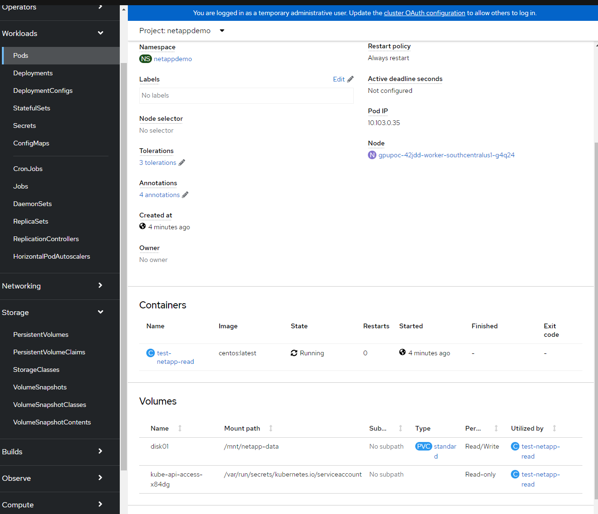

**Byron Miller**

*05/23/2022*

Note:
This guide a simple "happy path" to show the path of least friction to showcasing how to use NetApp files with Azure Red Hat OpenShift. This may not be the best behavior for any system beyond demonstration purposes.

## Prerequisites

  * An Azure Red Hat OpenShift cluster installed with Service Principal role/credentials.
  * [kubectl cli](https://kubernetes.io/releases/download/#kubectl)
  * [oc cli](https://docs.openshift.com/container-platform/4.10/cli_reference/openshift_cli/getting-started-cli.html)
  * [helm 3 cli](https://helm.sh/docs/intro/install/)
  * [Review official trident documentation](https://netapp-trident.readthedocs.io/en/stable-v21.07/kubernetes/deploying/operator-deploy.html#deploying-with-operator)

In this guide, you will need service principal and region details. Please have these handy.

* Azure subscriptionID
* Azure tenantID
* Azure clientID (Service Principal)
* Azure clientSecret (Service Principal Secret)
* Azure Region

If you don't have your existing ARO service principal credentials, you can create your own service principal and grant it contributor to be able to manage the required resources. Please review the [official Trident documentation](https://netapp-trident.readthedocs.io/en/stable-v21.07/kubernetes/deploying/operator-deploy.html#deploying-with-operator) regarding Azure NetApp files and required permissions.

### Important Concepts

Persistent Volume Claims are [namespaced objects](https://kubernetes.io/docs/concepts/storage/persistent-volumes/#a-note-on-namespaces).  Mounting RWX/ROX is only possible within the same namespace.

NetApp files must be have a delegated subnet within your ARO Vnet's and you must assign it to the Microsoft.Netapp/volumes service.

## Configure Azure

You must first register the Microsoft.NetApp provider and Create a NetApp account on Azure before you can use Azure NetApp Files.

### Register NetApp files

[Azure Console](https://docs.microsoft.com/en-us/azure/azure-netapp-files/azure-netapp-files-register)

or az cli

```bash
az provider register --namespace Microsoft.NetApp --wait
```

### Create storage account

Again, for brevity I am using the same RESOURCE_GROUP and Service Principal that the cluster was created with.

[Azure Console](https://docs.microsoft.com/en-us/azure/azure-netapp-files/azure-netapp-files-create-netapp-account)

or az cli

```bash
RESOURCE_GROUP="myresourcegroup"
LOCATION="southcentralus"
ANF_ACCOUNT_NAME="netappfiles"
```

```bash
az netappfiles account create \
    --resource-group $RESOURCE_GROUP \
    --location $LOCATION \
    --account-name $ANF_ACCOUNT_NAME
```

## Create capacity pool

Creating one pool for now. The common pattern is to expose all three levels with unique pool names respective of each service level.

[Azure Console](https://docs.microsoft.com/en-us/azure/azure-netapp-files/azure-netapp-files-set-up-capacity-pool)

or az cli:

```bash
POOL_NAME="Standard"
POOL_SIZE_TiB=4 # Size in Azure CLI needs to be in TiB unit (minimum 4 TiB)
SERVICE_LEVEL="Standard" # Valid values are Standard, Premium and Ultra
```

```bash
az netappfiles pool create \
    --resource-group $RESOURCE_GROUP \
    --location $LOCATION \
    --account-name $ANF_ACCOUNT_NAME \
    --pool-name $POOL_NAME \
    --size $POOL_SIZE_TiB \
    --service-level $SERVICE_LEVEL
```

### Delegate subnet to ARO

Login to azure console, find the subnets for your ARO cluster and click add subnet. We need to call this subnet anf.subnet since that is the name we refer to in later configuration.



## Install Trident Operator

### Login/Authenticate to ARO

Login to your ARO cluster.   You can create a token to login via cli straight from the web gui




```bash
oc login --token=sha256~abcdefghijklmnopqrstuvwxyz --server=https://api.randomseq.eastus.aroapp.io:6443
```

### Helm Install

Download latest Trident package

```bash
wget https://github.com/NetApp/trident/releases/download/v22.04.0/trident-installer-22.04.0.tar.gz
```

Extract tar.gz into working director

```bash
tar -xzvf trident-installer-22.04.0.tar.gz
```

cd into installer

```bash
cd trident-installer/helm
```

Helm install

```bash
helm install trident-operator trident-operator-22.04.0.tgz
```

Example output from installation:

```bash
W0523 17:45:22.189592   30478 warnings.go:70] policy/v1beta1 PodSecurityPolicy is deprecated in v1.21+, unavailable in v1.25+
W0523 17:45:22.484071   30478 warnings.go:70] policy/v1beta1 PodSecurityPolicy is deprecated in v1.21+, unavailable in v1.25+
NAME: trident-operator
LAST DEPLOYED: Mon May 23 17:45:20 2022
NAMESPACE: openshift
STATUS: deployed
REVISION: 1
TEST SUITE: None
NOTES:
Thank you for installing trident-operator, which will deploy and manage NetApp's Trident CSI
storage provisioner for Kubernetes.

Your release is named 'trident-operator' and is installed into the 'openshift' namespace.
Please note that there must be only one instance of Trident (and trident-operator) in a Kubernetes cluster.

To configure Trident to manage storage resources, you will need a copy of tridentctl, which is
available in pre-packaged Trident releases.  You may find all Trident releases and source code
online at https://github.com/NetApp/trident.

To learn more about the release, try:

  $ helm status trident-operator
  $ helm get all trident-operator
```

Validate

```bash
cd ..
./tridentctl -n openshift version
+----------------+----------------+
| SERVER VERSION | CLIENT VERSION |
+----------------+----------------+
| 22.04.0        | 22.04.0        |
+----------------+----------------+
```

### Install tridentctl

I put all my cli's in /usr/local/bin

```bash
sudo install tridentctl /usr/local/bin
```
example output:
```bash
which tridentctl
/usr/local/bin/tridentctl
```

## Create trident backend

FYI - Sample files for review are in sample-input/backends-samples/azure-netapp-files directory from the trident tgz we extracted earlier.

1. Replace client ID with service principal ID
2. Replace clientSecret with Service Principal Secret
3. Replace tenantID with your account tenant ID
4. Replace subscriptionID with your azure SubscriptionID
5. Ensure location matches your Azure Region

Note: I have used nfsv3 for basic compatibility. You can remove that line and use NetApp files defaults.

```bash
vi backend.json
```

Add the following snippet:

```json
{
        "version": 1,
        "nfsMountOptions": "nfsvers=3",
        "storageDriverName": "azure-netapp-files",
        "subscriptionID": "12abc678-4774-fake-a1b2-a7abcde39312",
        "tenantID": "a7abcde3-edc1-fake-b111-a7abcde356cf",
        "clientID": "abcde356-bf8e-fake-c111-abcde35613aa",
        "clientSecret": "rR0rUmWXfNioN1KhtHisiSAnoTherboGuskey6pU",
        "location": "southcentralus",
        "subnet": "anf.subnet",
        "labels": {
                "cloud": "azure"
        },
        "storage": [
                {
                        "labels": {
                                "performance": "Standard"
                        },
                        "serviceLevel": "Standard"
                }
        ]
}
```

run
```bash
tridentctl -n openshift create backend -f backend.json
```

example output:

```bash
+------------------------+--------------------+--------------------------------------+--------+---------+
|          NAME          |   STORAGE DRIVER   |                 UUID                 | STATE  | VOLUMES |
+------------------------+--------------------+--------------------------------------+--------+---------+
| azurenetappfiles_eb177 | azure-netapp-files | f7f211afe-d7f5-41a5-a356-fa67f25ee96b | online |       0 |
+------------------------+--------------------+--------------------------------------+--------+---------+
```
if you get a failure here, you can run to following command to review logs:

```bash
 tridentctl logs
 ```

 To view log output that may help steer you in the right direction.

### Create storage class

```bash
cat <<EOF | kubectl apply -f -
apiVersion: storage.k8s.io/v1
kind: StorageClass
metadata:
  name: standard
provisioner: csi.trident.netapp.io
parameters:
  backendType: "azure-netapp-files"
  fsType: "nfs"
  selector: "performance=Standard"    # Matching labels in the backends...
allowVolumeExpansion: true            # To allow volume resizing. This parameter is optional
mountOptions:
  - nconnect=16
EOF
```
output:

```bash
storageclass.storage.k8s.io/standard created
```

### Provision volume

Let's create a new project and set up a persistent volume claim. Remember that PV Claims are namespaced objects and you must create the pvc in the namespace where it will be allocated. I'll use the project "netappdemo".

```bash
oc new-project netappdemo
```

Now we'll create a PV claim in the "netappdemo" project we just created.

```bash
cat <<EOF | kubectl apply -f -
kind: PersistentVolumeClaim
apiVersion: v1
metadata:
  name: standard
spec:
  accessModes:
    - ReadWriteMany
  resources:
    requests:
      storage: 4000Gi
  storageClassName: standard
EOF
```

output:
```bash
persistentvolumeclaim/standard created
```

## Verify

Quick verification of storage, volumes and services.

### Verify Kubectl

```bash
➜  kubectl get storageclass
NAME                        PROVISIONER                RECLAIMPOLICY   VOLUMEBINDINGMODE      ALLOWVOLUMEEXPANSION   AGEmanaged-premium (default)   kubernetes.io/azure-disk   Delete          WaitForFirstConsumer true                   3h26m
standard                    csi.trident.netapp.io      Delete          Immediate              true                   5m5s
➜
```

### Verify OpenShift

Login to your cluster as cluster-admin and verify your storage classes and persistent volumes.

Storage Class



Persisent Volumes



## Create Pods to test Azure NetApp

We'll create two pods here to exercise the Azure NetApp file mount. One to write data and another to read data to show that it is mounted as "read write many" and correctly working.

### Writer Pod

This pod will write "hello netapp" to a shared NetApp mount.

```yaml
cat <<EOF | oc apply -f -
apiVersion: v1
kind: Pod
metadata:
  name: test-netapp
  labels:
    app: test-aznetapp
    deploymethod: trident
spec:
  containers:
    - name: aznetapp
      image: centos:latest
      command: ["/bin/bash", "-c", "--"]
      resources:
        limits:
          cpu: 1
          memory: "1Gi"
      args:
        [
          "while true; do echo 'hello netapp' | tee -a /mnt/netapp-data/verify-netapp && sleep 5; done;",
        ]
      volumeMounts:
        - name: disk01
          mountPath: "/mnt/netapp-data"
  volumes:
    - name: disk01
      persistentVolumeClaim:
        claimName: standard
EOF
```

You can watch for this container to be ready:

```bash
watch oc get pod test-netapp
```

Or view it in the OpenShift Pod console for the netappdemo project.


### Reader Pod

This pod will read back the data from the shared NetApp mount.

```yaml
cat <<EOF | oc apply -f -
apiVersion: v1
kind: Pod
metadata:
  name: test-netapp-read
spec:
  containers:
    - name: test-netapp-read
      image: centos:latest
      command: ["/bin/bash", "-c", "--"]
      resources:
        limits:
          cpu: 1
          memory: "1Gi"
      args: ["tail -f /mnt/netapp-data/verify-netapp"]
      volumeMounts:
        - name: disk01
          mountPath: "/mnt/netapp-data"
  volumes:
    - name: disk01
      persistentVolumeClaim:
        claimName: standard
EOF
```

Now let's verify the POD is reading from shared volume.

```bash
oc logs test-netapp-read
hello netapp
hello netapp
hello netapp
hello netapp
hello netapp
hello netapp
hello netapp
hello netapp
hello netapp
hello netapp
```

You can also see the pod details in OpenShift for the reader:


