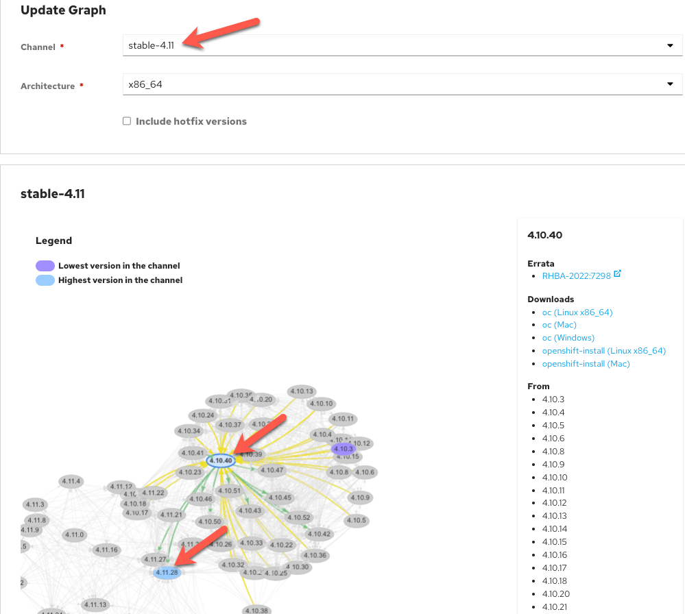

**Aaron Green & Kevin Collins**

*03/02/2022*

## Background
One of the great features of ARO is that you can create 'disconnected' clusters with no connectivity to the Internet.  Out of the box, the ARO service mirrors all the code repositories to build OpenShift clusters to Azure Container Registry.  This means ARO is built without having to reach out to the Internet as the images to build OpenShift are pulled via the Azure private network.

When you upgrade a cluster, OpenShift needs to call out to the Internet to get an upgrade graph to see what options you have to upgrade the cluster.  This of course breaks the concept of having a disconnected cluster.  This guide goes through how to upgrade ARO without having the cluster reach out to the Internat and maintaining the disconnected nature of an ARO cluster.

### Prerequisites

  * A Private Azure Red Hat OpenShift cluster with no Internet Connectivity

## Check upgrade path

* ***NOTE:*** This step is VERY important. In a future step, you need to have already validated that the version you are upgrading to is safe to do so.

1. First check which version your cluster is at:
   ```bash
   oc get clusterversion version
   ```

   Note the server version. 
   ```bash
   NAME      VERSION   AVAILABLE   PROGRESSING   SINCE   STATUS
   version   4.10.40   True        False         14h     Cluster version is 4.10.40
   ```
 
2. Verify you are selecting a valid version to upgrade to.  Go to https://access.redhat.com/labsinfo/ocpupgradegraph

   Under Channel, select the stable minor version that you want to upgrade the cluster to.  In this example, we have 4.10 cluster that is at patch level 40 and we want to upgrade it to 4.11.  Note that you can also update patch versions.

   On the next screen, start by selecting the version your cluster is at. In example below, we'll select 4.10.40.

   Then select the version you want to upgrade to ensuring there is a green line showing the upgrade path is recommended.  In example, we select version 4.11.28.

   

## Upgrade the cluster

* ***NOTE:*** In step 2 below, you are explicitly telling the cluster to upgrade to an image digest value and must use the `--force` flag because the cluster has no ability to validate the image digest value without Internet connectivity. Please ensure you have completed the step to check upgrade path so that you are upgrading the cluster to a version with a supported path from the current cluster version you're on.

1. Retrieve the image digest of the OpenShift version you want to upgrade to:

   ```bash
   export VERSION=4.11.28 # Update to your desired version 
   curl -s https://mirror.openshift.com/pub/openshift-v4/clients/ocp/"${VERSION}"/release.txt | grep "Pull From:"
   ```
   Expected Output:
   ```bash
   Pull From: quay.io/openshift-release-dev/ocp-release@sha256:85238bc3eddb88e958535597dbe8ec6f2aa88aa1713c2e1ee7faf88d1fefdac0
   ```
   
2. Perform the Upgrade

    > Set the image to the desired values from the above command.

   ```bash
   oc adm upgrade --allow-explicit-upgrade --to-image=quay.io/openshift-release-dev/ocp-release@sha256:1c3913a65b0a10b4a0650f54e545fe928360a94767acea64c0bd10faa52c945a --force
   ```
3. Check the status of the scheduled upgrade

   ```bash
   oc get clusterversion version
   ```
   When the upgrade is complete you will see the following:

   ```
   NAME      VERSION   AVAILABLE   PROGRESSING   SINCE   STATUS
   version   4.11.28    True        False         161m    Cluster version is 4.11.28
   ```
