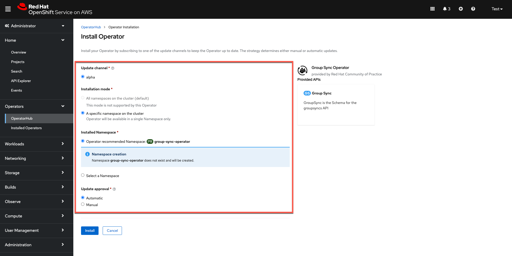

**Steve Mirman**

*8 November 2021*

This guide focuses on how to synchronize Identity Provider (IDP) groups and users after configuring authentication in OpenShift Cluster Manager (OCM). For an IDP configuration example, please reference the [Configure Azure AD as an OIDC identity provider for ROSA/OSD](https://mobb.ninja/docs/idp/azuread/) guide.

To set up group synchronization from Azure Active Directory (AD) to ROSA/OSD you must:

1. Define groups and assign users in Azure AD
1. Add the required API permissions to the app registration in Azure AD
1. Install the Group Sync Operator from the OpenShift Operator Hub
1. Create and configure a new Group Sync instance
1. Set a synchronization schedule
1. Test the synchronization process

## Define groups and assign users in Azure AD ##

To synchronize groups and users with ROSA/OSD they must exist in Azure AD

1. Create groups to syncronize with ROSA/OSD if they do not already exist

    

1. Create user IDs to synchronize with ROSA/OSD if they do not already exist

    

1. Assign newly created users to the appropriate group

    

## Add API Permissions to Azure AD App Registration

The GroupSync job requires permissions on the Azure AD tenant beyond those of the OIDC IdP. For it to work, add the these entries:

- `Group.ReadAll`
- `GroupMember.ReadAll`
- `User.ReadAll`

..under the 'API Permissions' menu item. These three should all be 'Application' rather than 'Delegated' and this will require clicking on 'Grant admin consent' button above the permissions list. When done, the screen should look like this:

    

## Install the Group Sync Operator from the OpenShift Operator Hub ##

1. In the OpenShift Operator Hub find the **Group Sync Operator**

    

1. Install the operator in the `group-sync-operator` namespace

    

## Create and configure a new Group Sync instance ##

1. Create a new secret named `azure-group-sync` in the **group-sync-operator** namespace. For this you will need the following values:
    - AZURE_TENANT_ID
    - AZURE_CLIENT_ID
    - AZURE_CLIENT_SECRET

1. Using the OpenShift CLI, create the secret using the following format:

        oc create secret generic azure-group-sync \
        --from-literal=AZURE_TENANT_ID=<insert-id> \
        --from-literal=AZURE_CLIENT_ID=<insert-id> \
        --from-literal=AZURE_CLIENT_SECRET=<insert-secret>

1. Create a new Group Sync instance in the `group-sync-operator` namespace

    

1. Select all the default YAML and replace is with a modified version of the the example below, customizingthe YAML to match the group names and save the configuration.

    

    Sample YAML:
    ```
    apiVersion: redhatcop.redhat.io/v1alpha1
    kind: GroupSync
    metadata:
        name: azure-groupsync
        namespace: group-sync-operator
    spec:
        providers:
            - name: azure
              azure:
                credentialsSecret:
                  name: azure-group-sync
                  namespace: group-sync-operator
              groups:
                - rosa_admin
                - rosa_project_owner
                - rosa_viewer
              prune: false
        schedule: '* * * * *'
    ```

## Set a synchronization schedule ##

The Group Sync Operator provides a cron-based scheduling parameter for specifying how often the groups and users should be synchronized. This can be set in the instance YAML file during initial configuration or at any time after.

The schedule setting of `schedule: * * * * *` would result in synchronization occuring every minute. It also supports the cron "slash" notation (e.g., "*/5 * * * *", which would synchronize every five minutes).

## Testing the synchronization process ##

- Check to see if the Group Sync process has completed with a `Condition: ReconcileSuccess` message

    

1. Check to see that all the groups specified in the configuration YAML file show up in the ROSA/OSD Groups list

    

1. Validate that all users specified in Azure AD also show up as members of the associated group in ROSA/OSD

    

1. Add a new user in Azure AD and assign it to the admin group

    

1. Verify that the user now appears in ROSA/OSD (after the specified synchronization time)

    

1. Now delete a user from the Azure AD admin group

    

1. Verify the user has been deleted from the ROSA/OSD admin group

    

## Binding Groups to Roles

The preceding steps provide a method to get group membership information into OpenShift, but the final step in translating that into user authorization control requires binding each group to a role or roles on the cluster. This can be done via the OCP web console by opening the Group detail, or by applying YAML via the CLI.

## Additional Notes

1. The `prune` key in the YAML controls how the sync handles groups that are removed from Azure AD. If they key isn't present, the default value is `false`, which means that if a group is removed from Azure AD, it will still persist in OpenShift. If it is set to `true`, removal of a group from Azure AD will also remove the corresponding OpenShift Group.

1. If there is a need to have multiple GroupSync configurations against multiple providers, note that there is no "merge" functionality in the operator when it comes to group membership. If a group named `ocp-admins` is present in two directories with sync jobs, they will effectively overwrite each other each time the sync job runs. It is recommended to name groups intended for use on OCP such that they indicate from which directory they originate (e.g., `azure-ocp-admins` or something like `contoso_ocp_admins` in the case of multiple Azure AD providers). Bind multiple groups with the same permissions needs to the same `Role` or `ClusterRole` as needed.
