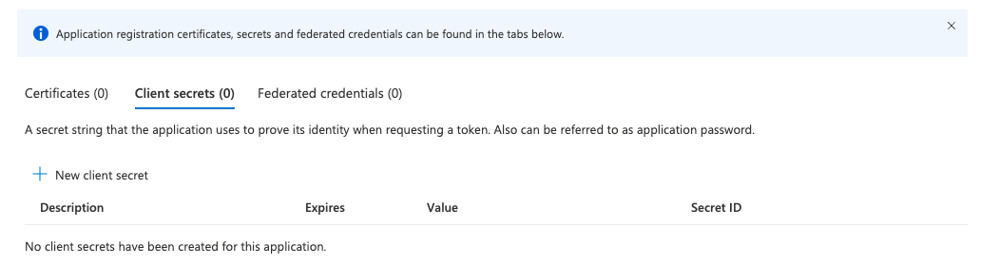
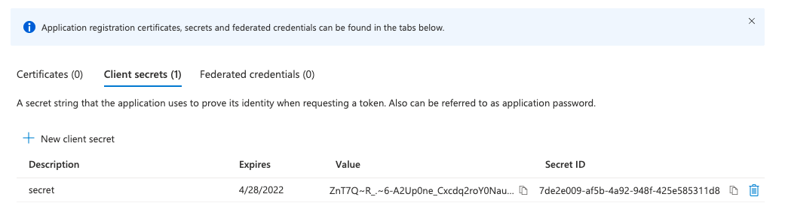

# Configure Azure AD as an OIDC identity provider for ROSA/OSD #

**Andrea Bozzoni, Steve Mirman**

*27 October 2021*

The steps to add Azure AD as an identity provider for Red Hat OpenShift on AWS (ROSA) and OpenShift Dedicated (OSD) are:

1. Define the OAuth callback URL
1. Register a new Webapp on Azure AD
1. Create the client secret
1. Configure the Token
1. Configure the OAuth identity provider in OCM

## Define the OAuth callback URL ##

You can find the callback URL in [OpenShift Cluster Manager](https://console.redhat.com/openshift/) (OCM)

1. Select your cluster in OCM and then go to the **'Access control'** tab.

    

1. Pick OpenID as identity provider from the identity providers list.

    

1. Give a name to the identity provider that we are adding to the OCP cluster

    

1. Keep the OAuth callback URL to use later.

    > **Note:** the OAuth Callback has the following format:

    ```
    https://oauth-openshift.apps.<cluster_name>.<cluster_domain>/oauth2callback/<idp_name>
    ```

## Register a new Webapp on Azure AD ##

Access your Azure account and select the Azure Active Directory service and execute the following steps:

1. From the main menu add a new Webapp

    

1. Set the **Name** to <cluster_name> or something else unique to the cluster, set the  **Redirect URI** to the callback URL from above and click 'Register'

    

1. Remember **Application (client) ID** and **Directory (tenant) ID** to be used later

    

## Create the client secret ##

1. Create a new Secret for the Webapp

    

1. Remember the **Secret Value** to be used later in the OCM OAuth configuration

    

## Configure the Token ##

1. Create a new token configuration

    

1. Select **upn** and **email** as optional claims

    

1. Specify that the claim must be returned in the token.

    

## Configure the OAuth identity provider in OCM ##

1. In the OCM fill all the fields with the values collected during the registration of the new Webapp in the Azure AD and click the 'Add' button.

    

1. After a few minutes the Azure AD authentication methos will be available in the OpenShift console login screen

    