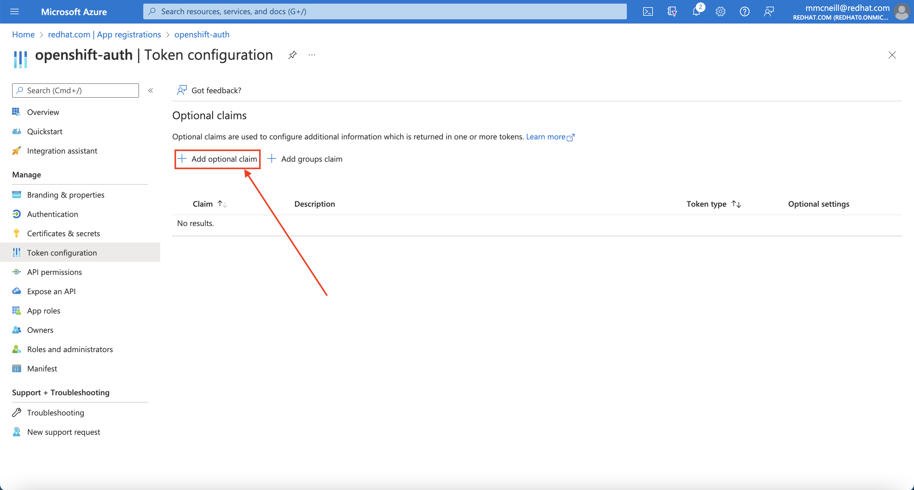

**Michael McNeill, Andrea Bozzoni, Steve Mirman**

*23 September 2022*

This guide demonstrates how to configure Azure AD as the cluster identity provider in Red Hat OpenShift Service on AWS (ROSA). This guide will walk through the creation of an Azure Active Directory (Azure AD) application and configure Red Hat OpenShift Service on AWS (ROSA) to authenticate using Azure AD.

This guide will walk through the following steps:

1. Register a new application in Azure AD for authentication.
2. Configure the application registration in Azure AD to include optional and group claims in tokens.
3. Configure the OpenShift cluster to use Azure AD as the identity provider.
4. Grant additional permissions to individual groups.

## Before you Begin

Create a set of security groups and assign users by following [the Microsoft documentation](https://docs.microsoft.com/en-us/azure/active-directory/fundamentals/active-directory-groups-create-azure-portal).

In addition, if you are using `zsh` as your shell (which is the default shell on macOS) you may need to run `set -k` to get the below commands to run without errors. [This is because `zsh` disables comments in interactive shells from being used](https://zsh.sourceforge.io/Doc/Release/Options.html).

## 1. Register a new application in Azure AD for authentication

### Capture the OAuth callback URL
First, construct the cluster's OAuth callback URL and make note of it. To do so, run the following command, making sure to replace the variable specified:

The "AAD" directory at the end of the the OAuth callback URL should match the OAuth identity provider name you'll setup later.

```bash
CLUSTER_NAME=example-cluster # Replace this with the name of your ROSA cluster
domain=$(rosa describe cluster -c $CLUSTER_NAME | grep "DNS" | grep -oE '\S+.openshiftapps.com')
echo "OAuth callback URL: https://oauth-openshift.apps.$domain/oauth2callback/AAD"
```

### Register a new application in Azure AD

Second, you need to create the Azure AD application itself. To do so, login to the Azure portal, and navigate to [App registrations blade](https://portal.azure.com/#blade/Microsoft_AAD_RegisteredApps/ApplicationsListBlade), then click on "New registration" to create a new application.


Provide a name for the application, for example `openshift-auth`. Select "Web" from the Redirect URI dropdown and fill in the Redirect URI using the value of the OAuth callback URL you retrieved in the previous step. Once you fill in the necessary information, click "Register" to create the application.


Then, click on the "Certificates & secrets" sub-blade and select "New client secret". Fill in the details request and make note of the generated client secret value, as you'll use it in a later step. You won't be able to retrieve it again.


Then, click on the "Overview" sub-blade and make note of the "Application (client) ID" and "Directory (tenant) ID". You'll need those values in a later step as well.

## 2. Configure optional claims

In order to provide OpenShift with enough information about the user to create their account, we will configure Azure AD to provide two optional claims, specifically "email" and "preferred_username" when a user logs in. For more information on optional claims in Azure AD, see [the Microsoft documentation](https://docs.microsoft.com/en-us/azure/active-directory/develop/active-directory-optional-claims).

Click on the "Token configuration" sub-blade and select the "Add optional claim" button.



Select ID then check the "email" and "preferred_username" claims and click the "Add" button to configure them for your Azure AD application.


When prompted, follow the prompt to enable the necessary Microsoft Graph permissions.


## 3. Configure the OpenShift cluster to use Azure AD as the identity provider

Finally, we need to configure OpenShift to use Azure AD as its identity provider. While Red Hat OpenShift Service on AWS (ROSA) offers the ability to configure identity providers via the OpenShift Cluster Manager (OCM), that functionality does not currently support group claims. Instead, we'll configure the cluster's OAuth provider to use Azure AD as its identity provider via the `rosa` CLI. To do so, run the following command, making sure to replace the variable specified:

```bash
CLUSTER_NAME=example-cluster # Replace this with the name of your ROSA cluster
IDP_NAME=AAD # Replace this with the name you used in the OAuth callback URL
APP_ID=yyyyyyyy-yyyy-yyyy-yyyy-yyyyyyyyyyyy # Replace this with the Application (client) ID
CLIENT_SECRET=xxxxxxxx-xxxx-xxxx-xxxx-xxxxxxxxxxxx # Replace this with the Client Secret
TENANT_ID=zzzzzzzz-zzzz-zzzz-zzzz-zzzzzzzzzzzz # Replace this with the Directory (tenant) ID
rosa create idp \
    --cluster ${CLUSTER_NAME} \
    --type openid \
    --name ${IDP_NAME} \
    --client-id ${APP_ID} \
    --client-secret ${CLIENT_SECRET} \
    --issuer-url https://login.microsoftonline.com/${TENANT_ID}/v2.0 \
    --email-claims email \
    --name-claims name \
    --username-claims preferred_username
```

## 4. Grant additional permissions to individual users

Once the cluster authentication operator reconciles your changes (generally within a few minutes), you will be able to login to the cluster using Azure AD.

Once you login, you will notice that you have very limited permissions. This is because, by default, OpenShift only grants you the ability to create new projects (namespaces) in the cluster. Other projects (namespaces) are restricted from view.

OpenShift includes a significant number of pre-configured roles, including the `cluster-admin` role that grants full access and control over the cluster. To grant your user access to the `cluster-admin` role, run the following command:

```bash
USERNAME=example@redhat.com # Replace with your Azure AD username
rosa grant user cluster-admin \
    --user=${USERNAME} \
    --cluster=${CLUSTER_NAME}
```

For more information on how to use RBAC to define and apply permissions in OpenShift, see [the OpenShift documentation](https://docs.openshift.com/container-platform/latest/authentication/using-rbac.html).
