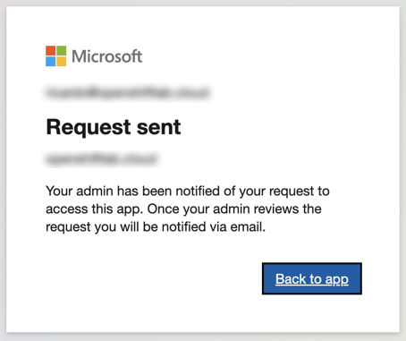

Author: [Ricardo Macedo Martins](https://www.linkedin.com/in/ricmmartins)

*May 24, 2023*

In this guide, we will discuss key considerations when using Azure Active Directory (AAD) as the Identity Provider (IDP) for your ARO or ROSA cluster. Below are some helpful references:

* [Configure ARO to Use Azure AD](../azuread-aro/)
* [Configuring IDP for ROSA, OSD, and ARO](../azuread/)

## Default Access for All Users in Azure Active Directory

Once you set up AAD as the IDP for your cluster, it's important to note that by default, all users in your Azure Active Directory instance will have access to the cluster. They can log in using their AAD credentials through the OpenShift Web Console endpoint:

However, for security purposes, it's recommended to restrict access and only allow specific users who are assigned to access the cluster.

## Restricting Access

To implement access restrictions, follow these steps:

1. Log in to the Azure Portal and navigate to your AAD instance.

2. Under Enterprise applications, select the application created for the ARO IDP configuration.

3. In the selected Enterprise application, go to Properties and switch the **"Assignment required?"** option to **YES**.

4. If you attempt to log in at this point, you will receive a denial error:

Enter your username:

Enter your password:

The error message indicates that only users specifically granted access to the application are allowed:

5. To allow access, go to Users and groups in the main blade, click **+ Add user/group**, and add the desired users/groups who should have access to the ARO cluster.

Search for the desired user/group and click **Select**.

Verify that the user has been assigned:

6. You should now be able to log in with the specified user/group to your cluster:

Enter your username:

Enter your password:

You will then be logged in:

## Approval Workflow

If you receive a message like the one below, it means that your AAD has the [admin consent workflow](https://learn.microsoft.com/en-us/azure/active-directory/manage-apps/configure-admin-consent-workflow) enabled:

In this case, you will need to request and wait for approval from your AAD domain admin. 
To request access, fill out the request form:

And wait for approval:

## Self-Approval Process

If you have administrative privileges, you can self-approve the request by following these steps:

> Please note that these steps are based on the official guidance from Microsoft, which is [available here.](https://learn.microsoft.com/en-us/azure/active-directory/manage-apps/review-admin-consent-requests)

1. Go to your Azure Active Directory Tenant > Enterprise Applications > Admin Consent Requests > All (Preview):

2. Select the application (openshift, in this case) and click **Review permissions and consent**:

3. A new window will open, prompting you to log in with credentials of an admin with permissions:

4. Click **Accept** to consent to the permission:

You will then see that the request was approved:

Now you will be able to log in through the AAD option:

Enter your username:

Enter your password:

It worked!

As a best practice, we recommend removing the kubeadmin user after setting up an identity provider. You can find instructions on how to do this [here](https://docs.openshift.com/container-platform/4.13/authentication/remove-kubeadmin.html).

## Using the Group Sync Operator

Integrating groups from external identity providers with OpenShift, such as synchronizing groups from AAD, can be a valuable feature to enhance your system's functionality. To accomplish this, you can leverage the usage of the [Group Sync Operator](https://github.com/redhat-cop/group-sync-operator). 

We have published a comprehensive how-to guide that walks you through the process, [accessible here](../az-ad-grp-sync). By following these instructions, you'll be able to seamlessly synchronize AAD groups into your OpenShift environment, optimizing your workflow and streamlining access management.

