# Configure GitLab as an identity provider for ARO #

**Steve Mirman**

*28 March 2022*

The following instructions will detail how to configure GitLab as the identity provider for Azure Red Hat OpenShift:

1. Register a new application in GitLab
1. Create OAuth callback URL in ARO
1. Log in and confirm
1. Add administrative users or groups

## Register a new application in GitLab ##

Log into **GitLab** and execute the following steps:

1. Go to **Preferences**

    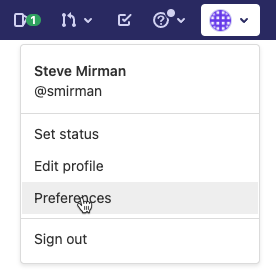

1. Select **Applications** from the left navigation bar

    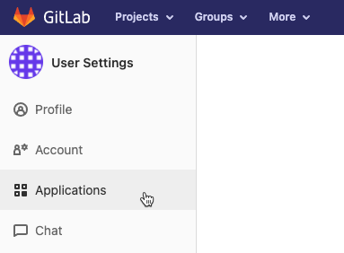

1. Provide a **Name** and enter an **OAuth Callback URL** as the **Redirect URI** in GitLab

    > **Note:** the OAuth Callback has the following format:
        ```
        https://oauth-openshift.apps.<cluster-id>.<region>.aroapp.io/oauth2callback/GitLab
        ```

    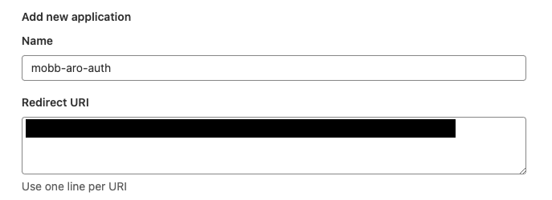

1. Check the **openid** box and save the application

    

1. After saving the GitLab application you will be provided with an **Application ID** and a **Secret**

    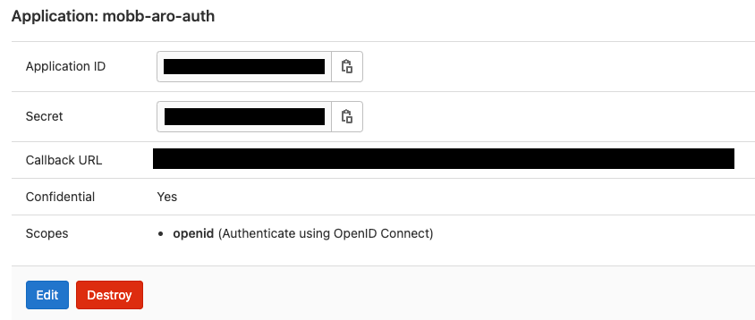

1. Copy both the **Application ID** and **Secret** for use in the ARO console

## Create OAuth provider in ARO ##

Log in to the ARO console as an administrator to add a GitLab identity provider

1. Select the **'Administration'** drop down and click **'Cluster Settings'**

    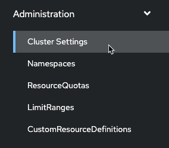

1. On the **'Configuration'** scroll down and click on **'OAuth'**

    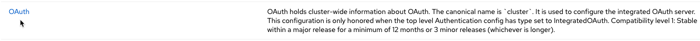

1. Select **'GitLab'** from the Identity Providers drop down

    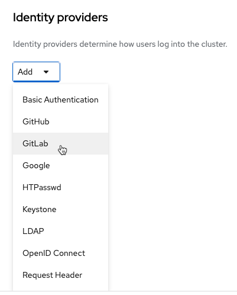

1. Enter a **Name**, the base **URL** of your GitLab OAuth server, and the **Client ID** and **CLient Secret** from the previous step

    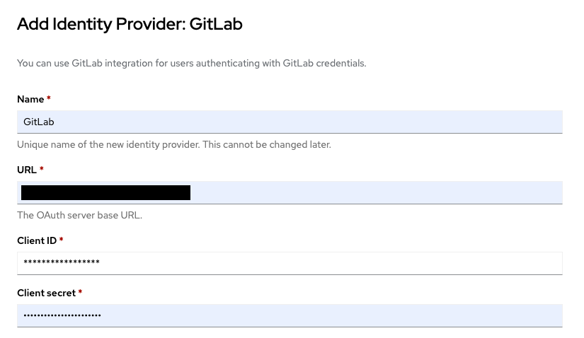

1. Click **Add** to confirm the configuration

    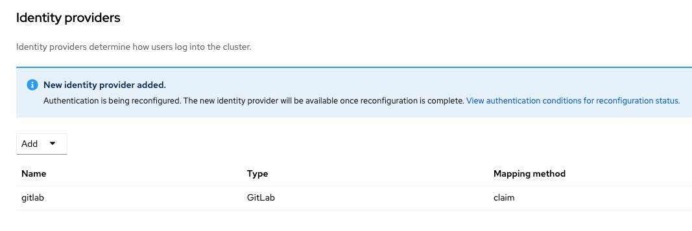

## Log in and confirm ##

1. Go to the ARO console in a new browser to bring up the OpenShift login page. An option for **GitLab** should now be available.

    > Note: I can take 2-3 minutes for this update to occur

    

1. After selecting GitLab for the first time an authorization message will appear. Click **Authorize** to confirm.

    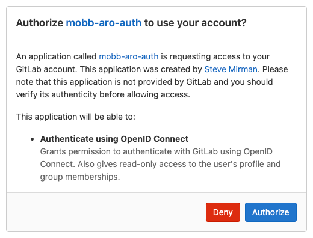

1. Once you have successfully logged in using GitLab, your userid should display under **Users** in the **User Management** section of the ARO console

    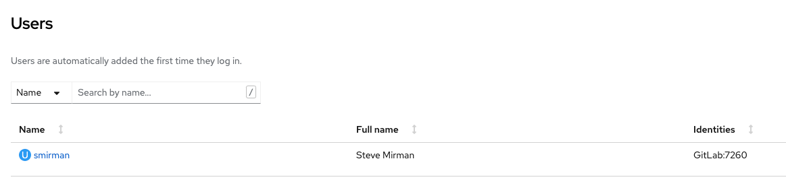

    > Note: On initial login users do NOT have elevated access


## Add administrative users or groups ##

1. Now that the GitLab identity provider is configured, it is possible to add authenticated users to elevated OpenShift roles. This can be accomplished at the user or group level.

1. To elevate a users permissions, select the user in the OpenShift console and click **Create Binding** from the **RoleBindings** tab

    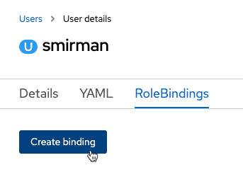

1. Choose the scope (namespace/cluster), assign a name to the RoleBinding, and choose a role.

    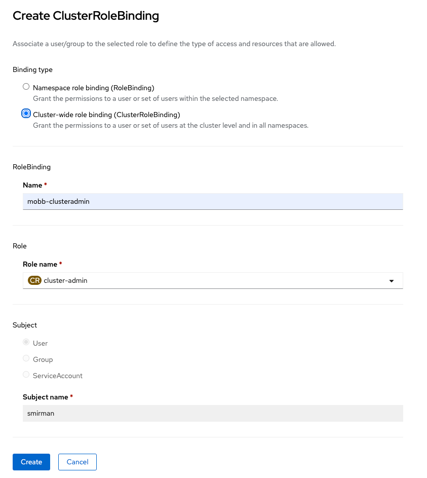

1. After clicking **Create** the assigned user will have elevated access once they log in.

    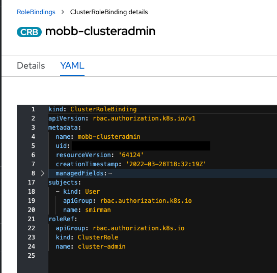

1. To elevate a groups permissions, create a group in the OpenShift console.

    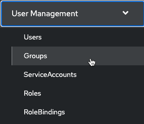

1. Edit the group YAML to specify a custom name and initial user set

    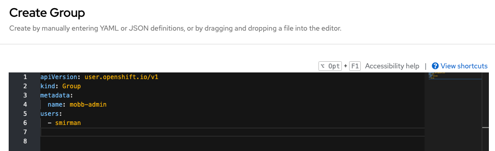

1. Create a RoleBinding for the group, similar to what was configured previously for an individual user

    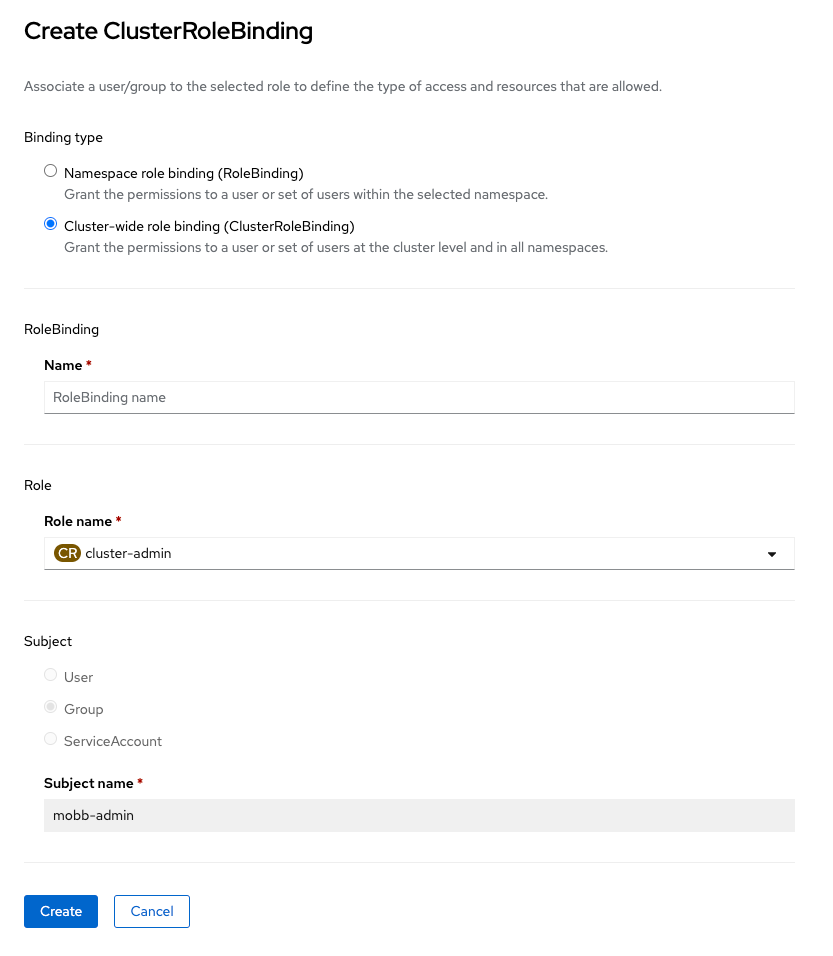

1. Add additional users to the YAML file as needed and they will assume the elevated access

    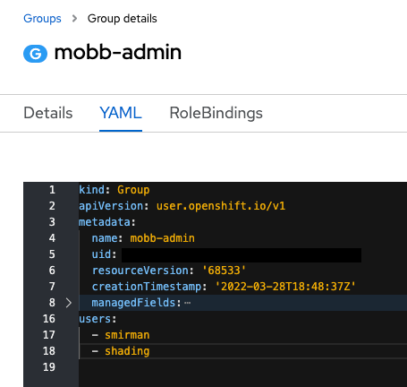