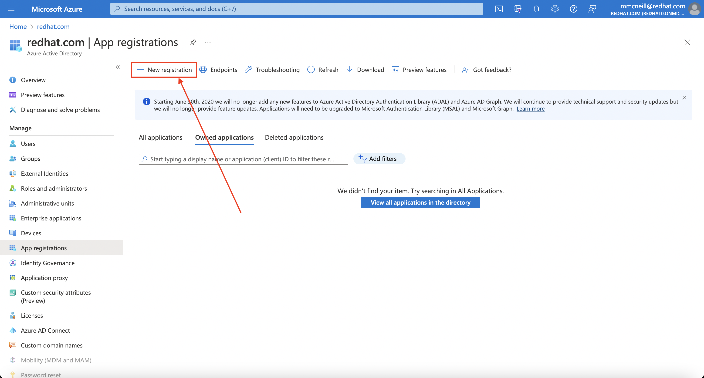
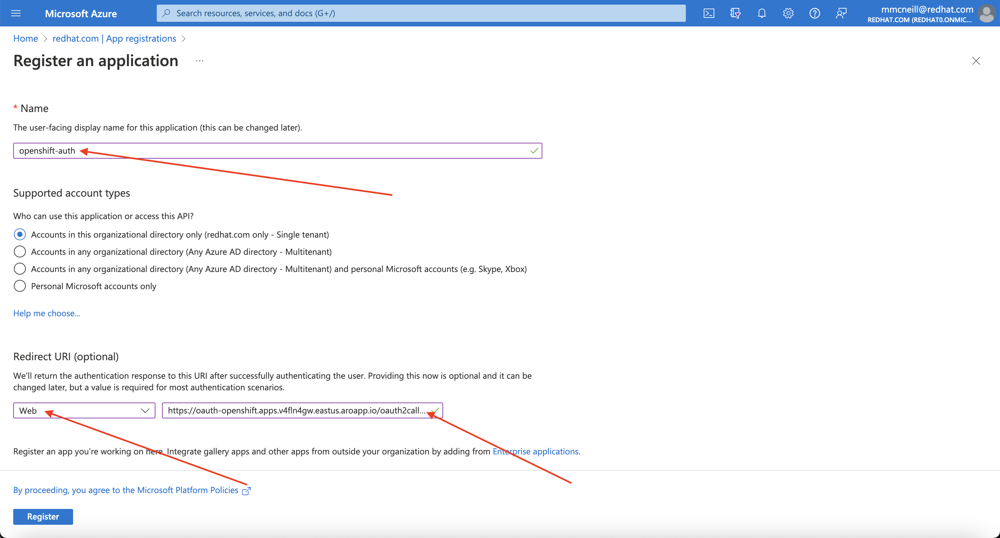
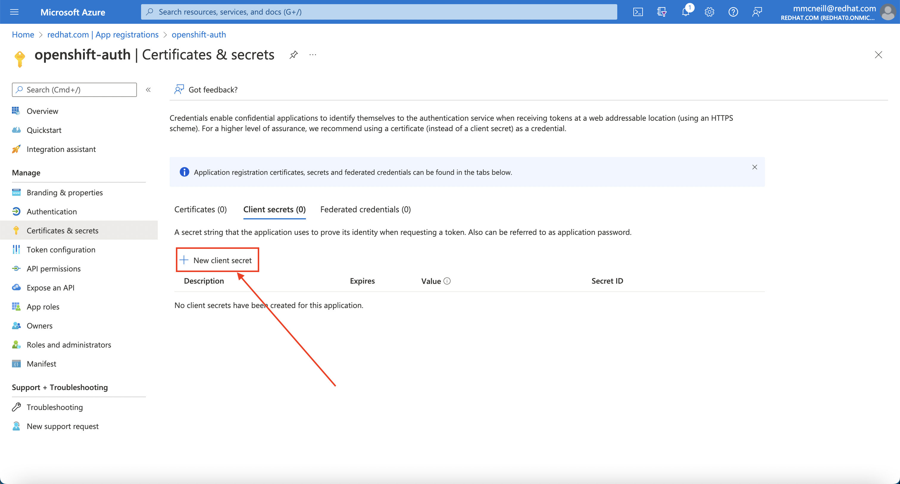
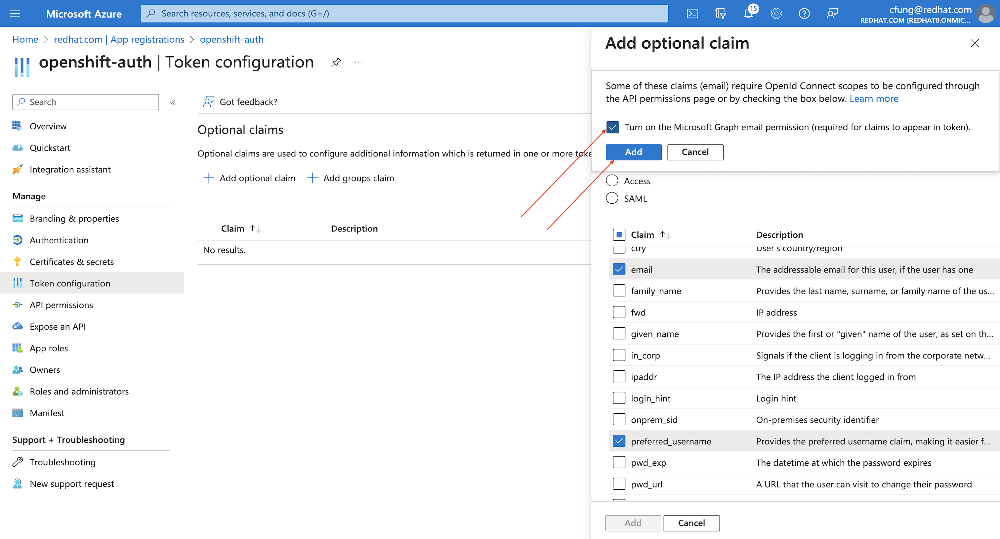
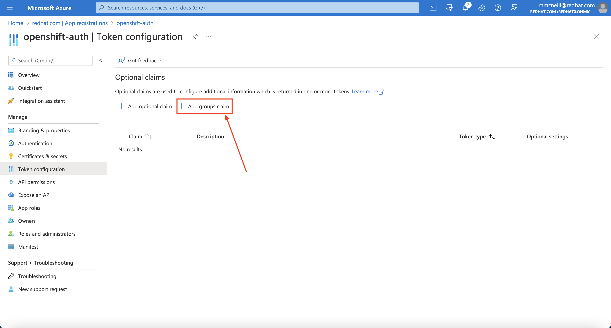
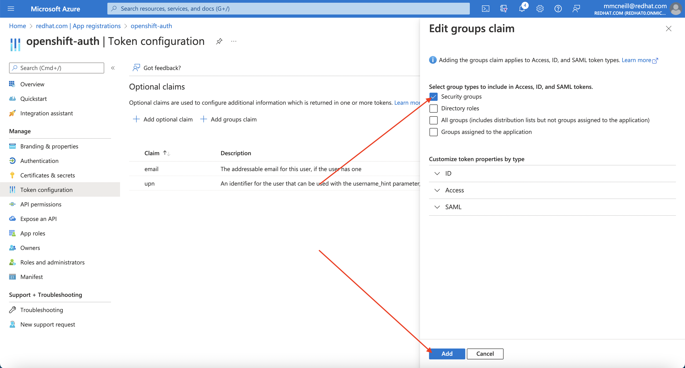
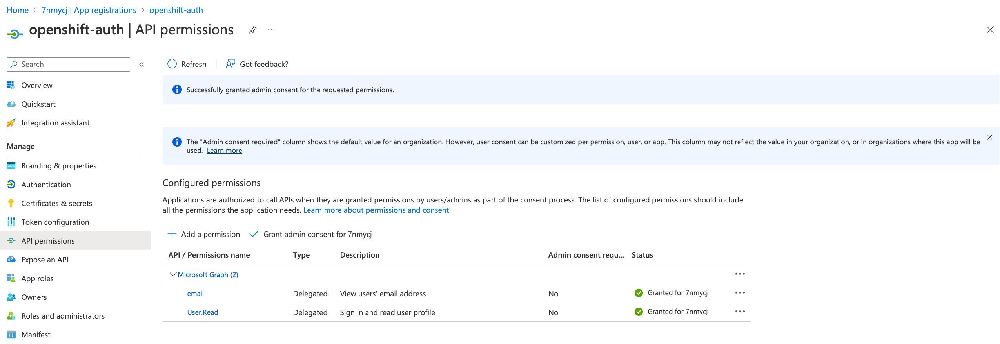
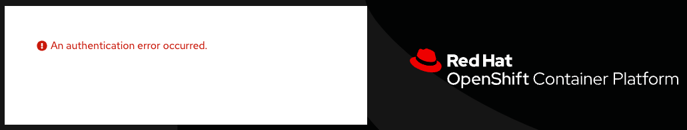
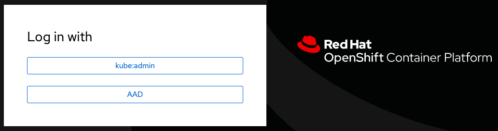

Authors: **Michael McNeill**, **Ricardo M. Martins**

*24 May 2023*

This guide demonstrates how to utilize the OpenID Connect group claim functionality implemented in OpenShift 4.10. This functionality allows an identity provider to provide a user's group membership for use within OpenShift. This guide will walk through the creation of an Azure Active Directory (Azure AD) application, configure the necessary Azure AD groups, and configure Azure Red Hat OpenShift (ARO) to authenticate and manage authorization using Azure AD.

This guide will walk through the following steps:

1. Register a new application in Azure AD for authentication.
2. Configure the application registration in Azure AD to include optional and group claims in tokens.
3. Configure the Azure Red Hat OpenShift (ARO) cluster to use Azure AD as the identity provider.
4. Grant additional permissions to individual groups.

## Before you Begin

Create a set of security groups and assign users by following [the Microsoft documentation](https://docs.microsoft.com/en-us/azure/active-directory/fundamentals/active-directory-groups-create-azure-portal).

In addition, if you are using `zsh` as your shell (which is the default shell on macOS) you may need to run `set -k` to get the below commands to run without errors. [This is because `zsh` disables comments in interactive shells from being used](https://zsh.sourceforge.io/Doc/Release/Options.html).

## 1. Register a new application in Azure AD for authentication

### Capture the OAuth callback URL
First, construct the cluster's OAuth callback URL and make note of it. To do so, run the following command, making sure to replace the variables specified:

The "AAD" directory at the end of the the OAuth callback URL should match the OAuth identity provider name you'll setup later.

```bash
RESOURCE_GROUP=example-rg # Replace this with the name of your ARO cluster's resource group
CLUSTER_NAME=example-cluster # Replace this with the name of your ARO cluster
echo 'OAuth callback URL: '$(az aro show -g $RESOURCE_GROUP -n $CLUSTER_NAME --query consoleProfile.url -o tsv | sed 's/console-openshift-console/oauth-openshift/')'oauth2callback/AAD'
```

### Register a new application in Azure AD

Second, you need to create the Azure AD application itself. To do so, login to the Azure portal, and navigate to [App registrations blade](https://portal.azure.com/#blade/Microsoft_AAD_RegisteredApps/ApplicationsListBlade), then click on "New registration" to create a new application.



Provide a name for the application, for example `openshift-auth`. Select "Web" from the Redirect URI dropdown and fill in the Redirect URI using the value of the OAuth callback URL you retrieved in the previous step. Once you fill in the necessary information, click "Register" to create the application.



Then, click on the "Certificates & secrets" sub-blade and select "New client secret". Fill in the details request and make note of the generated client secret value, as you'll use it in a later step. You won't be able to retrieve it again.




Then, click on the "Overview" sub-blade and make note of the "Application (client) ID" and "Directory (tenant) ID". You'll need those values in a later step as well.

## 2. Configure optional claims (for optional and group claims)

In order to provide OpenShift with enough information about the user to create their account, we will configure Azure AD to provide two optional claims, specifically "email" and "preferred_username", as well as a group claim when a user logs in. For more information on optional claims in Azure AD, see [the Microsoft documentation](https://docs.microsoft.com/en-us/azure/active-directory/develop/active-directory-optional-claims).

Click on the "Token configuration" sub-blade and select the "Add optional claim" button.


Select ID then check the "email" and "preferred_username" claims and click the "Add" button to configure them for your Azure AD application.


When prompted, follow the prompt to enable the necessary Microsoft Graph permissions.



Next, select the "Add groups claim" button.



Select the "Security groups" option and click the "Add" button to configure group claims for your Azure AD application.

> **Note:** In this example, we are providing all security groups a user is a member of via the group claim. In a real production environment, we highly recommend _scoping the groups provided by the group claim to _only those groups which are applicable to OpenShift_.



Grant the admin consent for the in the API Permission section



## 3. Configure the OpenShift cluster to use Azure AD as the identity provider

Finally, we need to configure OpenShift to use Azure AD as its identity provider.

To do so, ensure you are logged in to the OpenShift command line interface (`oc`) by running the following command, making sure to replace the variables specified:

```bash
RESOURCE_GROUP=example-rg # Replace this with the name of your ARO cluster's resource group
CLUSTER_NAME=example-cluster # Replace this with the name of your ARO cluster
oc login \
    $(az aro show -g $RESOURCE_GROUP -n $CLUSTER_NAME --query apiserverProfile.url -o tsv) \
    -u $(az aro list-credentials -g $RESOURCE_GROUP -n $CLUSTER_NAME --query kubeadminUsername -o tsv) \
    -p $(az aro list-credentials -g $RESOURCE_GROUP -n $CLUSTER_NAME --query kubeadminPassword -o tsv)
```

Next, create a secret that contains the client secret that you captured in step 2 above. To do so, run the following command, making sure to replace the variable specified:

```bash
CLIENT_SECRET=xxxxxxxx-xxxx-xxxx-xxxx-xxxxxxxxxxxx # Replace this with the Client Secret
oc create secret generic openid-client-secret --from-literal=clientSecret=${CLIENT_SECRET} -n openshift-config
```

Next, generate the necessary YAML for the cluster's OAuth provider to use Azure AD as its identity provider. To do so, run the following command, making sure to replace the variables specified:

```bash
IDP_NAME=AAD # Replace this with the name you used in the OAuth callback URL
APP_ID=yyyyyyyy-yyyy-yyyy-yyyy-yyyyyyyyyyyy # Replace this with the Application (client) ID
TENANT_ID=zzzzzzzz-zzzz-zzzz-zzzz-zzzzzzzzzzzz # Replace this with the Directory (tenant) ID
cat << EOF > cluster-oauth-config.yaml
apiVersion: config.openshift.io/v1
kind: OAuth
metadata:
  name: cluster
spec:
  identityProviders:
  - mappingMethod: claim
    name: ${IDP_NAME}
    openID:
      claims:
        email:
        - email
        groups:
        - groups
        name:
        - name
        preferredUsername:
        - email
      clientID: ${APP_ID}
      clientSecret:
        name: openid-client-secret
      extraScopes:
      - profile
      - openid
      issuer: https://login.microsoftonline.com/${TENANT_ID}/v2.0
    type: OpenID
EOF
```

Feel free to further modify this output (which is saved in your current directory as `cluster-oauth-config.yaml`).

Finally, apply the new configuration to the cluster's OAuth provider by running the following command:

```bash
oc apply -f ./cluster-oauth-config.yaml
```

> **Note:** It is normal to receive an error that says an annotation is missing when you run `oc apply` for the first time. This can be safely ignored.

Once the cluster authentication operator reconciles your changes (generally within a few minutes), you will be able to login to the cluster using Azure AD. In addition, the cluster OAuth provider will automatically create or update the membership of groups the user is a member of (using the group ID). The provider **does not** automatically create RoleBindings and ClusterRoleBindings for the groups that are created, you are responsible for creating those via your own processes.

If you have a private cluster behind a firewall, you may get an error message like the image below when you try login into the web console using the AAD option. In this case you should open a firewall rule allowing access from the cluster to `graph.microsoft.com`.



If you are using Azure Firewall, you can run those commands to allow this access:

```bash
az network firewall network-rule create -g $AZR_RESOURCE_GROUP -f aro-private   \
    --collection-name 'Allow_Microsoft_Graph' --action allow --priority 100     \
    -n 'Microsoft_Graph' --source-address '*' --protocols 'any'                 \
    --source-addresses '*' --destination-fqdns 'graph.microsoft.com'            \
    --destination-ports '*'
```

Now you should be able to login choosing the AAD option:



Then inform the user you would like to use:


## 4. Grant additional permissions to individual groups

Once you login, you will notice that you have very limited permissions. This is because, by default, OpenShift only grants you the ability to create new projects (namespaces) in the cluster. Other projects (namespaces) are restricted from view. The cluster OAth provider **does not** automatically create RoleBindings and ClusterRoleBindings for the groups that are created, you are responsible for creating those via your own processes.

OpenShift includes a significant number of pre-configured roles, including the `cluster-admin` role that grants full access and control over the cluster. To grant an automatically generated group access to the `cluster-admin` role, you must create a ClusterRoleBinding to the group ID.

```bash
GROUP_ID=wwwwwwww-wwww-wwww-wwww-wwwwwwwwwwww # Replace with your Azure AD Group ID that you would like to have cluster admin permissions
oc create clusterrolebinding cluster-admin-group \
    --clusterrole=cluster-admin \
    --group=$GROUP_ID
```

Now, any user in the specified group will automatically be granted `cluster-admin` access.

For more information on how to use RBAC to define and apply permissions in OpenShift, see [the OpenShift documentation](https://docs.openshift.com/container-platform/latest/authentication/using-rbac.html).
