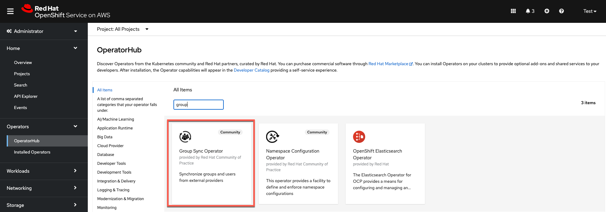
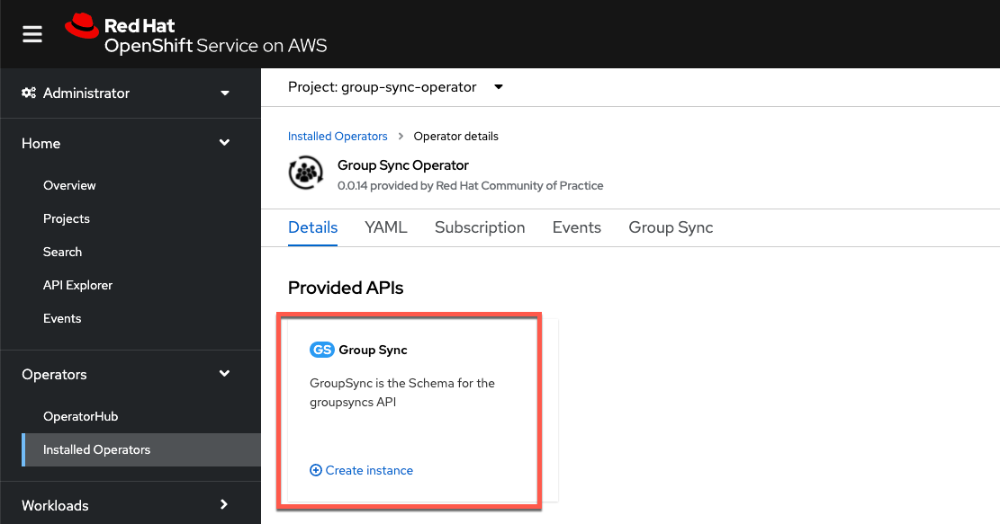

**Thatcher Hubbard**

*15 July 2022*

This guide focuses on how to synchronize Identity Provider (IDP) groups and users after configuring authentication in OpenShift Cluster Manager (OCM). For an IDP configuration example, please reference the [Configure Okta as an OIDC identity provider for ROSA/OSD](https://mobb.ninja/docs/idp/okta/) guide.

To set up group synchronization from Okta to ROSA/OSD you must:

1. Define groups and assign users in Okta
1. Install the Group Sync Operator from the OpenShift Operator Hub
1. Create and configure a new Group Sync instance
1. Set a synchronization schedule
1. Test the synchronization process

## Define groups and assign users in Okta ##

To synchronize groups and users with ROSA/OSD they must exist in Okta

1. Create groups to syncronize with ROSA/OSD if they do not already exist

    

1. Create user IDs to synchronize with ROSA/OSD if they do not already exist

    

1. Assign newly created users to the appropriate group

    

## Install the Group Sync Operator from the OpenShift Operator Hub ##

1. In the OpenShift Operator Hub find the **Group Sync Operator**

    

1. Install the operator in the `group-sync-operator` namespace

    

## (Optional) Create an Okta Group Sync Administrator

> Tokens are created with whatever permissions the currently logged-in user has, which is typically 'Super Admin' for a developer account. This is obviously not good practice for anything other than the most basic testing.

Ideally, a user would be created inside the Okta organization that was specifically for group synchronizations, which should only need to be able to read groups. Creating a user with 'Read Administrator' permissions on the account would be a good place to start for following the principle of "least privilege". That user can then issue a token that includes only those permissions.

## Create an Okta API Access Token

1. Login as a user that has minimally has Group and User read permissions (see previous section) and generate an API token in Okta

    

## Create and configure a new Group Sync instance ##

1. Create a new secret named `okta-group-sync` in the **group-sync-operator** namespace. This will contain the Okta API key that was just created.

1. Using the OpenShift CLI, create the secret using the following format:

        oc create secret generic okta-api-token --from-literal='okta-api-token=${API_TOKEN}' -n group-sync-operator

1. Obtain values from Okta for the AppId and URL. The AppId is the client ID under the application created to support OpenID for the OCP Cluster(s). The URL is the same as the one used to admin Okta, without the `-admin` in the first term and should look something like this:

        https://dev-34278011.okta.com/

1. Create a new Group Sync instance in the `group-sync-operator` namespace

    

1. Using the example below, customize the YAML to match the group names and save the configuration

    

    Sample YAML:
    ```
    apiVersion: redhatcop.redhat.io/v1alpha1
    kind: GroupSync
    metadata:
      name: okta-sync
    spec:
      schedule: "*/1 * * * *"
      providers:
        - name: okta
          okta:
            credentialsSecret:
              name: okta-api-token
              namespace: group-sync-operator
            groups:
              - ocp-admins
              - ocp-restricted-users
            prune: true
            url: "<Okta URL here>"
            appId: <Okta AppID here>
    ```

## Set a synchronization schedule ##

The Group Sync Operator provides a cron-based scheduling parameter for specifying how often the groups and users should be synchronized. This can be set in the instance YAML file during initial configuration or at any time after.

The schedule setting of `schedule: "* * * * *"` would result in synchronization occuring every minute. It also supports the cron "slash" notation (e.g., "*/5 * * * *", which would synchronize every five minutes).

## Testing the synchronization process ##

- Check to see if the Group Sync process has completed with a `Condition: ReconcileSuccess` message

    

1. Check to see that all the groups specified in the configuration YAML file show up in the ROSA/OSD Groups list

    

1. Validate that all users specified in Okta also show up as members of the associated group in ROSA/OSD

    

1. Add a new user in Okta and assign it to the admin group

    

1. Verify that the user now appears in ROSA/OSD (after the specified synchronization time)

    

1. Now deactivate a user from the Okta admin group

    

1. Verify the user has been deleted from the ROSA/OSD admin group

    

## Binding Groups to Roles

The preceding steps provide a method to get group membership information into OpenShift, but the final step in translating that into user authorization control requires binding each group to a role or roles on the cluster. This can be done via the OCP web console by opening the Group detail, or by applying YAML via the CLI.

## Additional Okta Config Options

1. There are also other options that are provider-specific that are covered in the [operator documentation](https://github.com/redhat-cop/group-sync-operator#okta) that should be kept in mind:

- Pruning groups that cease to exist on Okta
- A numeric limit on the number of groups to sync
- A list of groups against which to match

1. If there is a need to have multiple GroupSync configurations against multiple providers, note that there is no "merge" functionality in the operator when it comes to group membership. If a group named `ocp-admins` is present in two directories with sync jobs, they will effectively overwrite each other each time the sync job runs. It is recommended to name groups intended for use on OCP such that they indicate from which directory they originate (e.g., `okta-ocp-admins` or something like `okta-contoso-ocp-admins` in the case of multiple Okta providers). Bind multiple groups with the same permissions needs to the same `Role` or `ClusterRole` as needed.
