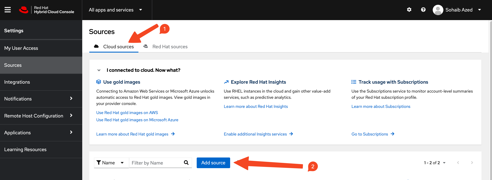

**Author: Charlotte Fung**

*Last edited: 03/29/2023*

Adopted from [Official Documentation for Cost Management Service](https://access.redhat.com/documentation/en-us/cost_management_service/2022)

Red Hat Cost Management is a software as a service (SaaS) offering available free of charge as part of your Red Hat subscriptions. Cost management helps you monitor and analyze your OpenShift Container Platform and Public cloud costs in order to improve the management of your business.

Some capabilities of cost management are :

* Visualize costs across hybrid cloud infrastructure
* Track cost trends
* Map charges to projects and organizations
* Normalize data and add markups with cost models
* Generate showback and chargeback information

In this document, I will show you how to connect your OpenShift and Cloud provider sources to Cost Management in order to collect cost and usage.

## Prerequisites

* A Public Cloud subscritption (Azure Subscription)
* An OpenShift Cluster *(to create an Azure Red Hat OpenShift (ARO) cluster, click [here](https://mobb.ninja/docs/quickstart-aro.html))*


## Adding your OpenShift source to Cost Management

### **Installing the Cost Management Metric Operator**

1. Log into the Openshift cluster web console with cluster-admin credentials

1. On the left navigation pane under Administator perspective, select **Operators** --> **OperatorHub**

   

1. Search for and locate **cost management metrics operator**. Click on the displayed Cost Management Metrics Operator

   

1. When the Install Operator window appears, you must select the **costmanagement-metrics-operator namespace** for installation. If it does not exist, it will be created for you. Click on **install** button.

1. After a short wait, **Cost Management Metrics Operator** appears in the **Installed Operators** tab under **Project: all Projects** or **Project: costmanagement-metrics-operator**

### Configuring the Operator instance for a new installation

1. Once installed, click on the Cost Management

1. In the detail window, click **+ Create Instance**

1. A **Cost Management Metrics Operator > Create CostManagementMetricsConfig** window appears

1. Click the **YAML view** radio button to view and modify the contents of the YAML configuration file

   

1. Modify the following two lines in the YAML file to look like the following

   ```yaml
   create_source: true
   name: <SOURCE-NAME>
   ```
   > Change `SOURCE-NAME` to the new name of your source (ex. `my-openshift-cost-source`)
   > Change `false` to `true`

1. Click the **Create** button. This creates a new source for cost management that will appear in the **console.redhat.com** Cost Management applications

## Adding your Microsoft Azure source to Cost Management

### **1. Configuring your Microsoft Azure**
The following steps are required to configure your Azure account to be a cost management source

1. Creating a storage account and resource group
1. Configuring a storage account contributor and reader roles for access
1. Scheduling daily exports

### 1.1 Creating an Azure resource group and storage account using Azure CLI

1. First create a new resource group

   ```bash
   az group create \
    --name storage-resource-group \
    --location eastus
   ```

1. If you're not sure which region to specify for the `--location` parameter, you can retrieve a list of supported regions for your subscription with the `az account list-locations` command.

   ```bash
   az account list-locations \
    --query "[].{Region:name}" \
    --out table
    ```

1. Next, create a standard general-purpose v2 storage account with read-access geo-redundant storage. Ensure the name of your storage account is unique across Azure

   ```bash
   az storage account create \
    --name <account-name> \
    --resource-group storage-resource-group \
    --location eastus \
    --sku Standard_RAGRS \
    --kind StorageV2
    ```

1. Make note of the resource group and storage account. We will need them in the subsequent steps
   
### **2. Creating a Microsoft Azure Source in your Red Hat account**

1. In the [console.redhat.com](https://console.redhat.com/) click on **All apps and services** tab in the left top corner of the screen to navigate to this window. Click on **Sources** under **Settings**

   

2. On Sources page, click on **Cloud sources** tab and then click **Add a source**. This opens up the Sources Wizard


3. Select **Microsoft Azure** as the source type and click next.

4. Enter a name for your source and click next.

5. Select **cost management** as the application click next.

6. Enter **resource group** and **storage account name** created in the last step to collect cost data and metrics for cost management click next.

7. Enter **Subscription ID** for your Azure account click next. Use the command given by the wizard to get Subscription ID.
   
8. Use the command given by the wizard to create **Service Principal** and enter **Tenant ID**, **Application ID** and **Application Secret**.

9. Click next, review the information and click add. 


### 2.3 Configuring a Daily Azure data export schedule using Azure Portal

*Cost management requires a data export from a **Subscription** level scope*

1. In the Azure Portal home page, click on **Subscriptions**

   

1. Select the Subscription you want to track from the list, and then select **Cost Analysis** in the menu. At the top of the **Cost analysis** page, select **configure subscription**

   

1. Click on the **Export** tab, and then **Schedule export**

   

1. In the **Exports** wizard, fill out the **Export details**

   

   * For **Export Type**, select **Daily export of billing-period-to-date costs** <br>

   * For **Storage account**, select the account you created earlier <br>

   * Enter any value for the **Container name** and **Directory path** for the export. These values provide the tree structure in the storage account where report files are stored.<br>

   * Click **Create** to start exporting data to the Azure storage container.

1. Return to **Sources** wizard after creating the export schedule and click **Next**. Review the source details

1. Click **Finish** to complete adding the Azure source to cost management

Cost management will begin polling Azure for cost data, which will appear on the cost management dashboard (console.redhat.com/openshift/cost-management/).

## Managing your Costs

After adding your Openshift Container Platform and Cloud Provider sources, Cost management will show cost data by

1. Source

1. Cloud provider cost and usage related to running your OpenShift Container Platform clusters on their platform

 See the following video for a quick overview of Cost Management for OpenShift followed by a demo of the product on [YouTube](https://www.youtube.com/watch?v=umyceNEWpog)

  <iframe width="560" height="315" src="https://www.youtube.com/embed/umyceNEWpog" title="YouTube video player" frameborder="0" allow="accelerometer; autoplay; clipboard-write; encrypted-media; gyroscope; picture-in-picture" allowfullscreen></iframe>

### Next steps for managing your costs

1. [Limiting access to cost management resources](https://access.redhat.com/documentation/en-us/cost_management_service/2022/html-single/limiting_access_to_cost_management_resources/index) - Use role-based access control to limit visibility of resources in cost management reports.

1. [Managing cost data using tagging](https://access.redhat.com/documentation/en-us/cost_management_service/2022/html-single/managing_cost_data_using_tagging/index) - Tags allow you to organize your resources by cost and allocate the costs to different parts of your cloud infrastructure

1. [Using cost models](https://access.redhat.com/documentation/en-us/cost_management_service/2022/html-single/using_cost_models/index) - Configure cost models to associate prices to metrics and usage.

1. [Visualizing your costs using Cost Explorer](https://access.redhat.com/documentation/en-us/cost_management_service/2022/html-single/visualizing_your_costs_using_cost_explorer/index) - Allows you to see your costs through time.


