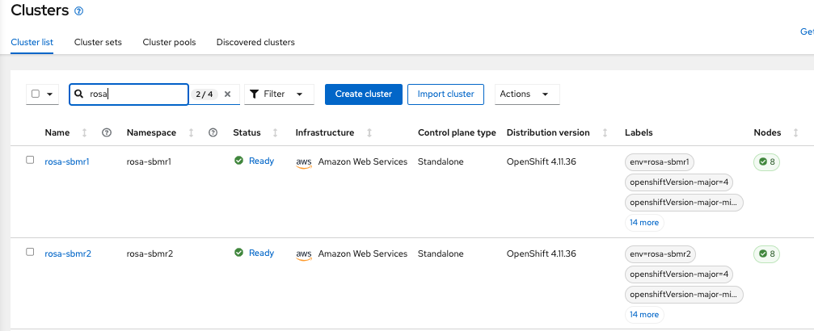
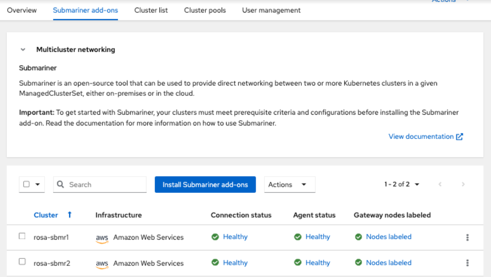
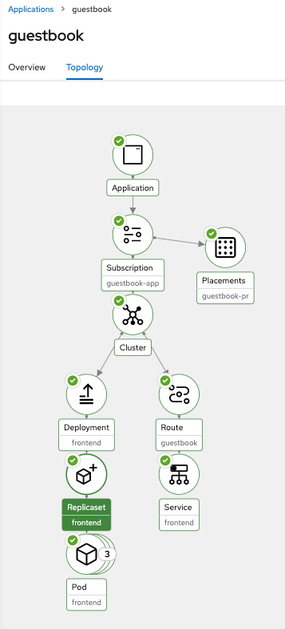
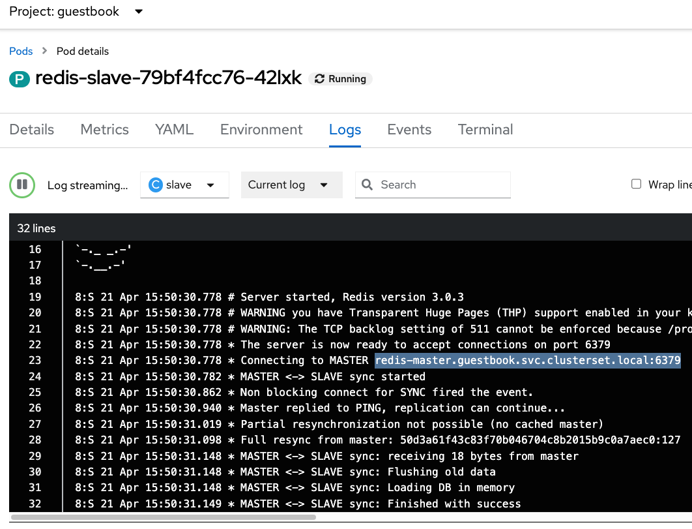
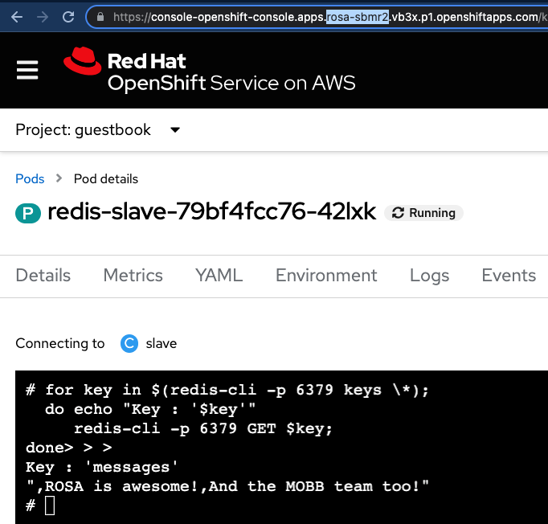

# Deploy ACM Submariner for connect overlay networks of ROSA clusters

Author: [Roberto Carratalá](https://github.com/rcarrata)

Submariner is an open source tool that can be used with Red Hat Advanced Cluster Management for Kubernetes to provide direct networking between pods and compatible multicluster service discovery across two or more Kubernetes clusters in your environment, either on-premises or in the cloud.

This article describes how to deploy ACM Submariner for connecting ROSA clusters overlay networks.

NOTE: ACM Submariner for ROSA clusters only works with ACM 2.7 or newer!

## Prerequisites

* OpenShift Cluster version 4 (ROSA or non-ROSA)
* rosa cli
* aws cli (optional)
* ACM 2.7 or newer

## Manage Multiple Logins

* In order to manage several clusters, we will add a new Kubeconfig file to manage the logins and change quickly from one context to another:

```
rm -rf /var/tmp/acm-lab-kubeconfig
touch /var/tmp/acm-lab-kubeconfig
export KUBECONFIG=/var/tmp/acm-lab-kubeconfig
```

## Deploy ACM Cluster HUB

We will use the first OpenShift cluster to deploy ACM Hub. 

* Login into the HUB OpenShift cluster and set the proper context:

```sh
oc login --username xxx --password xxx --server=https://api.cluster-xxx.xxx.xxx.xxx.com:6443

kubectl config rename-context $(oc config current-context) hub
kubectl config use hub
```

* Create the namespace for ACM

```sh
cat << EOF | kubectl apply -f -
apiVersion: v1
kind: Namespace
metadata:
  name: open-cluster-management
  labels:
    openshift.io/cluster-monitoring: "true"
EOF
```

* Create the OperatorGroup for ACM

```sh
cat << EOF | kubectl apply -f -
apiVersion: operators.coreos.com/v1
kind: OperatorGroup
metadata:
  name: open-cluster-management
  namespace: open-cluster-management
spec:
  targetNamespaces:
    - open-cluster-management
EOF
```

* Install Operator ACM 2.7

```sh
cat << EOF | kubectl apply -f -
apiVersion: operators.coreos.com/v1alpha1
kind: Subscription
metadata:
  name: advanced-cluster-management
  namespace: open-cluster-management
spec:
  channel: release-2.7
  installPlanApproval: Automatic
  name: advanced-cluster-management
  source: redhat-operators
  sourceNamespace: openshift-marketplace
EOF
```

* Check that the Operator has installed successfully

```sh
oc get csv
NAME                                 DISPLAY                                      VERSION   REPLACES   PHASE
advanced-cluster-management.v2.7.0   Advanced Cluster Management for Kubernetes   2.7.0                Succeeded
```

NOTE: ACM Submariner will only work from 2.7 onwards! Ensure that you have a >= 2.7 ACM version.

* Install MultiClusterHub instance in the ACM namespace

```sh
cat << EOF | kubectl apply -f -
apiVersion: operator.open-cluster-management.io/v1
kind: MultiClusterHub
metadata:
  namespace: open-cluster-management
  name: multiclusterhub
spec: {}
EOF
```

* Check that the MultiClusterHub is properly installed

```sh
kubectl get mch -n open-cluster-management multiclusterhub -o jsonpath='{.status.phase}'
```

NOTE: if it's not in Running state, wait a couple of minutes and check again.

## Deploy First ROSA Cluster

* Define the prerequisites for install the ROSA cluster

```sh
 export VERSION=4.11.36 \
        ROSA_CLUSTER_NAME_1=rosa-sbmr1 \
        AWS_ACCOUNT_ID=`aws sts get-caller-identity --query Account --output text` \
        REGION=eu-west-1 \
        AWS_PAGER="" \
        CIDR="10.0.0.0/16"
```

NOTE: it's critical that the Machine CIDR of the ROSA clusters not overlap, for that reason we're setting different CIDRs than the out of the box ROSA cluster install.  

* Create the IAM Account Roles

```sh
rosa create account-roles --mode auto --yes
```

* Generate a STS ROSA cluster

```sh
rosa create cluster -y --cluster-name ${ROSA_CLUSTER_NAME_1} \
--region ${REGION} --version ${VERSION} \
--machine-cidr $CIDR \
--sts
```

* Create the Operator and OIDC Roles

```sh
rosa create operator-roles --cluster ${ROSA_CLUSTER_NAME_1} --mode auto --yes
rosa create oidc-provider --cluster ${ROSA_CLUSTER_NAME_1} --mode auto --yes
```

* Check the status of the Rosa cluster (40 mins wait until is in ready status)

```sh
rosa describe cluster --cluster ${ROSA_CLUSTER_NAME_1} | grep State
State:                      ready
```

* Set the admin user for the ROSA cluster

```sh
rosa create admin --cluster=$ROSA_CLUSTER_NAME_1
```

* Login into the rosa cluster and set the proper context

```sh
oc login https://api.rosa-sbmr1.xxx.xxx.xxx.com:6443 --username cluster-admin --password xxx

kubectl config rename-context $(oc config current-context) $ROSA_CLUSTER_NAME_1
kubectl config use $ROSA_CLUSTER_NAME_1

kubectl get dns cluster -o jsonpath='{.spec.baseDomain}'
```

### Generate ROSA New nodes for submariner 

* Create new node/s that will be used to run Submariner gateway using the following command (check [the related GitHub issue](https://github.com/submariner-io/submariner/issues/1896) for more details)

```sh
rosa create machinepool --cluster $ROSA_CLUSTER_NAME_1 --name=sm-gw-mp --replicas=1 --labels='submariner.io/gateway=true'
```

NOTE: setting replicas=2  means that we allocate two nodes for SM GW , to support GW Active/Passive HA (check [Gateway Failover](https://submariner.io/getting-started/architecture/gateway-engine/) section ), if GW HA is not needed you can set replicas=1.

* Check the machinepools requested, including the submariner machinepool requested

```sh
rosa list machinepools -c $ROSA_CLUSTER_NAME_1
ID        AUTOSCALING  REPLICAS  INSTANCE TYPE  LABELS                        TAINTS    AVAILABILITY ZONES    SPOT INSTANCES
Default   No           2         m5.xlarge                                              eu-west-1a            N/A
sm-gw-mp  No           2         m5.xlarge      submariner.io/gateway=true              eu-west-1a            No
```

* After a couple of minutes, check the new nodes generated

```sh
kubectl get nodes --show-labels | grep submariner
```

## Deploy Second ROSA Cluster

> **IMPORTANT**: To enable Submariner in both ROSA clusters, the POD_CIDR and SERVICE_CIDR can’t overlap between them. To avoid IP address conflicts, the second ROSA cluster needs to modify the default IP CIDRs. Check the Submariner docs for more information.

* Define the prerequisites for install the second ROSA cluster

```sh
 export VERSION=4.11.36 \
        ROSA_CLUSTER_NAME_2=rosa-sbmr2 \
        AWS_ACCOUNT_ID=$(aws sts get-caller-identity --query Account --output text) \
        REGION=us-east-2 \
        AWS_PAGER="" \
        CIDR="10.20.0.0/16" \
        POD_CIDR="10.132.0.0/14" \
        SERVICE_CIDR="172.31.0.0/16"
```

* Create the IAM Account Roles

```sh
rosa create account-roles --mode auto --yes
```

* Generate the second STS ROSA cluster (with the POD_CIDR and SERVICE_CIDR modified)

```sh
 rosa create cluster -y --cluster-name ${ROSA_CLUSTER_NAME_2} \
   --region ${REGION} --version ${VERSION} \
   --machine-cidr $CIDR \
   --pod-cidr $POD_CIDR \
   --service-cidr $SERVICE_CIDR \
   --sts
```

* Create the Operator and OIDC Roles

```sh
rosa create operator-roles -c $ROSA_CLUSTER_NAME_2 --mode auto --yes
rosa create oidc-provider -c $ROSA_CLUSTER_NAME_2 --mode auto --yes
```

* Check the status of the Rosa cluster (40 mins wait until is in ready status)

```sh
rosa describe cluster --cluster ${ROSA_CLUSTER_NAME_2} | grep State
State:                      ready
```

* Set the admin user for the ROSA cluster

```sh
rosa create admin --cluster=$ROSA_CLUSTER_NAME_2
```

* Login into the rosa cluster and set the proper context

```sh
oc login https://api.rosa-sbmr2.xxx.xxx.xxx.com:6443 --username cluster-admin --password xxx


kubectl config rename-context $(oc config current-context) $ROSA_CLUSTER_NAME_2
kubectl config use $ROSA_CLUSTER_NAME_2

kubectl get dns cluster -o jsonpath='{.spec.baseDomain}'
```

### Generate ROSA New nodes for submariner

* Create new node/s that will be used to run Submariner gateway using the following command

```sh
rosa create machinepool --cluster $ROSA_CLUSTER_NAME_2 --name=sm-gw-mp --replicas=1 --labels='submariner.io/gateway=true'
```

* Check the machinepools requested, including the submariner machinepool requested:

```sh
rosa list machinepools -c $ROSA_CLUSTER_NAME_2
ID        AUTOSCALING  REPLICAS  INSTANCE TYPE  LABELS                        TAINTS    AVAILABILITY ZONES    SPOT INSTANCES
Default   No           2         m5.xlarge                                              us-east-2a            N/A
sm-gw-mp  No           2         m5.xlarge      submariner.io/gateway=true              us-east-2a            No
```

* After a couple of minutes, check the new nodes generated

```sh
kubectl get nodes --show-labels | grep submariner
```

## Create a ManagedClusterSet

* In the Hub (where ACM is installed), create the ManagedClusterSet for the `rosa-clusters`:

```sh
kubectl config use hub
kubectl get mch -A

cat << EOF | kubectl apply -f -
apiVersion: cluster.open-cluster-management.io/v1beta1
kind: ManagedClusterSet
metadata:
  name: rosa-clusters
EOF
```

## Import ROSA Sub1 

We will import the cluster using the auto-import secret and using the Klusterlet Addon Config.

* Retrieve ROSA TOKEN the ROSA API from the first ROSA cluster 

```sh
kubectl config use $ROSA_CLUSTER_NAME_1
SUB1_TOKEN=$(oc whoami -t)
echo $SUB1_TOKEN
SUB1_API=$(oc whoami --show-server)
echo $SUB1_API
```

* Config the Hub as the current context

```sh
kubectl config use hub
kubectl get dns cluster -o jsonpath='{.spec.baseDomain}'
kubectl get mch -A
```

* Create (in the Hub) ManagedCluster object defining the `rosa-subm1` cluster

```sh
cat << EOF | kubectl apply -f -
apiVersion: cluster.open-cluster-management.io/v1
kind: ManagedCluster
metadata:
  name: $ROSA_CLUSTER_NAME_1
  labels:
    name: $ROSA_CLUSTER_NAME_1
    cluster.open-cluster-management.io/clusterset: rosa-clusters
  annotations: {}
spec:
  hubAcceptsClient: true
EOF
```

* Create (in the Hub)` auto-import-secret.yaml` secret defining the the token and server from first ROSA cluster

```sh
cat << EOF | kubectl apply -f -
apiVersion: v1
kind: Secret
metadata:
  name: auto-import-secret
  namespace: $ROSA_CLUSTER_NAME_1
stringData:
  autoImportRetry: "5"
  token: ${SUB1_TOKEN}
  server: ${SUB1_API}
type: Opaque
EOF
```

* Create and apply the klusterlet add-on configuration file for the first rosa cluster

```sh
cat << EOF | kubectl apply -f -
apiVersion: agent.open-cluster-management.io/v1
kind: KlusterletAddonConfig
metadata:
  name: $ROSA_CLUSTER_NAME_1
  namespace: $ROSA_CLUSTER_NAME_1
spec:
  clusterName: $ROSA_CLUSTER_NAME_1
  clusterNamespace: $ROSA_CLUSTER_NAME_1
  clusterLabels:
    name: $ROSA_CLUSTER_NAME_1
    cloud: auto-detect
    vendor: auto-detect
    cluster.open-cluster-management.io/clusterset: rosa-clusters
  applicationManager:
    enabled: true
  certPolicyController:
    enabled: true
  iamPolicyController:
    enabled: true
  policyController:
    enabled: true
  searchCollector:
    enabled: true
EOF
```

## Import ROSA sub2 (CLI)

* Retrieve ROSA TOKEN the ROSA API from the second ROSA cluster 

```sh
kubectl config use $ROSA_CLUSTER_NAME_2
SUB2_API=$(oc whoami --show-server)
echo "$ROSA_CLUSTER_NAME_2 API: $SUB2_API\n"

SUB2_TOKEN=$(oc whoami -t)
echo "$ROSA_CLUSTER_NAME_2 Token: $SUB2_TOKEN\n"
```

* Config the Hub as the current context

```sh
kubectl config use hub
kubectl get mch -A
```

* Create (in the Hub) ManagedCluster object defining the second ROSA cluster

```sh
cat << EOF | kubectl apply -f -
apiVersion: cluster.open-cluster-management.io/v1
kind: ManagedCluster
metadata:
  name: $ROSA_CLUSTER_NAME_2
  labels:
    name: $ROSA_CLUSTER_NAME_2
    cloud: auto-detect
    vendor: auto-detect
    cluster.open-cluster-management.io/clusterset: rosa-clusters
    env: $ROSA_CLUSTER_NAME_2
  annotations: {}
spec:
  hubAcceptsClient: true
EOF
```

* Create (in the Hub) auto-import-secret.yaml secret defining the the token and server from second ROSA cluster

```sh
cat << EOF | kubectl apply -f -
apiVersion: v1
kind: Secret
metadata:
  name: auto-import-secret
  namespace: $ROSA_CLUSTER_NAME_2
stringData:
  autoImportRetry: "2"
  token: "${SUB2_TOKEN}"
  server: "${SUB2_API}"
type: Opaque
EOF
```

* Create and apply the klusterlet add-on configuration file for the second rosa cluster

```sh
cat << EOF | kubectl apply -f -
apiVersion: agent.open-cluster-management.io/v1
kind: KlusterletAddonConfig
metadata:
  name: $ROSA_CLUSTER_NAME_2
  namespace: $ROSA_CLUSTER_NAME_2
spec:
  clusterName: $ROSA_CLUSTER_NAME_2
  clusterNamespace: $ROSA_CLUSTER_NAME_2
  clusterLabels:
    name: $ROSA_CLUSTER_NAME_2
    cloud: auto-detect
    vendor: auto-detect
    cluster.open-cluster-management.io/clusterset: rosa-clusters
    env: rosa-subm2
  applicationManager:
    enabled: true
  policyController:
    enabled: true
  searchCollector:
    enabled: true
  certPolicyController:
    enabled: true
  iamPolicyController:
    enabled: true
EOF
```

* Check the managed clusters and the managed cluster set

```sh
kubectl config use hub

kubectl get managedclusters
NAME            HUB ACCEPTED   MANAGED CLUSTER URLS                                           JOINED   AVAILABLE   AGE
local-cluster   true           https://api.cluster-xxx.xxx.xxx.xxx.com:6443   True     True        5h55m
rosa-subm1      true           https://api.rosa-subm1.xxx.p1.openshiftapps.com:6443          True     True        133m
rosa-subm2      true           https://api.rosa-subm2.xxx.p1.openshiftapps.com:6443          True     True        51m
```



Now it's time to deploy submariner in our Managed ROSA Clusters. 
Either deploy using the RHACM UI or with CLI (choose one).

## Deploy Submariner Addon in Managed ROSA clusters from the RHACM UI

* Inside of the ClusterSets tab, go to the rosa-aro-clusters generated.

* Go to Submariner add-ons and Click in "Install Submariner Add-Ons"

* Configure the Submariner addons adding both ROSA clusters generated:


## Deploy Submariner Addon in ROSA clusters

* After the ManagedClusterSet is created, the `submariner-addon` creates a namespace called `managed-cluster-set-name-broker` and deploys the Submariner broker to it.

```sh
$ kubectl get ns | grep broker
default-broker                                     Active   6h39m
rosa-clusters-broker                               Active   13m
```

* Create the Broker configuration on the hub cluster in the `managed-cluster-set-name-broker` namespace

```sh
cat << EOF | kubectl apply -f -
apiVersion: submariner.io/v1alpha1
kind: Broker
metadata:
     name: submariner-broker
     namespace: rosa-clusters-broker
spec:
     globalnetEnabled: false
EOF
```

NOTE: Set the the value of `globalnetEnabled: true` if you want to enable Submariner Globalnet in the ManagedClusterSet.

* Check the Submariner Broker in the `rosa-clusters-broker` namespace:

```sh
kubectl get broker -n rosa-clusters-broker
NAME                AGE
submariner-broker   21s
```

* We don’t need to label the ManagedCluster because it was imported the proper labels within the proper ManagedClusterSet.

* Deploy SubmarinerConfig for the first rosa cluster imported:

```sh
cat << EOF | kubectl apply -f -
apiVersion: submarineraddon.open-cluster-management.io/v1alpha1
kind: SubmarinerConfig
metadata:
  name: submariner
  namespace: $ROSA_CLUSTER_NAME_1
spec:
  IPSecNATTPort: 4500
  NATTEnable: true
  cableDriver: libreswan
  loadBalancerEnable: true
EOF
```

* Deploy SubmarinerConfig for the second rosa cluster imported:

```sh
cat << EOF | kubectl apply -f -
apiVersion: submarineraddon.open-cluster-management.io/v1alpha1
kind: SubmarinerConfig
metadata:
  name: submariner
  namespace: $ROSA_CLUSTER_NAME_2
spec:
  IPSecNATTPort: 4500
  NATTEnable: true
  cableDriver: libreswan
  loadBalancerEnable: true
EOF
```

* Deploy Submariner on the first ROSA cluster cluster:

```sh
cat << EOF | kubectl apply -f -
apiVersion: addon.open-cluster-management.io/v1alpha1
kind: ManagedClusterAddOn
metadata:
     name: submariner
     namespace: $ROSA_CLUSTER_NAME_1
spec:
     installNamespace: submariner-operator
EOF
```

* Deploy Submariner on the second ROSA cluster cluster:

```sh
cat << EOF | kubectl apply -f -
apiVersion: addon.open-cluster-management.io/v1alpha1
kind: ManagedClusterAddOn
metadata:
     name: submariner
     namespace: $ROSA_CLUSTER_NAME_2
spec:
     installNamespace: submariner-operator
EOF
```

* Check the submariner status of `managedclusteraddons`  in order to check if submariner is deployed correctly

```sh
kubectl get managedclusteraddon -A | grep submariner
rosa-sbmr1      submariner                    True
rosa-sbmr2      submariner                    True
```

The Submariner Add-on installation will start, and will take up to 10 minutes to finish.

## Check the Status of the Submariner Networking Add-On 

A few minutes (up to 10 minutes) after we can check that the app Connection Status and the Agent Status are Healthy:



## Testing Submariner Networking connectivity with an example app (Optional)

This final step (**totally optional**), is an extra step to check if the Submariner networking tunnels are built and connected properly.

This example app deploy one FE (guestbook) in the first ROSA cluster, and two redis with active-backup replication.

One Redis will be in the first ROSA cluster and will sync and replicate the data inserted by the FE, to the second redis (in backup/passive mode) using the submariner tunnel (connecting both ROSA clusters).

The connection will be using the ServiceExport feature (DNS Discovery) from Submariner, that allows to call the Redis Service (Active or Passive) from within the Service CIDR. 

* Clone the example repo app

```sh
git clone https://github.com/rh-mobb/acm-demo-app
```

* Deploy the GuestBook App in ROSA Cluster 1

```sh
kubectl config use hub
oc apply -k guestbook-app/acm-resources
```



* Deploy the Redis Master App in ROSA Cluster 1

```sh
oc apply -k redis-master-app/acm-resources
```


* Apply relaxed scc only for this PoC

```sh
kubectl config use $ROSA_CLUSTER_NAME
oc adm policy add-scc-to-user anyuid -z default -n guestbook
oc delete pod --all -n guestbook
```

* Deploy the Redis Slave App in ROSA Cluster 2

```sh
kubectl config use hub
oc apply -k redis-slave-app/acm-resources
```

* Apply relaxed SCC only for this PoC

```sh
kubectl config use $ROSA_CLUSTER_NAME_2
oc adm policy add-scc-to-user anyuid -z default -n guestbook
oc delete pod --all -n guestbook
```


### Testing the Synchronization of the Redis Master-Slave between clusters and interacting with our FrontEnd using Submariner tunnels

To test the sync between the data from the Redis Master<->Slave, let's write some data into our frontend. Access to the route of the guestbook App y write some data:


* Now let's see the logs in the Redis Slave:



The sync is automatic and almost instantaneous between Master-Slave.

* We can check the data write in the redis-slave with the redis-cli and the following command:

```
for key in $(redis-cli -p 6379 keys \*);
  do echo "Key : '$key'"
     redis-cli -p 6379 GET $key;
done
```

* Let's do this in the redis-slave pod:



And that's how the Redis-Master in the ROSA cluster 1 sync properly the data to the redis-slave in the ROSA Cluster 2, using Submariner tunnels, all encrypted with IPSec.