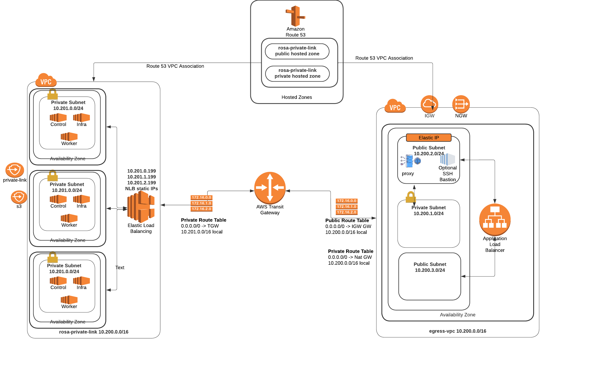
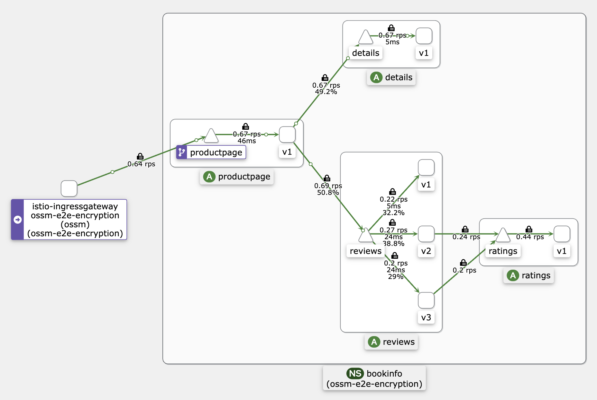

This repository demonstrates how to utilize a privatelink [ROSA](https://www.redhat.com/en/technologies/cloud-computing/openshift/aws) (Red Hat OpenShift on AWS) cluster and [OSSM](https://www.redhat.com/en/technologies/cloud-computing/openshift/what-is-openshift-service-mesh) (OpenShift Service Mesh) to securely expose an application with end-to-end encryption. The provided architecture serves as a sample for application exposure. The deployment incorporates an Ingress/Egress VPC to route traffic to the cluster, which is deployed within a private VPC.



### Prerequisites

- A multi-az privatelink ROSA cluster 
- [ROSA CLI](https://github.com/openshift/rosa) - Download the latest release
- oc CLI `rosa download openshift-client`
- [jq](https://jqlang.github.io/jq/download/)
- [AWS CLI](https://aws.amazon.com/cli/)

Clone the repository

```bash
git clone https://github.com/houshym/rosa-ossm-e2e-encryption
cd rosa-ossm-e2e-encryption
```
 ### Deploy OpenShift Service Mesh(OSSM)

 **Note:** if service mesh is already installed skip this step

Installing the OSSM(OpenShift Service Mesh) involves installing the OpenShift Elasticsearch, Jaeger, Kiali, and Service Mesh Operators, creating and managing a ServiceMeshControlPlane resource to deploy the control plane, and creating a ServiceMeshMemberRoll resource to specify the namespaces associated with the Service Mesh 

Install service mesh operators by applying the following snippet on the cluster or or run the script inside the cloned git repo ./ossm-operator/deploy-ossm.sh

```bash
cat << EOF | oc apply -f -
apiVersion: operators.coreos.com/v1alpha1
kind: Subscription
metadata:
  name: elasticsearch-operator
  namespace: openshift-operators
spec:
  channel: "stable"
  name: elasticsearch-operator
  source: redhat-operators
  sourceNamespace: openshift-marketplace
  installPlanApproval: Automatic
---
#install jaeger operator
apiVersion: operators.coreos.com/v1alpha1
kind: Subscription
metadata:
  name: jaeger-product
  namespace: openshift-operators
spec:
  name: jaeger-product
  source: redhat-operators
  sourceNamespace: openshift-marketplace
  channel: "stable"
  installPlanApproval: Automatic
--- 
#install Kiali operator
apiVersion: operators.coreos.com/v1alpha1
kind: Subscription
metadata:
  name: kiali-ossm
  namespace: openshift-operators
spec:
  name: kiali-ossm
  source: redhat-operators
  sourceNamespace: openshift-marketplace
  channel: "stable"
  installPlanApproval: Automatic
--- 
# Create a Subscription  to subscribe the openshift-operators
# namespace to the Red Hat OpenShift Service Mesh Operator
apiVersion: operators.coreos.com/v1alpha1
kind: Subscription
metadata:
  name: servicemeshoperator
  namespace: openshift-operators
spec:
  channel: "stable"
  name: servicemeshoperator
  source: redhat-operators
  sourceNamespace: openshift-marketplace
  installPlanApproval: Automatic
EOF
```

Install service mesh operators by applying the following snippet or run the script inside the cloned git repo `./ossm-operator/deploy-ossm.sh` and Check the operator's status in each cluster with the following commands or run script `./ossm-operator/check-ossm.sh` in the cloned repo. if you need troubleshooting follow the [troubleshooting operator](https://docs.openshift.com/container-platform/4.12/support/troubleshooting/troubleshooting-operator-issues.html) : 
  
```bash
oc get sub elasticsearch-operator -n openshift-operators --output jsonpath='{.status.conditions[?(@.type == "CatalogSourcesUnhealthy")].message}'
```

```bash
oc get sub jaeger-product  -n openshift-operators --output jsonpath='{.status.conditions[?(@.type == "CatalogSourcesUnhealthy")].message}'
```

```bash
oc get sub kiali-ossm  -n openshift-operators --output jsonpath='{.status.conditions[?(@.type == "CatalogSourcesUnhealthy")].message}'
```

```bash
oc get sub servicemeshoperator -n openshift-operators --output jsonpath='{.status.conditions[?(@.type == "CatalogSourcesUnhealthy")].message}'
```

### Create a service mesh instance
   
Create a service mesh instance. We assign a static IP addresses(10.201.1.199, 10.201.0.199,10.201.2.199) to the istio-ingress NLB
**NOTE:**  The annotations in the following resources are reserving the IP addresses for a static NLB using the ALB controller as these are items of interest that differ from a regular OSSM install.

```bash
cat << EOF | oc apply -f -
apiVersion: v1
kind: Namespace
metadata:
  name: ossm
--- 
apiVersion: maistra.io/v2
kind: ServiceMeshControlPlane
metadata:
  namespace: ossm
  name: ossm-e2e-encryption
spec:
  cluster:
    name: ossm-e2e-encryption
  addons:
    grafana:
      enabled: true
    jaeger:
      install:
        storage:
          type: Memory
    kiali:
      enabled: true
    prometheus:
      enabled: true
  policy:
    type: Istiod
  telemetry:
    type: Istiod
  tracing:
    sampling: 10000
    type: Jaeger
  runtime:
    defaults:
      container:
        imagePullPolicy: Always
  proxy:
    accessLogging:
      file:
        name: /dev/stdout        
  security:
    identity:
      type: ThirdParty
      thirdParty:
        audience: istio-ca
  gateways:
    ingress: # istio-ingressgateway
      service:
        metadata:
            annotations:
                  service.beta.kubernetes.io/aws-load-balancer-nlb-target-type: instance
                  service.beta.kubernetes.io/aws-load-balancer-scheme: internal
                  service.beta.kubernetes.io/aws-load-balancer-private-ipv4-addresses: 10.201.0.199, 10.201.1.199, 10.201.2.199
                  service.beta.kubernetes.io/aws-load-balancer-type: external
        type: LoadBalancer
EOF
```

### Deploy AWS Load Balancer Operator (ALBO)

Use the following snippet or run the script in the cloned repo `./alb-operator/deploy-aws-lbo.sh` . see [mobb.ninja](https://mobb.ninja/docs/rosa/aws-load-balancer-operator/) article for more details about the ALB operator and its installtion.

```bash
#!/bin/sh
set +e
export ROSA_CLUSTER_NAME=$(oc get infrastructure cluster -o=jsonpath="{.status.infrastructureName}"  | sed 's/-[a-z0-9]\{5\}$//')
export REGION=$(oc get infrastructure cluster -o=jsonpath="{.status.platformStatus.aws.region}")
export OIDC_ENDPOINT=$(oc get authentication.config.openshift.io cluster -o jsonpath='{.spec.serviceAccountIssuer}' | sed  's|^https://||')
export AWS_ACCOUNT_ID=$(aws sts get-caller-identity --query Account --output text)
export CLUSTER_NAME=$(oc get infrastructure cluster -o=jsonpath="{.status.infrastructureName}")
echo "Cluster: ${ROSA_CLUSTER_NAME}, Region: ${REGION}, OIDC Endpoint: ${OIDC_ENDPOINT}, AWS Account ID: ${AWS_ACCOUNT_ID}"
export SUBSTITUTED_POLICY=$(cat alb-operator/trust-policy.json | envsubst)
echo "Trust Policy $SUBSTITUTED_POLICY"

if ! ROLE_ARN=$(aws iam get-role --role-name "${ROSA_CLUSTER_NAME}-alb-operator" --query Role.Arn --output text 2>/dev/null); then
  ROLE_ARN=$(aws iam create-role --role-name "${ROSA_CLUSTER_NAME}-alb-operator" --assume-role-policy-document "$SUBSTITUTED_POLICY" --query Role.Arn --output text)
fi
echo "Role ARN: $ROLE_ARN"
# Create the policy if it doesn't exist
EXISTING_POLICY_ARN=$(aws --region "$REGION" --output text iam list-policies --query "Policies[?PolicyName=='aws-load-balancer-operator-policy'].Arn" --output text)
if [ -z "$EXISTING_POLICY_ARN" ]; then
  # Create the policy if it doesn't exist
  POLICY_ARN=$(aws --region "$REGION" --query Policy.Arn --output text iam create-policy --policy-name aws-load-balancer-operator-policy --policy-document "file://alb-operator/load-balancer-operator-policy.json")
else
  POLICY_ARN="$EXISTING_POLICY_ARN"
fi
echo "Policy ARN: $POLICY_ARN"
aws iam attach-role-policy --role-name "${ROSA_CLUSTER_NAME}-alb-operator" \
  --policy-arn $POLICY_ARN
# tag cluster vpc for aws load balancer operator
export ROSA_CLUSTER_SUBNET=$(rosa describe cluster -c $ROSA_CLUSTER_NAME -o json | jq -r '.aws.subnet_ids[0]')
export ROSA_CLUSTER_VPC_ID=$(aws ec2 describe-subnets --subnet-ids $ROSA_CLUSTER_SUBNET --query 'Subnets[0].VpcId' --output text)
echo "ROSA cluster VPC ID $ROSA_CLUSTER_VPC_ID"
aws ec2 create-tags --resources ${ROSA_CLUSTER_VPC_ID} \
  --tags Key=kubernetes.io/cluster/${CLUSTER_NAME},Value=owned \
  --region ${REGION}

# Fetch all subnets of the VPC
export ROSA_CLUSTER_SUBNETS=$(aws ec2 describe-subnets --filters "Name=vpc-id,Values=$ROSA_CLUSTER_VPC_ID" --query 'Subnets[*].SubnetId' --output text)

# Loop through each subnet and add the tag
for subnet in $ROSA_CLUSTER_SUBNETS; do
    aws ec2 create-tags --resources $ROSA_CLUSTER_SUBNETS --tags Key=kubernetes.io/role/internal-elb,Value=1
done

cat << EOF | oc apply -f -
apiVersion: v1
kind: Namespace
metadata:
  name: aws-load-balancer-operator
EOF

cat << EOF | oc apply -f -
apiVersion: v1
kind: Secret
metadata:
  name: aws-load-balancer-operator
  namespace: aws-load-balancer-operator
stringData:
  credentials: |
    [default]
    role_arn = $ROLE_ARN
    web_identity_token_file = /var/run/secrets/openshift/serviceaccount/token
EOF

cat << EOF | oc apply -f -
apiVersion: operators.coreos.com/v1
kind: OperatorGroup
metadata:
  name: aws-load-balancer-operator
  namespace: aws-load-balancer-operator
spec:
  upgradeStrategy: Default
---
apiVersion: operators.coreos.com/v1alpha1
kind: Subscription
metadata:
  name: aws-load-balancer-operator
  namespace: aws-load-balancer-operator
spec:
  channel: stable-v1.0
  installPlanApproval: Automatic
  name: aws-load-balancer-operator
  source: redhat-operators
  sourceNamespace: openshift-marketplace
  startingCSV: aws-load-balancer-operator.v1.0.0
EOF
```

 **Note:** If you have a cluster-wide proxy, you must run the following snippet or uncomment the "Configuring egress proxy for AWS Load Balancer Operator" section in the script `./alb-operator/deploy-aws-lbo.sh`

```bash
 oc -n aws-load-balancer-operator create configmap trusted-ca
 oc -n aws-load-balancer-operator label cm trusted-ca config.openshift.io/inject-trusted-cabundle=true
 oc -n aws-load-balancer-operator patch subscription aws-load-balancer-operator --type='merge' -p '{"spec":{"config":{"env":[{"name":"TRUSTED_CA_CONFIGMAP_NAME","value":"trusted-ca"}],"volumes":[{"name":"trusted-ca","configMap":{"name":"trusted-ca"}}],"volumeMounts":[{"name":"trusted-ca","mountPath":"/etc/pki/tls/certs/albo-tls-ca-bundle.crt","subPath":"ca-bundle.crt"}]}}}'
 oc -n aws-load-balancer-operator exec deploy/aws-load-balancer-operator-controller-manager -c manager -- bash -c "ls -l /etc/pki/tls/certs/albo-tls-ca-bundle.crt; printenv TRUSTED_CA_CONFIGMAP_NAME"
 oc -n aws-load-balancer-operator rollout restart deployment/aws-load-balancer-operator-controller-manager
 ```
**NOTE:** It takes minutes to operator be up and running. Check operator status is `running` 
```bash
oc get pod -n aws-load-balancer-operator
```

Create AWS Load Balancer Controller

```bash
cat << EOF | oc apply -f -
apiVersion: networking.olm.openshift.io/v1
kind: AWSLoadBalancerController
metadata:
  name: cluster
spec:
  credentials:
    name: aws-load-balancer-operator
EOF
```

### Deploy cert-manager 

We use cert-manager to issue a certificate for bookinfo application. The following step creates a self-signed certificate. if you have a certificate you can skip these steps

1. Create a project (namespace) in the ROSA cluster.

```bash
oc new-project cert-manager --display-name="Certificate Manager" --description="Project to manage certificate LCM"
```

2. Install the cert-manager Operator

```bash
cat <<EOF | oc create -f -
apiVersion: operators.coreos.com/v1alpha1
kind: Subscription
metadata:
  name: cert-manager
  namespace: openshift-operators
spec:
  channel: stable
  installPlanApproval: Automatic
  name: cert-manager
  source: community-operators
  sourceNamespace: openshift-marketplace
EOF
```

3. Create a cluster issuer

```bash
cat <<EOF | oc create -f -
apiVersion: cert-manager.io/v1
kind: ClusterIssuer
metadata:
  name: self-signed-issuer
spec:
  selfSigned: {}
EOF
```

4. Create a self-signed certificate

```bash
cat <<EOF | oc create -f -
apiVersion: cert-manager.io/v1
kind: Certificate
metadata:
  name: bookinfo-self-sgined-cert
  namespace: ossm
spec:
  commonName: securedbookinfo.com
  dnsNames:
    - securedbookinfo.com
  issuerRef:
    kind: ClusterIssuer
    name: self-signed-issuer
  privateKey:
    algorithm: RSA
    size: 2048
  secretName: bookinfo-cert
EOF
```
### Deploy application

we use bookinfo application to show an end to end encryption

```bash
oc new-project bookinfo
oc apply -f ./app/smmr.yaml
oc apply -f ./app/bookinfo.yaml
oc apply -f ./app/destination-rule.yaml
oc apply -f ./app/gateway.yaml
```

### Verify TLS 

 ```bash
export NLB_URL=$(oc get svc -n ossm istio-ingressgateway -o jsonpath='{.status.loadBalancer.ingress[0].hostname}')
echo "NLB's FQDN:  $NLB_URL"
export NLB_IP=$(dig +short $NLB_URL | head -1)
echo "NLP IP address $NLB_IP"
```

**NOTE:** If the NLP IP address is blank, you should wait until the load balancer provisioning is completed

Check application endpoint

```bash
 curl -v -k --resolve securedbookinfo.com:443:$NLB_IP https://securedbookinfo.com:443/productpage
 ```

you can check HTTP to HTTPS redirection by running the following command and you can see HTTP/1.1 301 Moved Permanently

```bash
curl -v -k -L --resolve securedbookinfo.com:80:$NLB_IP  http://securedbookinfo.com/productpage
``` 

### Create an ALB in the public subnet 
 We need to create an ALB in the ingress/egress VPC. To do this, we first need to create a Target Group (TG) within this VPC and then associate this TG with the ALB's targets. To create the TG, we require the IP addresses of the NLB. 

1. Define a Target Group
    
    ```bash

    export ING_EGRESS_VPC_ID=<vpc-id>
    export ING_EGRESS_PUB_SUB_1=<public subnet-id 1>
    export ING_EGRESS_PUB_SUB_2=<public subnet-id 2>
    export BOOKINFO_CERT_ARN=<certificate arn>
    export TG_ARN=$(aws elbv2 create-target-group --name nlb-e2e-tg --protocol HTTPS --port 443 --vpc-id $ING_EGRESS_VPC_ID --target-type ip --health-check-protocol HTTP --health-check-port 15021 --health-check-path /healthz/ready --query 'TargetGroups[0].TargetGroupArn' --output text)
    echo "Target Group arn $TG_ARN"
    ```

1. Fetch NLB IP addresses 

    ```bash
    export NLB_FQDN=$(oc get svc -n ossm istio-ingressgateway -o jsonpath='{.status.loadBalancer.ingress[0].hostname}')
    
    echo "The external IP address of istio-ingressgateway is: $NLB_FQDN"
    
    # Fetch the load balancer ARN
    export NLB_ARN=$(aws elbv2 describe-load-balancers --query "LoadBalancers[?DNSName=='$NLB_FQDN'].LoadBalancerArn" --output text)
    echo "NLB arn: $NLB_ARN"
    
    export NLB_INFO=$(aws elbv2 describe-load-balancers --load-balancer-arns $NLB_ARN --output json )
    
    export NLB_PRV_IP_1=$(echo "$NLB_INFO" | jq -r '.LoadBalancers[0].AvailabilityZones[0].LoadBalancerAddresses[0].PrivateIPv4Address')
    export NLB_PRV_IP_2=$(echo "$NLB_INFO" | jq -r '.LoadBalancers[0].AvailabilityZones[1].LoadBalancerAddresses[0].PrivateIPv4Address')
    export NLB_PRV_IP_3=$(echo "$NLB_INFO" | jq -r '.LoadBalancers[0].AvailabilityZones[2].LoadBalancerAddresses[0].PrivateIPv4Address')
    
    echo "Private IP 1: $NLB_PRV_IP_1"
    echo "Private IP 2: $NLB_PRV_IP_2"
    echo "Private IP 3: $NLB_PRV_IP_3"
    ```

1. Register NLB IP addresses in the Target Group

    ```bash
    aws elbv2 register-targets --target-group-arn $TG_ARN --targets Id=$NLB_PRV_IP_1,Port=443,AvailabilityZone=all Id=$NLB_PRV_IP_2,Port=443,AvailabilityZone=all Id=$NLB_PRV_IP_3,Port=443,AvailabilityZone=all
    ```

1. Create an ALB in the ingress/egress VPC and set the TG.

   You need to find your ingress/egress VPC ID, public subnet ID, and certificate ARN to create the ALB.

   4.1. Create a security group for ALB

    ```bash
    ALB_SG_ID=$(aws ec2 create-security-group --group-name bookinfo \
        --vpc-id $ING_EGRESS_VPC_ID \
        --description "allow traffic from the internet" \
        --query 'GroupId' \
        --output text)
    ```
    
   4.2. Allow traffic from the internet

    ```bash 
    aws ec2 authorize-security-group-ingress \
       --group-id $ALB_SG_ID \
       --protocol tcp \
       --port 443 \
        --cidr 0.0.0.0/0
    ```

   4.3 Create ALB
 
    ```bash
    ALB_ARN=$(aws elbv2 create-load-balancer \
        --name bookinfo-alb \
        --subnets $ING_EGRESS_PUB_SUB_1 $ING_EGRESS_PUB_SUB_2 \
        --security-groups $ALB_SG_ID \
        --scheme internet-facing \
        --type application \
        --query 'LoadBalancers[0].LoadBalancerArn' \
        --output text)
     ```
    Check load balancer status with the following command. The status should be active.

    ```bash
    aws elbv2 describe-load-balancers --name bookinfo-alb --query 'LoadBalancers[].State.Code'
    ```

   4.4 Create Listener

    ```bash
    aws elbv2 create-listener \
     --load-balancer-arn $ALB_ARN \
     --protocol HTTPS \
     --port 443 \
     --certificates CertificateArn=$BOOKINFO_CERT_ARN \
     --default-actions Type=forward,TargetGroupArn=$TG_ARN
    ```  
### Check Application

Fetch ALB's URL and generate traffic  

```bash
ALB_DNS=$(aws elbv2 describe-load-balancers --load-balancer-arns $ALB_ARN --query 'LoadBalancers[0].DNSName' --output text)
while true; do curl -k  https://$ALB_DNS/productpage; sleep 1; done
```
Retrieve the application and Kiali URLs

```bash
echo "open browser and hit https://$ALB_DNS/productpage" or Open Kiali https://$(oc get route kiali -n ossm -o jsonpath='{$.status.ingress[0].host}')
```


