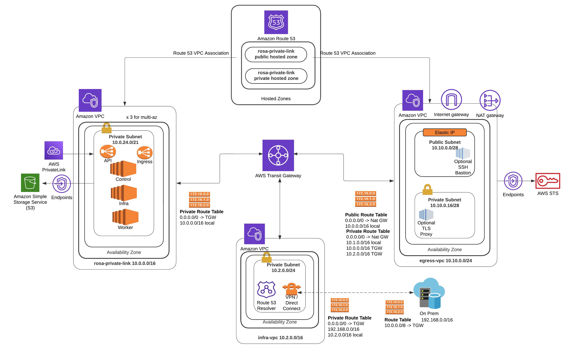

# Deploying ROSA PrivateLink Cluster with Ansible
Draft v0.3

## Background
This guide shows an example of how to deploy Red Hat OpenShift Services on AWS (ROSA) cluster with [PrivateLink](https://aws.amazon.com/privatelink/) with [STS](https://docs.aws.amazon.com/IAM/latest/UserGuide/id_credentials_temp.html) enabled using [Ansible](https://docs.ansible.com/) playbook from our [MOBB GitHub repository](https://github.com/rh-mobb/ansible-rosa) and [makefiles](https://www.gnu.org/software/make/manual/make.html#Introduction) to compile them. Note that this is an unofficial Red Hat guide and your implementation may vary. 

This guide is broken down into two main sections namely the architectural landscape of this deployment scenario including the AWS services and open source products and services that we will be using, and the implementation steps which includes the prerequisites needed to run the deployment itself. 


## Architecture
In this section, we will first discuss about the architecture of the cluster we are going to create in high level. Afterward, we will talk about the components that we are utilizing in this deployment, from the Git repository where this deployment will be cloned from, the makefile that compiles the codes needed to run the deployment, to the Ansible commands that the makefile compiles.

### ROSA Cluster with PrivateLink
PrivateLink allows you to securely access AWS services over private network connections, without exposing your traffic to the public internet. In this scenario, we will be using [Transit Gateway (TGW)](https://aws.amazon.com/transit-gateway/) allowing inter-VPC and VPC-to-on-premises communications by providing a scalable and efficient way to handle traffic between these networks. 

To help with DNS resolution, we will be using DNS forwarder to forward the queries to [Route 53 Inbound Resolver](https://docs.aws.amazon.com/Route53/latest/DeveloperGuide/resolver.html) allowing the cluster to accept incoming DNS queries from external sources and thus establishing the desired connection without exposing the underlying infrastructure.



In addition, [Egress VPC](https://docs.aws.amazon.com/managedservices/latest/onboardingguide/networking-vpc.html) will be provisioned serving as a dedicated network component for managing outbound traffic from the cluster. A [NAT Gateway](https://docs.aws.amazon.com/vpc/latest/userguide/vpc-nat-gateway.html) will be created within the public subnet of the Egress VPC and along with it a [Squid](http://www.squid-cache.org/)-based proxy to restrict egress traffic from the cluster to only the permitted [endpoints or destinations](https://docs.openshift.com/rosa/rosa_install_access_delete_clusters/rosa_getting_started_iam/rosa-aws-prereqs.html#osd-aws-privatelink-firewall-prerequisites_prerequisites). 

We will also be using [VPC Endpoints](https://docs.aws.amazon.com/whitepapers/latest/aws-privatelink/what-are-vpc-endpoints.html) to privately access AWS resources, e.g. gateway endpoint for S3 bucket, interface endpoint for STS, interface endpoint for EC2 instances, etc.

Finally, once the cluster is created, we will access it by establishing secure SSH connection using a jump host that is set up within the Egress VPC, and to do so we will be using [sshuttle](https://sshuttle.readthedocs.io/en/stable/). 


### Git
Git is version control system that tracks changes to files and enables collaboration, while GitHub is a web-based hosting service for Git repositories. And in this scenario, the deployment will be based on the Ansible playbook from MOBB GitHub repository at [https://github.com/rh-mobb/ansible-rosa](https://github.com/rh-mobb/ansible-rosa). 

We are specifying the default environment and variables in the following directories:
* <code>./environment/*/group_vars/all.yaml</code> - environment setup
* <code>./roles/_vars/defaults/main.yml</code> - variables

And these default variables will be overridden by specific variables which we will discuss in a second. 

For now, let's take a look at what these default variables are. Below are the snippets from <code>./roles/_vars/defaults/main.yml</code>:

```bash
# defaults for roles/cluster_create
rosa_private: false
rosa_private_link: false
rosa_sts: true
rosa_disable_workload_monitoring: false
rosa_enable_autoscaling: false
rosa_hcp: false

# wait for rosa to finish installing
rosa_wait: true
rosa_multi_az: false
rosa_admin_password: "Rosa1234password67890"
rosa_vpc_endpoints_enabled: false
rosa_subnet_ids: []
rosa_machine_cidr: ~

# defaults for roles/juphost-create
# when not set will search based on ami_name
jumphost_ami: ""
jumphost_ami_name: "RHEL-8.8.0_HVM-*-x86_64-*Hourly*"
jumphost_instance_type: t1.micro

# enable this if you want a second jumphost in the
# rosa private subnet, useful for testing TGW connectivity
jumphost_private_instance: false
proxy_enabled: false

# when not set will search based on ami_name
# proxy_ami: ami-0ba62214afa52bec7
proxy_ami: ""
proxy_ami_name: "RHEL-8.8.0_HVM-*-x86_64-*Hourly*"
proxy_instance_type: m4.large

# defaults for roles/vpc_create
rosa_vpc_cidr: "10.0.0.0/16"
rosa_region: "us-east-2"

# defaults file for roles/tgw_create
rosa_tgw_enabled: false

# the full CIDR that TGW should route for
rosa_egress_vpc_enabled: false
rosa_egress_vpc_multi_az: false
rosa_tgw_cidr: "10.0.0.0/8"
rosa_egress_vpc_cidr: "10.10.0.0/24"
```

As mentioned previously, we are going to override the above default variables with ones that are relevant our scenario in this case, i.e. ROSA with PrivateLink and Transit Gateway, and to do so, we will be running the variables specified from <code>./environment/transit-gateway-egress/group_vars/all.yaml</code> instead:

```bash
rosa_private_link: true
# note private-link forces private to be true
# regardless of the following value.
rosa_private: false
rosa_sts: true
rosa_multi_az: true
rosa_vpc_endpoints_enabled: true
rosa_version: 4.12.12
rosa_region: us-east-1
rosa_vpc_cidr: "10.0.0.0/16"
rosa_vpc_public_subnets: []

rosa_tgw_enabled: true
# The full cidr that encompasses all VPCs the TGW will be
# attached to.
rosa_tgw_cidr: "10.0.0.0/8"

rosa_egress_vpc_enabled: true
rosa_egress_vpc_multi_az: true
# defaults file for roles/vpc
rosa_egress_vpc_cidr: "10.10.0.0/16"

jumphost_instance_type: t2.micro

proxy_enabled: true
```

Next, we will talk about what <code>makefile</code> is and how it helps compiling the code for our deployment in this scenario.


### Makefile
[Make](https://www.gnu.org/software/make/manual/make.html#Overview) is a build automation tool to manage the compilation and execution of programs. It reads a file called a [makefile](https://www.gnu.org/software/make/manual/make.html#Introduction) that contains a set of rules and dependencies, allowing developers to define how source code files should be compiled, linked, and executed.

In this scenario, the makefile can be found in the root directory of the GitHub repository, and here below is the snippet where the cluster name is set up along with the virtual environment that makefile will compile when we are running <code>make virtualenv</code>: 

```bash
CLUSTER_NAME ?= ans-$(shell whoami)
EXTRA_VARS ?= --extra-vars "cluster_name=$(CLUSTER_NAME)"

VIRTUALENV ?= "./virtualenv/"
ANSIBLE = $(VIRTUALENV)/bin/ansible-playbook $(EXTRA_VARS)

virtualenv:
		LC_ALL=en_US.UTF-8 python3 -m venv $(VIRTUALENV)
		. $(VIRTUALENV)/bin/activate
		pip install pip --upgrade
		LC_ALL=en_US.UTF-8 $(VIRTUALENV)/bin/pip3 install -r requirements.txt #--use-feature=2020-resolver
		$(VIRTUALENV)/bin/ansible-galaxy collection install -r requirements.yml
```

As you can see above, the <code>cluster_name</code> variable is hardcoded in the makefile to be <code>ans-${username}</code>. 

And below are what the makefile will compile when we are running <code>make create.tgw</code> and <code>make delete.tgw</code> for this scenario. 

```bash
create.tgw:
	$(ANSIBLE) -v create-cluster.yaml -i ./environment/transit-gateway-egress/hosts

delete.tgw:
	$(ANSIBLE) -v delete-cluster.yaml -i ./environment/transit-gateway-egress/hosts
```

Here we see that we have Ansible commands that trigger the deployment. So next, let's discuss about what Ansible is and how it helps building the cluster in this scenario.


### Ansible
[Ansible](https://docs.ansible.com/) is an open-source automation tool that simplifies system management and configuration. It uses a declarative approach, allowing users to define desired states using YAML-based [Playbooks](https://docs.ansible.com/ansible/latest/playbook_guide/playbooks_intro.html). With an agentless architecture and a vast [library of modules](https://docs.ansible.com/ansible/2.9/modules/modules_by_category.html), Ansible enables automation of tasks such as configuration management, package installation, and user management. 

Recall that we have the following code snippet in the <code>Make</code> section that will be run for <code>make create.tgw</code> command:

```bash
create.tgw:
	$(ANSIBLE) -v create-cluster.yaml -i ./environment/transit-gateway-egress/hosts
```
In this case, we will be running Ansible command by executing a playbook called <code>create-cluster.yaml</code> and specifying <code>./environment/transit-gateway-egress/hosts</code> as the inventory file. 

Let's take a quick look at the <code>create-cluster.yaml</code> playbook which can be found in the repository's root folder:

```bash
---
- hosts:      "all"
  connection: "local"
  vars_files:
      - vars/main.yaml

  roles:
    - name: roles/network_math
    - name: roles/tgw_create
      when: rosa_tgw_enabled | bool
    - name: roles/egress_vpc_create
      when: rosa_egress_vpc_enabled | bool
    - name: roles/vpc_create
      when: rosa_subnet_ids | default([]) | length == 0
    - name: roles/jumphost_create
      when:
        - (rosa_private or rosa_private_link) or
          (enable_jumphost | default(False) | bool)
    - name: roles/proxy_create
      when:
        - (rosa_private_link | bool) and
          (proxy_enabled | default(False) | bool)
    - name: roles/cluster_create
    - name: roles/dns_resolver_create
      when: rosa_tgw_enabled | bool
    - name: roles/create_admin
    - name: roles/finish


- hosts:      "jumphost"
  connection: "ssh"
  remote_user: ec2-user
  vars:
    cluster_api: "{{ hostvars.localhost._cluster_info.cluster.api.url }}"
  roles:
    - name: roles/post_install
      when:
        - (rosa_private or rosa_private_link) or
          (enable_jumphost | default(False) | bool)
```

As you can see above, the playbook consists of two plays targeting different hosts, the first one targeting all hosts and the second one targeting jump host. And within each plays, there are different tasks specified. The first play's tasks are to be executed locally using roles that are specified depends on the scenario. For example, in this case, it will be executing the tasks in the <code>./roles/tgw_create</code> because <code>rosa_tgw_enabled</code> value will be returned <code>true</code>.
In similar vein, the second play's tasks required SSH connection to the host, and in this case, it will execute the tasks in the <code>./roles/post_install</code> since the value for both <code>rosa_private_link</code> and <code>enable_jumphost</code> will be returned <code>true</code>.


## Implementation
Now that we understand the architecture of the cluster that we are going to create in this scenario in high level, along with the components and the commands that needed to run the deployment, we can now start preparing to build the cluster itself. 

### Prerequisites 
* AWS CLI
* ROSA CLI >= 1.2.22
* ansible >= 2.15.0
* python >= 3.6
* boto3 >= 1.22.0
* botocore >= 1.25.0
* make
* sshuttle

### Deployment 
Once you have all of the prerequisites installed, clone our repository and go to the <code>ansible-rosa</code> directory.

```bash
git clone https://github.com/rh-mobb/ansible-rosa
cd ansible-rosa
``` 

Then, run the following command to create python virtual environment.

```bash
make virtualenv
```

Next, run the following command to allow Ansible playbook to create the cluster.

```bash
make create.tgw
```

Note that the cluster setup may take up to one hour. Once the cluster is successfully deployed, you will see following snippet (note this is an example):

```bash
...omitted...
TASK [roles/finish : set_fact] *************************************************
ok: [localhost] => changed=false
  ansible_facts:
    jumphost_dns: ec2-54-89-148-118.compute-1.amazonaws.com
    when: _jumphost_info.instances | length > 0

TASK [roles/finish : debug] ****************************************************
ok: [localhost] =>
  msg: |-
    Cluster API: https://api.ans-dianasari.caxr.p1.openshiftapps.com:6443
    Cluster Console: https://console-openshift-console.apps.ans-dianasari.caxr.p1.openshiftapps.com

    Authenticate to cluster:
      oc login https://api.ans-dianasari.caxr.p1.openshiftapps.com:6443 \
        --username cluster-admin --password Rosa1234password67890

TASK [roles/finish : debug] ****************************************************
ok: [localhost] =>
  msg: |-
    SSH to Jumphost:
      ssh ec2-user@ec2-54-89-148-118.compute-1.amazonaws.com

    SSH VPN via Jumphost:
      sshuttle --dns -NHr ec2-user@ec2-54-89-148-118.compute-1.amazonaws.com 10.0.0.0/8
...omitted...
```


Next, let's connect to the jump host and login to the cluster using the credentials provided by Ansible upon the creation task completion as seen above. In this example, we will be using sshuttle (note that this is just an example, so please refer to the one provided by your Ansible deployment):

```bash
sshuttle --dns -NHr ec2-user@ec2-54-89-148-118.compute-1.amazonaws.com 10.0.0.0/8
```
And you may need your password for local sudo access and proceed with `yes` when asked for if you want to continue connecting. And once you see that it is connected in your terminal, hop on to your browser using the console URL provided. In the example above, the URL was `https://console-openshift-console.apps.ans-dianasari.caxr.p1.openshiftapps.com` (note that this is just an example, so please refer to the one provided by your Ansible deployment).

It will then ask you to login using <code>htpasswd</code>, so click that button, and use the username and the password provided by the Ansible deployment. In this case, as you can see from the snippet above, the username is `cluster-admin` and the password is `Rosa1234password67890`. And finally click the login button. 

Note that `cluster-admin` username with its password are precreated in this scenario, so you might want to modify this for your own deployment. 

And once you are done with the cluster, use the following command to delete the cluster.

```bash
make delete.tgw
```
