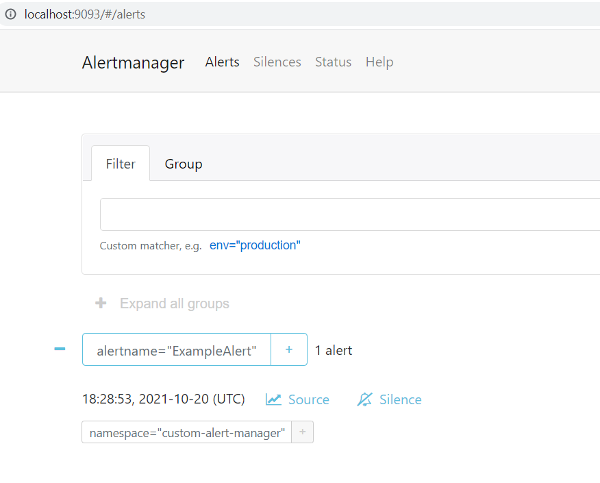

Starting with OpenShift 4.11 it is possible to [manage alerting rules for user-defined projects](https://docs.openshift.com/container-platform/4.11/monitoring/managing-alerts.html#managing-alerting-rules-for-user-defined-projects_managing-alerts). Similarly, in ROSA clusters the OpenShift Administrator can enable a second AlertManager instance in the user workload monitoring namespace which can be used to create such alerts.

> Note: Currently this is **not a managed** feature of ROSA. Such an implementation may get overwritten if the User Workload Monitoring functionality is toggled using the OpenShift Cluster Manager (OCM).

## Prerequisites

* [AWS CLI](https://docs.aws.amazon.com/cli/latest/userguide/cli-chap-install.html)
* A Red Hat OpenShift for AWS (ROSA) cluster 4.11.0 or higher

## Create Environment Variables

## Configure User Workload Monitoring to include AlertManager

1. Edit the user workload config to include AlertManager

  > Note: If you have other modifications to this config, you will need to hand edit the resource rather than brute forcing it like below.

   ```bash
   cat << EOF | oc apply -f -
   apiVersion: v1
   kind: ConfigMap
   metadata:
     name: user-workload-monitoring-config
     namespace: openshift-user-workload-monitoring
   data:
     config.yaml: |
       alertmanager:
         enabled: true
         enableAlertmanagerConfig: true
   EOF
   ```

1. Verify that a new Alert Manager instance is defined

   ```bash
   oc -n openshift-user-workload-monitoring get alertmanager
   ```

   ```
   NAME            VERSION   REPLICAS   AGE
   user-workload   0.24.0    2          2m
   ```

1. If you want non-admin users to be able to define alerts in their own namespaces you can run the following.

   ```bash
   oc -n <namespace> adm policy add-role-to-user alert-routing-edit <user>
   ```

1. Update the Alert Manager Configuration file

   > This will create a basic AlertManager configuration to send alerts to a slack channel. Configuring slack is outside the scope of this document. Update the variables to suit your slack integration.

   ```bash
   SLACK_API_URL=https://hooks.slack.com/services/XXX/XXX/XXX
   SLACK_CHANNEL='#paultest'
   cat << EOF | kubectl apply -f -
   apiVersion: v1
   kind: Secret
   metadata:
     name: alertmanager-user-workload
     namespace: openshift-user-workload-monitoring
   stringData:
     alertmanager.yaml: |
       global:
         slack_api_url: "${SLACK_API_URL}"
       route:
         receiver: Default
         group_by: [alertname]
       receivers:
         - name: Default
           slack_configs:
             - channel: ${SLACK_CHANNEL}
               send_resolved: true
     EOF
   ```

## Create an Example Alert

1. Create a Namespace for your custom alert

   ```bash
   oc create namespace custom-alert
   ```

1. Verify it works by creating a Prometheus Rule that will fire off an alert

   ```bash
   cat << EOF | kubectl apply -n custom-alert -f -
   apiVersion: monitoring.coreos.com/v1
   kind: PrometheusRule
   metadata:
     name: prometheus-example-rules
   spec:
     groups:
     - name: example.rules
       rules:
       - alert: ExampleAlert
         expr: vector(1)
   EOF
   ```

1. Forward a port to the alert manager service

   ```bash
    kubectl port-forward -n openshift-user-workload-monitoring \
      svc/alertmanager-operated 9093:9093
    ```

1. Browse to http://localhost:9093/#/alerts to see the alert "ExampleAlert"

    

1. Check the Alert was sent to Slack

    
