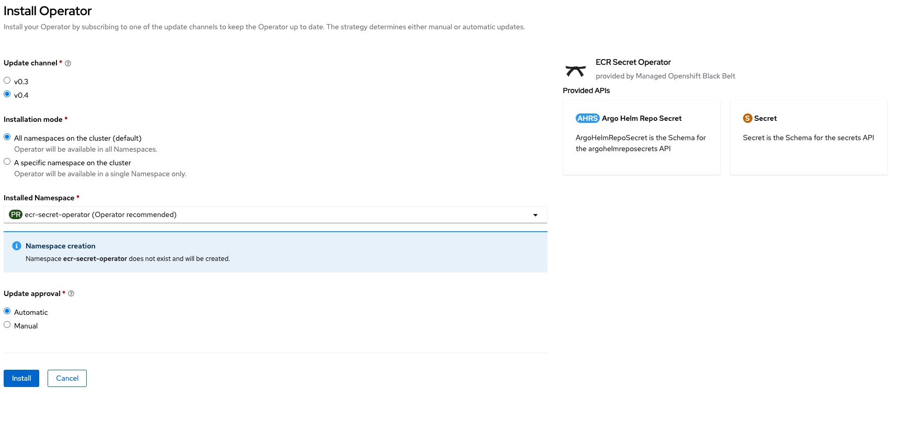

**Author: Shaozhen**
*Modified: 04/06/2023*

Amazon Elastic Container Registry [Private Registry Authentication](https://docs.aws.amazon.com/AmazonECR/latest/userguide/registry_auth.html) provides a temporary authorization token valid only for 12 hours. This operator refreshes automatically the Amazon ECR authorization token before it expires, reducing the overhead in managing the authentication flow.

This operator contains two Custom Resources which direct the operator to generate/refresh Amazon ECR authorization token in a timely manner:

* [Image Pull Secret API](https://github.com/rh-mobb/ecr-secret-operator/blob/v0.4.0/api/v1alpha1/secret_types.go)
* [Argo CD Repo Helm Chart Secret](https://github.com/rh-mobb/ecr-secret-operator/blob/v0.4.0/api/v1alpha1/argohelmreposecret_types.go)


## How to use this operator

### Prerequisites

* [Create an ECR private repository](https://docs.aws.amazon.com/AmazonECR/latest/userguide/repository-create.html)
* Provide AWS Authentication to the operator. Two Options:
  * [IAM User](./iam_user)
  * [STS Assume Role](./iam_assume_role)

### Install the operator

* Install the operator from operator hub community



### Create the ECR Secret CRD

```bash
oc new-project test-ecr-secret-operator
cat << EOF | oc apply -f -
apiVersion: ecr.mobb.redhat.com/v1alpha1
kind: Secret
metadata:
  name: ecr-secret
  namespace: test-ecr-secret-operator
spec:
  generated_secret_name: ecr-docker-secret
  ecr_registry: ${AWS_ACCOUNT_ID}.dkr.ecr.us-east-2.amazonaws.com
  frequency: 10h
  region: us-east-2
EOF
```

A docker registry secret is created by the operator momentally and the token is patched every 10 hours

```
oc get secret ecr-docker-secret
NAME                TYPE                             DATA   AGE
ecr-docker-secret   kubernetes.io/dockerconfigjson   1      16h
```

### A sample build process with generated secret


Link the secret to builder

```
oc secrets link builder ecr-docker-secret
```

Configure build config to point to your ECR Container repository

```bash
oc create imagestream ruby
oc tag openshift/ruby:2.5-ubi8 ruby:2.5
cat << EOF | oc apply -f -
kind: BuildConfig
apiVersion: build.openshift.io/v1
metadata:
  name: ruby-sample-build
  namespace: test-ecr-secret-operator
spec:
  runPolicy: Serial
  source:
    git:
      uri: "https://github.com/openshift/ruby-hello-world"
  strategy:
    sourceStrategy:
      from:
        kind: "ImageStreamTag"
        name: "ruby:2.5"
      incremental: true
  output:
    to:
      kind: "DockerImage"
      name: "${AWS_ACCOUNT_ID}.dkr.ecr.us-east-2.amazonaws.com/test:latest"
  postCommit:
      script: "bundle exec rake test"
EOF
oc start-build ruby-sample-build --wait
```

Build should succeed and push the image to the the private ECR Container repository


### Create the ECR Secret Argo CD Helm Repo CRD

* [OpenShift GitOps is installed](https://docs.openshift.com/container-platform/4.8/cicd/gitops/installing-openshift-gitops.html)
* [Helm chart stored in ecr](https://docs.aws.amazon.com/AmazonECR/latest/userguide/push-oci-artifact.html)
* aws ecr set-repository-policy --repository-name helm-test-chart --policy-text file:///tmp/repo_policy.json

```bash
export ACCOUNT_AWS_ID=
cat << EOF | oc apply -f -
apiVersion: ecr.mobb.redhat.com/v1alpha1
kind: ArgoHelmRepoSecret
metadata:
  name: helm-repo
  namespace: openshift-gitops
spec:
  generated_secret_name: ecr-argo-helm-secret
  url: ${AWS_ACCOUNT_ID}.dkr.ecr.us-east-2.amazonaws.com
  frequency: 10h
  region: us-east-2
EOF
cat << EOF | oc apply -f -
apiVersion: argoproj.io/v1alpha1
kind: Application
metadata:
  name: test
spec:
  destination:
    name: ''
    namespace: test-ecr-secret-operator
    server: 'https://kubernetes.default.svc'
  source:
    path: ''
    repoURL: ${AWS_ACCOUNT_ID}.dkr.ecr.us-east-2.amazonaws.com
    targetRevision: 0.1.0
    chart: helm-test-chart
  project: default
EOF
```

The ArgoCD application should sync with ECR helm chart successfully

