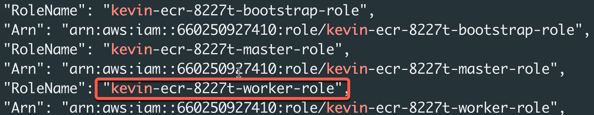

## Prerequisites

* [AWS CLI](https://docs.aws.amazon.com/cli/latest/userguide/install-cliv2.html)
* [Openshift CLI](https://mirror.openshift.com/pub/openshift-v4/clients/ocp/) 4.11+
* [Podman Desktop](https://podman-desktop.io/)

### Background
Quick Introduction by Ryan Niksch & Charlotte Fung on [YouTube](https://youtu.be/1PBFtpCIMBo).

 <iframe width="560" height="315" src="https://www.youtube.com/embed/1PBFtpCIMBo" title="YouTube video player" frameborder="0" allow="accelerometer; autoplay; clipboard-write; encrypted-media; gyroscope; picture-in-picture" allowfullscreen></iframe>  <br/>

There are two options to use to authenticate wth Amazon ECR to pull images.

The traditional method is to create a pull secret for ecr.

Example:

```
oc create secret docker-registry ecr-pull-secret  \
  --docker-server=<registry id>.dkr.ecr.<region>.amazonaws.com  \
  --docker-username=AWS --docker-password=$(aws ecr get-login-password) \
  --namespace=hello-world
```

However Amazon ECR tokens expire every 12 hours which will mean you will need to re-authenticate every 12 hours either through scripting or do so manually.

A second, and preferred method, is to attach an ECR Policy to your cluster's worker machine profiles which this guide will walk you through.


## Attach ECR Policy Role

You can attach an ECR policy to your cluster giving the cluster permissions to pull images from your registries.  ROSA worker machine instances comes with pre-defined IAM roles, named differently depending on whether its a STS cluster or a non-STS cluster.

### STS Cluster Role

`ManagedOpenShift-Worker-Role` is the IAM role attached to ROSA STS compute instances.

### non-STS Cluster Role

`<cluster name>-<identifier>-worker-role` is the IAM role attached to ROSA non-STS compute instances.

> Tip: To find the non-STS cluster role run the following command with your cluster name:

```
aws iam list-roles | grep <cluster_name>
```



## Configure ECR with ROSA

ECR has several pre-defined policies that give permissions to interact with the service.  In the case of ROSA, we will be pulling images from ECR and will only need to add the `AmazonEC2ContainerRegistryReadOnly` policy.

1. Add the `AmazonEC2ContainerRegistryReadOnly` policy to the `ManagedOpenShift-Worker-Role` for STS clusters (or the `<cluster name>-<identifier>-worker-role` for non-STS clusters).

   STS Example:

   ```
    aws iam attach-role-policy \
     --role-name ManagedOpenShift-Worker-Role \
     --policy-arn "arn:aws:iam::aws:policy/AmazonEC2ContainerRegistryReadOnly"
   ```

2. Set ENV variables

   Set our AWS Region and Registry name for creating a new ECR

   ```
   REGION=us-east-2
   REGISTRY=hello-ecr
   ```

3. Create a repository

   ```
   aws ecr create-repository \
    --repository-name $REGISTRY \
    --image-scanning-configuration scanOnPush=true \
    --region $REGION
   ```

4. Set Registry ID

   ```
   REGISTRYID=`aws ecr describe-repositories --repository-name hello-ecr | jq -r '.repositories[].registryId'`
   ```

5. Log into ECR  

   ```
   podman login -u AWS -p $(aws ecr get-login-password --region $REGION) $REGISTRYID.dkr.ecr.$REGION.amazonaws.com
   ```

6. Pull an image  

   ```
   podman pull openshift/hello-openshift
   ```

7. Tag the image for ecr  

   ```
   podman tag openshift/hello-openshift:latest $REGISTRYID.dkr.ecr.$REGION.amazonaws.com/hello-ecr:latest
   ```

8. Push the image to ECR  

   ```
   podman push $REGISTRYID.dkr.ecr.$REGION.amazonaws.com/hello-ecr:latest
   ```

9. Create OC pull secret for new ECR registry
   
   ```
   oc create secret docker-registry ecr-pull-secret  --docker-server=$REGISTRYID.dkr.ecr.$REGION.amazonaws.com  \
   --docker-username=AWS --docker-password=$(aws ecr get-login-password)  --namespace=hello-ecr
   ```

10. Create a new project  

   ```
   oc new-project hello-ecr
   ```

11. Create a new app using the image on ECR  

   ```
   oc new-app --name hello-ecr --image $REGISTRYID.dkr.ecr.$REGION.amazonaws.com/hello-ecr:latest
   ```

12. View a list of pods in the namespace you created:
    
   ```
   oc get pods
   ```

   Expected output:

   If you see the hello-ecr pod running ... congratulations!  You can now pull images from your ECR repository.

## Clean up    

1. Simply delete the project you created to test pulling images:

    ```
    oc delete project hello-ecr
    ```

   You may also want to remove the `arn:aws:iam::aws:policy/AmazonEC2ContainerRegistryReadOnly` policy from the worker nodes if you do no want them to continue to have access to the ECR.
