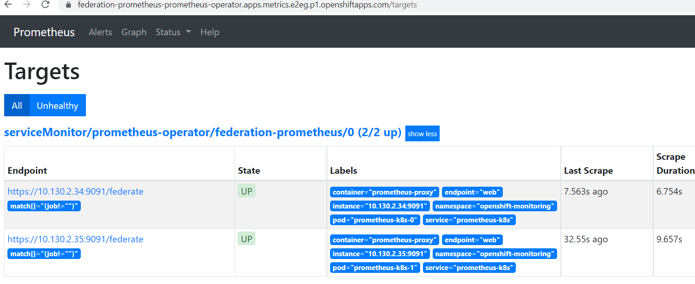
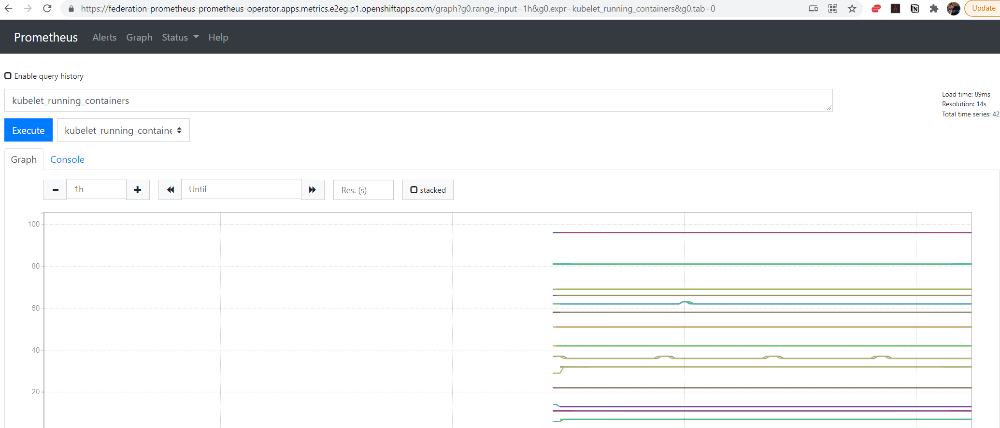
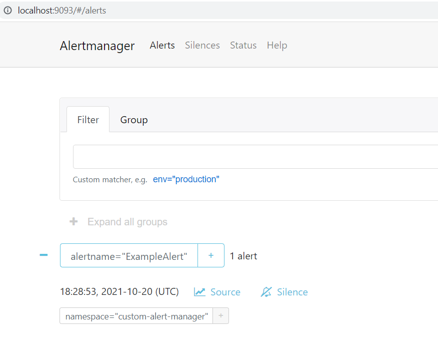
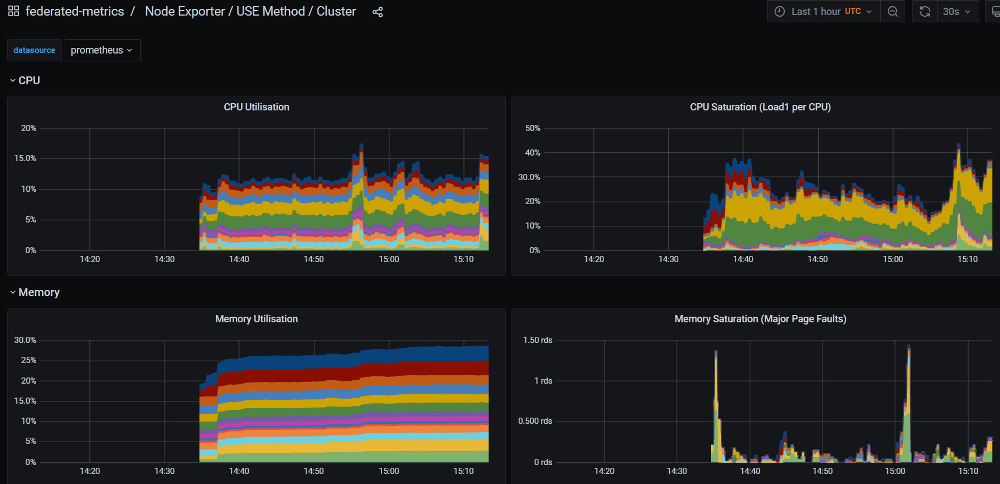

Red Hat Openshift for AWS (ROSA) comes with two built-in monitoring stacks. `ClusterMonitoring` and `User Workload Monitoring`. They are both based on Prometheus, the first targets the Cluster Operator (Red Hat SRE) and the latter targets the Cluster user (you!).

Both provide amazing metrics insights inside the Cluster's web console, showing overall cluster metrics as well as namespace specific workload metrics, all integrated with your configured IDP.

However the Alert Manager instance is locked down and used to send alerts to the Red Hat  SRE team. This means that the customer cannot create alerts for either the cluster resources, or their own workloads. This is being worked on and future versions of ROSA will provide a way for the end user to create alerts for their own workloads.

Until that work is done, the ROSA cluster administrator can deploy a Prometheus instance and configure it to send alerts to themselves. Thankfully with Prometheus' federated metrics feature and the Prometheus Operator, this can be done in a few simple steps.

This guide is heavily influenced by Tommer Amber's [guide](https://medium.com/@tamber/2-mini-how-to-guides-for-prometheus-on-openshift-federation-custom-infrastructure-alerting-8ec70061405d) for OCP 4.x.

## Pre-requisites

1. Make sure the following pre-requisites are met:

* [Helm 3](https://helm.sh/docs/intro/install/)
* A Red Hat OpenShift for AWS (ROSA) cluster 4.8 or higher

## Prepare Environment

1. Set the following environment variables

   ```bash
   export NAMESPACE=federated-metrics
   ```

1. Create the namespace

   ```bash
   oc new-project $NAMESPACE
   ```

1. Add the MOBB chart repository to your Helm

   ```bash
   helm repo add mobb https://rh-mobb.github.io/helm-charts/
   ```

1. Update your repositories

   ```bash
   helm repo update
   ```

1. Use the `mobb/operatorhub` chart to deploy the needed operators

   ```bash
   helm upgrade -n $NAMESPACE federated-metrics-operators \
   mobb/operatorhub --version 0.1.1 --install \
   --values https://raw.githubusercontent.com/rh-mobb/helm-charts/main/charts/rosa-federated-prometheus/files/operatorhub.yaml
   ```

1. Wait until the two operators are running

   ```bash
   watch kubectl get pods -n $NAMESPACE
   ```

   ```
   NAME                                                   READY   STATUS    RESTARTS   AGE
   grafana-operator-controller-manager-775f8d98c9-822h7   2/2     Running   0          7m33s
   operatorhubio-dtb2v                                    1/1     Running   0          8m32s
   prometheus-operator-5cb6844699-t7wfd                   1/1     Running   0          7m29s
   ```

## Deploy the monitoring stack


1. Install the `mobb/rosa-federated-prometheus` Helm Chart

   ```bash
   helm upgrade --install -n $NAMESPACE monitoring \
   --set grafana-cr.basicAuthPassword='mypassword' \
   --set fullnameOverride='monitoring' \
   --version 0.5.3 \
   mobb/rosa-federated-prometheus
   ```

### Validate Prometheus

1. Ensure the new Prometheus instance's Pods are running

   ```bash
   kubectl get pods -n ${NAMESPACE} -l app=prometheus -o wide
   ```

   You should see the following:

   ```bash
   NAME                                 READY   STATUS    RESTARTS   AGE     IP             NODE                                        NOMINATED NODE   READINESS GATES
   prometheus-federation-prometheus-0   3/3     Running   1          7m58s   10.131.0.104   ip-10-0-215-84.us-east-2.compute.internal   <none>           <none>
   prometheus-federation-prometheus-1   3/3     Running   1          7m58s   10.128.2.21    ip-10-0-146-85.us-east-2.compute.internal   <none>           <none>
   ```

1. Log into the new Prometheus instance

    Fetch the Route:

   ```bash
   kubectl -n ${NAMESPACE} get route prometheus-route
   ```

   You should see the following:

   ```bash
      NAME               HOST/PORT                                                                     PATH   SERVICES                   PORT   TERMINATION WILDCARD
      prometheus-route   prometheus-route-custom-prometheus.apps.mycluster.jnmf.p1.openshiftapps.com         monitoring-prometheus-cr   web-proxy  reencrypt  None
   ```

Open the Prometheus Route in your browser (the `HOST/PORT` field from above)

   It should take you through authorization and then you should see the Prometheus UI.

1. add `/targets` to the end of the URL to see the list of available targets OR under the *Status* drop down select *Targets*

   

1. Switch out the trailing path to be `graph?g0.range_input=1h&g0.expr=kubelet_running_containers&g0.tab=0` to see the graph of the number of running containers fetched from cluster monitoring.

   

1. click on **Alerts** in the menu to see our example Alert


### Validate Alert Manager

1. forward a port to Alert Manager

   ```bash
      kubectl -n ${NAMESPACE} port-forward svc/monitoring-alertmanager-cr 9093:9093
   ```

1. Browse to http://localhost:9093/#/alerts to see the alert "ExampleAlert"

   

### Validate Grafana and Dashboards

1. Find the Grafana Route

   ```bash
      kubectl get route grafana-route
   ```

   ```bash
      NAME            HOST/PORT                                                                PATH   SERVICES          PORT            TERMINATION   WILDCARD
      grafana-route   grafana-route-federated-metrics.apps.metrics.9l1z.p1.openshiftapps.com   /      grafana-service   grafana-proxy   reencrypt     None
   ```

1. Log into grafana using your cluster's idp

1. Click login and login to Grafana as `admin` with the password you set when doing `helm install`.

1. Click on **Configuration** -> **Datasources** and check that the prometheus data source is loaded.

   Sometimes due to Kubernetes resource ordering the Data Source may not be loaded. We can force the Operator to reload it by running `kubectl annotate -n $NAMESPACE grafanadatasources.integreatly.org federated reroll=true`

1. Click on **Dashboards** -> **Manage** and click on the "Use Method / Cluster" dashboard.

   

## Cleanup

1. Delete the helm release

   ```bash
      helm -n $NAMESPACE delete monitoring
   ```

1. Delete the namespace

   ```bash
      kubectl delete namespace $NAMESPACE
   ```
