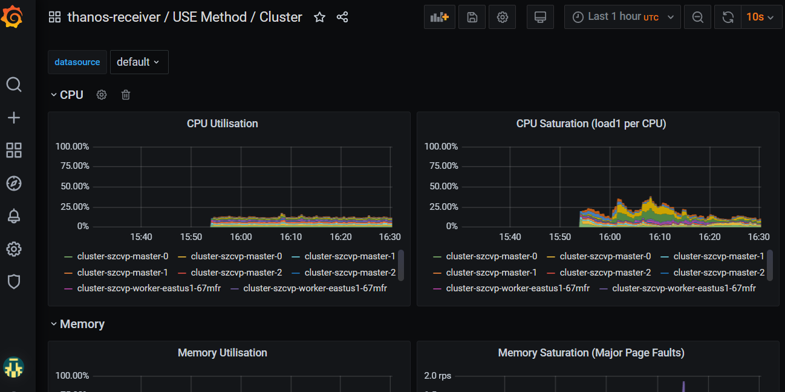

This guide walks through setting up federating Prometheus metrics to S3 storage.

> ToDo - Add Authorization in front of Thanos APIs

## Prerequisites

* [A ROSA cluster deployed with STS](/docs/rosa/sts/)
* aws CLI

## Set up environment

1. Create environment variables

    ```bash
    export CLUSTER_NAME=my-cluster
    export S3_BUCKET=my-thanos-bucket
    export REGION=us-east-2
    export NAMESPACE=federated-metrics
    export SA=aws-prometheus-proxy
    export SCRATCH_DIR=/tmp/scratch
    export OIDC_PROVIDER=$(oc get authentication.config.openshift.io cluster -o json | jq -r .spec.serviceAccountIssuer| sed -e "s/^https:\/\///")
    export AWS_ACCOUNT_ID=$(aws sts get-caller-identity --query Account --output text)
    export AWS_PAGER=""
    rm -rf $SCRATCH_DIR
    mkdir -p $SCRATCH_DIR
    ```

1. Create namespace

    ```bash
    oc new-project $NAMESPACE
    ```

## AWS Preperation

1. Create an S3 bucket

    ```bash
    aws s3 mb s3://$S3_BUCKET
    ```
1. Create a Policy for access to S3
    ```bash
      cat <<EOF > $SCRATCH_DIR/s3-policy.json
      {
          "Version": "2012-10-17",
          "Statement": [
              {
                  "Sid": "Statement",
                  "Effect": "Allow",
                  "Action": [
                      "s3:ListBucket",
                      "s3:GetObject",
                      "s3:DeleteObject",
                      "s3:PutObject",
                      "s3:PutObjectAcl"
                  ],
                  "Resource": [
                      "arn:aws:s3:::$S3_BUCKET/*",
                      "arn:aws:s3:::$S3_BUCKET"
                  ]
              }
          ]
      }
      EOF
    ```
1. Apply the Policy
    ```bash
    S3_POLICY=$(aws iam create-policy --policy-name $CLUSTER_NAME-thanos \
      --policy-document file://$SCRATCH_DIR/s3-policy.json \
      --query 'Policy.Arn' --output text)
    echo $S3_POLICY
    ```
1. Create a Trust Policy
    ```bash
    cat <<EOF > $SCRATCH_DIR/TrustPolicy.json
    {
      "Version": "2012-10-17",
      "Statement": [
        {
          "Effect": "Allow",
          "Principal": {
            "Federated": "arn:aws:iam::${AWS_ACCOUNT_ID}:oidc-provider/${OIDC_PROVIDER}"
          },
          "Action": "sts:AssumeRoleWithWebIdentity",
          "Condition": {
            "StringEquals": {
              "${OIDC_PROVIDER}:sub": [
                "system:serviceaccount:${NAMESPACE}:${SA}"
              ]
            }
          }
        }
      ]
    }
    EOF
    ```
1. Create Role for AWS Prometheus and CloudWatch
    ```bash
    S3_ROLE=$(aws iam create-role \
      --role-name "$CLUSTER-thanos-s3" \
      --assume-role-policy-document file://$SCRATCH_DIR/TrustPolicy.json \
      --query "Role.Arn" --output text)
    echo $S3_ROLE
    ```
1. Attach the Policies to the Role
    ```bash
    aws iam attach-role-policy \
      --role-name "$CLUSTER-thanos-s3" \
      --policy-arn $S3_POLICY
    ```

<!--
1. Grant access for the thanos user to the s3 bucket

aws s3api put-bucket-policy --bucket my-thanos-metrics \
  --policy file://s3-policy.json

1. Get the account key and secret and update in `thanos-store-credentials.yaml`
-->

## Deploy Operators

1. Add the MOBB chart repository to your Helm
    ```bash
    helm repo add mobb https://rh-mobb.github.io/helm-charts/
    ```
1. Update your repositories
    ```bash
    helm repo update
    ```
1. Use the `mobb/operatorhub` chart to deploy the needed operators
    ```bash
    helm upgrade -n $echNAMESPACE custom-metrics-operators \
      mobb/operatorhub --version 0.1.1 --install \
      --values https://raw.githubusercontent.com/rh-mobb/helm-charts/main/charts/rosa-thanos-s3/files/operatorhub.yaml
    ```

## Deploy Thanos Store Gateway

1. Deploy ROSA Thanos S3 Helm Chart
    ```bash
    helm upgrade -n $NAMESPACE rosa-thanos-s3 --install mobb/rosa-thanos-s3 \
      --set "aws.roleArn=$ROLE_ARN" \
      --set "rosa.clusterName=$CLUSTER_NAME"
    ```

1. Append remoteWrite settings to the user-workload-monitoring config to forward user workload metrics to Thanos.
    **Check if the User Workload Config Map exists:**
    ```bash
    oc -n openshift-user-workload-monitoring get \
      configmaps user-workload-monitoring-config
    ```

    **If the config doesn't exist run:**

    ```bash
    cat << EOF | kubectl apply -f -
    apiVersion: v1
    kind: ConfigMap
    metadata:
      name: user-workload-monitoring-config
      namespace: openshift-user-workload-monitoring
    data:
      config.yaml: |
        prometheus:
          remoteWrite:
            - url: "http://thanos-receive.${NAMESPACE}.svc.cluster.local:9091/api/v1/receive"
    EOF
    ```

    **Otherwise update it with the following:**

    ```bash
    oc -n openshift-user-workload-monitoring edit \
      configmaps user-workload-monitoring-config
    ```

    ```yaml
      data:
        config.yaml: |
          ...
          prometheus:
          ...
            remoteWrite:
              - url: "http://thanos-receive.thanos-receiver.svc.cluster.local:9091/api/v1/receive"
    ```

## Check metrics are flowing by logging into Grafana

1. get the Route URL for Grafana (remember its https) and login using username `root` and the password you updated to (or the default of `secret`).
    ```bash
    oc -n thanos-receiver get route grafana-route
    ```

1. Once logged in go to **Dashboards->Manage** and expand the **federated-metrics** group and you should see the cluster metrics dashboards.  Click on the **Use Method / Cluster** Dashboard and you should see metrics.  \o/.

    
    
    