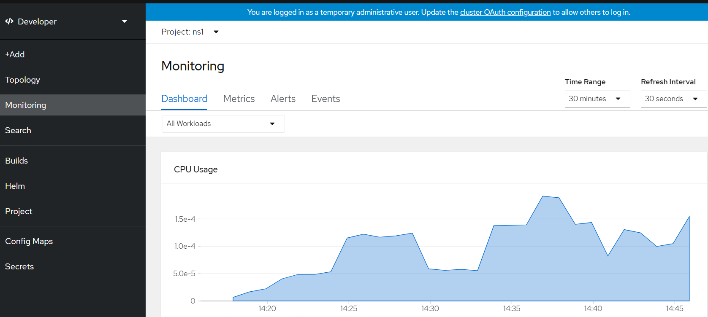

# User Workload Monitoring on Azure Red Hat OpenShift

In Azure Red Hat OpenShift (ARO) Monitoring for User Defined Projects is disabled by default. Follow these instructions to enable it.

## Enabling

> See [docs](https://docs.openshift.com/container-platform/4.7/monitoring/enabling-monitoring-for-user-defined-projects.html) for more indepth details.

1. Check the cluster-monitoring-config ConfigMap object

    ```bash
    oc -n openshift-monitoring get configmap cluster-monitoring-config -o yaml
    ```

1. Enable User Workload Monitoring by doing one of the following

    **If the `data.config.yaml` is not `{}` you should edit it and add the `enableUserWorkload: true` line manually.**

    ```bash
    oc -n openshift-monitoring edit configmap cluster-monitoring-config
    ```

    **Otherwise if its `{}` then you can run the following command safely.**

    ```bash
    cat << EOF | oc apply -f -
    apiVersion: v1
    kind: ConfigMap
    metadata:
      name: cluster-monitoring-config
      namespace: openshift-monitoring
    data:
      config.yaml: |
        enableUserWorkload: true
    EOF
    ```

3. Create a config for User Workload Monitoring to set retention and

    This will configure the user workload instance to have PVC storage and will set
    basic data retention values. Feel free to edit it to suit your needs. Remember if you're going to have PVCs enabled they are tied to an AZ, to for a multi-AZ cluster you should ensure you have at least 2 workers per AZ so that they can failover.

    ```bash
    cat << EOF | oc apply -f -
    apiVersion: v1
    kind: ConfigMap
    metadata:
      name: user-workload-monitoring-config
      namespace: openshift-user-workload-monitoring
    data:
      config.yaml: |
        prometheus:
          volumeClaimTemplate:
          spec:
            storageClassName: managed-premium
            volumeMode: Filesystem
            resources:
              requests:
                storage: 40Gi
          retention: 24h
          resources:
            requests:
              cpu: 200m
              memory: 2Gi
    EOF
    ```

4. Deploy an example application with a service monitor resource

    ```bash
    oc apply -f example-app.yaml
    ```

5. Wait a few minutes and then check your cluster metrics.

    1. Switch to **Developer** mode
    2. Change the **Project** to `ns1`
    3. Click the **Monitoring** button

    

## Grafana

1. Create a Project for the Grafana Operator + Application

    ```bash
    oc new-project custom-grafana
    ```

1. Install the Grafana Operator (or via the OperatorHub in the GUI)

    ```bash
    cat << EOF | oc apply -f -
    apiVersion: operators.coreos.com/v1alpha1
    kind: Subscription
    metadata:
      name: grafana-operator
      namespace: custom-grafana
      labels:
        operators.coreos.com/grafana-operator.custom-grafana: ''
    spec:
      channel: alpha
      installPlanApproval: Automatic
      name: grafana-operator
      source: community-operators
      sourceNamespace: openshift-marketplace
      startingCSV: grafana-operator.v3.10.1
    EOF
    ```

1. Once the Grafana Operator is running create a Grafana Instance

    ```
    cat << EOF | oc apply -f -
    apiVersion: integreatly.org/v1alpha1
    kind: Grafana
    metadata:
      name: custom-grafana
      namespace: custom-grafana
    spec:
      adminPassword: bad-password
      adminUser: admin
      basicAuth: true
      config:
        auth:
          disable_signout_menu: false
        auth.anonymous:
          enabled: false
        log:
          level: warn
          mode: console
        security:
          admin_password: secret
          admin_user: root
      dashboardLabelSelector:
        - matchExpressions:
            - key: app
              operator: In
              values:
                - grafana
      ingress:
        enabled: true
    EOF
    ```

1. Once the instance has been created you should be able to log in by getting the route and using the admin user/pass from above.

    ```bash
    oc -n custom-grafana get routes
    ```

    The output should look like

    ```
    NAME            HOST/PORT                                                     PATH   SERVICES          PORT   TERMINATION   WILDCARD
    grafana-route   grafana-route-custom-grafana.apps.w4l8w924.eastus.aroapp.io          grafana-service   3000   edge          None
    ```

    Copy and paste the host into your browser and log in to verify its working.

1. Grant the grafana instance access to cluster-metrics

    ```bash
    oc adm policy add-cluster-role-to-user \
      cluster-monitoring-view -z grafana-serviceaccount
    ```

1. Save the service accounts bearer token as a variable

    ```bash
    BEARER_TOKEN=`oc serviceaccounts get-token grafana-serviceaccount -n custom-grafana`
    ```

1. Create a datasource to access the Thanos Querier

    ```bash
    cat << EOF | oc apply -f -
    apiVersion: integreatly.org/v1alpha1
    kind: GrafanaDataSource
    metadata:
      name: prometheus-grafanadatasource
      namespace: custom-grafana
    spec:
      datasources:
        - access: proxy
          editable: true
          isDefault: true
          jsonData:
            httpHeaderName1: 'Authorization'
            timeInterval: 5s
            tlsSkipVerify: true
          name: Prometheus
          secureJsonData:
            httpHeaderValue1: 'Bearer ${BEARER_TOKEN}'
          type: prometheus
          url: 'https://thanos-querier.openshift-monitoring.svc.cluster.local:9091'
      name: prometheus-grafanadatasource.yaml
    EOF
    ```

1. Add system dashboards to Grafana

> The `dashboards.yaml` file was created by running the script `generate-dashboards.sh` which fetches the dashboard json files from the `openshift-monitoring` namespace.

```bash
oc apply -f dashboards.yaml
```
