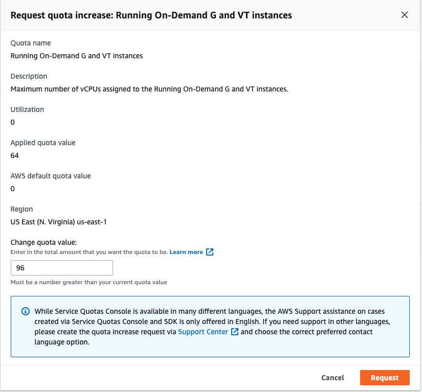

ROSA guide to running Nvidia GPU workloads.

## Prerequisites

* ROSA Cluster (4.10+)
* rosa cli #logged-in
* oc cli #logged-in-cluster-admin
* jq

If you need to install a ROSA cluster, please read our [ROSA Quickstart Guide](). Please be sure you are installing or using an existing ROSA cluster that it is 4.10.x or higher. 

>As of OpenShift 4.10, it is no longer necessary to set up entitlements to use the nVidia Operator. This has greatly simplified the setup of the cluster for GPU workloads.

Enter the `oc login` command, username, and password from the output of the previous command:

Example login:
```bash
oc login https://api.cluster_name.t6k4.i1.organization.org:6443 --username cluster-admin
Login successful. 
You have access to 77 projects, the list has been suppressed. You can list all projects with ' projects'
```

Linux:

```bash
sudo dnf install jq
```

MacOS
```bash
brew install jq
```

### Helm Prerequisites

If you plan to use Helm to deploy the GPU operator, you will need to do the following

1. Add the MOBB chart repository to your Helm

    ```bash
    helm repo add mobb https://rh-mobb.github.io/helm-charts/
    ```

1. Update your repositories

    ```bash
    helm repo update
    ```

## GPU Quota

1. View the list of supported GPU instance types in ROSA

   ```bash
   rosa list instance-types | grep accelerated
   ```

1. Select a GPU instance type

   > The guide uses *g5.xlarge* as an example. Please be mindful of the GPU cost of the type you choose.

   ```bash
   export GPU_INSTANCE_TYPE='g5.xlarge'
   ```
 
1. Login to AWS

   Login to [AWS Console](https://console.aws.amazon.com/console/home), type "quotas" in search by, click on "Service Quotas" -> "AWS services" -> "Amazon Elastic Compute Cloud (Amazon EC2). Search for "Running On-Demand [instance-family] instances" (e.g. Running On-Demand G and VT instances).

> Please remember that when you request quota that AWS is per core.  As an example, to request a single *g5.xlarge*, you will need to request quota in groups of 4; to request a single *g5.8xlarge*, you will need to request quota in groups of 32.

1. Verify quota and request increase if necessary

   

## GPU Machine Pool

1. Set environment variables

   ```bash
   export CLUSTER_NAME=<YOUR-CLUSTER>
   export MACHINE_POOL_NAME=nvidia-gpu-pool
   export MACHINE_POOL_REPLICA_COUNT=1
   ```

1. Create GPU machine pool

   ```bash
   rosa create machinepool --cluster=$CLUSTER_NAME \
     --name=$MACHINE_POOL_NAME \
     --replicas=$MACHINE_POOL_REPLICA_COUNT \
     --instance-type=$GPU_INSTANCE_TYPE
   ```

1. Verify GPU machine pool

> It may take 10-15 minutes to provision a new GPU machine. If this step fails, please login to the [AWS Console](https://console.aws.amazon.com/console/home) and ensure you didn't run across availability issues. You can go to EC2 and search for instances by cluster name to see the instance state.

   ```bash
   oc wait --for=jsonpath='{.status.readyReplicas}'=1 machineset \
     -l hive.openshift.io/machine-pool=$MACHINE_POOL_NAME \
     -n openshift-machine-api --timeout=600s
   ```

## Install and Configure Nvidia GPU

This section configures the Node Feature Discovery Operator (to allow OpenShift to discover the GPU nodes) and the Nvidia GPU Operator.

Two options: [Helm](#helm) or [Manual](#manually)

### Helm

1. Create namespaces

    ```bash
    oc create namespace openshift-nfd
    oc create namespace nvidia-gpu-operator
    ```

1. Use the `mobb/operatorhub` chart to deploy the needed operators

    ```bash
    helm upgrade -n nvidia-gpu-operator nvidia-gpu-operator \
      mobb/operatorhub --install \
      --values https://raw.githubusercontent.com/rh-mobb/helm-charts/main/charts/nvidia-gpu/files/operatorhub.yaml
    ```

1. Wait until the two operators are running

    ```bash
    oc rollout status deploy/nfd-controller-manager -n openshift-nfd --timeout=300s
    ```

    ```bash
    oc rollout status deploy/gpu-operator -n nvidia-gpu-operator --timeout=300s
    ```

1. Install the Nvidia GPU Operator chart

    ```bash
    helm upgrade --install -n nvidia-gpu-operator nvidia-gpu \
      mobb/nvidia-gpu --disable-openapi-validation
    ```

1. Wait until NFD instances are ready

   ```bash
   oc wait --for=jsonpath='{.status.availableReplicas}'=3 -l app=nfd-master deployment -n openshift-nfd
   ```
   > NOTE: If you are deploying ROSA in single-AZ change the replicas from 3 to 1 nfd-master

   ```bash
   oc wait --for=jsonpath='{.status.numberReady}'=5 -l app=nfd-worker ds -n openshift-nfd
   ```
   

1. Wait until Cluster Policy is ready

   ```bash
   oc wait --for=jsonpath='{.status.state}'=ready clusterpolicy \
     gpu-cluster-policy -n nvidia-gpu-operator --timeout=600s
   ```

1. Skip to [Validate GPU](#validate-gpu)


### Manually

#### Install Nvidia GPU Operator

1. Create Nvidia namespace

   ```bash
   oc create namespace nvidia-gpu-operator
   ```

1. Create Operator Group

   ```yaml
   cat <<EOF | oc apply -f -
   apiVersion: operators.coreos.com/v1
   kind: OperatorGroup
   metadata:
     name: nvidia-gpu-operator-group
     namespace: nvidia-gpu-operator
   spec:
    targetNamespaces:
    - nvidia-gpu-operator
   EOF
   ```

1. Get latest nvidia channel

   ```bash
   CHANNEL=$(oc get packagemanifest gpu-operator-certified -n openshift-marketplace -o jsonpath='{.status.defaultChannel}')
   ```

1. Get latest nvidia package

   ```bash
   PACKAGE=$(oc get packagemanifests/gpu-operator-certified -n openshift-marketplace -ojson | jq -r '.status.channels[] | select(.name == "'$CHANNEL'") | .currentCSV')
   ```

1. Create Subscription

   ```yaml
   envsubst  <<EOF | oc apply -f -
   apiVersion: operators.coreos.com/v1alpha1
   kind: Subscription
   metadata:
     name: gpu-operator-certified
     namespace: nvidia-gpu-operator
   spec:
     channel: "$CHANNEL"
     installPlanApproval: Automatic
     name: gpu-operator-certified
     source: certified-operators
     sourceNamespace: openshift-marketplace
     startingCSV: "$PACKAGE"
   EOF
   ```

1. Wait for Operator to finish installing

   ```bash
   oc rollout status deploy/gpu-operator -n nvidia-gpu-operator --timeout=300s
   ```

#### Install Node Feature Discovery Operator

The node feature discovery operator will discover the GPU on your nodes and appropriately label the nodes so you can target them for workloads.  We'll install the NFD operator into the opneshift-ndf namespace and create the "subscription" which is the configuration for NFD.

Official Documentation for Installing [Node Feature Discovery Operator](https://docs.openshift.com/container-platform/4.10/hardware_enablement/psap-node-feature-discovery-operator.html)

1. Set up namespace

   ```bash
   oc create namespace openshift-nfd
   ```

1. Create OperatorGroup

   ```yaml
   cat <<EOF | oc apply -f -
   apiVersion: operators.coreos.com/v1
   kind: OperatorGroup
   metadata:
     generateName: openshift-nfd-
     name: openshift-nfd
     namespace: openshift-nfd
   EOF
   ```

1. Create Subscription

   ```yaml
   cat <<EOF | oc apply -f -
   apiVersion: operators.coreos.com/v1alpha1
   kind: Subscription
   metadata:
     name: nfd
     namespace: openshift-nfd
   spec:
     channel: "stable"
     installPlanApproval: Automatic
     name: nfd
     source: redhat-operators
     sourceNamespace: openshift-marketplace
   EOF
   ```
1. Wait for Node Feature discovery to complete installation

   ```bash
   oc rollout status deploy/nfd-controller-manager -n openshift-nfd --timeout=300s
   ```

1. Create NFD Instance

   ```yaml
   cat <<EOF | oc apply -f -
   kind: NodeFeatureDiscovery
   apiVersion: nfd.openshift.io/v1
   metadata:
     name: nfd-instance
     namespace: openshift-nfd
   spec:
     customConfig:
       configData: |
         #    - name: "more.kernel.features"
         #      matchOn:
         #      - loadedKMod: ["example_kmod3"]
         #    - name: "more.features.by.nodename"
         #      value: customValue
         #      matchOn:
         #      - nodename: ["special-.*-node-.*"]
     operand:
       image: >-
         registry.redhat.io/openshift4/ose-node-feature-discovery@sha256:07658ef3df4b264b02396e67af813a52ba416b47ab6e1d2d08025a350ccd2b7b
       servicePort: 12000
     workerConfig:
       configData: |
         core:
         #  labelWhiteList:
         #  noPublish: false
           sleepInterval: 60s
         #  sources: [all]
         #  klog:
         #    addDirHeader: false
         #    alsologtostderr: false
         #    logBacktraceAt:
         #    logtostderr: true
         #    skipHeaders: false
         #    stderrthreshold: 2
         #    v: 0
         #    vmodule:
         ##   NOTE: the following options are not dynamically run-time
         ##          configurable and require a nfd-worker restart to take effect
         ##          after being changed
         #    logDir:
         #    logFile:
         #    logFileMaxSize: 1800
         #    skipLogHeaders: false
         sources:
         #  cpu:
         #    cpuid:
         ##     NOTE: whitelist has priority over blacklist
         #      attributeBlacklist:
         #        - "BMI1"
         #        - "BMI2"
         #        - "CLMUL"
         #        - "CMOV"
         #        - "CX16"
         #        - "ERMS"
         #        - "F16C"
         #        - "HTT"
         #        - "LZCNT"
         #        - "MMX"
         #        - "MMXEXT"
         #        - "NX"
         #        - "POPCNT"
         #        - "RDRAND"
         #        - "RDSEED"
         #        - "RDTSCP"
         #        - "SGX"
         #        - "SSE"
         #        - "SSE2"
         #        - "SSE3"
         #        - "SSE4.1"
         #        - "SSE4.2"
         #        - "SSSE3"
         #      attributeWhitelist:
         #  kernel:
         #    kconfigFile: "/path/to/kconfig"
         #    configOpts:
         #      - "NO_HZ"
         #      - "X86"
         #      - "DMI"
           pci:
             deviceClassWhitelist:
               - "0200"
               - "03"
               - "12"
             deviceLabelFields:
         #      - "class"
               - "vendor"
         #      - "device"
         #      - "subsystem_vendor"
         #      - "subsystem_device"
         #  usb:
         #    deviceClassWhitelist:
         #      - "0e"
         #      - "ef"
         #      - "fe"
         #      - "ff"
         #    deviceLabelFields:
         #      - "class"
         #      - "vendor"
         #      - "device"
         #  custom:
         #    - name: "my.kernel.feature"
         #      matchOn:
         #        - loadedKMod: ["example_kmod1", "example_kmod2"]
         #    - name: "my.pci.feature"
         #      matchOn:
         #        - pciId:
         #            class: ["0200"]
         #            vendor: ["15b3"]
         #            device: ["1014", "1017"]
         #        - pciId :
         #            vendor: ["8086"]
         #            device: ["1000", "1100"]
         #    - name: "my.usb.feature"
         #      matchOn:
         #        - usbId:
         #          class: ["ff"]
         #          vendor: ["03e7"]
         #          device: ["2485"]
         #        - usbId:
         #          class: ["fe"]
         #          vendor: ["1a6e"]
         #          device: ["089a"]
         #    - name: "my.combined.feature"
         #      matchOn:
         #        - pciId:
         #            vendor: ["15b3"]
         #            device: ["1014", "1017"]
         #          loadedKMod : ["vendor_kmod1", "vendor_kmod2"]
   EOF
   ```

1. Wait until NFD instances are ready

   ```bash
   oc wait --for=jsonpath='{.status.numberReady}'=3 -l app=nfd-master ds -n openshift-nfd
   ```
   
   ```bash
   oc wait --for=jsonpath='{.status.numberReady}'=5 -l app=nfd-worker ds -n openshift-nfd
   ```

#### Apply nVidia Cluster Config

We'll now apply the nvidia cluster config. Please read the [nvidia documentation](https://docs.nvidia.com/datacenter/cloud-native/gpu-operator/openshift/install-gpu-ocp.html) on customizing this if you have your own private repos or specific settings. This will be another process that takes a few minutes to complete.

1. Create cluster config

   ```yaml
   cat <<EOF | oc create -f -
   apiVersion: nvidia.com/v1
   kind: ClusterPolicy
   metadata:
     name: gpu-cluster-policy
   spec:
     migManager:
       enabled: true
     operator:
       defaultRuntime: crio
       initContainer: {}
       runtimeClass: nvidia
       deployGFD: true
     dcgm:
       enabled: true
     gfd: {}
     dcgmExporter:
       config:
         name: ''
     driver:
       licensingConfig:
         nlsEnabled: false
         configMapName: ''
       certConfig:
         name: ''
       kernelModuleConfig:
         name: ''
       repoConfig:
         configMapName: ''
       virtualTopology:
         config: ''
       enabled: true
       use_ocp_driver_toolkit: true
     devicePlugin: {}
     mig:
       strategy: single
     validator:
       plugin:
         env:
           - name: WITH_WORKLOAD
             value: 'true'
     nodeStatusExporter:
       enabled: true
     daemonsets: {}
     toolkit:
       enabled: true
   EOF
   ```

1. Wait until Cluster Policy is ready

   ```bash
   oc wait --for=jsonpath='{.status.state}'=ready clusterpolicy \
    gpu-cluster-policy -n nvidia-gpu-operator --timeout=600s
   ```

## Validate GPU

1. Verify NFD can see your GPU(s)

    ```bash
    oc describe node -l node.kubernetes.io/instance-type=$GPU_INSTANCE_TYPE \
      | egrep 'Roles|pci-10de' | grep -v master    
    ```

    You should see output like:

    ```bash
    Roles:              worker
                        feature.node.kubernetes.io/pci-10de.present=true
    ```

1. Verify GPU Operator added node label to your GPU nodes

   ```bash
   oc get node -l nvidia.com/gpu.present
   ```

1. [Optional] Test GPU access using Nvidia SMI

   ```bash
   oc project nvidia-gpu-operator

   for i in $(oc get pod -lopenshift.driver-toolkit=true --no-headers |awk '{print $1}'); do echo $i; oc exec -it $i -- nvidia-smi ; echo -e '\n' ;  done
   ```

   You should see output that shows the GPUs available on the host such as this example screenshot. (Varies depending on GPU worker type)

   

2. Create Pod to run a GPU workload

   ```yaml
   oc project nvidia-gpu-operator

   cat <<EOF | oc create -f -
   apiVersion: v1
   kind: Pod
   metadata:
     name: cuda-vector-add
   spec:
     restartPolicy: OnFailure
     containers:
       - name: cuda-vector-add
         image: "nvidia/samples:vectoradd-cuda11.2.1"
         resources:
           limits:
             nvidia.com/gpu: 1
         nodeSelector:
           nvidia.com/gpu.present: true
   EOF
   ```

3. View logs

   ```bash
   oc logs cuda-vector-add --tail=-1
   ```

   >Please note, if you get an error "Error from server (BadRequest): container "cuda-vector-add" in pod "cuda-vector-add" is waiting to start: ContainerCreating" try running "oc delete pod cuda-vector-add" and then re-run the create statement above. We've seen issues where if this step is ran before all of the operator consolidation is done it may just sit there.

   You should see Output like the following (mary vary depending on GPU):

   ```bash
   [Vector addition of 5000 elements]
   Copy input data from the host memory to the CUDA device
   CUDA kernel launch with 196 blocks of 256 threads
   Copy output data from the CUDA device to the host memory
   Test PASSED
   Done
   ```

4. If successful, the pod can be deleted

   ```bash
   oc delete pod cuda-vector-add
   ```
