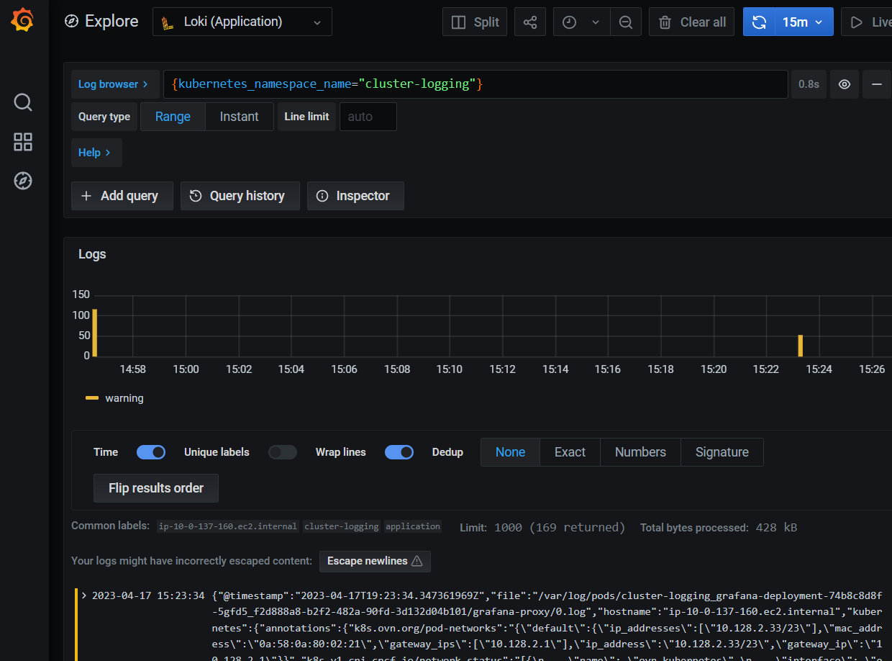

**Paul Czarkowski**

*04/18/2023*

This guide will show you how to use Helm to deploy Loki on a ROSA cluster in order to write [and view] your logs in AWS S3.

## Prerequisites

* A ROSA cluster
* Helm CLI
* AWS cli

## Prepare Environment

1. Set some environment variables

    > Change these to suit your environment / cluster

    ```bash
    export CLUSTER_NAME="$(whoami)-sts"
    export NAMESPACE=cluster-logging
    export AWS_REGION=us-east-1
    export SCRATCH=/tmp/rosa-loki
    mkdir -p $SCRATCH
    ```

1. Add the MOBB chart repository to your Helm

    ```bash
    helm repo add mobb https://rh-mobb.github.io/helm-charts/
    ```

1. Update your repositories

    ```bash
    helm repo update
    ```

## Prepare AWS Account

Loki stores logs in the Cloud's Object storage, in this case AWS S3. In order to allow it to do so you need to create an S3 bucket and give access to read/write to it to Loki.

1. Create S3 bucket

    ```bash
    aws s3api create-bucket --bucket "rosa-${CLUSTER_NAME}-loki" \
      --region "${AWS_REGION}"
    ```

1. Create an IAM Policy

    ```bash
    cat << EOF > ${SCRATCH}/policy.json
    {
    "Version": "2012-10-17",
    "Statement": [
      {
            "Effect": "Allow",
            "Action": [
                "s3:ListBucket",
                "s3:PutObject",
                "s3:GetObject",
                "s3:DeleteObject"
            ],
            "Resource": [
                "arn:aws:s3:::rosa-${CLUSTER_NAME}-loki",
                "arn:aws:s3:::rosa-${CLUSTER_NAME}-loki/*"
            ]
      }
    ]
    }
    EOF
    POLICY_ARN=$(aws iam create-policy --policy-name "rosa-${CLUSTER_NAME}-loki" \
    --policy-document file:///${SCRATCH}/policy.json --query Policy.Arn --output text)
    echo ${POLICY_ARN}
    ```

> Note, currently OpenShift Logging does not support

1. Create an IAM user for Loki

    ```bash
    aws iam create-user \
      --user-name rosa-${CLUSTER_NAME}-loki \
      > $SCRATCH/aws-user.json
   ```

1. Create IAM Access Key and save it to variables

    ```bash
    aws iam create-access-key \
      --user-name rosa-${CLUSTER_NAME}-loki \
      > $SCRATCH/aws-access-key.json

    AWS_ID=`cat $SCRATCH/aws-access-key.json | jq -r '.AccessKey.AccessKeyId'`
    AWS_KEY=`cat $SCRATCH/aws-access-key.json | jq -r '.AccessKey.SecretAccessKey'`
    ```

## Deploy and Configure Loki

1. Create a namespace to deploy to

    ```bash
    oc new-project $NAMESPACE
    ```

1. Use the `mobb/operatorhub` chart to deploy the needed operators

    ```bash
    helm upgrade -n $NAMESPACE custom-logging-operators \
      mobb/operatorhub --install \
      --values https://raw.githubusercontent.com/rh-mobb/helm-charts/main/charts/rosa-loki/files/operatorhub.yaml
    ```

1. Wait until the operators are running (if the command fails, wait a few minutes and try again)

    ```bash
    oc -n openshift-logging rollout status \
      deployment cluster-logging-operator
    oc -n $NAMESPACE rollout status deployment \
      grafana-operator-controller-manager
    oc -n openshift-operators-redhat rollout status \
      deployment loki-operator-controller-manager
    ```

    ```
    deployment "cluster-logging-operator" successfully rolled out
    deployment "grafana-operator-controller-manager" successfully rolled out
    deployment "loki-operator-controller-manager" successfully rolled out
    ```

## Deploy the Helm Chart

1. Install a Chart

    ```bash
    helm upgrade --install -n $NAMESPACE cluster-logging \
      --set "aws_access_key_id=${AWS_ID}" \
      --set "aws_access_key_secret=${AWS_KEY}" \
      --set "aws_region=${AWS_REGION}" \
      --set "aws_s3_bucket_name=rosa-${CLUSTER_NAME}-loki" \
      mobb/rosa-loki
    ```

1. Check to see the Lokistack pods are started

    ```bash
    oc -n openshift-logging get pods
    ```

    ```
    NAME                                           READY   STATUS    RESTARTS   AGE
    cluster-logging-operator-6fd6dbc575-xzxpc      1/1     Running   0          38m
    collector-4ckl2                                2/2     Running   0          98s
    collector-dw4jn                                2/2     Running   0          97s
    collector-fjv4p                                2/2     Running   0          97s
    collector-lth49                                2/2     Running   0          97s
    collector-qqxv8                                2/2     Running   0          97s
    logging-loki-compactor-0                       1/1     Running   0          86s
    logging-loki-distributor-79d8db5f89-xmpmz      1/1     Running   0          86s
    logging-loki-gateway-69f68f5685-54bgz          2/2     Running   0          86s
    logging-loki-gateway-69f68f5685-ql6hk          2/2     Running   0          86s
    logging-loki-index-gateway-0                   1/1     Running   0          86s
    logging-loki-ingester-0                        1/1     Running   0          86s
    logging-loki-querier-766cfd6bcd-79k28          1/1     Running   0          86s
    logging-loki-query-frontend-7f8cdb6885-x5n49   1/1     Running   0          86s
    logging-view-plugin-b97d78895-wwqts            1/1     Running   0          102s
    ```

> Note: If you want to view logs from the Console, you can enabled it via **Operators > Installed Operators > Red Hat OpenShift Logging > Console Plugin**.

1. Fetch the Route for Grafana

    ```bash
    oc get route grafana-route -o jsonpath='{"https://"}{.spec.host}{"\n"}'
    ```

    ```
    https://grafana-route-cluster-logging.apps.pczarkow-sts.h5yv.p1.openshiftapps.com
    ```

1. Browse to the Route via your preferred Web browser and log in using your OpenShift credentials.

1. Click the Compass icon in the menu and Click **Explore**

1. Change the Source from `Grafana` to `Loki (Infrastructure)` and search for `{kubernetes_namespace_name="cluster-logging"}`.

    
