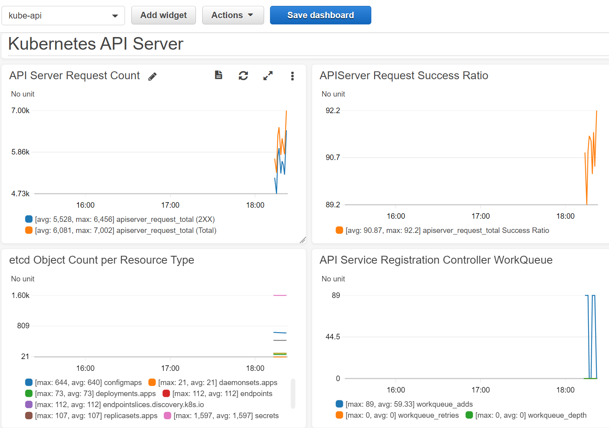

This document shows how you can use the AWS Cloud Watch agent to scrape Prometheus endpoints and publish metrics to CloudWatch in a Red Hat OpenShift Container Platform (ROSA) cluster.

It pulls from The AWS documentation for installing the CloudWatch agent to Kubernetes and collections and publishes metrics for the Kubernetes API Server and provides a simple Dashboard to view the results.

Currently the AWS Cloud Watch Agent does [not support](https://github.com/aws/amazon-cloudwatch-agent/issues/187) pulling all metrics from the Prometheus federated endpoint, but the hope is that when it does we can ship all Cluster and User Workload metrics to CloudWatch.

## Prerequisites

1. [AWS CLI](https://aws.amazon.com/cli/)
1. [jq](https://stedolan.github.io/jq/)
1. A ROSA Cluster

## Prepare AWS Account

1. Turn off AWS CLI Paging

   ```bash
   export AWS_PAGER=""
   ```

1. Set some environment variables

   Change these to suit your environment.

   ```bash
   export CLUSTER_NAME=metrics
   export CLUSTER_REGION=us-east-2
   export SCRATCH_DIR=/tmp/scratch
   mkdir -p $SCRATCH_DIR
   ```

1. Create an AWS IAM User for Cloud Watch

   ```bash
   aws iam create-user \
     --user-name $CLUSTER_NAME-cloud-watch \
     > $SCRATCH_DIR/aws-user.json
   ```

1. Fetch Access and Secret Keys for IAM User

   ```bash
   aws iam create-access-key \
     --user-name $CLUSTER_NAME-cloud-watch \
     > $SCRATCH_DIR/aws-access-key.json
   ```

1. Attach Policy to AWS IAM User

   ```bash
   aws iam attach-user-policy \
     --user-name $CLUSTER_NAME-cloud-watch \
     --policy-arn "arn:aws:iam::aws:policy/CloudWatchAgentServerPolicy"
   ```

## Deploy Cloud Watch Prometheus Agent

1. Create a namespace for Cloud Watch

   ```bash
   oc create namespace amazon-cloudwatch
   ```

1. Download the Cloud Watch Agent Kubernetes manifests

   ```bash
   wget -O $SCRATCH_DIR/cloud-watch.yaml https://raw.githubusercontent.com/rh-mobb/documentation/main/docs/rosa/metrics-to-cloudwatch-agent/cloud-watch.yaml
   ```

1. Update the Cloud Watch Agent Kubernetes manifests

   ```bash
   sed -i "s/__cluster_name__/$CLUSTER_NAME/g" $SCRATCH_DIR/cloud-watch.yaml
   sed -i "s/__cluster_region__/$CLUSTER_REGION/g" $SCRATCH_DIR/cloud-watch.yaml
   ```

1. Provide AWS Creds to the Cloud Watch Agent

   ```bash
   AWS_ID=`cat $SCRATCH_DIR/aws-access-key.json | jq -r '.AccessKey.AccessKeyId'`
   AWS_KEY=`cat $SCRATCH_DIR/aws-access-key.json | jq -r '.AccessKey.SecretAccessKey'`

   echo "[AmazonCloudWatchAgent]\naws_access_key_id = $AWS_ID\naws_secret_access_key = $AWS_KEY" \
     > $SCRATCH_DIR/credentials

   oc --namespace amazon-cloudwatch \
     create secret generic aws-credentials \
     --from-file=credentials=$SCRATCH_DIR/credentials
   ```

1. Allow Cloud Watch Agent to run as Root user (inside the container)

   ```bash
   oc -n amazon-cloudwatch adm policy \
     add-scc-to-user anyuid -z cwagent-prometheus
   ```

1. Apply the Cloud Watch Agent Kubernetes manifests

   ```bash
   oc apply -f $SCRATCH_DIR/cloud-watch.yaml
   ```

1. Check the Pod is running

   ```bash
   oc get pods -n amazon-cloudwatch
   ```

   You should see:

   ```
   NAME                                  READY   STATUS    RESTARTS   AGE
   cwagent-prometheus-54cd498c9c-btmjm   1/1     Running   0          60m
   ```

## Create Sample Dashboard

1. Download the Sample Dashboard

   ```bash
   wget -O $SCRATCH_DIR/dashboard.json https://raw.githubusercontent.com/rh-mobb/documentation/main/docs/rosa/metrics-to-cloudwatch-agent/dashboard.json
   ```

1. Update the Sample Dashboard

   ```bash
   sed -i "s/__CLUSTER_NAME__/$CLUSTER_NAME/g" $SCRATCH_DIR/dashboard.json
   sed -i "s/__REGION_NAME__/$CLUSTER_REGION/g" $SCRATCH_DIR/dashboard.json
   ```

1. Browse to https://us-east-2.console.aws.amazon.com/cloudwatch

1. Create a Dashboard, call it "Kubernetes API Server"

1. Click **Actions**->**View/edit source**

1. Paste the JSON contents from `$SCRATCH_DIR/dashboard.json` into the text area

1. View the dashboard

   
