**Steve Mirman, Paul Czarkowski**

*Last updated 1/28/2022*

> This is a combination of the [private-link](../private-link) and [sts](../sts) setup documents to show the full picture

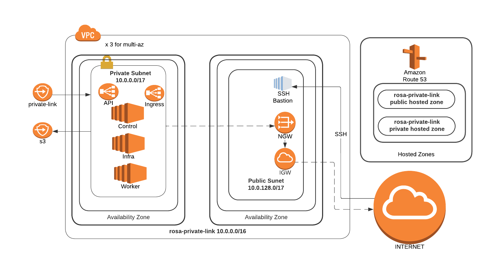

## Prerequisites

* [AWS CLI](https://docs.aws.amazon.com/cli/latest/userguide/install-cliv2.html)
* [Rosa CLI](https://github.com/openshift/rosa/releases/tag/v1.1.7) v1.1.7
* [jq](https://stedolan.github.io/jq/download/)

## AWS Preparation

1. If this is a brand new AWS account that has never had a AWS Load Balancer installed in it, you should run the following

    ```bash
    aws iam create-service-linked-role --aws-service-name \
    "elasticloadbalancing.amazonaws.com"
    ```

## Create the AWS Virtual Private Cloud (VPC) and Subnets

For this scenario, we will be using a newly created VPC with both public and private subnets.  All of the cluster resources will reside in the private subnet. The public subnet will be used for traffic to the Internet (egress)

> **Note**: If you already have a Transit Gateway (TGW) or similar, you can skip the public subnet configuration

> **Note**: When creating subnets, make sure that subnet(s) are created in availability zones that have ROSA instances types available. If AZ is not "forced", the subnet is created in a random AZ in the region. Force AZ using the `--availability-zone` argument in the `create-subnet` command.

1. Use `rosa list instance-types` to list the ROSA instance types

1. Use `aws ec2 describe-instance-type-offerings` to check that your desired AZ supports your desired instance type

   Example using ***us-east-1***, ***us-east-1b***, and ***m5.xlarge***:  

   ```
   aws ec2 describe-instance-type-offerings --location-type availability-zone \
     --filters Name=location,Values=us-east-1b --region us-east-1 \
     --output text | egrep m5.xlarge
   ```

   Result should display **INSTANCETYPEOFFERINGS [instance-type] [az] availability-zone** if your selected region supports your desired instance type

1. Configure the following environment variables, adjusting for `ROSA_CLUSTER_NAME`, `VERSION` and `REGION` as necessary

   ```bash
   export VERSION=4.9.15 \
          ROSA_CLUSTER_NAME=pl-sts-cluster \
          AWS_ACCOUNT_ID=`aws sts get-caller-identity --query Account --output text` \
          REGION=us-east-1 \
          AWS_PAGER=""
   ```

1. Create a VPC for use by ROSA

    - Create the VPC and return the ID as `VPC_ID`

      ```
       VPC_ID=`aws ec2 create-vpc --cidr-block 10.0.0.0/16 | jq -r .Vpc.VpcId`
       echo $VPC_ID
      ```

    - Tag the newly created VPC with the cluster name

      ```bash
        aws ec2 create-tags --resources $VPC_ID \
        --tags Key=Name,Value=$ROSA_CLUSTER_NAME
      ```

    - Configure the VPC to allow DNS hostnames for their public IP addresses

      ```bash
        aws ec2 modify-vpc-attribute --vpc-id $VPC_ID --enable-dns-hostnames
      ```

    - The new VPC should be visible in the AWS console

      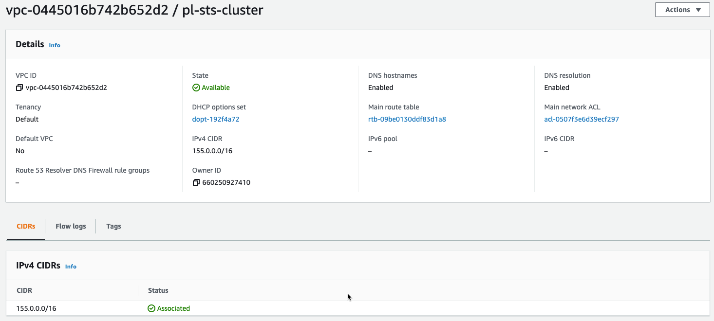

1. Create a Public Subnet to allow egress traffic to the Internet

    - Create the public subnet in the VPC CIDR block range and return the ID as `PUBLIC_SUBNET`

      ```bash
      PUBLIC_SUBNET=`aws ec2 create-subnet --vpc-id $VPC_ID --cidr-block 10.0.128.0/17 | jq -r .Subnet.SubnetId`
      echo $PUBLIC_SUBNET
      ```

    - Tag the public subnet with the cluster name

      ```bash
      aws ec2 create-tags --resources $PUBLIC_SUBNET \
      --tags Key=Name,Value=$ROSA_CLUSTER_NAME-public
      ```

1. Create a Private Subnet for the cluster

    - Create the private subnet in the VPC CIDR block range and return the ID as `PRIVATE_SUBNET`

      ```bash
      PRIVATE_SUBNET=`aws ec2 create-subnet --vpc-id $VPC_ID \
        --cidr-block 10.0.0.0/17 | jq -r .Subnet.SubnetId`
      echo $PRIVATE_SUBNET
      ```

    - Tag the private subnet with the cluster name

      ```bash
      aws ec2 create-tags --resources $PRIVATE_SUBNET \
        --tags Key=Name,Value=$ROSA_CLUSTER_NAME-private
      ```

    - Both subnets should now be visible in the AWS console

      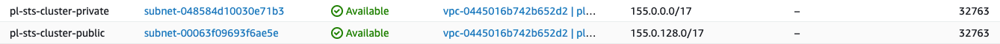

1. Create an Internet Gateway for NAT egress traffic

      - Create the Internet Gateway and return the ID as `I_GW`

        ```
        I_GW=`aws ec2 create-internet-gateway | jq -r .InternetGateway.InternetGatewayId`
        echo $I_GW
        ```

      - Attach the new Internet Gateway to the VPC

        ```bash
        aws ec2 attach-internet-gateway --vpc-id $VPC_ID --internet-gateway-id $I_GW
        ```

      - Tag the Internet Gateway with the cluster name

        ```bash
        aws ec2 create-tags --resources $I_GW \
        --tags Key=Name,Value=$ROSA_CLUSTER_NAME
        ```

      - The new Internet Gateway should be created and attached to your VPC

        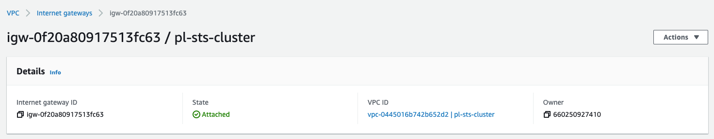

1. Create a Route Table for NAT egress traffic

      - Create the Route Table and return the ID as `R_TABLE`

        ```bash
        R_TABLE=`aws ec2 create-route-table --vpc-id $VPC_ID \
          | jq -r .RouteTable.RouteTableId`
        echo $R_TABLE
        ```

      - Create a route with no IP limitations (0.0.0.0/0) to the Internet Gateway

        ```bash
        aws ec2 create-route --route-table-id $R_TABLE \
          --destination-cidr-block 0.0.0.0/0 --gateway-id $I_GW
        ```

      - Verify the route table settings

        ```bash
          aws ec2 describe-route-tables --route-table-id $R_TABLE
        ```

        > Example output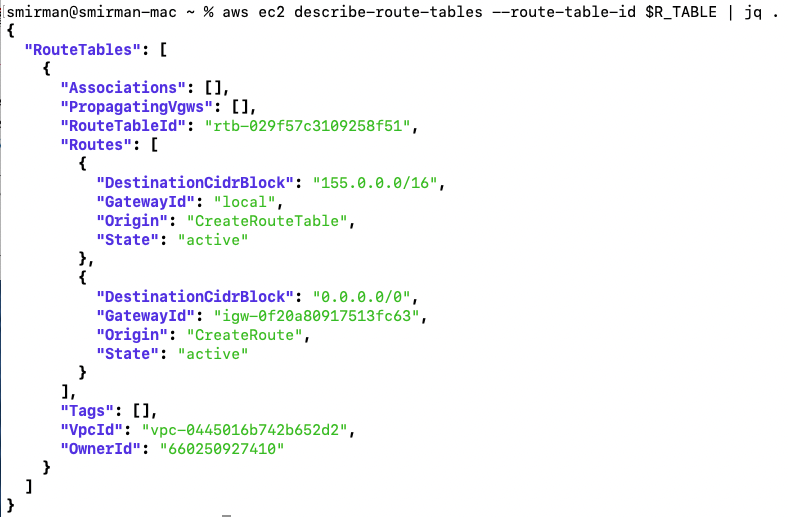

      - Associate the Route Table with the Public subnet

        ```bash
          aws ec2 associate-route-table --subnet-id $PUBLIC_SUBNET \
          --route-table-id $R_TABLE
        ```

        > Example output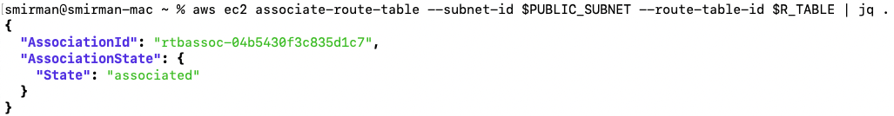

      - Tag the Route Table with the cluster name

        ```bash
        aws ec2 create-tags --resources $R_TABLE \
          --tags Key=Name,Value=$ROSA_CLUSTER_NAME
        ```

1. Create a NAT Gateway for the Private network

      - Allocate and elastic IP address and return the ID as `EIP`

        ```bash
          EIP=`aws ec2 allocate-address --domain vpc | jq -r .AllocationId`
          echo $EIP
        ```

      - Create a new NAT Gateway in the Public subnet with the new Elastic IP address and return the ID as `NAT_GW`

        ```bash
          NAT_GW=`aws ec2 create-nat-gateway --subnet-id $PUBLIC_SUBNET \
          --allocation-id $EIP | jq -r .NatGateway.NatGatewayId`
          echo $NAT_GW
        ```

      - Tag the Elastic IP with the cluster name

        ```bash
          aws ec2 create-tags --resources $EIP --resources $NAT_GW \
          --tags Key=Name,Value=$ROSA_CLUSTER_NAME
        ```

      - The new NAT Gateway should be created and associated with your VPC

        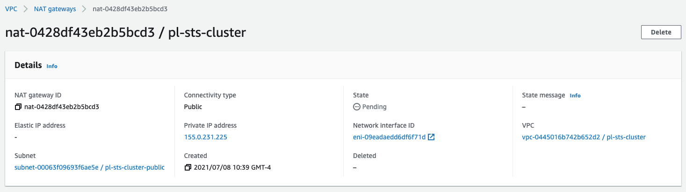

1. Create a Route Table for the Private subnet to the NAT Gateway

      - Create a Route Table in the VPC and return the ID as `R_TABLE_NAT`

        ```bash
          R_TABLE_NAT=`aws ec2 create-route-table --vpc-id $VPC_ID \
            | jq -r .RouteTable.RouteTableId`
          echo $R_TABLE_NAT
        ```

      - Loop through a Route Table check until it is created

        ```bash
          while ! aws ec2 describe-route-tables \
            --route-table-id $R_TABLE_NAT \
          | jq .; do sleep 1; done
        ```
        > Example output! <br>

          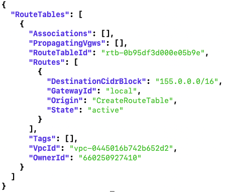

      - Create a route in the new Route Table for all addresses to the NAT Gateway

        ```bash
        aws ec2 create-route --route-table-id $R_TABLE_NAT \
          --destination-cidr-block 0.0.0.0/0 \
          --gateway-id $NAT_GW
        ```

      - Associate the Route Table with the Private subnet

        ```bash
        aws ec2 associate-route-table --subnet-id $PRIVATE_SUBNET \
          --route-table-id $R_TABLE_NAT
        ```

      - Tag the Route Table with the cluster name

        ```bash
          aws ec2 create-tags --resources $R_TABLE_NAT $EIP \
          --tags Key=Name,Value=$ROSA_CLUSTER_NAME-private
        ```


## Configure the AWS Security Token Service (STS) for use with ROSA

The AWS Security Token Service (STS) allows us to deploy ROSA without needing a ROSA admin account, instead it uses roles and policies to gain access to the AWS resources needed to install and operate the cluster.

This is a summary of the [official OpenShift docs](https://docs.openshift.com/rosa/rosa_getting_started/rosa-sts-getting-started-workflow.html) that can be used as a line by line install guide.

> Note that some commands (OIDC for STS) will be hard coded to US-EAST-1, do not be tempted to change these to use $region instead or you will fail installation.

1. Make you your ROSA CLI version is correct (v1.1.0 or higher)

    ```bash
    rosa version
    ```

1. Create the IAM Account Roles

    ```
    rosa create account-roles --mode auto --yes
    ```


## Deploy ROSA cluster

1. Run the rosa cli to create your cluster

    ```bash
    rosa create cluster -y --cluster-name ${ROSA_CLUSTER_NAME} \
      --region ${REGION} --version ${VERSION} \
      --subnet-ids=$PRIVATE_SUBNET \
      --private-link --machine-cidr=10.0.0.0/16 \
      --sts
    ```

    > Confirm the Private Link set up
    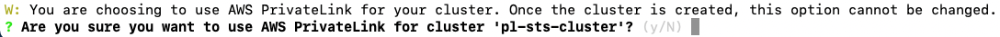

1. Create the Operator Roles

    ```bash
    rosa create operator-roles -c $ROSA_CLUSTER_NAME --mode auto --yes
    ```

1. Create the OIDC provider.

    ```bash
    rosa create oidc-provider -c $ROSA_CLUSTER_NAME --mode auto --yes
    ```

1. Validate The cluster is now installing

    The State should have moved beyond `pending` and show `installing` or `ready`.

    ```bash
    watch "rosa describe cluster -c $ROSA_CLUSTER_NAME"
    ```

1. Watch the install logs

    ```bash
    rosa logs install -c $ROSA_CLUSTER_NAME --watch --tail 10
    ```

## Validate the cluster

Once the cluster has finished installing it is time to validate. Validation when using Private Link requires the use of a **jump host**.

 You can create them using the AWS Console or the AWS CLI as depicted below:

1. *Option 1*: Create a **jump host** instance through the AWS Console

    - Navigate to the EC2 console and launch a new instance

    - Select the AMI for your instance, if you don't have a standard, the Amazon Linux 2 AMI works just fine
    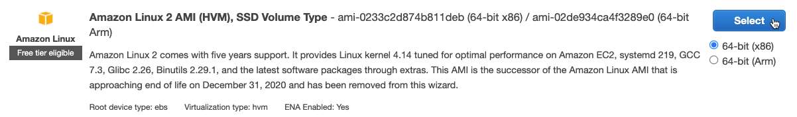

    - Choose your instance type, the t2.micro/free tier is sufficient for our needs, and click **Next: Configure Instance Details**

    - Change the **Network** settings to setup this host inside your _private-link_ VPC
       

    - Change the **Subnet** setting to use the _private-link-public_ subnet
      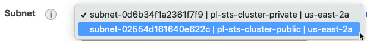

    - Change **Auto-assign Public IP** to _Enable_
      

    - Default settings for **Storage** and **Tags** are fine.  Make the following changes in the  **6. Configure Security Group** tab (either by clicking through the screens or selecting from the top bar)
      - If you already have a security group created to allow access from your computer to AWS, choose **Select an existing security group** and choose that group from the list, otherwise, select **Create a new security group** and continue.

      - To allow access only from your current public IP, change the **Source** heading to use _My IP_
      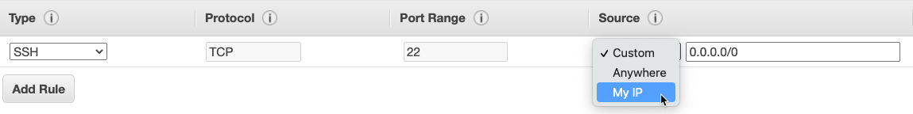

    - Click **Review and Launch**, verify all settings are correct, and follow the standard AWS instructions for finalizing the setup and selecting/creating the security keys.

    - Once launched, open the instance summary for the jump host instance and note the public IP address.

1. *Option 2*: Create a **jumphost** instance using the AWS CLI

    - Create an additional Security Group for the jumphost

      ```bash
      TAG_SG="$ROSA_CLUSTER_NAME-jumphost-sg"

      aws ec2 create-security-group --group-name ${ROSA_CLUSTER_NAME}-jumphost-sg --description ${ROSA_CLUSTER_NAME}-jumphost-sg --vpc-id ${VPC_ID} --tag-specifications "ResourceType=security-group,Tags=[{Key=Name,Value=$TAG_SG}]"
      ```

    - Grab the Security Group Id generated in the previous step

      ```bash
      PublicSecurityGroupId=$(aws ec2 describe-security-groups --filters "Name=tag:Name,Values=${ROSA_CLUSTER_NAME}-jumphost-sg" | jq -r '.SecurityGroups[0].GroupId')
      echo $PublicSecurityGroupId
      ```

    - Add a rule to Allow the ssh into the Public Security Group

      ```bash
      aws ec2 authorize-security-group-ingress --group-id $PublicSecurityGroupId --protocol tcp --port 22 --cidr 0.0.0.0/0
      ```

    - (Optional) Create a Key Pair for your jumphost if your have not a previous one

      ```bash
      aws ec2 create-key-pair --key-name $ROSA_CLUSTER_NAME-key --query 'KeyMaterial' --output text > PATH/TO/YOUR_KEY.pem
      chmod 400 PATH/TO/YOUR_KEY.pem
      ```

    - Define an AMI_ID to be used for your jump host

      ```bash
      AMI_ID="ami-0022f774911c1d690"
      ```

      > This AMI_ID corresponds an Amazon Linux within the us-east-1 region and could be not available in your region. [Find your AMI ID](https://docs.aws.amazon.com/AWSEC2/latest/UserGuide/finding-an-ami.html) and use the proper ID.

    - Launch an ec2 instance for your jumphost using the parameters defined in early steps:

      ```bash
      TAG_VM="$ROSA_CLUSTER_NAME-jumphost-vm"

      aws ec2 run-instances --image-id $AMI_ID --count 1 --instance-type t2.micro --key-name $ROSA_CLUSTER_NAME-key --security-group-ids $PublicSecurityGroupId --subnet-id $PUBLIC_SUBNET --associate-public-ip-address --tag-specifications "ResourceType=instance,Tags=[{Key=Name,Value=$TAG_VM}]"
      ```

      > This instance will be associated with a Public IP directly.

    - Wait until the ec2 instance is in Running state, grab the Public IP associated to the instance and check the if the ssh port and:

      ```bash
      IpPublicBastion=$(aws ec2 describe-instances --filters "Name=tag:Name,Values=$TAG_VM" | jq -r '.Reservations[0].Instances[0].PublicIpAddress')
      echo $IpPublicBastion

      nc -vz $IpPublicBastion 22
      ```

1. Create a ROSA admin user and save the login command for use later

    ```
    rosa create admin -c $ROSA_CLUSTER_NAME
    ```

1. Note the DNS name of your private cluster, use the `rosa describe` command if needed

    ```
    rosa describe cluster -c $ROSA_CLUSTER_NAME
    ```

1. update /etc/hosts to point the openshift domains to localhost. Use the DNS of your openshift cluster as described in the previous step in place of `$YOUR_OPENSHIFT_DNS` below

    ```
    127.0.0.1 api.$YOUR_OPENSHIFT_DNS
    127.0.0.1 console-openshift-console.apps.$YOUR_OPENSHIFT_DNS
    127.0.0.1 oauth-openshift.apps.$YOUR_OPENSHIFT_DNS
    ```


1. SSH to that instance, tunneling traffic for the appropriate hostnames. Be sure to use your new/existing private key, the OpenShift DNS for `$YOUR_OPENSHIFT_DNS` and your jump host IP for `$YOUR_EC2_IP`

    ```bash
      sudo ssh -i PATH/TO/YOUR_KEY.pem \
      -L 6443:api.$YOUR_OPENSHIFT_DNS:6443 \
      -L 443:console-openshift-console.apps.$YOUR_OPENSHIFT_DNS:443 \
      -L 80:console-openshift-console.apps.$YOUR_OPENSHIFT_DNS:80 \
       ec2-user@$YOUR_EC2_IP
    ```
    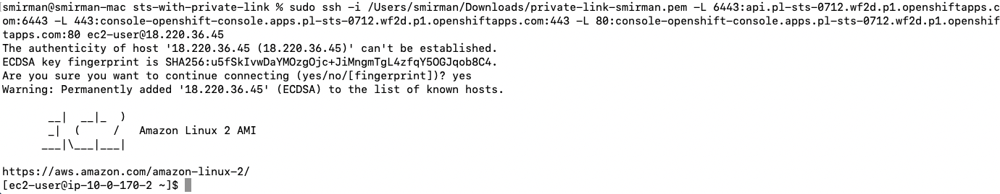

1. From your EC2 jump instances, download the OC CLI and install it locally
    - Download the OC CLI for Linux
      ```
      wget https://mirror.openshift.com/pub/openshift-v4/clients/ocp/stable/openshift-client-linux.tar.gz
      ```
    - Unzip and untar the binary
      ```
        gunzip openshift-client-linux.tar.gz
        tar -xvf openshift-client-linux.tar
      ```

1. log into the cluster using oc login command from the create admin command above. ex.

    ```bash
    ./oc login https://api.$YOUR_OPENSHIFT_DNS.p1.openshiftapps.com:6443 --username cluster-admin --password $YOUR_OPENSHIFT_PWD
    ```
    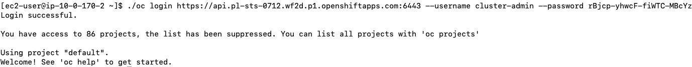

1. Check that you can access the Console by opening the console url in your browser.
  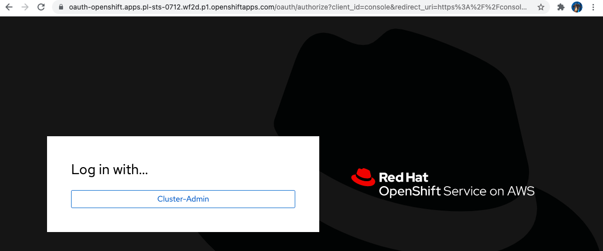

## Cleanup

1. Delete ROSA

    ```bash
    rosa delete cluster -c $ROSA_CLUSTER_NAME -y
    ```

1. Watch the logs and wait until the cluster is deleted

    ```bash
    rosa logs uninstall -c $ROSA_CLUSTER_NAME --watch
    ```

1. Clean up the STS roles

    > Note you can get the correct commands with the ID filled in from the output of the previous step.

    ```bash
    rosa delete operator-roles -c <id> --mode auto --yes
    rosa delete oidc-provider -c <id> --mode auto --yes
    ```


1. Delete AWS resources

    ```bash
    aws ec2 delete-nat-gateway --nat-gateway-id $NAT_GW | jq .
    aws ec2 release-address --allocation-id=$EIP | jq .
    aws ec2 detach-internet-gateway --vpc-id $VPC_ID --internet-gateway-id $I_GW | jq .
    aws ec2 delete-subnet --subnet-id=$PRIVATE_SUBNET | jq .
    aws ec2 delete-subnet --subnet-id=$PUBLIC_SUBNET | jq .
    aws ec2 delete-route-table --route-table-id=$R_TABLE | jq .
    aws ec2 delete-route-table --route-table-id=$R_TABLE_NAT | jq .
    aws ec2 delete-internet-gateway --internet-gateway-id $I_GW | jq .
    aws ec2 delete-vpc --vpc-id=$VPC_ID | jq .
    ```
