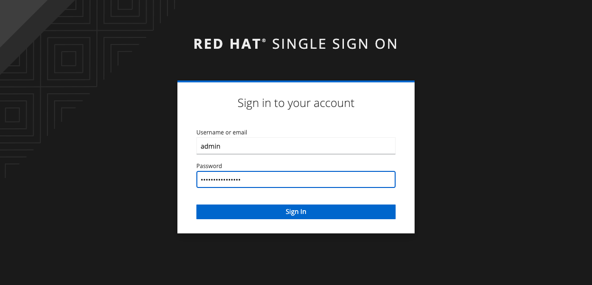
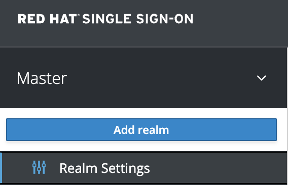
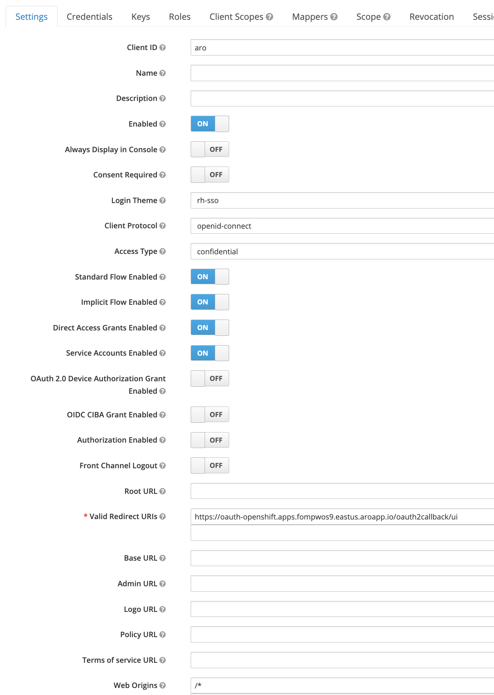
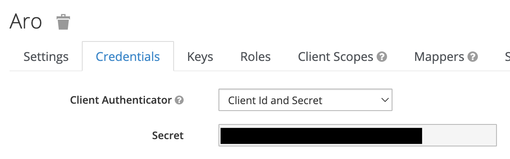
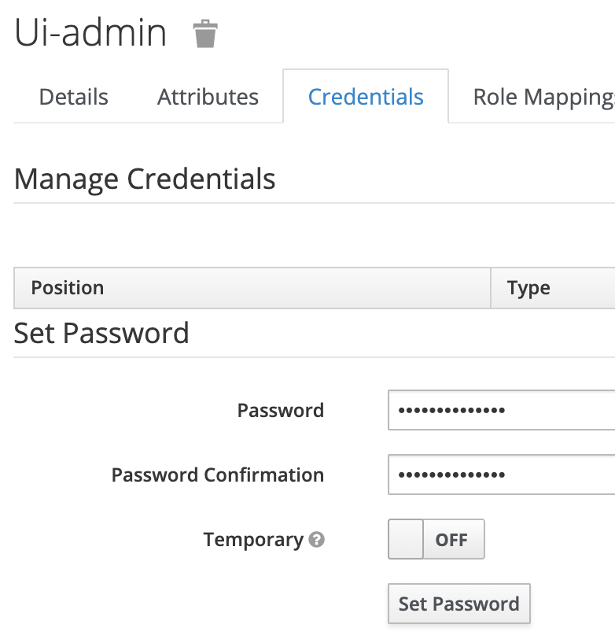
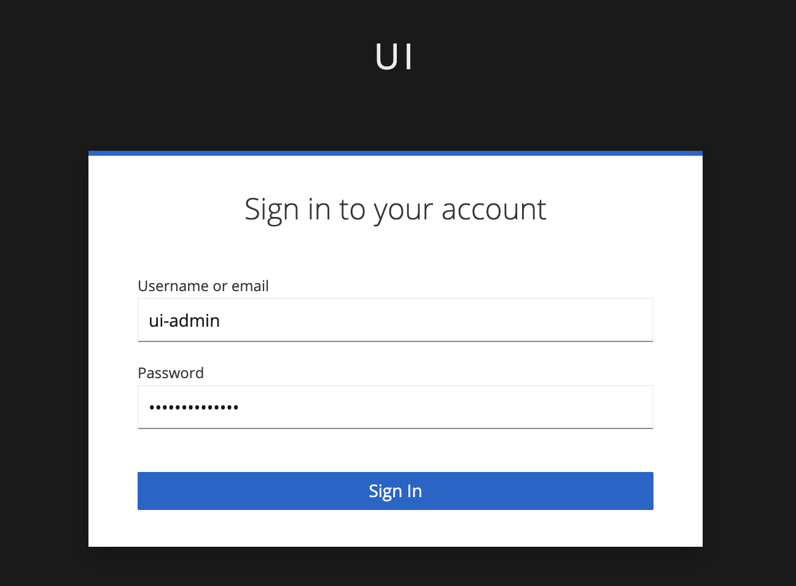
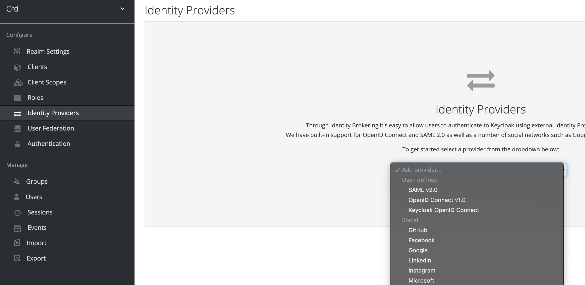
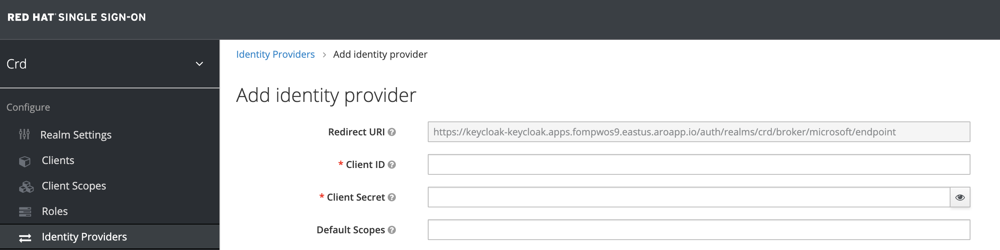
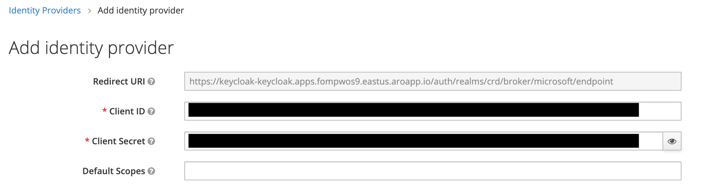

This guide demonstrates how to install and configure Red Hat SSO (Keycloak) into an Azure Red Hat OpenShift (ARO) cluster.  It will also also
configure the ARO cluster to use the SSO server as a mechanism to login by way of the OIDC protocol.  In addition, Red Hat SSO can 
federate user identities with other identity providers.  We will use Azure AD as an additional identity provider to show how 
this could be done.

This guide will walk through the following steps:

1. Install Red Hat SSO into an ARO cluster
2. Configure Azure AD
3. Configure Azure AD as an identity provider in Red Hat SSO
4. Integrate ARO with Red Hat SSO for authentication


## Before you Begin

1. Please review the [Official Red Hat SSO Operator Documentation](https://access.redhat.com/documentation/en-us/red_hat_single_sign-on/7.4/html/server_installation_and_configuration_guide/operator) 
on this topic.
2. Please ensure you have stood up an ARO cluster.  See the [Quick Start](/experts/quickstart-aro/) for
to get started if needed.

> **NOTE:** there is also a Keycloak operator which is community supported.  This is not covered as 
part of this documentation, however if desired, you may use the Keycloak operator instead.  Please 
understand that the Keycloak operator does not have the same functionality and offers different API 
schemas and a different set of custom resources.  For more information on the Keycloak operator, 
please visit https://www.keycloak.org/operator/installation.


## Set the Environment

Set the environment variables needed in the following steps:

```bash
SSO_NAMESPACE=keycloak
AZ_REGION=eastus
AZ_RESOURCE_GROUP=dscott-sso-rg
AZ_VNET=dscott-sso-aro-vnet-eastus
AZ_PRIVATE_ENDPOINT_SUBNET=dscott-sso-aro-machine-subnet-eastus
AZ_CLUSTER_NAME=dscott-sso
AZ_CONSOLE=$(az aro show -n $AZ_CLUSTER_NAME -g $AZ_RESOURCE_GROUP --query consoleProfile.url -o tsv)
PG_USER=dscott
PG_PASS='P@ssword1234'
```


## Deploy the Operator

Create a project where your operator will be installed to:

```bash
oc new-project $SSO_NAMESPACE
```

To install, first create an Operator Group for the operator:

```bash
cat <<EOF | oc apply -f -
apiVersion: operators.coreos.com/v1
kind: OperatorGroup
metadata:
  name: keycloak-operator
  namespace: $SSO_NAMESPACE
spec:
  targetNamespaces:
    - $SSO_NAMESPACE
EOF
```

Next, install the subscription:

```bash
cat <<EOF | oc apply -f -
apiVersion: operators.coreos.com/v1alpha1
kind: Subscription
metadata:
  name: rhsso-operator
  namespace: $SSO_NAMESPACE
spec:
  channel: stable
  installPlanApproval: Automatic
  name: rhsso-operator
  source: redhat-operators
  sourceNamespace: openshift-marketplace
  startingCSV: rhsso-operator.7.6.3-opr-002
EOF
```


## Deploy the Database (Optional)

It may be desirable to keep the database management to include backups and persistence 
outside of the OpenShift cluster.  If this is a desired configuration, then you can 
create an Azure Postgres DB instance to store your Red Hat SSO data.

For reference, please see https://learn.microsoft.com/en-us/azure/postgresql/single-server/how-to-configure-privatelink-cli.

First, create the database:

> **NOTE** Below is only a sample, be sure to replace arguments with your desired options.

```bash
az postgres server create \
  -l $AZ_REGION \
  -g $AZ_RESOURCE_GROUP \
  -n $AZ_CLUSTER_NAME \
  -u $PG_USER \
  -p "$PG_PASS" \
  --sku-name GP_Gen5_2 \
  --ssl-enforcement Disabled \
  --public-network-access Disabled \
  --backup-retention 10  \
  --geo-redundant-backup Disabled \
  --storage-size 10240 \
  --version 11
```

Create a private endpoint to restrict network access to private connectivity only:

```bash
az network private-endpoint create \
  --name $AZ_CLUSTER_NAME-pgsql \
  --resource-group $AZ_RESOURCE_GROUP \
  --vnet-name $AZ_VNET \
  --subnet $AZ_PRIVATE_ENDPOINT_SUBNET \
  --private-connection-resource-id $(az resource show -g $AZ_RESOURCE_GROUP -n $AZ_CLUSTER_NAME --resource-type "Microsoft.DBforPostgreSQL/servers" --query "id" -o tsv) \
  --group-id postgresqlServer \
  --connection-name $AZ_CLUSTER_NAME 
```

Configure the private DNS zone for the private link connection:

```bash
az network private-dns zone create \
  --resource-group $AZ_RESOURCE_GROUP \
  --name "privatelink.postgres.database.azure.com"
  
az network private-dns link vnet create \
  --resource-group $AZ_RESOURCE_GROUP \
  --zone-name "privatelink.postgres.database.azure.com" \
  --name $AZ_CLUSTER_NAME-pgsql \
  --virtual-network $AZ_VNET \
  --registration-enabled false
```

Retrieve the private IP from the private link connection:

```bash
PRIVATE_IP=`az resource show \
  --ids $(az network private-endpoint show --name $AZ_CLUSTER_NAME-pgsql --resource-group $AZ_RESOURCE_GROUP --query 'networkInterfaces[0].id' -o tsv) \
  --api-version 2019-04-01 \
  -o json | jq -r '.properties.ipConfigurations[0].properties.privateIPAddress'`
```

Create the DNS records for the private link connection:

```bash
az network private-dns record-set a create \
  --name $AZ_CLUSTER_NAME-pgsql \
  --zone-name privatelink.postgres.database.azure.com \
  --resource-group $AZ_RESOURCE_GROUP

az network private-dns record-set a add-record \
  --record-set-name $AZ_CLUSTER_NAME-pgsql \
  --zone-name privatelink.postgres.database.azure.com \
  --resource-group $AZ_RESOURCE_GROUP \
  -a $PRIVATE_IP
```


## Deploy the Server


### With External Database

If you deployed an [external database](#deploy-the-database-optional), then you can create the server and use the existing 
database.  Otherwise proceed to [creating the server with an internal database](#with-internal-database).

1. Create the secret with the credential information:

```bash
cat <<EOF | oc apply -f -
apiVersion: v1
kind: Secret
metadata:
  name: keycloak-db-secret
  namespace: $SSO_NAMESPACE
stringData:
  POSTGRES_DATABASE: "postgres"
  POSTGRES_EXTERNAL_ADDRESS: "$AZ_CLUSTER_NAME-pgsql.privatelink.postgres.database.azure.com"
  POSTGRES_EXTERNAL_PORT: "5432"
  POSTGRES_HOST: "keycloak-postgresql"
  POSTGRES_PASSWORD: "$PG_PASS"
  POSTGRES_SUPERUSER: "true"
  POSTGRES_USERNAME: "$PG_USER@$AZ_CLUSTER_NAME"
type: Opaque
EOF
```

2. Deploy the server:

```bash
cat <<EOF | oc apply -f -
apiVersion: keycloak.org/v1alpha1
kind: Keycloak
metadata:
  name: keycloak
  namespace: $SSO_NAMESPACE
  labels:
    app: sso
spec:
  instances: 2
  externalAccess:
    enabled: True
  externalDatabase:
    enabled: true
EOF
```


### With Internal Database

Be sure to skip this step if you deployed an [external database](#with-external-database).

If you are deploying the server using an internal database, you can simply deploy the resource as
follows which will create the server as well as an instance of PostgreSQL within your cluster 
as the backend database for the server:

```bash
cat <<EOF | oc apply -f -
apiVersion: keycloak.org/v1alpha1
kind: Keycloak
metadata:
  name: keycloak
  namespace: $SSO_NAMESPACE
  labels:
    app: sso
spec:
  instances: 2
  externalAccess:
    enabled: True
EOF
```


## Retrieve Information About Red Hat SSO Installation

> **IMPORTANT:** this sets environment variables based on the installation that are needed in future steps.

```bash
ADMIN_USERNAME=$(oc -n $SSO_NAMESPACE exec -it keycloak-0 -- printenv SSO_ADMIN_USERNAME)
ADMIN_PASSWORD=$(oc -n $SSO_NAMESPACE exec -it keycloak-0 -- printenv SSO_ADMIN_PASSWORD)
ADMIN_CONSOLE=$(oc -n $SSO_NAMESPACE get route keycloak -o json | jq -r '.status.ingress[0].host')
CALLBACK_URL_BASE=https://oauth-openshift.apps.$(az aro show -g $AZ_RESOURCE_GROUP -n $AZ_CLUSTER_NAME --query clusterProfile.domain -o tsv).$AZ_REGION.aroapp.io/oauth2callback
```


## Configure Red Hat SSO

### Configure Red Hat SSO as an OIDC Identity Provider for ARO (UI Method)

This method walks you through configuring Red Hat SSO as an OIDC provider by using the user interface.  If you
would like to control your configuration via Kubernetes custom resources, please review the 
[CRD Method](#configure-red-hat-sso-as-an-oidc-identity-provider-for-aro-crd-method) instead.

1. Login to the host from the `ADMIN_CONSOLE` environment variable set in the previous step using
the `ADMIN_USERNAME` and `ADMIN_PASSWORD`:



2. Add a new realm by navigating to the top left corner, hovering over the `Master` realm (default) and clicking 
`Add realm`:



3. Enter your desired realm name and make note of it, as it will be used in the URLs for this realm.  Be sure 
that enabled is set to `ON` and then click `Create`:


4. Create a new client for OIDC authentication by navigating to `Clients > Create` and input your `Client ID`.  Also
make sure that the Client Protocol is set to `openid-connect`. Make 
note of the client ID as it will be used when configuring ARO to authenticate against the Red Hat SSO server.  Once done, 
click `Save`:


5. Configure the new client by setting the following values in the `Settings` tab.  Be sure to `Save` before 
heading to the next step as these settings will create extra tabs in the UI for configuration:

* **Login Theme**: `rh-sso`
* **Access Type**: `confidential`
* **Implicit Flow Enabled**: `ON`
* **Service Accounts Enabled**: `ON`
* **Valid Redirect URIs**: `<Value of $CALLBACK_URL_BASE from above>/ui`. Note that the `/ui` is a custom unique suffix that is tied to the identity provider resource
* **Web Origins**: `/*`



6. Ensure the `Credentials` tab has the following settings.  Be sure to capture the `Secret` value for use in the next step:

* **Client Authenticator**: `Client Id and Secret`
* **Secret**: `<This secret is used to configure the IDP in OpenShift>`.  Note that the image below is redacted.



7. Create the client secret.  This is needed for the `OAuth` OpenShift resource to correctly
create the Red Hat SSO IDP as an OIDC provider:

```bash
oc -n openshift-config create secret generic red-hat-sso-ui --from-literal=clientSecret=<CLIENT_SECRET_FROM_LAST_STEP>
```

8. Create a user for authentication by navigating to `Users > Add User`, fill in the information and click `Save`.  Ensure 
this user is `Enabled`:


9. Set a password for the user in the `Credentials` tab for the user you created.  Be sure `Temporary` is 
set to `OFF` and then click `Set Password`:




### Configure Red Hat SSO as an OIDC Identity Provider for ARO (CRD Method)

This method walks you through configuring Red Hat SSO as an OIDC provider by using native Kubernetes CRDs.  If you
would like to control your configuration via the user interface instead, please review the 
[UI Method](#configure-red-hat-sso-as-an-oidc-identity-provider-for-aro-ui-method).

1. Create the realm:

```bash
cat <<EOF | oc apply -f -
apiVersion: keycloak.org/v1alpha1
kind: KeycloakRealm
metadata:
  name: crd
  namespace: $SSO_NAMESPACE
  labels:
    app: sso
spec:
  instanceSelector:
    matchLabels:
      app: sso
  realm:
    realm: crd
    enabled: true
# NOTE: you can set unmanaged to 'true' if you intend to manage this realm via the UI
# unmanaged: true
EOF
```

2. Create the client:

```bash
cat <<EOF | oc apply -f -
apiVersion: keycloak.org/v1alpha1
kind: KeycloakClient
metadata:
  name: crd
  namespace: $SSO_NAMESPACE
  labels:
    app: sso
spec:
  realmSelector:
    matchLabels:
      app: sso
  client:
    clientId: aro
    name: aro
    description: "Azure Red Hat OpenShift"
    protocol: openid-connect
    enabled: true
    publicClient: false
    directAccessGrantsEnabled: true
    implicitFlowEnabled: true
    standardFlowEnabled: true
    serviceAccountsEnabled: true
    redirectUris:
      - $CALLBACK_URL_BASE/crd
    webOrigins:
      - "/*"
    defaultClientScopes:
      - acr
      - email
      - profile
      - roles
      - web-origins
    optionalClientScopes:
      - address
      - microprofile-jwt
      - offline_access
      - phone
  serviceAccountRealmRoles:
    - default-roles-crd
EOF
```

3. Create the client secret.  This is needed for the `OAuth` OpenShift resource to correctly
create the Red Hat SSO IDP as an OIDC provider:

```bash
oc -n openshift-config create secret generic red-hat-sso-crd --from-literal=clientSecret=$(oc get secret keycloak-client-secret-crd -o json | jq -r '.data.CLIENT_SECRET' | base64 -d)
```

4. Create a user for authentication:

```bash
cat <<EOF | oc apply -f -
apiVersion: keycloak.org/v1alpha1
kind: KeycloakUser
metadata:
  name: crd
  namespace: $SSO_NAMESPACE
  labels:
    app: sso
spec:
  realmSelector:
    matchLabels:
      app: sso
  user:
    enabled: true
    username: crd-admin
    firstName: CRD
    lastName: Admin
    email: crd-admin@example.com
    credentials:
      - temporary: false
        type: password
        value: 'P@ssword1234'
EOF
```

## Configure OpenShift


### Configure OAuth Resource

If you used the [UI Method](#configure-red-hat-sso-as-an-oidc-identity-provider-for-aro-ui-method) then you can update your 
`OAuth` resource as follows.  Take note that if you have other identity providers configured here, you will want to 
ensure that you only add a new identity provider to the YAML rather than replace it.

```bash
cat <<EOF | oc apply -f -
apiVersion: config.openshift.io/v1
kind: OAuth
metadata:
  name: cluster
spec:
  identityProviders:
    # NOTE: name needs to be lowercase as per https://access.redhat.com/solutions/6213561
    # NOTE: this maps to the /ui suffix when creating the client
    - name: ui
      mappingMethod: claim
      type: OpenID
      openID:
        clientID: aro
        clientSecret:
          name: red-hat-sso-ui
        extraScopes:
          - email
          - profile
        extraAuthorizeParameters:
          include_granted_scopes: "true"
        claims:
          preferredUsername:
            - preferred_username
          name:
            - name
          email:
            - email
        issuer: https://$ADMIN_CONSOLE/auth/realms/ui
EOF
```

If you used the [CRD Method](#configure-red-hat-sso-as-an-oidc-identity-provider-for-aro-crd-method) then you can update your 
`OAuth` resource as follows.  Take note that if you have other identity providers configured here, you will want to 
ensure that you only add a new identity provider to the YAML rather than replace it.

```bash
cat <<EOF | oc apply -f -
apiVersion: config.openshift.io/v1
kind: OAuth
metadata:
  name: cluster
spec:
  identityProviders:
    # NOTE: name needs to be lowercase as per https://access.redhat.com/solutions/6213561
    # NOTE: this maps to the /ui suffix when creating the client
    - name: crd
      mappingMethod: claim
      type: OpenID
      openID:
        clientID: aro
        clientSecret:
          name: red-hat-sso-crd
        extraScopes:
          - email
          - profile
        extraAuthorizeParameters:
          include_granted_scopes: "true"
        claims:
          preferredUsername:
            - preferred_username
          name:
            - name
          email:
            - email
        issuer: https://$ADMIN_CONSOLE/auth/realms/crd
EOF
```


### Test Login to OpenShift

> **IMPORTANT** It takes a few minutes for the above configuration to be applied to the cluster.  This is because 
the authentication operator has to reconfigure and reconcile the pods that are responsible for authentication to the 
cluster.

In a web browser, navigate to the Azure Red Hat OpenShift login page.  You should have this value stored 
in the environment as the `AZ_CONSOLE` variable from [this step](#set-the-environment).

> **NOTE** The below image shows both the `crd` and `ui` profiles as this documentation was put together 
while doing both side-by-side.  You should see one or the other.


Select the appropriate provider, and input your username and password:



Congratulations, you are now logged into the OpenShift Console with your user!  Let's take a look at the
identities in the cluster:

```bash
oc get identities
NAME                                       IDP NAME   IDP USER NAME                          USER NAME          USER UID
crd:de24ecb0-0475-42ce-b69b-bb3a80d6b633   crd        de24ecb0-0475-42ce-b69b-bb3a80d6b633   crd-admin          88871fcc-74d1-486f-99ca-8dae17f72834
ui:7937fa9c-6231-42e0-8cd4-666990baeef7    ui         7937fa9c-6231-42e0-8cd4-666990baeef7   ui-admin           1a6a8150-5fb7-4031-a00c-5ab0a2c8c2b2

oc get users
NAME                       UID                                    FULL NAME      IDENTITIES
crd-admin                  88871fcc-74d1-486f-99ca-8dae17f72834   CRD Admin      crd:de24ecb0-0475-42ce-b69b-bb3a80d6b633
ui-admin                   1a6a8150-5fb7-4031-a00c-5ab0a2c8c2b2   UI Admin       ui:7937fa9c-6231-42e0-8cd4-666990baeef7
```

Just a reminder that you only have Developer permissions when logged in at this point.
If you need this user to have elevated permissions within OpenShift, you 
can use standard Kubernetes RBAC procedures to assign permissions to your user.


## Configure Azure AD

1. Login to the Red Hat SSO UI, navigate to your realm, and select `Identity Providers > Add Provider > Microsoft`:



2. Capture the `Redirect URI` from this screen.  You will need it to register Red Hat SSO as an 
application in Azure AD.  Once you have captured the URI, leave this screen up while we configure
Azure AD:



3. [Register an application in Azure AD for Red Hat SSO](/experts/idp/azuread-aro/#register-a-new-application-in-azure-ad).  
Be sure to use the redirect URI captured in the last step when setting this up.  Also be sure to take note of the client ID
and client secret as those will be used to finish configuration in Red Hat SSO.

4. [Enable optional claims and enable necessary Microsoft Graph permissions](/experts/idp/azuread-aro/#2-configure-optional-claims).

5. Input the client ID and client secret from the application registration into the 
identity provider:




### Test Login to OpenShift with Azure AD Credentials

In a web browser, navigate to the Azure Red Hat OpenShift login page.  You should have this value stored 
in the environment as the `AZ_CONSOLE` variable from [this step](#set-the-environment).

> **NOTE** The below image shows both the `crd` and `ui` profiles as this documentation was put together 
while doing both side-by-side.  You should see one or the other.


Select the appropriate provider.  You should now see an option to login with your 
Microsoft credentials:


Congratulations, you are now logged into the OpenShift Console with your Azure AD user, using Red Hat SSO 
as a federated identity source!  Let's take a look at the identities in the cluster:

```bash
oc get identities
NAME                                       IDP NAME   IDP USER NAME                          USER NAME                         USER UID
crd:de24ecb0-0475-42ce-b69b-bb3a80d6b633   crd        de24ecb0-0475-42ce-b69b-bb3a80d6b633   crd-admin                         88871fcc-74d1-486f-99ca-8dae17f72834
ui:7937fa9c-6231-42e0-8cd4-666990baeef7    ui         7937fa9c-6231-42e0-8cd4-666990baeef7   ui-admin                          1a6a8150-5fb7-4031-a00c-5ab0a2c8c2b2
sso:2d9a2753-f069-4286-9f1d-f1cfb80b0857   ui         2d9a2753-f069-4286-9f1d-f1cfb80b0857   dustin@mydomain.onmicrosoft.com   c856d652-b865-4c03-82a2-24fc429d08be

oc get users
NAME                              UID                                    FULL NAME      IDENTITIES
crd-admin                         88871fcc-74d1-486f-99ca-8dae17f72834   CRD Admin      crd:de24ecb0-0475-42ce-b69b-bb3a80d6b633
ui-admin                          1a6a8150-5fb7-4031-a00c-5ab0a2c8c2b2   UI Admin       ui:7937fa9c-6231-42e0-8cd4-666990baeef7
dustin@mydomain.onmicrosoft.com   c856d652-b865-4c03-82a2-24fc429d08be   Dustin Scott   ui:2d9a2753-f069-4286-9f1d-f1cfb80b0857
```

Just a reminder that you only have Developer permissions when logged in at this point.
If you need this user to have elevated permissions within OpenShift, you 
can use standard Kubernetes RBAC procedures to assign permissions to your user.
