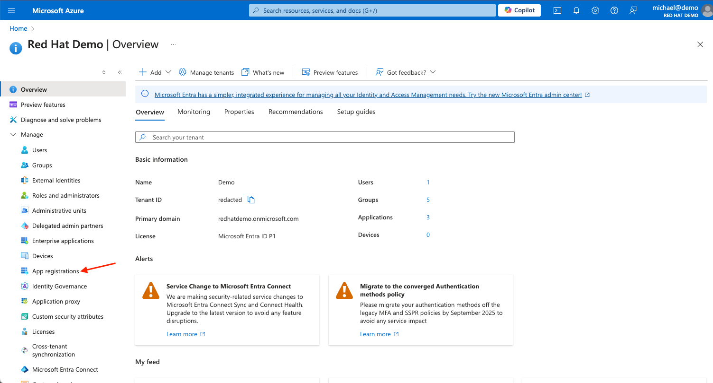
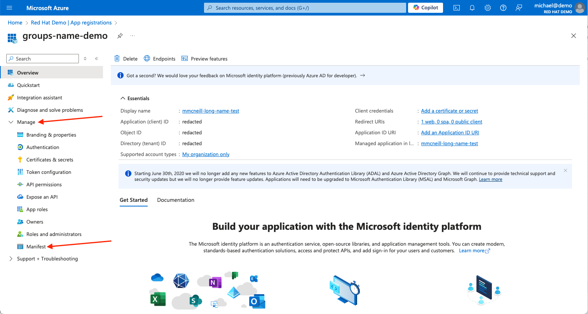
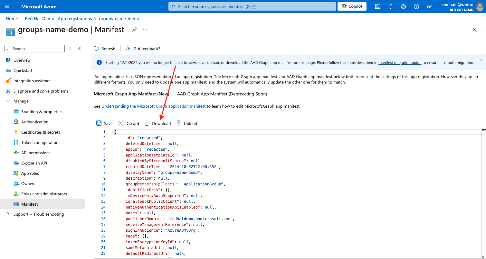
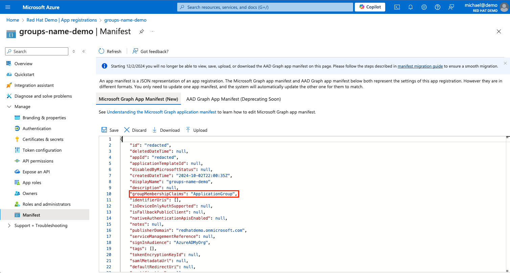
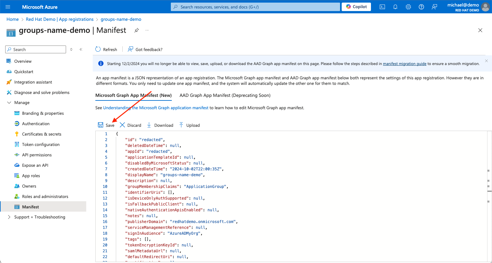
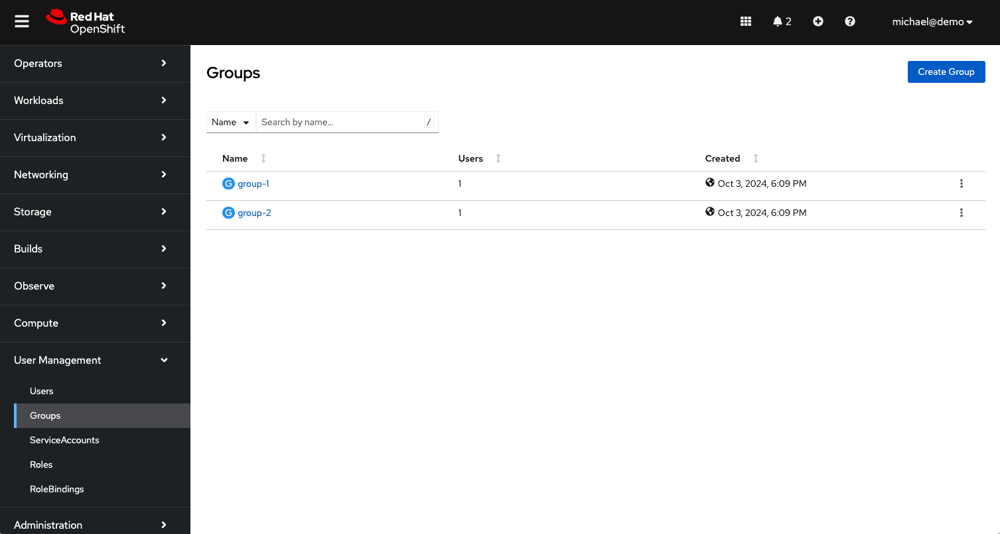

In this guide, we will configure an existing Microsoft Entra ID (formerly Azure Active Directory) identity provider to emit the group name instead of the group ID for optional group claims. This will allow you to reference group names in your role bindings instead of the group ID. 

{}
The ability to [emit group names instead of group IDs](https://learn.microsoft.com/en-us/entra/identity/hybrid/connect/how-to-connect-fed-group-claims#emit-cloud-only-group-display-name-in-token) is a preview feature made available by Microsoft and is subject to their terms and conditions around preview features of their services. 
{}

### Prerequisites

Before we begin, ensure that you have properly configured Microsoft Entra ID as an identity provider in your cluster following the guide specific to your platform:
* [Red Hat OpenShift Service on AWS (ROSA)](https://docs.openshift.com/rosa/cloud_experts_tutorials/cloud-experts-entra-id-idp.html)
* [Azure Red Hat OpenShift (ARO)](../group-claims/aro/)

In addition, ensure that you have the necessary permissions to modify the Microsoft Entra ID app registration in the Azure Portal.

{}
Microsoft Entra ID Free is not able to emit group names instead of group IDs. 
{}

### Procedure

1. Login to the [Microsoft Azure portal](https://portal.azure.com) and navigate to the _Microsoft Entra ID_ service, then click on the _App registrations_ blade. 


1. Locate your App registration and click on it. 

1. Expand the _Manage_ sidebar menu, and click on the _Manifest_ blade.


1. Download the _Microsoft Graph App Manifest_ to keep as a backup, just in case.


1. Locate the setting `groupMembershipClaims` and ensure it is set to `ApplicationGroup`. This option includes only groups that are assigned to the application.

    {}
Before changing this value, ensure that the groups you wish to include in your claims are attached to your Microsoft Entra ID application. Failure to do so may result in unexpected behavior including the removal of group memberships used for role bindings. For more information on how to add groups to your Microsoft Entra ID application, see the [Microsoft documentation](https://learn.microsoft.com/en-us/entra/identity/enterprise-apps/assign-user-or-group-access-portal).
{}

    

1. Locate the `groups` claims under the `optionalClaims` section of the manifest. There should be three, one under `accessToken`, one under `idToken`, and one under `saml2Token`. Edit the `additionalProperties` field of the `groups` claims for the `idToken` _only_. You will change the `additionalProperties` field to look like this:
    ```json
    ...
        "optionalClaims": {
            "idToken": [
                {
                    "name": "groups",
                    "source": null,
                    "essential": false,
                    "additionalProperties": [
                        "sam_account_name",
                        "cloud_displayname"
                    ]
                }
            ],
    ...
    ```

1. Save your changes.


1. If you are already logged into the OpenShift Web Console, logout. Once you are logged out of the cluster, log back in using the Microsoft Entra ID. You should now see group membership populated with group names instead of group IDs.


    You can see these groups were synced from Microsoft Entra ID by running the `oc get groups -o yaml` command. Your output will look something like this (note the `oauth.openshift.io` annotations):

    ```yaml
    apiVersion: v1
    items:
    - apiVersion: user.openshift.io/v1
      kind: Group
      metadata:
        annotations:
          oauth.openshift.io/generated: "true"
          oauth.openshift.io/idp.EntraID: synced
        name: group-1
      users:
      - michael@demo
    - apiVersion: user.openshift.io/v1
      kind: Group
      metadata:
        annotations:
          oauth.openshift.io/generated: "true"
          oauth.openshift.io/idp.EntraID: synced
        name: group-2
      users:
      - michael@demo
    kind: List
    metadata:
      resourceVersion: ""
    ```

Congratulations! You are now able to reference your group names in role bindings instead of group IDs.