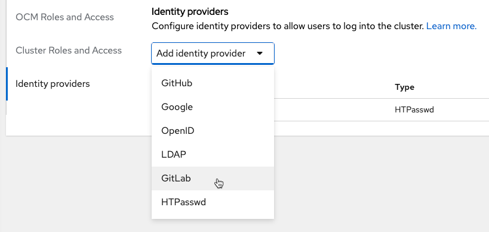
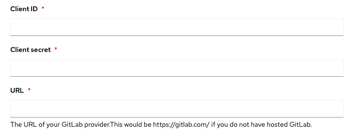
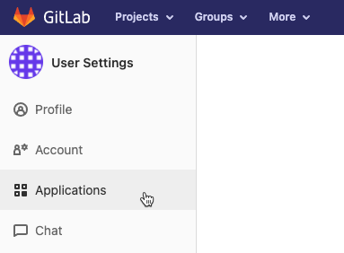
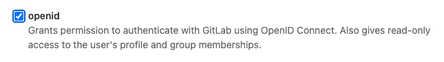
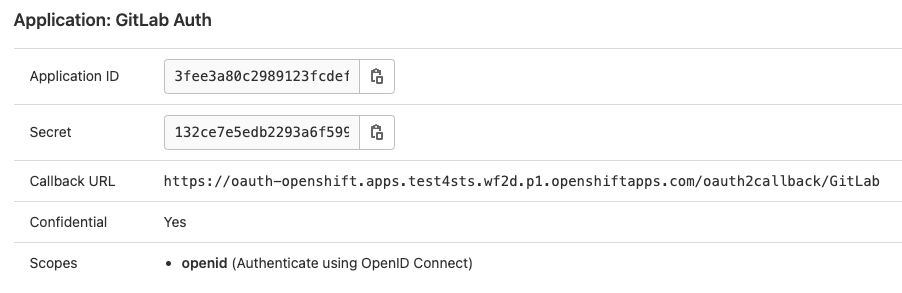
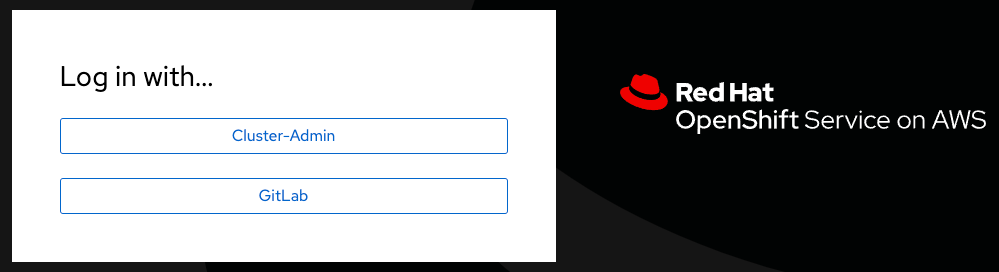
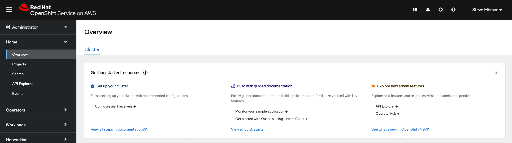

The following instructions will detail how to configure GitLab as the identity provider for Managed OpenShift through the OpenShift Cluster Manager (OCM):

1. Create OAuth callback URL in OCM
1. Register a new application in GitLab
1. Configure the identity provider credentials and URL
1. Add cluster-admin or dedicated-admin users
1. Log in and confirm

## Create OAuth callback URL in OCM ##

Log in to the [OpenShift Cluster Manager](https://console.redhat.com/openshift/) (OCM) to add a GitLab identity provider

1. Select your cluster in OCM and then go to the **'Access control'** tab and select **'Identity Providers'**

    

1. Choose GitLab as identity provider from the identity providers list

    

1. Provide a name for the new identity provider

    

1. Copy the **OAuth callback URL**. It will be needed later

    

    > **Note:** the OAuth Callback has the following format:

    ```
    https://oauth-openshift.apps.<cluster_name>.<cluster_domain>/oauth2callback/<idp_name>
    ```

1. At this point, leave the **Client ID**, **Client secret**, and **URL** blank while configuring GitLab

    

## Register a new application in GitLab ##

Log into **GitLab** and execute the following steps:

1. Go to **Preferences**

    

1. Select **Applications** from the left navigation bar

    

1. Provide a **Name** and enter the **OAuth Callback URL** copied from OCM above and enter it as the **Redirect URL** in GitLab

    

1. Check the **openid** box and save the application

    

1. After saving the GitLab application you will be provided with an **Application ID** and a **Secret**

    

1. Copy both the **Application ID** and **Secret** and return to the OCM console

    
    

## Configure the identity provider credentials and URL ##

1. Returning to the OCM console, enter the **Application ID** and **Secret** obtained from GitLab in the previous step and enter them as **Client ID** and **Client Secret** respectively in the OCM console. Additionally, provide the GitLab **URL** where credentials were obtained and click **Add**

    

1. The new GitLab identity provider should display in the IDP list

    

## Add cluster-admin or dedicated-admin users ##

1. Now that the GitLab identity provider is configured, it is possible to add authenticated users to elevated OCM and OpenShift roles. Under **Cluster Roles and Access** select **Add user** and enter an existing GitLab user. Then choose to assign `dedicated-admin` or `cluster-admin` permissions to the user and click **Add user**

    

1. The new user should now display, with proper permissions, in the cluster-admin or dedicated-admin user lists

    

## Log in and confirm ##

1. Select the **Open console** button in OCM to bring up the OpenShift login page. An option for **GitLab** should now be available.

    > Note: I can take 1-2 minutes for this update to occur

    

1. After selecting GitLab for the first time an authorization message will appear. Click **Authorize** to confirm.

    


1. Congratulations!

    
