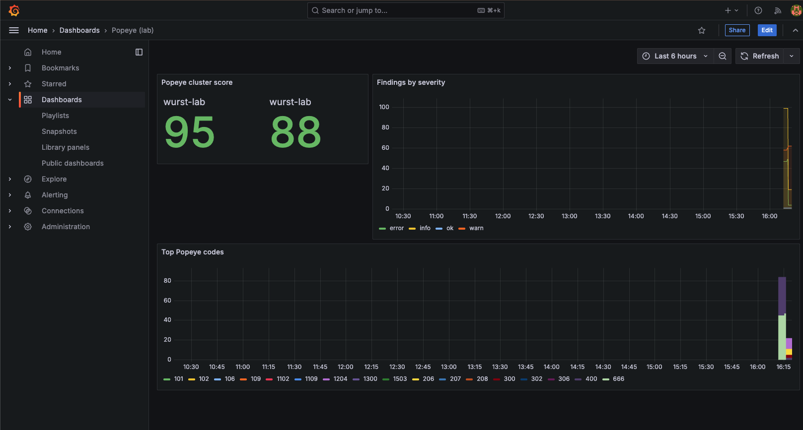
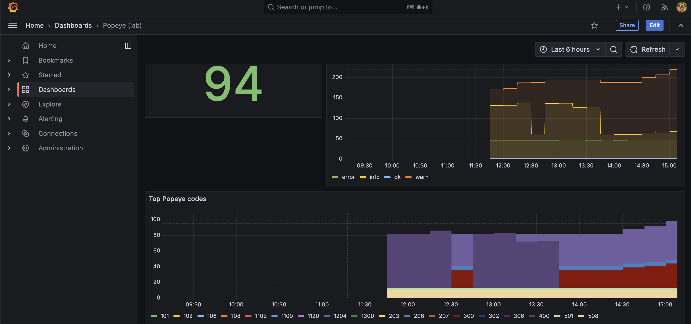

This document describes how to build and operate Kubernetes workloads that are secure, reliable, and operationally sound on Red Hat managed cloud services (ROSA, ARO, and OpenShift Dedicated clusters).
It covers the recommended best practices and three complementary enforcement layers: **kube-linter** for catching misconfigurations before they merge, **Popeye** for auditing live cluster state on a schedule, and **Red Hat Advanced Cluster Management (ACM)** for continuously enforcing policies and auto-remediating drift across an entire fleet.

The best practices catalogue and tool coverage data in this guide are based on research conducted for the [paulczar/wurst-practices](https://github.com/paulczar/wurst-practices) repository, which provides deliberately misconfigured Kubernetes manifests for evaluating cluster sanitizers and policy tools.

## Recommended tooling strategy

No single tool covers every enforcement scenario.
Use all three layers together, each at the stage where it is most effective.

| Tool | Model | Best used for |
|------|-------|---------------|
| **kube-linter** | Static analysis (YAML, no cluster needed) | Pre-deploy CI gate on every PR |
| **Popeye** | Batch scan of live cluster state | Post-deploy audit on a schedule |
| **ACM Governance** | Continuous policy engine across a fleet | Ongoing enforcement and auto-remediation |


<br><br>
**kube-linter** catches misconfigurations in manifests *before* they merge, when feedback is still cheap.
**Popeye** catches what only a running cluster can reveal: drift, hand-applied changes, right-sizing deltas, and runtime-only problems that never appeared in a branch lint.
**ACM Governance** is the enterprise control plane: policies are continuously evaluated against every managed cluster and can automatically remediate non-compliant resources rather than just reporting them.
Together they cover intended state in git, observed state in a single cluster, and enforced state across an entire fleet.

## Best practices

The severity model below determines how aggressively to gate on each finding.

| Level | Meaning |
|-------|---------|
| 🔴 **Critical** | Likely cluster or tenant compromise, major data exposure, or loss of strong workload isolation. Block deploys; require an explicit exception to proceed. |
| 🟠 **High** | Serious security weakness, frequent or prolonged outages under realistic failures, or clear compliance failure. Block deploys. |
| 🟡 **Medium** | Reduced resilience, harder operations, noisy-neighbour risk, or slower incident detection. Warn and file a tracking issue; do not block. |
| 🔵 **Low** | Hygiene with real future consequence: upgrade risk, operational friction, drift, or audit findings. Warn; fix in planned work. |
| ⚪ **Style** | Consistency and readability conventions only. Report only; never block. |

### 🗂️ Namespaces, quotas, and limits

- 🟠 Apply a **ResourceQuota** and **LimitRange** to every namespace (or via a higher-level policy) so aggregate usage and per-pod defaults are bounded.
- 🟡 **Dedicated namespaces** per app, team, and environment; never run user workloads in `default`.

### 🔁 Workload reliability

- 🟠 **At least three replicas** for stateless services that require high availability.
- 🟠 Define a **PodDisruptionBudget** for every multi-replica workload.
- 🟠 `PDB.spec.minAvailable` must be **less than** the replica count; setting it equal or higher blocks all voluntary disruptions permanently.
- 🟠 Configure **liveness and readiness probes** (and startup probes where needed) with correct ports and thresholds.
- 🟡 Each workload must be covered by **at most one PodDisruptionBudget**; overlapping selectors silently apply the most restrictive rule.
- 🟡 Never leave a Deployment at **zero replicas** unless it is intentionally paused.
- 🟡 Use **pod anti-affinity** or topology spread constraints so replicas do not all land on one node.
- 🟡 Apply **node affinity** rules to control which node pools or zones workloads are eligible to run on.
- 🟡 Use a **rolling update strategy** with sensible `maxUnavailable` / `maxSurge` values.
- 🟡 Always use **controllers** (Deployment, StatefulSet, DaemonSet, Job) rather than bare Pods.
- 🔵 Use **named container ports** and consistent Service selectors.

### 📊 Resource management

- 🟠 Set **CPU requests** and **memory limits** (and memory requests) from observed usage.
- 🟡 **Right-size** requests and limits to match actual consumption; values far below observed usage starve the scheduler, values far above mask leaks and waste capacity.
- 🟡 Size **HPA min/max replicas** so the sum of all HPAs at maximum scale fits within available cluster CPU and memory.

### 🔒 Pod security context

- 🔴 Never use **privileged** containers or enable `hostNetwork`, `hostPID`, or `hostIPC` unless strictly necessary.
- 🔴 Never mount the **Docker socket** or other sensitive host paths into application pods.
- 🟠 Use **non-root** users, a **read-only root filesystem** where possible, and `allowPrivilegeEscalation: false` unless strictly required.
- 🟠 **Drop dangerous capabilities** (e.g. `NET_RAW`) and avoid unsafe `sysctls` or unmasked `/proc` mounts.

### 🪪 RBAC and service accounts

- 🔴 Enforce **least-privilege RBAC**: no `cluster-admin` bindings to users and no wildcard verb rules.
- 🔴 Scope Secret and pod-create access; no blanket `*` verbs on sensitive resources.
- 🟠 Set `automountServiceAccountToken: false` on pods that do not call the Kubernetes API.
- 🟡 Use a **dedicated ServiceAccount** per workload; do not rely on the `default` service account for application pods.

### 🌐 Network security

- 🟠 Apply **NetworkPolicies** with a default-deny stance and explicit allow rules for required traffic.
- 🟠 Prefer `ClusterIP` for internal services; justify every **NodePort** and **LoadBalancer**; avoid SSH-like ports on workloads.

### 📦 Image hygiene

- 🟠 Use **immutable tags** (digest or version pins) in production; never use `latest` or floating tags.
- 🟠 **Restrict images to approved registries**; images from arbitrary public registries introduce supply-chain and compliance risk.
- 🟠 **Scan images** in CI or the registry and block on critical CVEs per policy.

### 🔑 Secrets and credentials

- 🔴 Never store **long-lived cloud IAM keys** in Kubernetes Secrets; prefer OIDC / workload identity or short-lived tokens.
- 🟠 **Mount secrets as files** or use a secret store; avoid plaintext credential-like values in environment variables.

### 🎛️ OpenShift-specific

- 🔴 Align **SCCs / security constraints** to workload needs; avoid permissive custom SCCs for normal applications.
- 🔴 Use **enterprise identity** (OAuth / OIDC) and disable the default `kubeadmin` account after bootstrap.
- 🟠 Do not schedule user workloads onto **infra** or **control-plane** nodes without strong justification.

### 💾 Storage

- 🟡 Set **reclaim policies and PVC binding** to match intent; resolve `Released` PVs and `Pending` PVCs promptly.

### 🔄 API hygiene and upgrades

- 🟠 Use **supported API versions**; migrate off deprecated beta APIs before cluster upgrades.

### 🧹 Cluster hygiene

- 🔵 Remove **unused resources** (orphaned ConfigMaps, Secrets, Services, RBAC objects, PVCs) regularly.

### 🚦 Ingress hygiene

- 🟡 Ensure **Ingress backend services and ports exist**; dangling Ingress rules produce silent 502/503 errors.
- 🔵 Use **named ports** in Ingress backends rather than port numbers.

### ⏱️ Batch workloads

- 🟡 Never leave CronJobs **accidentally suspended**; a suspended CronJob runs no jobs and produces no pod probe failures.
- 🟡 Alert on CronJobs that **have never run successfully** or that are consistently failing.

## kube-linter in CI

[kube-linter](https://github.com/stackrox/kube-linter) is a static manifest analyzer that runs without a cluster.
It is the right tool for blocking obvious misconfigurations in a pull request gate.

### Configuration

Save the following as `kube-linter.yaml` at the repository root.
It enables all built-in checks and excludes only pure governance annotations (owner label, contact email) that fire on every object regardless of content.

```yaml
# kube-linter.yaml
checks:
  addAllBuiltIn: true
  exclude:
    - required-annotation-email
    - required-label-owner
    - dnsconfig-options
  doNotAutoAddDefaults: false
```

Tune `checks.exclude` when a check is too noisy for your pipeline, but start with everything enabled so you know what you are silencing.

### Running kube-linter locally

```bash
# Scan all manifests in the repository
kube-linter lint manifests/ --config kube-linter.yaml

# Scan a Helm chart (render first, then lint the output)
helm template my-release ./charts/my-app --values values.yaml \
  | kube-linter lint - --config kube-linter.yaml
```

### GitHub Actions: gate on every pull request

The workflow below runs on every PR that touches Kubernetes manifests or Helm charts.
Critical and High findings fail the job; the non-zero exit from kube-linter is the gate.

```yaml
# .github/workflows/kube-lint.yaml
name: kube-linter

on:
  pull_request:
    paths:
      - "manifests/**"
      - "charts/**"
      - "overlays/**"
      - "base/**"
      - "templates/**"

jobs:
  lint:
    runs-on: ubuntu-latest
    steps:
      - uses: actions/checkout@v4

      - name: Install kube-linter
        run: |
          curl -sSfL \
            https://github.com/stackrox/kube-linter/releases/latest/download/kube-linter-linux.tar.gz \
            | tar xz -C /usr/local/bin

      - name: Lint plain manifests
        run: kube-linter lint manifests/ --config kube-linter.yaml

      - name: Lint Helm chart (render + lint)
        run: |
          helm template my-release ./charts/my-app --values values.yaml \
            | kube-linter lint - --config kube-linter.yaml
```

### GitOps (Flux / ArgoCD) patterns

For GitOps repositories where the rendered manifests live in-tree (e.g. Flux `HelmRelease` with rendered output, or Kustomize overlays), lint the entire output directory:

```bash
# Kustomize overlay -> lint rendered output
kustomize build overlays/production | kube-linter lint - --config kube-linter.yaml

# ArgoCD-style: lint the entire app directory
kube-linter lint apps/my-app/ --config kube-linter.yaml
```

For Helm-rendered GitOps output committed to git (e.g. rendered by `helm template` in a pre-commit hook or pipeline), lint the committed YAML directly so you are always scanning what will actually apply.

### What kube-linter cannot catch

kube-linter does not connect to a cluster.
It cannot see runtime health, actual resource usage, HPA capacity, deprecated APIs in live objects, or CronJob scheduler state.
That is where Popeye fills the gap.

## Popeye: live cluster auditing on a schedule

[Popeye](https://github.com/derailed/popeye) connects to the live Kubernetes API server and surfaces findings that no static analyzer can reach: unhealthy Deployments, selector mismatches, right-sizing deltas, orphaned resources, suspended CronJobs, and more.

### Exclusion configuration (spinach)

Create a `spinach.yaml` file to exclude platform namespaces from cluster-wide scans.
Without it, kube-system, openshift-*, and other control-plane namespaces produce noise that obscures application findings.

```yaml
# spinach.yaml
---
popeye:
  excludes:
    global:
      fqns:
        - rx:^kube-
        - rx:^openshift-
```

### Running a one-shot scan

```bash
# Scan all namespaces (output to terminal)
popeye -A -f spinach.yaml

# Save an HTML report
popeye -A -f spinach.yaml -o html > reports/popeye-$(date +%Y%m%d-%H%M%S).html

# Scope to a single namespace
popeye -n my-app -f spinach.yaml
```

### Running Popeye in the cluster

Running Popeye as a Kubernetes **CronJob** rather than from a developer workstation ensures the audit runs against the live cluster state on a predictable schedule, not only when someone remembers to trigger it.
The pattern is:

```text
CronJob (Popeye) --push-metrics--> Pushgateway --scrape--> Prometheus --datasource--> Grafana
```

Popeye's `--push-gtwy-url` flag (the "Prom Queen" mode) pushes a Prometheus-format metric snapshot after each scan.
Prometheus scrapes the Pushgateway; Grafana charts scores and findings over time.

## Deploying the Popeye observability stack

The following heredocs deploy a complete Popeye + Pushgateway + Prometheus + Grafana stack into a dedicated namespace on OpenShift.
Apply them with `oc apply -f -` or save to files and apply together.

{}
**This is a proof-of-concept deployment, not a production-ready configuration.** It is intended to demonstrate the Popeye observability pattern and help you evaluate the tooling quickly. Specific limitations include: `emptyDir` volumes (data lost on pod restart), a plaintext default Grafana password, no TLS between components, and no persistent storage for Prometheus metrics. Before running this in any environment beyond a throwaway cluster, harden storage, credentials, network policies, and TLS termination to meet your organization's requirements.
{}

### 1. Namespace

```bash
oc apply -f - <<'EOF'
apiVersion: v1
kind: Namespace
metadata:
  name: popeye-obs
  labels:
    app.kubernetes.io/component: observability
EOF
```

### 2. RBAC: ServiceAccount and ClusterRole for Popeye

Popeye needs read access to most resource types across all namespaces.
Grant exactly what it lists; do not use `cluster-admin`.

```bash
oc -n popeye-obs apply -f - <<'EOF'
---
apiVersion: v1
kind: ServiceAccount
metadata:
  name: popeye
  namespace: popeye-obs
---
apiVersion: rbac.authorization.k8s.io/v1
kind: ClusterRole
metadata:
  name: popeye-scan
rules:
  - apiGroups: ["policy"]
    resources: ["poddisruptionbudgets", "podsecuritypolicies"]
    verbs: ["get", "list"]
  - apiGroups: ["autoscaling"]
    resources: ["horizontalpodautoscalers"]
    verbs: ["get", "list"]
  - apiGroups: ["networking.k8s.io"]
    resources: ["ingresses", "networkpolicies"]
    verbs: ["get", "list"]
  - apiGroups: [""]
    resources:
      - configmaps
      - endpoints
      - events
      - limitranges
      - namespaces
      - nodes
      - persistentvolumes
      - persistentvolumeclaims
      - pods
      - secrets
      - serviceaccounts
      - services
    verbs: ["get", "list"]
  - apiGroups: ["apps"]
    resources: ["daemonsets", "deployments", "statefulsets", "replicasets"]
    verbs: ["get", "list"]
  - apiGroups: ["batch"]
    resources: ["jobs", "cronjobs"]
    verbs: ["get", "list"]
  - apiGroups: ["rbac.authorization.k8s.io"]
    resources: ["clusterroles", "clusterrolebindings", "roles", "rolebindings"]
    verbs: ["get", "list"]
  - apiGroups: ["metrics.k8s.io"]
    resources: ["pods", "nodes"]
    verbs: ["get", "list"]
---
apiVersion: rbac.authorization.k8s.io/v1
kind: ClusterRoleBinding
metadata:
  name: popeye-scan
roleRef:
  apiGroup: rbac.authorization.k8s.io
  kind: ClusterRole
  name: popeye-scan
subjects:
  - kind: ServiceAccount
    name: popeye
    namespace: popeye-obs
EOF
```

### 3. Spinach ConfigMap (scan exclusions)

```bash
oc -n popeye-obs apply -f - <<'EOF'
apiVersion: v1
kind: ConfigMap
metadata:
  name: popeye-spinach
  namespace: popeye-obs
data:
  spinach: |
    ---
    popeye:
      excludes:
        global:
          fqns:
            - rx:^kube-
            - rx:^openshift-
EOF
```

### 4. Pushgateway

Popeye pushes its Prometheus metrics here after each scan.
Prometheus scrapes this endpoint.

```bash
oc -n popeye-obs apply -f - <<'EOF'
---
apiVersion: v1
kind: Service
metadata:
  name: pushgateway
  namespace: popeye-obs
  labels:
    app.kubernetes.io/name: pushgateway
spec:
  ports:
    - name: http
      port: 9091
      targetPort: 9091
  selector:
    app.kubernetes.io/name: pushgateway
---
apiVersion: apps/v1
kind: Deployment
metadata:
  name: pushgateway
  namespace: popeye-obs
  labels:
    app.kubernetes.io/name: pushgateway
spec:
  replicas: 1
  selector:
    matchLabels:
      app.kubernetes.io/name: pushgateway
  template:
    metadata:
      labels:
        app.kubernetes.io/name: pushgateway
    spec:
      securityContext:
        seccompProfile:
          type: RuntimeDefault
      containers:
        - name: pushgateway
          image: prom/pushgateway:v1.10.0
          securityContext:
            allowPrivilegeEscalation: false
            capabilities:
              drop: ["ALL"]
          args:
            - --web.enable-lifecycle
          ports:
            - name: http
              containerPort: 9091
          readinessProbe:
            httpGet:
              path: /-/ready
              port: http
            initialDelaySeconds: 2
            periodSeconds: 5
          livenessProbe:
            httpGet:
              path: /-/healthy
              port: http
            initialDelaySeconds: 10
            periodSeconds: 20
          resources:
            requests:
              cpu: 10m
              memory: 32Mi
            limits:
              cpu: 200m
              memory: 128Mi
EOF
```

### 5. Prometheus

Configured to scrape the Pushgateway so that Popeye metrics are available for Grafana.

```bash
oc -n popeye-obs apply -f - <<'EOF'
---
apiVersion: v1
kind: ConfigMap
metadata:
  name: prometheus-config
  namespace: popeye-obs
data:
  prometheus.yml: |
    global:
      scrape_interval: 30s
      evaluation_interval: 30s
    scrape_configs:
      - job_name: prometheus
        static_configs:
          - targets: ["localhost:9090"]
      - job_name: pushgateway
        honor_labels: true
        static_configs:
          - targets: ["pushgateway:9091"]
---
apiVersion: v1
kind: Service
metadata:
  name: prometheus
  namespace: popeye-obs
  labels:
    app.kubernetes.io/name: prometheus
spec:
  ports:
    - name: http
      port: 9090
      targetPort: 9090
  selector:
    app.kubernetes.io/name: prometheus
---
apiVersion: apps/v1
kind: Deployment
metadata:
  name: prometheus
  namespace: popeye-obs
  labels:
    app.kubernetes.io/name: prometheus
spec:
  replicas: 1
  selector:
    matchLabels:
      app.kubernetes.io/name: prometheus
  template:
    metadata:
      labels:
        app.kubernetes.io/name: prometheus
    spec:
      securityContext:
        seccompProfile:
          type: RuntimeDefault
      containers:
        - name: prometheus
          image: prom/prometheus:v2.55.1
          securityContext:
            allowPrivilegeEscalation: false
            capabilities:
              drop: ["ALL"]
          args:
            - --config.file=/etc/prometheus/prometheus.yml
            - --storage.tsdb.path=/prometheus
            - --web.enable-lifecycle
            - --storage.tsdb.retention.time=15d
          ports:
            - name: http
              containerPort: 9090
          volumeMounts:
            - name: config
              mountPath: /etc/prometheus
            - name: data
              mountPath: /prometheus
          readinessProbe:
            httpGet:
              path: /-/ready
              port: http
            initialDelaySeconds: 5
            periodSeconds: 5
          livenessProbe:
            httpGet:
              path: /-/healthy
              port: http
            initialDelaySeconds: 15
            periodSeconds: 20
          resources:
            requests:
              cpu: 100m
              memory: 256Mi
            limits:
              cpu: "1"
              memory: 1Gi
      volumes:
        - name: config
          configMap:
            name: prometheus-config
        - name: data
          emptyDir: {}
EOF
```

### 6. Grafana

Provisioned with a Prometheus datasource pointing at the in-cluster Prometheus.
The admin password is read from a mounted Secret file, not from a plain environment variable.

```bash
oc -n popeye-obs apply -f - <<'EOF'
---
apiVersion: v1
kind: Secret
metadata:
  name: grafana-admin
  namespace: popeye-obs
type: Opaque
stringData:
  admin-password: change-me-before-production
---
apiVersion: v1
kind: ConfigMap
metadata:
  name: grafana-datasources
  namespace: popeye-obs
data:
  datasources.yaml: |
    apiVersion: 1
    datasources:
      - name: Prometheus
        type: prometheus
        access: proxy
        url: http://prometheus:9090
        isDefault: true
        editable: false
---
apiVersion: v1
kind: ConfigMap
metadata:
  name: grafana-dashboard-provider
  namespace: popeye-obs
data:
  dashboards.yaml: |
    apiVersion: 1
    providers:
      - name: popeye
        orgId: 1
        folder: ""
        type: file
        disableDeletion: false
        allowUiUpdates: true
        options:
          path: /var/lib/grafana/dashboards
---
apiVersion: v1
kind: Service
metadata:
  name: grafana
  namespace: popeye-obs
  labels:
    app.kubernetes.io/name: grafana
spec:
  ports:
    - name: http
      port: 3000
      targetPort: 3000
  selector:
    app.kubernetes.io/name: grafana
---
apiVersion: apps/v1
kind: Deployment
metadata:
  name: grafana
  namespace: popeye-obs
  labels:
    app.kubernetes.io/name: grafana
spec:
  replicas: 1
  selector:
    matchLabels:
      app.kubernetes.io/name: grafana
  template:
    metadata:
      labels:
        app.kubernetes.io/name: grafana
    spec:
      securityContext:
        seccompProfile:
          type: RuntimeDefault
      containers:
        - name: grafana
          image: grafana/grafana:11.4.0
          securityContext:
            allowPrivilegeEscalation: false
            capabilities:
              drop: ["ALL"]
          ports:
            - name: http
              containerPort: 3000
          env:
            - name: GF_SECURITY_ADMIN_USER
              value: admin
            - name: GF_SECURITY_ADMIN_PASSWORD__FILE
              value: /etc/grafana/secrets/admin-password
            - name: GF_USERS_ALLOW_SIGN_UP
              value: "false"
            - name: GF_AUTH_ANONYMOUS_ENABLED
              value: "false"
          readinessProbe:
            httpGet:
              path: /api/health
              port: http
            initialDelaySeconds: 10
            periodSeconds: 10
          livenessProbe:
            httpGet:
              path: /api/health
              port: http
            initialDelaySeconds: 30
            periodSeconds: 20
          volumeMounts:
            - name: grafana-data
              mountPath: /var/lib/grafana
            - name: grafana-admin-secret
              mountPath: /etc/grafana/secrets
              readOnly: true
            - name: datasources
              mountPath: /etc/grafana/provisioning/datasources/datasources.yaml
              subPath: datasources.yaml
            - name: dashboard-provider
              mountPath: /etc/grafana/provisioning/dashboards/dashboards.yaml
              subPath: dashboards.yaml
          resources:
            requests:
              cpu: 50m
              memory: 128Mi
            limits:
              cpu: 500m
              memory: 512Mi
      volumes:
        - name: grafana-data
          emptyDir: {}
        - name: grafana-admin-secret
          secret:
            secretName: grafana-admin
        - name: datasources
          configMap:
            name: grafana-datasources
        - name: dashboard-provider
          configMap:
            name: grafana-dashboard-provider
EOF
```

### 7. OpenShift Route for Grafana (OpenShift only)

Skip this step on plain Kubernetes; use port-forward instead (see below).

```bash
oc -n popeye-obs apply -f - <<'EOF'
apiVersion: route.openshift.io/v1
kind: Route
metadata:
  name: grafana
  namespace: popeye-obs
  labels:
    app.kubernetes.io/name: grafana
spec:
  port:
    targetPort: http
  tls:
    termination: edge
    insecureEdgeTerminationPolicy: Redirect
  to:
    kind: Service
    name: grafana
    weight: 100
EOF
```

Get the URL after the Route is admitted:

```bash
oc -n popeye-obs get route grafana -o jsonpath='https://{.spec.host}{"\n"}'
```

If Grafana shows redirect errors after login, set its public root URL:

```bash
HOST=$(oc -n popeye-obs get route grafana -o jsonpath='{.spec.host}')
oc -n popeye-obs set env deployment/grafana "GF_SERVER_ROOT_URL=https://${HOST}/"
oc -n popeye-obs rollout status deployment/grafana
```

### 8. Popeye CronJob

The CronJob runs every 15 minutes, scans all namespaces (`-A`), and pushes Prometheus metrics to the Pushgateway.
An init container waits for the Pushgateway to be ready before Popeye starts; a failed push fails the Job, so startup ordering matters.

Set `--cluster-name` to something meaningful so metrics from multiple clusters can coexist in the same monitoring stack.
`--force-exit-zero` prevents non-critical Popeye findings from failing the Job (the Job should fail only on scan or push errors, not on linter findings).

```bash
oc -n popeye-obs apply -f - <<'EOF'
apiVersion: batch/v1
kind: CronJob
metadata:
  name: popeye
  namespace: popeye-obs
  labels:
    app.kubernetes.io/name: popeye
spec:
  schedule: "*/15 * * * *"
  concurrencyPolicy: Forbid
  successfulJobsHistoryLimit: 2
  failedJobsHistoryLimit: 3
  jobTemplate:
    spec:
      backoffLimit: 2
      activeDeadlineSeconds: 3600
      template:
        metadata:
          labels:
            app.kubernetes.io/name: popeye
        spec:
          serviceAccountName: popeye
          restartPolicy: OnFailure
          securityContext:
            seccompProfile:
              type: RuntimeDefault
          initContainers:
            - name: wait-pushgateway
              image: curlimages/curl:8.11.1
              imagePullPolicy: IfNotPresent
              securityContext:
                allowPrivilegeEscalation: false
                capabilities:
                  drop: ["ALL"]
              command: ["sh", "-c"]
              args:
                - |
                  set -eu
                  for i in $(seq 1 90); do
                    if curl -fsS "http://pushgateway:9091/-/ready" >/dev/null; then
                      echo "pushgateway ready"
                      exit 0
                    fi
                    echo "waiting for pushgateway ($i/90)..."
                    sleep 2
                  done
                  echo "pushgateway did not become ready in time"
                  exit 1
          containers:
            - name: popeye
              image: derailed/popeye:v0.22.1
              imagePullPolicy: IfNotPresent
              securityContext:
                allowPrivilegeEscalation: false
                capabilities:
                  drop: ["ALL"]
              command: ["/bin/popeye"]
              args:
                - -A
                - -f
                - /etc/config/popeye/spinach.yml
                - --push-gtwy-url
                - http://pushgateway:9091
                - --cluster-name
                - my-cluster
                - --force-exit-zero
              resources:
                requests:
                  cpu: 500m
                  memory: 512Mi
                limits:
                  cpu: "2"
                  memory: 4Gi
              volumeMounts:
                - name: spinach
                  mountPath: /etc/config/popeye
          volumes:
            - name: spinach
              configMap:
                name: popeye-spinach
                items:
                  - key: spinach
                    path: spinach.yml
EOF
```

{}
**Memory:** Cluster-wide scans on large or OpenShift clusters often need more than 1 Gi. The default above is 4 Gi; increase `limits.memory` in the CronJob spec if Popeye pods are `OOMKilled`.
{}

## Operating the stack

### Trigger a manual scan

The CronJob runs every 15 minutes.
To run a scan immediately without waiting:

```bash
oc -n popeye-obs create job --from=cronjob/popeye popeye-manual-$(date +%s)
```

### Access Grafana

**Port-forward (plain Kubernetes or OpenShift):**

```bash
oc -n popeye-obs port-forward svc/grafana 3000:3000
# Open http://localhost:3000
```

**Retrieve the admin password:**

```bash
oc -n popeye-obs get secret grafana-admin \
  -o jsonpath='{.data.admin-password}' | base64 -d; echo
```

After the first successful Popeye run, navigate to **Dashboards -> Popeye (lab)**.
Key metrics to watch:

- `popeye_cluster_score`: overall cluster health score (0-100)
- `popeye_namespace_score`: per-namespace health score
- `popeye_lint_errors_total`: cumulative finding count by severity

The screenshots below show the dashboard before and after applying the deliberately misconfigured manifests from [paulczar/wurst-practices](https://github.com/paulczar/wurst-practices), which exercises each of the best practices in this guide.

**Before (clean cluster):**



**After (bad-practice manifests applied):**



### Diagnose a failed Popeye Job

```bash
# Replace JOB_NAME with the actual job name
JOB_NAME=popeye-manual-1776837896

oc -n popeye-obs logs "job/${JOB_NAME}" --all-containers=true
oc -n popeye-obs get pods -l "job-name=${JOB_NAME}" -o wide
oc -n popeye-obs describe pod -l "job-name=${JOB_NAME}"

# Confirm Pushgateway is running
oc -n popeye-obs get pods -l app.kubernetes.io/name=pushgateway
```

Common failure causes:

- **Pushgateway not ready**: the init container waits up to ~3 minutes; re-apply the stack if the init container did not exist in an older revision.
- **DNS / network policy**: Popeye must be able to reach `http://pushgateway:9091` within the same namespace.
- **OOMKilled**: increase `limits.memory` in the CronJob spec and re-apply.

### Tear down the stack

```bash
oc delete namespace popeye-obs
oc delete clusterrole popeye-scan
oc delete clusterrolebinding popeye-scan
```

## 🏢 ACM governance at fleet scale

[Red Hat Advanced Cluster Management (ACM)](https://www.redhat.com/en/technologies/management/advanced-cluster-management) provides a policy engine that evaluates Kubernetes resources continuously across every managed cluster and can automatically remediate non-compliant configurations.
Where kube-linter and Popeye provide feedback loops for developers and platform teams, ACM governance is the authoritative control plane that makes the best practices in this guide *mandatory and self-healing* at enterprise scale.

### How ACM policies work

ACM governance uses three core resources working together:

- A **`ConfigurationPolicy`** describes the desired state of a Kubernetes resource and carries a `remediationAction`:
  - `inform`: report non-compliance in the ACM console without changing anything. Use this to baseline existing clusters before enforcing.
  - `enforce`: automatically create, update, or delete the resource to match the desired state.
- A **`Policy`** wraps one or more `ConfigurationPolicy` objects and sets top-level metadata (standards, categories, controls) used by the compliance dashboard.
- A **`Placement`** selects which managed clusters the policy applies to, using cluster labels, environment tags, or `ManagedClusterSet` membership. A **`PolicyBinding`** activates the policy on the selected clusters.

### Mapping severity tiers to remediation actions

Roll out governance in two phases to avoid disrupting existing workloads.

| Severity | Onboarding phase | Target steady state |
|----------|-----------------|---------------------|
| 🔴 **Critical** | `inform` (audit and baseline) | `enforce` (auto-remediate) |
| 🟠 **High** | `inform` (audit and baseline) | `enforce` (auto-remediate) |
| 🟡 **Medium** | `inform` (track in dashboard) | `inform` (tracked, not forced) |
| 🔵 **Low / Style** | `inform` (optional) | `inform` (optional) |

Start all policies in `inform` mode. Once teams have resolved existing violations, promote Critical and High policies to `enforce`.

### Example: enforcing a LimitRange on every application namespace

The following policy creates a `LimitRange` in every non-platform namespace across all managed clusters.
Any namespace missing one will have it created automatically when `remediationAction` is set to `enforce`.

```yaml
apiVersion: policy.open-cluster-management.io/v1
kind: Policy
metadata:
  name: require-limitrange
  namespace: acm-policies
  annotations:
    policy.open-cluster-management.io/standards: MOBB Workload Best Practices
    policy.open-cluster-management.io/categories: Resource Management
    policy.open-cluster-management.io/controls: Limit Ranges
spec:
  remediationAction: inform
  disabled: false
  policy-templates:
    - objectDefinition:
        apiVersion: policy.open-cluster-management.io/v1
        kind: ConfigurationPolicy
        metadata:
          name: require-limitrange
        spec:
          remediationAction: inform
          severity: high
          namespaceSelector:
            exclude:
              - kube-*
              - openshift-*
              - acm-*
          object-templates:
            - complianceType: musthave
              objectDefinition:
                apiVersion: v1
                kind: LimitRange
                metadata:
                  name: default-limits
                spec:
                  limits:
                    - type: Container
                      default:
                        cpu: 500m
                        memory: 256Mi
                      defaultRequest:
                        cpu: 100m
                        memory: 128Mi
```

### PolicySets and GitOps delivery

Group related policies into **`PolicySet`** objects by severity tier so the ACM compliance dashboard shows a score per tier rather than per individual policy.
Deliver the entire policy library from a GitOps repository using ACM's `Channel` / `Subscription` model or an ArgoCD `ApplicationSet` targeting the ACM hub:

```text
Git repo (policy manifests)
    |
    v
ACM hub (Subscription / ArgoCD Application)
    |
    +-- PolicySet: critical-controls   (remediationAction: enforce)
    +-- PolicySet: high-controls       (remediationAction: enforce)
    +-- PolicySet: medium-controls     (remediationAction: inform)
    |
    v
Managed clusters (ROSA / ARO / OSD)
```

Storing policies in git means governance changes go through the same pull request review, CI gate (kube-linter), and audit trail as application code. The three layers reinforce each other: kube-linter catches the issue before it merges, Popeye surfaces it if it slips through, and ACM enforces or alerts on it in perpetuity.

### Fleet compliance dashboard

The ACM console **Governance** view provides:

- Per-policy compliance status across all managed clusters
- Per-cluster compliance breakdown by `PolicySet`
- Violation details linking directly to the non-compliant resource and the diff between actual and desired state

Use this as the authoritative fleet-level health view alongside Popeye's per-cluster Grafana dashboard for runtime findings.

### Choosing between the three tools

| | kube-linter | Popeye | ACM Governance |
|---|---|---|---|
| When | Every PR | On a schedule | Continuously |
| Fixes drift automatically | No | No | Yes (`enforce` mode) |
| Scope | Single repo or chart | Single cluster | Entire fleet |
| Requires a cluster | No | Yes | Yes (hub + managed) |
| Primary audience | Developers, CI | Platform engineers | Platform / security teams |

## CI gate policy by severity

Apply these gates in kube-linter (pre-deploy), when acting on Popeye audit findings, and when setting `remediationAction` for ACM policies:

| Severity | kube-linter / Popeye | ACM `remediationAction` |
|----------|----------------------|------------------------|
| 🔴🟠 **Critical / High** | Block the deploy; require an explicit exception to proceed. | `enforce` (auto-remediate) |
| 🟡 **Medium** | Warn and file a tracking issue; do not block. | `inform` (track in dashboard) |
| 🔵 **Low** | Warn; fix in planned work. | `inform` (optional) |
| ⚪ **Style** | Report only; never block or gate. | Not enforced. |

## References

- [paulczar/wurst-practices](https://github.com/paulczar/wurst-practices): deliberately misconfigured Kubernetes manifests and tool coverage scorecards that this guide is based on
- [stackrox/kube-linter](https://github.com/stackrox/kube-linter): kube-linter source and documentation
- [derailed/popeye](https://github.com/derailed/popeye): Popeye source and Prometheus push documentation
- [ACM Governance documentation](https://access.redhat.com/documentation/en-us/red_hat_advanced_cluster_management_for_kubernetes/latest/html/governance/governance): ACM policy framework, `ConfigurationPolicy`, and `PolicySet` reference
- [ACM Policy collection](https://github.com/open-cluster-management-io/policy-collection): community library of ready-to-use ACM policies covering many of the best practices in this guide
