In some large enterprises, it might be a requirement to have your **Azure DevOps (ADO)** tools in a centralized Azure Tenant different from the tenant where your cluster resides. It then becomes imperative to configure secure cross-tenant access between your **Azure Red Hat OpenShift (ARO)** cluster and your ADO. 

With Managed Identity-enabled ARO clusters now generally available, we will leverage **Workload Identity Federation** and a **User-Assigned Managed Identity (UAMI)** to configure this secure bridge.

---

## Guide Overview
1. Install OpenShift GitOps Operator in ARO
2. Update the Repo-Server ServiceAccount
3. Establish Federated Trust with ADO Tenant
4. Add Tenant B Managed Identity as an entity in ADO
5. Configure ArgoCD to authenticate with ADO
6. Validate our setup by deploying a sample application

### Prerequisites
* **Tenant A:** An ARO cluster with Managed Identity/Workload Identity enabled.
* **Tenant B:** Azure DevOps Organization with a sample repo and a Resource Group for the Managed Identity.
* **Permissions:** You must to be a Member of the ADO tenant with Entra Admin permissions to add users in ADO. You also need cluster-admin privileges to deploy operators in ARO. 


## 1. Install the OpenShift GitOps Operator
1. Log into the OpenShift web console with cluster-admin privileges

1. Navigate to **Operators** > **OperatorHub**.

1. Search for **Red Hat OpenShift Gitops**. Click on the dispalyed Red Hat OpenShift Gitops operator

1. Keep default settings and click **Install**. 

    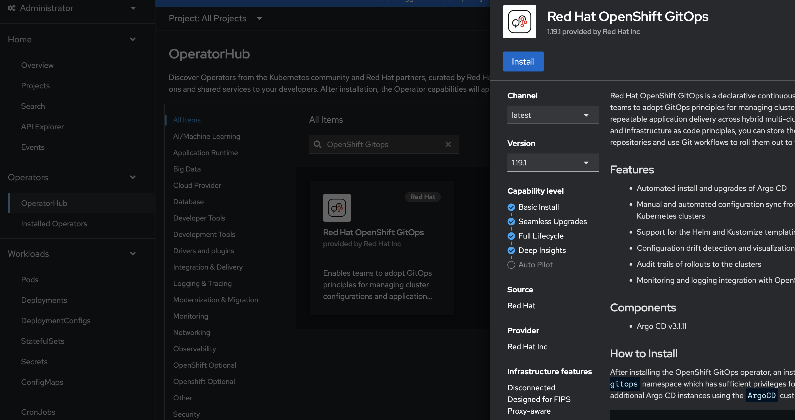

1. On the next screen that comes up, keep all the default entries, scroll to the bottom of the page and click **Install**.

1. Once installed, click **View Operator**. Look for the **Red Hat OpenShift GitOps** operator you just installed and click on it. The operator details page will be displayed. Click on **Argo CD** in the top panel. You will see a default ArgoCD instance deployed in the `openshift-gitops` namespace. 

   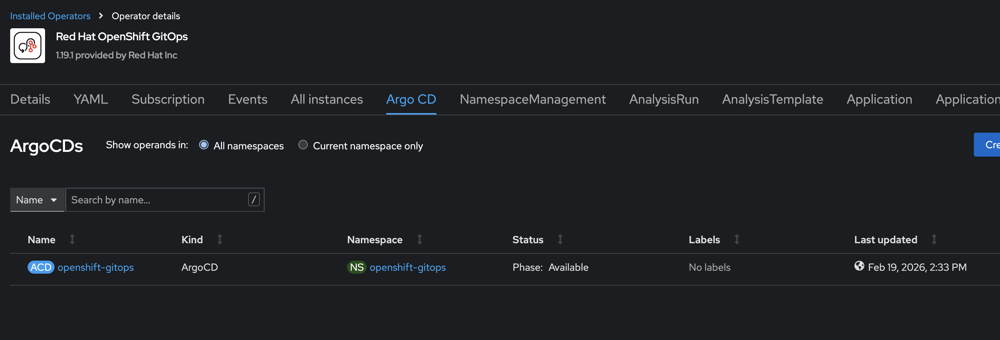
   

## 2. Update the Repo-Server ServiceAccount

This default ArgoCD instance uses the ServiceAccount (SA) named **default** for the repo-server pod. We are going to switch the default SA with a custom one for improved security.

First, log in to Openshift using the oc client. You can retrieve the login command from the OpenShift console. Click on **Copy login command**, then click on `Display Token`. Copy the `Log in with this token` command, and paste in your terminal. 

 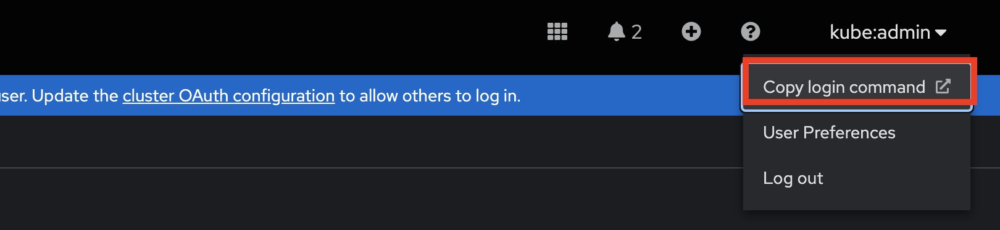

Next, create the custom service account 

  ```bash
  cat <<EOF | oc apply -f -
  apiVersion: v1
  kind: ServiceAccount
  metadata:
    name: repo-server-custom  # Relace with your custom SA name
    namespace: openshift-gitops
  EOF
  ```

Patch the ArgoCD CRD to swap the repo server's ServiceAccount

   ```bash
   oc patch argocd openshift-gitops -n openshift-gitops --type='merge' -p '{"spec":{"repo":{"serviceaccount":"repo-server-custom"}}}'
   ```


## 3. Establish Federated Trust

### Set Environment Variables

```bash
CLUSTER_NAME=test-cluster    # Repace with your ARO cluster name
RESOURCE_GROUP_A=aro-rg      # Replace with your ARO cluster resource group
TENANT_A_ID="<Tenant_A_ID>"    # Replace with your Cluster Tenant ID
TENANT_B_ID="<Tenant_B_ID>"    # Replace with your ADO Tenant ID
RESOURCE_GROUP_B=uami-rg     # Replace with Tenant B Resource Group
```

### Get OIDC Issuer URL (Tenant A)

Login to Tenant A and retrieve the identity provider URL:

```bash
az login --tenant $TENANT_A_ID
```
```bash
OIDC_URL=$(az aro show -n $CLUSTER_NAME -g $RESOURCE_GROUP_A --query "clusterProfile.oidcIssuer" -o tsv)
echo $OIDC_URL
```

### Create Managed Identity (Tenant B)

Login to Tenant B to create the identity that ADO will recognize:

```bash
az login --tenant $TENANT_B_ID
```

Create the User-assigned Managed Identity (UAMI)

```bash
az identity create --name argocd-cross-tenant-id --resource-group $RESOURCE_GROUP_B
```

Get the Client ID for later steps

```bash
MI_CLIENT_ID=$(az identity show --name argocd-cross-tenant-id --resource-group $RESOURCE_GROUP_B --query "clientId" -o tsv)
```

### Establish Federated Credential

This links the ARO ServiceAccount to the Identity in Tenant B.

```bash
az identity federated-credential create \
  --name "aro-argocd-trust" \
  --identity-name "argocd-cross-tenant-id" \
  --resource-group $RESOURCE_GROUP_B \
  --issuer "$OIDC_URL" \
  --subject "system:serviceaccount:openshift-gitops:repo-server-custom" \
  --audiences "api://AzureADTokenExchange"
```


## 4. Add your User-Assigned Managed Identity (UAMI) as an entity in ADO

Managed Identities are treated as Users in ADO. You must add the identity to the ADO organization in Tenant B.

1. Log into your **Azure DevOps Organization**.

2. Click **Organization Settings** at the bottom-left corner.

3. Select **Users** under the General Section and click **Add users**

   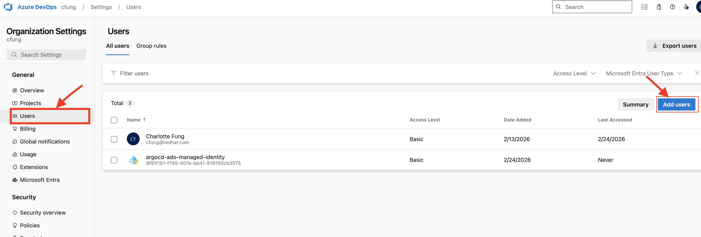

4. Fill in the following 
   
   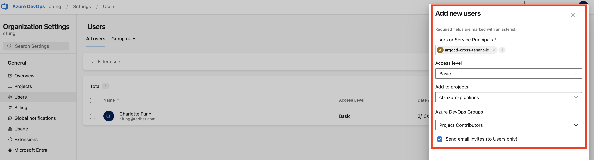

   ***Users***: Start typing the name of your UAMI (eg argocd-cross-tenant-id). A drop-down should appear, select the right Managed Identity

   ***Access level***: Select `Basic`
   
   ***Add to projects***: Select the project you want this Managed Identity to have access to. 

   ***Azure DevOps Groups***: Select `Project Contributors`

   Click **Add** at the bottom of the page to add the user to your organisation. 


## 5. Configure ArgoCD in ARO to authenticate with ADO

Switch back to Tenant A

```bash
az login --tenant $TENANT_A_ID
```

We need to tell the repo-server pod which identity to assume by annotating its Service Account.

```bash
oc annotate sa repo-server-custom -n openshift-gitops \
  azure.workload.identity/client-id="$MI_CLIENT_ID" \
  azure.workload.identity/tenant-id="$TENANT_B_ID" --overwrite
```

Patch the ArgoCD Deployment by adding the Workload Identity label to trigger the injection of the Azure token:

```bash
oc patch argocd openshift-gitops -n openshift-gitops --type=merge -p '
{
  "spec": {
    "repo": {
      "labels": {
        "azure.workload.identity/use": "true"
      }
    },
    "server": {
      "labels": {
        "azure.workload.identity/use": "true"
      }
    }
  }
}'
```

## 6. Deploy a Sample Application using ArgoCD

The sample application I used in this demo can be found here [BGD-App](https://github.com/rh-mobb/gitops-bgd-app). You'll have to import the repository to your ADO project in order to use it for this demo. Follow the Microsoft documentation to [Import a Git repository to a project](https://learn.microsoft.com/en-us/azure/devops/repos/git/import-git-repository?view=azure-devops)

### Assign necessary rights to the ArgoCD-Application-Controller ServiceAccount. 

The Application Controller manages the live state of your cluster; therefore, it requires specific RBAC permissions to synchronize resources. In this guide, we will assign **cluster-admin** privileges for simplicity, though these permissions can be scoped down to individual projects for stricter security. 

```bash
oc adm policy add-cluster-role-to-user cluster-admin -z openshift-gitops-argocd-application-controller -n openshift-gitops
```
### Retrieve ArgoCD credentials for UI login

```bash
CONSOLE_URL=$(oc get route openshift-gitops-server -n openshift-gitops -o jsonpath='{.spec.host}{"\n"}')
echo $CONSOLE_URL
```
```bash
PASSWORD=$(oc get secret/openshift-gitops-cluster -n openshift-gitops -o jsonpath='{.data.admin\.password}' | base64 -d)
echo $PASSWORD
```
Use the console URL to access your ArgoCD instance on a web browser. Use **admin** as username and enter the password you retrieved in the previous step

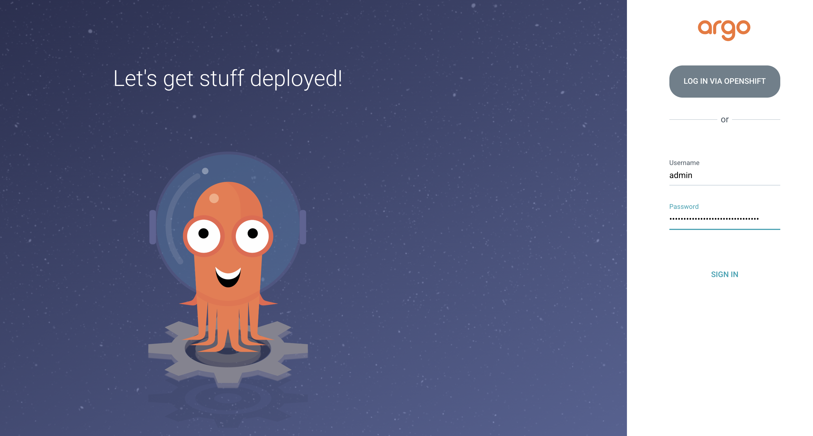

### Connect your ADO repo in ArgoCD

1. Click the **Settings** icon (the gear icon) in the left-hand sidebar

2. Select **Repositories** from the menu

3. Click the **+ CONNECT REPO** button at the top of the page.

4. A sliding panel will appear. Choose your **Connection Method**: HTTPS 

5. **Type**: `git`

6. **Project**: `default`

6. **Repository URL**: `Your ADO repo URL`

7. Scroll to the bottom of the page and  Select `Use Azure Workload Identity`.

    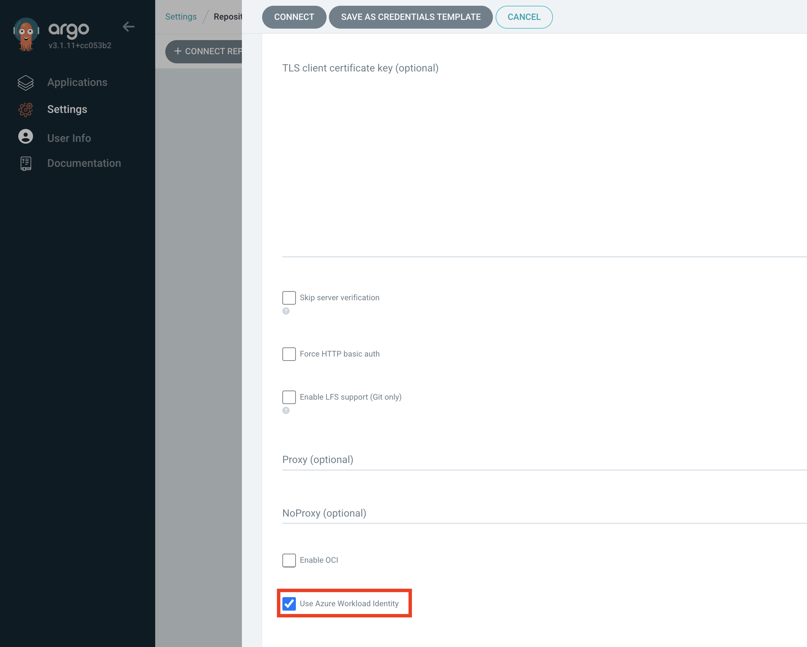

8. Click **Connect** at the top of the page. Check the **Connection Status** column in the `repository list`, it should show a green checkmark and say **Successful**. 
    
    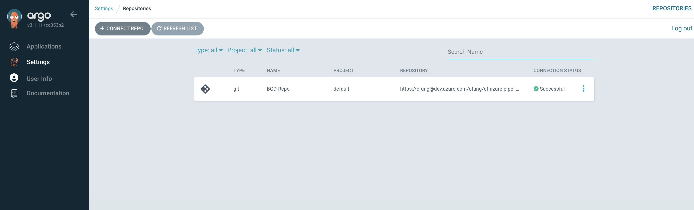

### Deploy your Application

1. Click the **Applications** tab in the left menu panel, and then click om  **+ New App** button in the top left corner

2. Fill out the app creation wizard as below

   ***Application Name***: bgd-app (replace with your app name)

   ***Project***: select `default`.

   ***Sync Policy***: `Automatic` and select `Enable Auto-Sync` (ArgoCD will automatically sync the application when changes are detected)

   ***Repository URL***: Paste your ADO repo URL

   ***Revision***: Set to `HEAD`, `main`, or a specific brnach

   ***Path***: apps/bgd/overlays/bgd (replace with your folder path inside the repo where the manifests are located)

   ***Destination Cluster***: https://kubernetes.default.svc.

   ***Namespace***: Enter the target namespace (if deploying to an existing namespace or leave empty if your manifests include namespace creation)

3. Click **Create** at the top of the panel. This will take you to a view similar to below 

   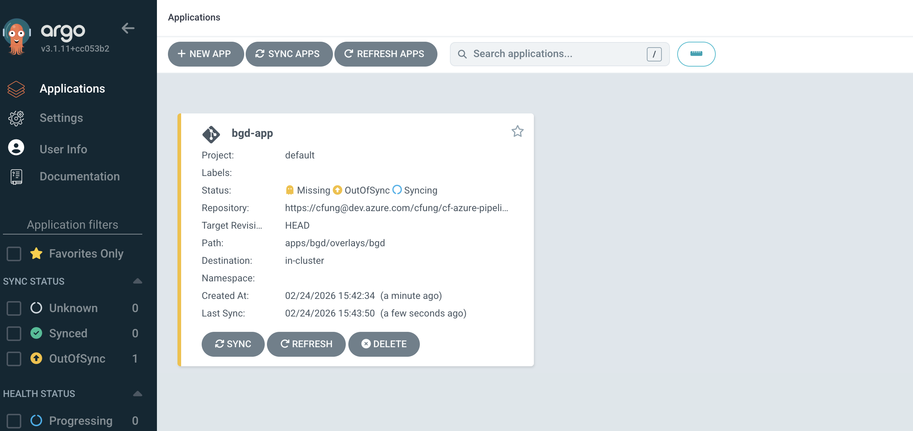

4. Click in the App box itself to see the detailed deployment. It should bring up this view 
 
   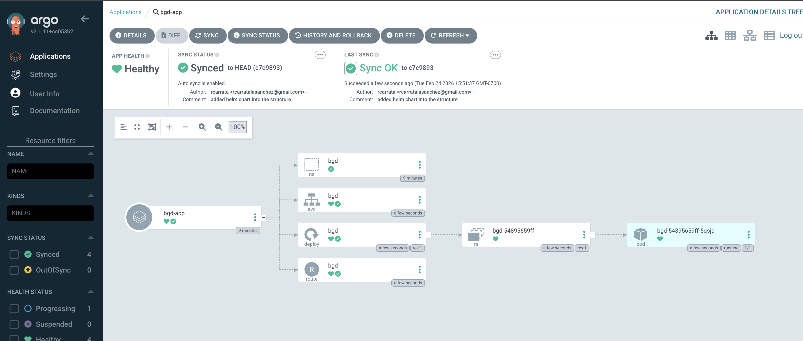


[NOTE]
The deployment may initially show `OutOfSync` as the resorurces get created in your cluster, but should be synced eventually after a few minutes 

### Verify Deployment
In your terminal, check all resources created in the bgd namespace

```bash
oc get all -n bgd
```

Copy the host address and paste in a browser to access your application. 

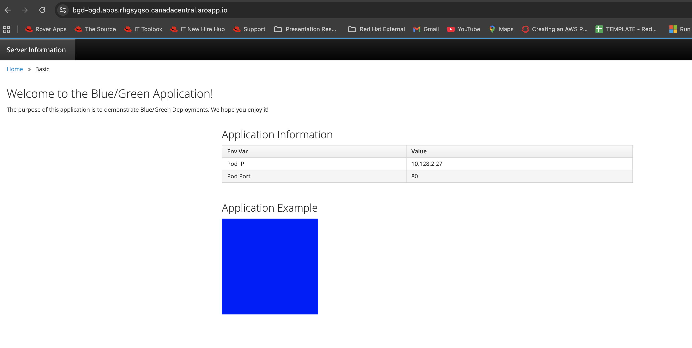

